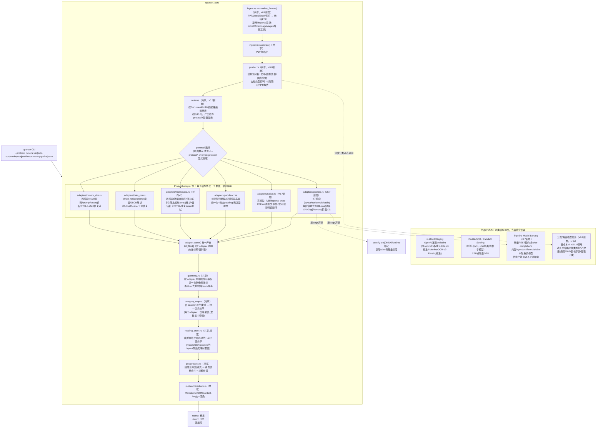

# uparserstudio 技术架构设计

> 版本：v0.9　|　目标：core 需要支持**多种不同的解析模型/协议**（MinerU 单模型端到端 `vlm` backend、dots.ocr、MonkeyOCR（v2）、PaddleOCR 等，未来可扩展），它们各自的**前处理（图像归一化/裁剪策略）与后处理（原始输出解析、修复、格式转换）机制互不相同**，但最终都要在 core 里统一成同一套 IR、同一套文档级后处理（段落/表格合并、标题分级）、同一套 Markdown 渲染。**模型推理本身始终外部化**（VLM 走 vLLM 等 OpenAI 兼容服务；PaddleOCR 走其自身的轻量 serving），core 不做任何模型推理。
>
> **v0.5 变更**：基于对 `opensource/MonkeyOCRv2` 的源码级分析（见 `monkeyocrv2_report.md`）修正并细化 §3.3、§4、§7、§8。核心结论：**本项目对接的 "MonkeyOCR" 协议应以 v2 为目标，而非 v1**——v2 用单一 vLLM 部署模型同时完成版面检测（含阅读顺序）与逐块内容识别，不再需要 v1 那样的独立版面检测模型，与"不引入独立 CV 模型"的原则不再冲突；同时 v2 的输出解析（`eval()` 解析 Python 字面量列表）、OTSL 表格转换、重复 token 检测+温度递增重试等机制与 MinerU-vlm 高度相似，验证了"共享工具函数"设计的可行性，但也带来一个新的开放问题（文档去弯曲预处理模型无法外部化）。
>
> **v0.6 变更**：正式确定 **core 实现语言为 Rust**，参照 `opensource/liteparse` 的"Rust core + 多语言绑定"范式（见新增 §9）。自 v0.3 起本项目已确立"模型推理一律外部化"的设计红线，core 自身只做 PDF/图像栅格化、HTTP 并发编排、字符串/正则解析、几何计算、Markdown 渲染——这恰好是 Rust（而非 Python）的优势场景，也是 liteparse 已经验证过的同构问题。本版本起，此前各章节里的 `core/*.rs`、`adapters/*.rs` 模块命名统一采用 `.rs` 后缀（原 v0.2-v0.5 文本中的 `.py` 后缀已批量更正）；Python/TS 侧不再是 core 的实现语言，只作为绑定层存在。
>
> **v0.7 变更**：新增两类协议以补齐产品能力（见新增 §10、§11）：①**`native`（本地无模型解析）**——参照 v0.2 曾设想但被 v0.3 收窄掉的"原生快速通道"，重新以 Rust 直接内嵌 liteparse crate 的形式加入，零模型依赖、零外部服务；②**`pipeline`（传统版面-OCR-公式-表格多模型流水线）**——对齐 MinerU `pipeline` backend（见 `mineru_report.md`），但解决了"多个较大模型在客户端（Agent 运行环境）吃满 CPU/内存"的问题：每个子阶段（layout/ocr/formula/table）独立声明可 `Local`（进程内轻量 ONNX 推理，仅限体积小的判别式模型）或 `Remote`（卸载到服务端的轻量模型服务，非 vLLM，是新增的第二类外部化服务）执行，由用户/`uparser doctor` 按客户端资源与网络条件决定默认落点。`ProtocolAdapter` 接口相应扩展了 `stages()` 方法以支持多阶段、多后端声明（见 §2 更新）。
>
> **v0.8 变更**：补齐两块此前缺失的能力（见新增 §12、§13）：①**多格式接入**——`ingest.rs` 扩展支持 PPT/Word/Excel 等非 PDF 格式的统一前置转换（复用 liteparse 已验证的"外部工具转换"思路，而非自研解析器），供全部协议共用；②**内容预分析与路由（Profiler + Router）**——在协议选择之前新增一个"先看一眼文档/页面是什么类型"的前置分析阶段（书籍/简历/PPT/学术表格/财务报表/数据报表/趋势图表等），分析结果既写入 `ParseResult` 供 Agent 参考，也驱动一套路由策略去选择/调整协议与配置，而不是把"选哪个协议"完全交给用户猜测或粗暴的文件后缀判断。本版本明确路由粒度以**整篇文档级**为 v1 落地范围，页面/区域级路由列为后续开放项。
>
> **v0.9 变更（针对 v0.8 架构评审发现的内部矛盾与能力缺口做修正）**：v0.8 及之前版本在多轮增量演进中积累了若干"记述与抽象自相矛盾"或"中核子系统脱落"的问题，本版本集中修正——
> - **§2 接口重构（致命修复）**：v0.3-v0.8 的 `build_requests → dispatch → parse` 线性三段接口**无法表达"两阶段"协议**（MinerU-vlm/MonkeyOCR-v2 的 stage② 请求依赖 stage① 的解析结果），而这两者恰是主力协议。改为以 `parse_page()` 为核心的**多轮编排接口**（adapter 内部自行驱动 stage①→解析→stage② 的迭代），并解决 `async fn` in trait 与 `dyn` registry 的技术非互换（改用 `#[async_trait]` 约定）。见 §2 全面重写。
> - **§2.2 新增执行模型**：补齐此前完全缺失的**文档级调度、跨页并发预算、大文档处理窗口/流式**设计（两个参考实现都视之为必需：MinerU 64页窗、MonkeyOCR-v2 五段流式）。
> - **§5 IR 增强（能力后退修复）**：v0.8 的 `Block` 缺少 `merge_hint`/字号/行级 span 等信息，导致移植自 MinerU 的段落合并/标题分级**在统一 IR 上必然弱于原实现**。本版本给 IR 增加可选的后处理信号字段，并明确"共享后处理按 adapter 实际提供的信号做优雅降级"，而非假装无损统一；标题分级从 §4"已解决共享能力"下调为**能力门控的可选增强**（多数模型只输出扁平标题，真正分级需外部 LLM，见 §4/§14）。
> - **§6 恢复 Agent-first CLI 契约**：v0.1-v0.3 的核心规约（语义化退出码、stdout=结果/stderr=日志分离）在 v0.4-v0.8 的 CLI 章节中悄然脱落，本版本恢复为一等规约。
> - **§15 新增内容哈希缓存层**：v0.1 设计过、v0.3 后消失的缓存回归——在 v0.8 新增 Profiler VLM 调用后，"Agent 高频复解析同一文档"的缓存收益比 v0.1 时更大。
> - **控制流去重（§12/§13）**：明确 `normalize_format → 结构化旁路判定 → profiler → router → parse` 的唯一执行顺序，消除 xlsx 处理路径在三个小节各自主张的歧义；Profiler L3 明确为 opt-in，并复用 profiler 已产出的中间图像/结构，避免与 parse 阶段重复 VLM 往返。

## 0. 多协议的结构差异（为什么需要 Adapter 抽象）

早期（v0.3）曾把"MinerU `backend/vlm/` 的两阶段协议"直接硬编码成 core 唯一的处理流程。这在只用一个模型时没问题，但**候选模型的协议在结构上并不相同**（下表列出四个生成式协议，另有 `native`/`pipeline` 两类非生成式协议见 §10/§11）：

| 维度 | MinerU `vlm` | dots.ocr | MonkeyOCR **v2**（`opensource/MonkeyOCRv2`，非 v1） | PaddleOCR（PP-StructureV3 系） |
|---|---|---|---|---|
| 请求次数/页 | **两次**：①整页版面检测 ②逐区块内容识别 | **一次**：整页一次调用同时给出版面+分类+内容+顺序 | **两次（默认）**：①整页版面检测（含阅读顺序，一次调用）②按类别逐区块内容识别（多次调用，`concurrency=1`）；另有 `--end2end` 单次调用模式可选 | 检测与识别本就是两个独立模型（DB 检测 + SVTR/CRNN 识别 + 可选版面/表格子模型），天然多阶段 |
| 图像预处理 | 阶段①整页**不保持长宽比**拉伸到固定分辨率；阶段②区块裁剪+短边下限放大+长宽比 padding | 整页 `smart_resize`：**保持长宽比**、对齐 28px、总像素落在 `[min_pixels,max_pixels]` 区间 | 整页按固定 dpi≈200 栅格化，**普通等比缩放**（按 `max_pixels`/`min_pixels` 阈值用 `sqrt(ratio)` 缩放，非 patch 网格对齐），另有**独立的文档去弯曲/去阴影预处理阶段**（U2NET分割+形变场回归，与视觉编码器无关，非 vLLM 部署） | 检测阶段图像整体缩放到检测模型输入尺寸；识别阶段按检测框裁剪+高度归一化+宽度动态 padding（CRNN/SVTR 惯用做法，与 VLM 类完全不同的归一化哲学） |
| 输出格式 | 自定义 token 流（`<|box_start|>...<|ref_start|>类别<|ref_end|>`）+ 内容识别阶段的纯文本/OTSL表格token/LaTeX | **JSON 数组** `[{bbox,category,text}]`，表格→HTML、公式→LaTeX 均直接写在 `text` 字段里，输出可能截断/畸形需要正则修复 | **类 Python 字面量列表**（`[{"bbox":...,"label":...,"content":...}]`），用 `eval()` 而非 `json.loads` 解析——与 MinerU 的自定义 token、dots.ocr 的严格 JSON 都不同，是第三种原始格式；表格同样输出 **OTSL**，公式为 LaTeX（`$$...$$`定界符） | 检测输出是多边形/矩形框坐标数组；识别输出是逐框的文本字符串+置信度，**没有版面分类概念**（除非启用 PP-StructureV3 的版面分析子模型），表格是单独的表格识别模型输出 HTML |
| 是否需要 GPU 生成式模型服务 | 是（vLLM） | 是（vLLM） | 是（vLLM，v2 只需一个模型服务；额外的去弯曲预处理模型走本地 torch，见下方开放问题） | 通常否（PP-OCR 系是轻量 CV 模型，CPU 也可跑；仅版面/表格子模型稍重，可选 GPU） |
| 阅读顺序来源 | 模型隐式（版面检测输出顺序即阅读顺序，需自行按几何规则校验） | 模型自身按 prompt 要求排序 | **模型隐式**：版面检测阶段 prompt 明确要求"in reading order"，直接给出阅读顺序，后续仅按检测顺序保序——**v2 不再需要 v1 的独立 LayoutLMv3 阅读顺序模型** | 无原生阅读顺序，需要下游按几何规则重建（类似 liteparse 的做法） |

**结论**：不能再假设"只有一种协议"，`output_parse.rs`/`preprocess.rs`/`prompts.rs` 这些 v0.3 里的单例模块必须拆分成**按模型协议隔离的插件**，而"文档级后处理"（段落合并、跨页表格合并、标题分级、Markdown 渲染）在四者之间是**可以且应该共享**的——它们操作的是统一 IR，不关心 IR 是怎么产生的。这正是本次要解决的核心矛盾：前后处理机制不同 ≠ 全部要各写一套；只有"模型协议相关"的那一小段需要隔离，"文档级"的那一大段应该统一。

补充一点：MinerU-vlm 与 MonkeyOCR-v2 的"两阶段（整页版面检测含阅读顺序 → 逐块内容识别）"结构高度相似，只是原始 token 格式不同（自定义 token vs `eval()` 字面量），且两者都用 OTSL 表格格式、都有"重复 token 检测 + 温度递增重试"的容错机制——这是"协议不同但可以共享底层工具函数"的具体例证，见 §4。

## 1. 总体架构：Protocol Adapter + 共享 Core



**核心设计原则**：图中 `ADAPTERS` 分组内的四个模块是**唯一允许"各写一套"的地方**，且每个 adapter 内部也应尽量复用共享的通用工具函数（如图像 resize/padding 的基础算子、HTTP 并发/重试基础设施），只有"resize 的具体参数策略""prompt 的具体文本""输出的具体解析规则"这些**协议特定**的部分才属于 adapter 私有代码。`geometry.rs` 往后（含）的所有模块**只有一份实现**，不因协议而分叉。

## 2. Protocol Adapter 接口契约（v0.9 重构）

### 2.0 为什么放弃 v0.8 的 `build_requests → dispatch → parse` 线性三段接口

v0.8 的接口假设"一页 = 构造一批请求 → 一次派发 → 一次解析"的单一往复。但 MinerU-vlm 与 MonkeyOCR-v2 这两个**主力协议**是**两阶段**的：stage②（逐区块内容识别）的请求，其数量与裁剪区域**取决于 stage①（版面检测）解析出的 bbox 列表**。线性三段接口无法表达"派发→解析→再据结果派发→再解析"的依赖回路，等于**主力协议在原接口下无法实现**。因此 v0.9 把接口重构为"adapter 内部自行驱动多轮"的编排式接口：core 提供派发/并发/重试的基础设施（`ctx`），adapter 决定调用它几次、每次请求什么。

```rust
#[async_trait]   // 用 async-trait crate 消除 async-fn-in-trait 与 `dyn ProtocolAdapter` 的 dyn 不兼容
pub trait ProtocolAdapter: Send + Sync {
    // ── 静态能力声明（供 registry / router / doctor / 共享层 introspection，无副作用）──
    fn name(&self) -> &'static str;                          // "mineru-vlm" | "dots-ocr" | "monkeyocr" | "paddleocr" | "native" | "pipeline"
    fn coordinate_system(&self) -> CoordinateSystem;          // 声明输出bbox的坐标约定，供 geometry.rs 通用反归一化
    fn provides_reading_order(&self) -> bool;                 // 输出是否已含可信阅读顺序，决定是否走 reading_order.rs 回退
    fn category_vocab(&self) -> &[&'static str];              // 该协议原生类别表，用于 category_map.rs 查表
    fn raw_output_format(&self) -> RawOutputFormat;           // CustomToken | StrictJson | PythonLiteralEval | OcrBoxes（见 §4）
    fn emitted_signals(&self) -> PostprocessSignals;          // v0.9新增：声明该协议能为IR填充哪些后处理信号
                                                               // （merge_hint / font_size / line_spans / title_level…），
                                                               // 供 postprocess.rs 按可用信号优雅降级（见 §4/§5）
    fn model_stages(&self) -> Vec<ModelStage>;                // 声明"可独立选择后端(Local/Remote)的模型阶段"。
                                                               // 注意语义（v0.9澄清）：这里的 stage 指"后端可独立配置的部署单元"，
                                                               // 不是"请求轮次"。故 mineru-vlm 的两轮请求打同一个vLLM端点=1个stage；
                                                               // pipeline 的 layout/ocr/formula/table 是4个可分别部署的模型=4个stage。
                                                               // `native` 返回空数组。用于 `uparser protocols`/`doctor` 与后端路由

    // ── 核心：一页的完整解析（adapter 内部自行驱动 N 轮请求，N 由协议决定）──
    /// 输入一页（已由 ingest 栅格化 + 记录原始尺寸），输出该页的 Block 列表
    /// （bbox 仍是 adapter 原生坐标系/坐标帧，未反归一化——反归一化交给 geometry.rs）。
    /// 单次调用（dots.ocr）: 内部 ctx.dispatch 一次即可；
    /// 两阶段（mineru-vlm / monkeyocr-v2）: 内部先 ctx.dispatch 版面请求 → 解析出 regions
    ///   → 对每个 region 再 ctx.dispatch 内容请求（可并发）→ 合并为 Block 列表；
    /// pipeline: 内部按 model_stages 顺序调用 layout→ocr→formula→table，各 stage 依 backend 走 Local/Remote。
    /// ctx 提供：dispatch(并发/重试/限流已封装) / 全局并发预算令牌 / 该页的原始尺寸与裁剪工具 /
    ///           profiler 已产出的可复用中间产物（见 §2.2、§13）。
    async fn parse_page(&self, page: &RenderedPage, ctx: &ParseCtx) -> Result<Vec<Block>, PageError>;
}
```

**关键变化**：v0.8 把"构造请求/派发/解析"拆成三个 core 可见的步骤，反而锁死了控制流；v0.9 只暴露一个 `parse_page`，把"几轮、什么依赖什么"的控制权还给 adapter，core 通过 `ParseCtx` 提供能力（派发、并发预算、裁剪、缓存），而不规定调用次序。单次协议与两阶段协议在同一接口下都能自然表达。

- **`ParseCtx` 承载共享基础设施**：`ctx.dispatch(requests)`（复用 `core/transport.rs` 的 reqwest+tokio 并发/重试/超时/限流；OpenAI 兼容与 PaddleOCR/Pipeline 的自定义 REST 都走它，只是请求 builder 不同）、`ctx.crop(bbox)`、`ctx.acquire_permit()`（从**文档级**并发预算取令牌，见 §2.2）、`ctx.cached_or(key, f)`（复用 profiler 中间产物或缓存，见 §13/§15）。
- `core/adapters/registry.rs` 维护 `name -> Box<dyn ProtocolAdapter>` 映射（`#[async_trait]` 保证 `dyn` 可用）；新增协议只需新增一个 adapter 文件并注册，不改动 `geometry.rs`/`postprocess.rs`/`render/` 任何一行。
- 每个 adapter 内部对"通用图像操作"（resize/pad/crop/RGB转换/base64编码）应调用 `core/imaging.rs` 里的共享原子函数，**不是复制粘贴 resize 代码**——协议之间"参数不同"不等于"实现不同"。

### 2.2 执行模型：文档级调度、跨页并发预算、处理窗口/流式（v0.9 新增，补齐此前缺失）

v0.8 的接口按页操作却没有说明"谁来调度多页、并发预算归谁、超大文档如何不 OOM"——而两个参考实现都把这当必需：MinerU 按 64 页处理窗分批加载（避免一次性占满内存），MonkeyOCR-v2 用五段队列做流式。v0.9 补上文档级执行层：

- **`core/scheduler.rs`（新增）** 拥有整个文档的执行编排：按**处理窗口**（默认可配，如 32/64 页）分批 `ingest.rs::rasterize()`，窗口内的页并发调用 `adapter.parse_page()`；窗口之间串行推进，已完成窗口的页图像尽快释放，保证峰值内存 ~O(窗口大小) 而非 O(总页数)。
- **全局并发预算**：`ParseCtx` 里的 permit 令牌来自一个**文档级信号量**（默认上限可配，如 `--max-concurrency`），无论是"跨页并发"还是"两阶段协议单页内的跨区块并发"都从同一个预算取令牌——避免 5 页 × 每页 20 区块 = 100 个请求瞬间打满外部 vLLM 的排队队列。这修正了 v0.8"并发在哪里发生"完全未定义的问题。
- **流式输出**：`scheduler.rs` 每完成一个窗口即可增量吐出该批页的结果（`--stream` 时按页/按窗口输出 NDJSON），而不是等全文档解析完再一次性构造巨大的 `ParseResult`。非流式模式仍聚合为完整 `ParseResult`。
- **部分失败隔离**：`parse_page` 返回 `Result<_, PageError>`，单页失败被 scheduler 捕获为该页的 `page_error` 标记并计入 `warnings`，不中断其余页；据此映射 §6 的退出码 3（部分失败）。

### 2.1 `ModelStage`/`StageBackend`（v0.7 新增，v0.9 澄清语义）：把"外部化"从"整协议一刀切"细化到"逐部署单元可选"

**"stage" 的定义（v0.9 澄清，避免 v0.8 的语义混淆）**：这里的 stage 指**"后端可独立配置（Local/Remote）的模型部署单元"**，而**不是"请求轮次"**。二者必须区分——
- mineru-vlm 对同一个 vLLM 端点发两轮请求（版面+内容），但打的是**同一个可部署模型**，所以它是 **1 个 model_stage**（那两轮请求是 `parse_page` 内部的编排细节，见 §2.0，与后端选择无关）；
- pipeline 的 layout/ocr/formula/table 是**四个可以分别部署到不同后端**的独立模型，所以是 **4 个 model_stage**。

v0.3-v0.6 的四个 VLM 协议天然只有一个 model_stage（走 vLLM，`allows_local=false`）。但 `pipeline` 协议（§11）的四个模型体积不均，体积小的判别式模型（表格分类/结构识别，MinerU 里已是 ONNX）适合客户端本地跑，体积大的（版面检测、OCR、公式识别）在资源受限的 Agent 环境上会显著占用 CPU/内存，需要能卸载到服务端。为此把"后端选择"下沉到 model_stage 粒度：

```rust
pub enum StageBackend {
    Local(LocalModelSpec),      // 进程内轻量推理：core 通过 `ort`（ONNXRuntime绑定）加载，仅限体积小的判别式模型
    Remote(RemoteEndpointSpec), // HTTP 调用外部模型服务：可以是 OpenAI chat completions（VLM类），
                                 // 也可以是自定义轻量 REST 契约（pipeline 各阶段模型服务，见 §11.3）
}

pub struct ModelStage {
    pub stage_name: &'static str,           // "layout" | "ocr" | "formula" | "table" | "vlm" ...
    pub default_backend: StageBackend,      // 该阶段未显式配置时的默认落点
    pub allows_local: bool,                 // 是否允许 Local（VLM 类协议的单一 stage 恒为 false，只能 Remote）
    pub resource_hint: ResourceHint,        // Lightweight | Heavy —— 供 `uparser doctor` 给出"建议本地跑/建议卸载"的提示
}
```

单模型 VLM 协议（`mineru-vlm`/`dots-ocr`/`monkeyocr`）的 `model_stages()` 固定返回一个 `allows_local = false` 的 stage；`native` 返回空数组；`pipeline` 返回四个 stage，各自 `allows_local`/`resource_hint` 不同（详见 §11.2）。这一设计让"模型推理外部化"这条红线，从"非黑即白"演进为"按部署单元的资源成本可配置"，而不放弃"core 本身默认不做重推理"的基本立场。

## 3. 单模型 VLM 协议 Adapter 的具体设计要点（另有 §10 `native`、§11 `pipeline` 两类新增协议）

### 3.1 `adapters/mineru_vlm.rs`

两阶段请求（在 §2.0 的 `parse_page` 内部编排：先派发版面请求→解析→对每区块派发内容请求）、整页固定 resize（不保持长宽比）+ 区块裁剪归一化、自定义 token 版面输出解析、OTSL→HTML、LaTeX 修复器链。`coordinate_system = Norm0To1000`，`provides_reading_order = True`（版面检测阶段的输出顺序即阅读顺序，但仍建议做几何合理性校验而非无条件信任）。`emitted_signals`：能提供 span 级结构与部分 `merge_hint`（源自 MinerU 模型/几何规则），但**不输出多级标题层级**（模型只给扁平标题，见 §4）。

### 3.2 `adapters/dots_ocr.rs`

- 预处理：`smart_resize`——**保持长宽比**，尺寸对齐 28（Qwen2.5-VL patch 网格），总像素数限制在 `[min_pixels, max_pixels]`，与 MinerU 阶段①的"不保持长宽比拉伸"策略完全不同，必须独立实现，不能共用同一个 resize 函数的默认参数。
- 请求：整页一次调用，prompt 要求模型直接输出"版面+分类+内容+阅读顺序"一体化 JSON。
- 输出解析：`json.loads` 优先；失败时进入**正则修复回退链**（补齐缺失的 `},{` 分隔符、截断末尾不完整字典、去重、多级降级抢救单个字段）——这是 dots.ocr 相对其余协议最突出的健壮性设计，值得作为 `output_parse` 通用工具函数库的一部分（供其他 JSON 类协议未来复用，即便当前只有 dots.ocr 用到）。
- `coordinate_system = 0-1000 归一化`，`provides_reading_order = True`（模型按 prompt 要求排序）。

### 3.3 `adapters/monkeyocr.rs`（对齐 MonkeyOCRv2，非 v1）

> v1（`opensource/MonkeyOCR`）的 Structure-Recognition-Relation 三段式依赖独立的 CV 版面检测模型（PP-DocLayoutV2/YOLO）与独立的 LayoutLMv3 阅读顺序模型，与"不引入独立版面检测模型"的原则冲突（该矛盾曾记录于 v0.4 §8）。**基于对 `opensource/MonkeyOCRv2` 的源码分析（`monkeyocrv2_report.md`），本项目的 MonkeyOCR 协议适配器应对齐 v2**：v2 用**同一个 vLLM 部署的模型**同时完成版面检测（含阅读顺序）与内容识别，矛盾自然消失。

- 请求模式：默认**两阶段**，与 MinerU-vlm 结构同构但非同一实现——①整页一次调用，prompt 明确要求"output the categories and coordinates of the document elements **in reading order**"，一次拿到全部 bbox+label（阅读顺序已内含，无需独立 Relation 模型）；②对每个 block 按 label 派发对应 prompt（Text 类统一文本抽取、Formula 用"LaTeX format"、Table 用"OTSL format"），逐块单独请求（区块间可并发，但该协议原生实现里以 `concurrency=1` 串行）。也支持 `--end2end` 单次调用变体（一次请求给整页图，直接输出 bbox+label+content 全部），可作为 adapter 的一个可选模式开关。
- 预处理：**不是** Qwen-VL 式 patch 对齐算法，而是简单等比缩放（超过 `max_pixels` 按 `sqrt(max_pixels/area)` 缩小，低于 `min_pixels` 按比例放大，`Image.LANCZOS`），与 dots.ocr/MinerU 阶段①的策略均不同，必须独立实现，不能共用同一组默认参数。
- 输出解析：原始输出是**类 Python 字面量的列表**（`[{"bbox":[...],"label":...,"content":...}]`），用 `eval()`（沙箱化，禁用 `__builtins__`）而非 `json.loads` 解析——这是与 dots.ocr（严格 JSON）、MinerU（自定义 token）都不同的**第三种原始格式**，`output_parse.rs` 需要为此新增一个"类字面量解析器"分支（`raw_output_format = "python_literal_eval"`）。截断/畸形输出的容错策略与 dots.ocr 的思路一致（括号配对提取平衡子串、对末尾未闭合括号自动补全、多候选取解析元素最多者），可与 dots.ocr 的容错回退链共享同一套通用工具函数。
- 表格：输出 **OTSL**（与 MinerU-vlm 相同的表格 token 体系），公式定界符为 `$$...$$`。二者的转换器/清洗器可考虑合并为 `core/otsl.rs`/`core/formula_repair.rs` 两个跨协议共享模块（见 §4）。
- 健壮性：同样有"重复 token 检测 → 递增 temperature 重试"的机制，与 MinerU-vlm 的抗幻觉重试设计一致，属于可共享的通用容错组件。
- `coordinate_system = NORM_0_1000`，`provides_reading_order = True`（版面检测阶段已给出阅读顺序，**不需要** `reading_order.rs` 的几何回退——这与 v0.4 中"MonkeyOCR 需要阅读顺序回退"的判断相反，已按 v2 事实更正）。
- **新开放问题**：v2 有一个**独立于 vLLM 部署之外的本地预处理模型**——文档去弯曲/去阴影矫正（U2NET 风格分割网络 + 形变场回归，与视觉编码器无关），若要复现该能力，`adapters/monkeyocr.rs` 需要通过 `requires_local_model` 声明一个无法外部化的本地 torch 依赖，这与"core 不做任何模型推理"的整体设计原则存在张力，取舍方案见第 8 节。

### 3.4 `adapters/paddleocr.rs`

- 与前三者本质不同：**不是生成式 VLM，是判别式检测+识别流水线**，且默认无版面分类概念（除非启用 PP-StructureV3 版面子模型）。
- 预处理：检测阶段图像整体缩放到检测模型输入尺寸（通常有固定短边/长边限制）；识别阶段按检测出的每个文本框裁剪，**高度归一化到固定值（如32px）+ 宽度按比例缩放+右侧padding**——这是 CRNN/SVTR 类序列识别模型的标准做法，与 Qwen-VL 系的 patch 对齐逻辑没有任何共通之处，必须独立实现。
- 输出解析：检测框（可能是四点多边形而非轴对齐矩形，`coordinate_system` 需要支持 `polygon` 变体）+ 识别文本+置信度，**没有 category**（`category_vocab` 可为空，`category_map.rs` 对该 adapter 统一映射为 `text`，除非启用版面子模型）；表格若启用 PP-StructureV3 表格子模型，输出已经是 HTML，无需 OTSL 转换。
- `provides_reading_order = False`：需要 `reading_order.rs` 的几何回退（PaddleOCR 生态本身也没有自带的阅读顺序重建，通常业务方自行按行/列坐标排序）。
- 部署：默认不需要 vLLM，是独立的 PaddleOCR/PaddleX serving（HTTP，但不是 OpenAI chat completions 协议），因此 `dispatch()` 需要覆盖默认实现，对接其专属 REST 契约。

## 4. 共享层设计（协议无关，只有一份实现）

| 模块 | 职责 | 对所有 adapter 通用的原因 |
|---|---|---|
| `core/imaging.rs` | resize/pad/crop/色彩空间转换/编码等原子图像操作 | adapter 只是传不同参数调用，不是重新实现算法 |
| `core/transport.rs` | 通用 HTTP 并发/重试/超时/限流基础设施 | OpenAI 兼容类 adapter（MinerU/dots.ocr/MonkeyOCR）直接复用；PaddleOCR adapter 覆盖协议层但仍复用并发/重试骨架 |
| `core/otsl.rs` | OTSL（Optimized Table Structure Language）token 序列 → HTML（含 rowspan/colspan）转换器 | **MinerU-vlm 与 MonkeyOCR-v2 都输出 OTSL 表格**（源码级验证：两者 token 体系一致），是第一个被两个独立协议共同证实需要共享的具体模块，而非假设 |
| `core/formula_repair.rs` | LaTeX 公式清洗修复器链（括号平衡、重复 `\quad`/`\qquad` 折叠、`\tag`/`\eqno` 处理、`\begin{env}...\end{env}` 重建等） | 同上，MinerU-vlm 与 MonkeyOCR-v2 的公式后处理逻辑高度相似，合并为一套可配置的修复器链 |
| `core/robustness.rs` | 重复 token/退化输出检测 + 递增 temperature 重试策略 | MinerU-vlm（`detect_repeat_token`）与 MonkeyOCR-v2（同名机制）分别独立实现了几乎一致的容错策略，证实这是协议无关的通用需求，而非各自的偶然设计 |
| `core/output_parse.rs` | 按 `raw_output_format` 分发到具体解析器：`custom_token`（正则）/`strict_json`（`json.loads`+dots.ocr式容错）/`python_literal_eval`（沙箱`eval()`+括号配对容错）/`ocr_boxes` | 三种生成式协议的"截断/畸形输出容错"思路相通（括号配对提取平衡子串、末尾补全、多候选择优），可抽出公共容错原语，仅解析入口（`json.loads` vs `eval` vs 正则）按格式分支 |
| `core/geometry.rs` | 按 adapter 声明的 `coordinate_system`（0-1000 归一化 / 0-1 归一化 / 像素绝对 / polygon）统一反归一化为像素坐标；通用 IoU 去重、异常 block 隔离 | bbox 反归一化是纯几何变换，与"谁产生的 bbox"无关，只与"用什么坐标约定"有关——用声明式配置而不是分支代码处理协议差异 |
| `core/category_map.rs` | 每个 adapter 一份"原生类别→统一枚举"映射表（数据，不是代码分支） | 参考 v0.2 的设计：这是唯一允许"配置膨胀"的地方，但集中管理、可测试，不散落在四份后处理代码里 |
| `core/reading_order.rs` | `provides_reading_order=False` 时的几何回退排序 | 目前 PaddleOCR 与 pipeline 协议需要（MonkeyOCR-v2/MinerU-vlm 自带阅读顺序） |
| `core/postprocess.rs` | 段落合并（含跨页）、跨页表格合并、**信号驱动的**标题分级 | 操作对象是统一 `Block`/`Page`，但**并非无损协议无关**——见下方"§4.1 后处理的能力边界"。核心逻辑（几何规则段落合并、表格 HTML 拼接）协议无关；但依赖模型信号的部分（`merge_hint`、字号）按 `emitted_signals` 优雅降级 |
| `core/render/` | Markdown/JSON/content-list 渲染 | 纯粹消费统一 IR，真正协议无关 |

### 4.1 后处理的能力边界（v0.9 明确，修正 v0.8 "无损统一"的过度承诺）

v0.8 的 §4 把段落合并/跨页表格合并/**标题分级**都列为"移植自 MinerU、协议无关的共享能力"。评审发现这**过度承诺**了：MinerU 的 `para_split` 深度依赖**模型吐出的 `merge_prev` 提示与 span 级字号**（见 `mineru_report.md`），而 dots.ocr/PaddleOCR 根本不产出这些信号，v0.8 的 `Block` 结构体里也没有承载它们的字段。因此：

- **`postprocess.rs` 分两层**：①**纯几何/结构层**（首行左边界对齐、末字符是否终止符、表格 HTML 行签名比对合并）——真正协议无关，所有协议都能用；②**信号增强层**（利用 `merge_hint`/字号做更准的段落边界判断）——**仅当 adapter 的 `emitted_signals` 提供了对应信号时才启用**，否则自动退化为纯几何层。§5 的 `Block` 因此新增可选信号字段（见 §5）。这不是"统一后处理更弱"，而是"诚实地按可用信息给出最好结果，并在 `warnings` 里标注降级"。
- **标题分级从"已解决共享能力"下调为"能力门控的可选增强"**：MinerU-vlm 与 MonkeyOCR-v2 都只输出**扁平标题**（全部 H1 / level 1），真正的多级分级 MinerU 也只在调用外部 LLM（llm_aided）时才做。所以 `postprocess.rs` 的标题处理**默认只能给扁平层级**；多级分级是一个**可选的、需额外 LLM 端点的增强步骤**（`--title-leveling-endpoint`），不接就是扁平，且必须在输出里如实标注"标题层级未分级"，而不是假装已分级（详见 §14 开放问题）。

## 5. 统一数据类型（v0.9 增强：后处理信号字段 + 几何形状 + 嵌套坐标帧）

```rust
#[derive(Clone, Copy)]
pub enum CoordinateSystem { Norm0To1000, Norm0To1, PixelAbs }   // v0.9：形状是否多边形独立成 Geometry，不再塞进坐标系枚举

/// v0.9：显式区分矩形/多边形，避免把 polygon 硬塞进 bbox: Vec<f32> 让下游几何计算无从判断
#[derive(Serialize, Deserialize)]
pub enum Geometry {
    Rect([f32; 4]),          // x0,y0,x1,y1
    Polygon(Vec<[f32; 2]>),  // PaddleOCR 检测框：任意点数多边形
}

/// v0.9新增：一个 block 内部的行/片段级信息，承载后处理所需的模型信号（见 §4.1）
#[derive(Serialize, Deserialize)]
pub struct Span {
    pub text: String,
    pub bbox_px: Option<[i32; 4]>,   // 若来自两阶段协议的裁剪子图，已由 geometry.rs 换算回页面坐标帧（见下）
    pub font_size: Option<f32>,      // 仅字号信号可得的协议（如 MinerU span）才有；用于信号增强层段落合并
    pub is_inline_formula: bool,
}

#[derive(Serialize, Deserialize)]
pub struct Block {
    pub geom: Geometry,                        // v0.9：原生坐标（矩形或多边形），反归一化前
    pub geom_frame: CoordFrame,                // v0.9：该坐标属于哪个坐标帧——Page（整页）或 Crop{parent_block, crop_bbox_px}
                                               //       两阶段协议 stage② 的内容坐标是裁剪子图相对帧，geometry.rs 据此换算回页面帧
    pub bbox_px: Option<[i32; 4]>,             // geometry.rs 统一换算到页面像素帧后填充，下游只应读这个字段
    pub category_raw: String,                  // adapter 原生类别（可能为空，如 PaddleOCR 默认无分类）
    pub category: Option<String>,              // category_map.rs 映射后的统一类别，postprocess/render 只应读这个字段
    pub reading_order: Option<u32>,            // adapter 自带则直接来自 adapter；否则由 reading_order.rs 回填
    pub text: Option<String>,
    pub html: Option<String>,                  // 表格（OTSL转换结果）
    pub latex: Option<String>,                 // 公式
    pub spans: Vec<Span>,                      // v0.9：行/片段级信号，可为空（协议不提供时）
    pub merge_hint: Option<MergeHint>,         // v0.9：模型给出的"是否与上一块续接"提示，仅部分协议有（见 emitted_signals）
    pub confidence: Option<f32>,
    pub source: BlockSource,                   // v0.9：native_text_layer | structured_native(xlsx) | one_shot_vlm | layout_then_recognize | ocr_pipeline
    pub error: Option<String>,                 // 单block解析/请求失败时记录，不中断整体
}

#[derive(Serialize, Deserialize)]
pub struct ParseResult {
    pub source_path: String,
    pub source_sha256: String,
    pub protocol: String,                      // 本次使用的 adapter name
    pub routed_by: RoutedBy,                   // v0.9：Explicit(用户--protocol) | Auto(profiler+router)，便于复现路由决定
    pub document_profile: Option<DocumentProfile>,  // v0.8/§13：随结果输出，非黑箱路由
    pub model_endpoint: Option<String>,
    pub model_name: Option<String>,
    pub pages: Vec<Page>,
    pub page_errors: Vec<PageError>,           // v0.9：整页失败（区别于 block 级 error），映射退出码3
    pub capability_notes: Vec<String>,         // v0.9：如实告知能力降级（"标题层级未分级"/"该协议无版面分类"/"图表仅描述非精确数据"）
    pub warnings: Vec<String>,
    pub timing: HashMap<String, f64>,          // ingest/profile/各stage/postprocess 各耗时
}
```

（`serde` 序列化，供 CLI JSON 输出与跨语言绑定共用同一套定义。）

**v0.9 相对 v0.8 的 IR 修正要点**：
- **`spans` + `merge_hint` + `font_size`**：让 §4.1 的"信号增强层"后处理有数据可依；无这些信号的协议留空，后处理自动退化到纯几何层。
- **`Geometry` 独立于 `CoordinateSystem`**：矩形与多边形是**形状**问题，归一化基准是**坐标系**问题，v0.8 把 polygon 塞进坐标系枚举导致 `geometry.rs`/`postprocess.rs` 无法判断某个 `Vec<f32>` 到底是矩形还是多边形。现在 `Geometry` 显式区分，`postprocess.rs` 的矩形几何段落合并遇到 `Polygon` 时取其外接矩形参与计算（并保留原多边形供 render）。
- **`geom_frame`（嵌套坐标帧）**：修正 v0.8 无法表达"两阶段协议 stage② 内容坐标是裁剪子图相对帧"的问题。stage① 给页面帧 bbox，stage② 的内容/inline-formula 坐标带 `Crop{parent, crop_bbox}` 帧，`geometry.rs` 统一换算回页面帧后填 `bbox_px`。
- **`capability_notes`**：把"标题未分级/无分类/图表仅描述"等能力降级如实写进结果（呼应 §4.1、§13、§14），而非静默产出看似完整实则受限的结果。

## 6. CLI 设计

```
uparser parse <input> \
  --protocol mineru-vlm|dots-ocr|monkeyocr|paddleocr|native|pipeline \
  --endpoint <协议对应的服务地址>              # native 协议下无需该参数 \
  --model <served-model-name>              # PaddleOCR协议下可省略或指向pipeline名 \
  [--format md|json|content-list] \
  [--out <dir>]

# --protocol pipeline 专属：逐阶段独立配置后端（v0.7新增）
uparser parse <input> --protocol pipeline \
  --layout-backend  local|remote [--layout-endpoint  <url>] \
  --ocr-backend     local|remote [--ocr-endpoint     <url>] \
  --formula-backend local|remote [--formula-endpoint <url>] \
  --table-backend   local|remote [--table-endpoint   <url>]     # 默认值见 §11.2

uparser protocols                 # 列出已注册的 adapter 及其 capabilities（是否需要外部服务/坐标系/是否自带阅读顺序/各stage的resource_hint）
uparser doctor --protocol <name> --endpoint <url>   # 按该协议的探测方式做健康检查（OpenAI协议探 /v1/models，PaddleOCR协议探其自身健康接口）
uparser doctor --protocol pipeline                  # 额外探测本机CPU核数/可用内存，对 resource_hint=Heavy 的stage给出"建议改用 --xxx-backend remote"的诊断
```

### 6.1 Agent-first CLI 契约（v0.9 恢复——v0.1-v0.3 的核心规约，在 v0.4-v0.8 迭代中脱落）

本产品的首要使用者是 Agent（Claude Code/Codex/OpenCode 等）通过子进程调用，因此以下是**一等规约，不是可选项**：

- **stdout 只输出结果**（默认 JSON 或 Markdown 正文；`--stream` 时为按窗口/按页的 NDJSON），**所有日志/进度/诊断一律走 stderr**，保证 `uparser parse ... | 下游工具` 管道干净可解析。
- **语义化退出码**（供 Agent 做条件分支而非解析自然语言）：`0` 成功；`1` 参数/用法错误；`2` 依赖不可用（`--endpoint` 服务不可达、`pipeline` 的 Remote stage 服务不可达、缺少 LibreOffice 等外部工具）；`3` 部分页失败（`page_errors` 非空，但产出了其余页结果）；`4` 内部错误。
- **结构化错误对象**：`--format json` 下失败返回 `{ "error": { "code", "message", "protocol", "stage"? } }`，而非仅退出码，便于 Agent 精确定位。
- **无交互原则**：任何需要确认的重操作（下载模型权重、拉起容器、LibreOffice 转换大文件）默认只报告不擅自执行，需显式 `--yes`/`--auto-provision`；避免 Agent 无意触发大流量下载或占用共享资源。

### 6.2 协议语义说明

- `--protocol` 语义是"选择 core 内部的一个前后处理插件"。对 `mineru-vlm`/`dots-ocr`/`monkeyocr`/`paddleocr` 四个协议，模型推理始终是外部服务；`native` 协议完全不涉及模型（也不涉及外部服务）；`pipeline` 协议是唯一允许"部分 model_stage 在 core 进程内跑轻量 ONNX 模型"的例外，且该例外**显式声明、用户可配置**，非隐性耦合。core 二进制除 `pipeline` 的 `Local` stage 按需加载 `ort` 运行时、`native` 静态链接 liteparse（含 PDFium，OCR 引擎按 feature 可选）外，不引入 torch/CUDA 等重依赖（liteparse 内嵌带来的二进制体积权衡见 §10.3）。

## 7. 分阶段落地路线图

- **M0（Adapter 骨架 + 共享层 + 执行模型）**：`core/imaging.rs`/`transport.rs`/`geometry.rs`/`category_map.rs`/`types.rs`（含 §5 增强 IR）+ `adapters/mod.rs`（`#[async_trait]` ProtocolAdapter，见 §2.0）+ registry + **`core/scheduler.rs`（文档级调度/并发预算/处理窗口，§2.2）**，先跑通一个最简单协议（建议 dots.ocr，单次 `parse_page`）端到端验证接口与共享层。**先落地 `parse_page` 单轮接口对两阶段协议的可承载性，是本次 v0.9 重构的第一验证点。**
- **M1（补齐 mineru-vlm adapter，验证两阶段编排）**：在 `parse_page` 内部实现"版面请求→解析→逐区块内容请求"的多轮编排（§2.0），OTSL 转换、LaTeX 修复链；验证同一套 `postprocess.rs`/`render/` 能同时处理 dots.ocr（单轮）与 mineru-vlm（两阶段、带 `spans`/`merge_hint` 信号）两种 IR，且 §4.1 的"信号增强层 vs 纯几何层"降级正确。
- **M2（接入 MonkeyOCR-v2 adapter + 共享 OTSL/公式/容错模块）**：`adapters/monkeyocr.rs` 对齐 v2 的两阶段协议；同步把 MinerU-vlm 已实现的 OTSL 转换、LaTeX 修复链、重复token重试从"各自实现"重构为 §4 新增的 `core/otsl.rs`/`core/formula_repair.rs`/`core/robustness.rs` 共享模块，验证两个协议能否真正复用同一套实现（这是本次改版最具体的可验证收益）。
- **M3（`reading_order.rs` 回退 + PaddleOCR 协议）**：MonkeyOCR-v2 已确认自带阅读顺序，`reading_order.rs` 的几何回退目前只有 PaddleOCR 协议需要，优先接入 PaddleOCR 验证该模块的必要性与实现；同时处理 §3.3 遗留的"去弯曲预处理模型能否/是否需要外部化"的开放问题。
- **M4（`category_map.rs` 完善 + 多协议一致性测试）**：为已接入的协议补齐类别映射表，建立"同一份样例文档分别用不同协议解析，检查 IR/Markdown 结构一致性"的回归测试集。
- **M5（CLI/`doctor`/`protocols` 命令完善）**：`requires_local_model` 声明在 `uparser doctor`/`uparser protocols` 中的呈现方式（提示用户该协议需要额外部署一个本地/独立服务，而非仅一个 vLLM endpoint）。
- **M6（接入 `native` 协议，v0.7新增）**：`adapters/native.rs` 内嵌 liteparse crate，验证"零模型"路径下 `postprocess.rs`/`render/` 是否仍能正常消费其产出的 IR（liteparse 自带空间投影阅读顺序，`provides_reading_order=True`，不经过 `reading_order.rs` 回退）——工作量小，优先级高，可与 M0-M5 并行。
- **M7（接入 `pipeline` 协议骨架 + `table` stage 本地化验证，v0.7新增）**：`adapters/pipeline.rs` 四阶段骨架 + `ModelStage`/`StageBackend` 机制；优先验证 `table` stage（ONNX，体积最小）走 `ort` 本地推理的可行性，作为"`Local` 后端"的第一个落地案例。
- **M8（`pipeline` 的 `layout`/`ocr`/`formula` 三个较重 stage 接入 Remote，v0.7新增）**：设计并实现"Pipeline Model Serving"的轻量 REST 契约（§11.3），验证 `Remote` 后端下客户端 CPU 占用是否显著降低；同时验证 `pipeline` 协议在无原生阅读顺序时对 `reading_order.rs` 回退的依赖。
- **M9（资源感知默认值 + `uparser doctor` 诊断，v0.7新增）**：实现 `uparser doctor --protocol pipeline` 的本机资源探测与建议逻辑（见 §11.4），使默认后端选择能自适应客户端环境而非写死。
- **M10（多格式接入，v0.8新增）**：`ingest.rs::normalize_format()` 接入 LibreOffice/ImageMagick 转换 PPT/Word/图片；确定"复用 liteparse 转换逻辑"还是"core 自行再包一层"（见 §12.1 开放的实现期选择）；`.xlsx`/`.csv` 结构化旁路（`calamine` 读取，见 §12.2）。
- **M11（Profiler L1/L2，v0.8新增）**：`profiler.rs` 的格式/元数据层（L1）与结构启发式层（L2，移植/参考 liteparse 的 `is_complex()`），先不接入任何模型调用，验证纯启发式能覆盖多少路由场景（书籍/PPT/长文本等"容易判断"的类型）。
- **M12（Router v1 + `uparser classify`/`--protocol auto`，v0.8新增）**：`router.rs` 按 §13.4 路由表实现，`uparser classify`/`--protocol auto` CLI 落地；此阶段 Router 只依赖 L1/L2 profile，尚不涉及 L3 深度分类。
- **M13（Profiler L3 深度分类，v0.8新增，v0.9下调为opt-in）**：接入低成本分类模型调用（`V4`），验证语义分类准确率；由于 L3 默认关闭且 ROI 存疑（§13.2a），此项优先级低于 M14/M15，作为可选增强。
- **M14（内容哈希缓存层，v0.9恢复）**：`core/cache.rs`（§15）——含 profiler 中间产物的分层缓存，是"Agent 高频调用"场景的关键收益，优先级应前置到 M1 之后而非最后。
- **M15（Agent-first 契约固化 + 契约测试，v0.9）**：§6.1 的退出码/stdout-stderr 分离/结构化错误对象落地并写成规范；`capability_notes`/`page_errors` 的输出契约；建立"mock 模型响应 + 固定样例文档 → 期望 IR/Markdown 快照"的回归测试（覆盖两阶段协议、截断输出、部分页失败、能力降级各场景）。

## 8. 开放问题 / 风险

- ~~MonkeyOCR 协议依赖独立版面检测模型，与"不引入独立 CV 模型"的原则冲突~~ **（v0.5 已解决）**：基于对 `opensource/MonkeyOCRv2` 的源码分析确认，v2 用单一 vLLM 部署模型同时完成版面检测（含阅读顺序）与内容识别，不再需要 v1 那样的独立 CV 版面检测/阅读顺序模型，此前 v0.4 记录的矛盾已随"对齐 v2 而非 v1"的决定自然消失。
- **新增：MonkeyOCR-v2 的文档去弯曲预处理模型无法外部化为标准 VLM 服务**：该矫正模型（U2NET风格分割+形变场回归）与视觉编码器/vLLM 部署的解析模型完全独立，是一个需要本地 torch 推理的辅助步骤，与"core 不做任何模型推理"的原则冲突。需要明确取舍——(a) 该 adapter 直接跳过此步骤（`--skip-preprocess` 等效行为），接受对弯曲/倾斜文档的识别质量下降，保持 core 完全无 torch 依赖；(b) 将该去弯曲模型也作为独立的外部服务部署（体积远小于 VLM，理论上可比照 PaddleOCR 的"轻量本地/远程服务"模式处理），通过 `requires_local_model`/未来可能扩展为 `requires_auxiliary_service` 声明；(c) 允许 core 在明确选择"完整模式"时引入这一个例外的进程内轻量模型依赖。**倾向 (a) 作为 MVP 默认行为**（不影响协议主干流程），(b) 作为可选增强能力，需在实现前与用户确认取舍优先级。
- **PaddleOCR 的"服务契约"尚未确认**：PaddleOCR/PaddleX 有多种部署形态（PaddleX 高性能推理服务、PaddleServing、PaddleOCR 自带的简易 HTTP demo），具体接哪一种、其请求/响应 JSON schema 是什么，需要在实现 `adapters/paddleocr.rs` 前单独确认，不能照搬 VLM 类的 OpenAI 协议假设。
- **`category_map.rs` 的映射粒度**：PaddleOCR 默认无分类，若不启用 PP-StructureV3 版面子模型，`postprocess.rs` 的标题分级/段落合并等依赖类别信息的逻辑对 PaddleOCR 协议可能大幅降级（只能做纯文本段落合并，无法区分标题/正文/表格），需要在 `ParseResult`/CLI 输出里明确告知 Agent"这次解析结果的结构化程度受协议限制"，而不是静默产出一份看似完整实则粗糙的结果。
- ~~**同一份共享 `postprocess.rs`/`render/` 能否真正做到协议无关**~~ **（v0.9 部分回应）**：v0.9 承认它**不是无损协议无关**——`postprocess.rs` 显式分成"纯几何/结构层（真协议无关）"与"信号增强层（按 `emitted_signals` 降级）"，标题分级下调为能力门控增强（§4.1/§14），IR 增加 `spans`/`merge_hint` 承载信号（§5）。核心假设仍需 M1 交叉验证，但设计上已不再假装无损统一。

> **以下为 v0.9 集中修正的架构级问题（原为 v0.8 及之前版本的内部矛盾/能力缺口，已在对应章节落地修正，此处仅存档）：**
> - ~~`ProtocolAdapter` 三段线性接口无法表达两阶段协议~~ → v0.9 §2.0 重构为 `parse_page` 多轮编排接口。
> - ~~`async fn` in trait 与 `dyn` registry 非互换~~ → v0.9 §2.0 采用 `#[async_trait]`。
> - ~~文档级调度/跨页并发预算/大文档处理窗口完全缺失~~ → v0.9 §2.2 新增 `scheduler.rs`。
> - ~~IR 缺少后处理所需的模型信号，导致段落合并/标题分级必然弱于原实现~~ → v0.9 §5 增加 `spans`/`merge_hint`/`font_size`，§4.1 明确降级策略。
> - ~~polygon 塞进坐标系枚举、两阶段嵌套坐标帧无法表达~~ → v0.9 §5 拆出 `Geometry` 与 `geom_frame`。
> - ~~Agent-first CLI 契约（退出码/stdout-stderr）在 v0.4-v0.8 脱落~~ → v0.9 §6.1 恢复为一等规约。
> - ~~内容哈希缓存层在 v0.3 后消失~~ → v0.9 §15 恢复。
> - ~~xlsx 处理路径在 §12.1/§12.2/§13.4 三处各自主张~~ → v0.9 §13.1a 固定唯一控制流，旁路判定归 `ingest` 单一职责。
> - ~~`stages()` 的"stage"语义在 VLM 与 pipeline 间不一致~~ → v0.9 §2.1 澄清为"后端可独立配置的部署单元"。
> - ~~native 内嵌 liteparse 的双重所有（格式转换/OCR）与二进制体积~~ → v0.9 §10.3 划定分界并把 native 做成 Cargo feature。
> - ~~Profiler L3 与 parse 阶段重复 VLM 往返、L3 ROI 存疑~~ → v0.9 §13.2a 将 L3 改为 opt-in 并复用中间产物。
- **"Pipeline Model Serving" 没有像 OpenAI chat completions 那样的行业标准协议可以照搬（v0.7新增）**：VLM 类协议可以直接复用 vLLM 的 OpenAI 兼容接口，但 `pipeline` 协议的 layout/ocr/formula 三个 stage 若要卸载到服务端，其 REST 契约（请求体/响应体 schema）需要本项目自行设计（可参照 liteparse 的 `OCR_API_SPEC.md` 作为"自定义轻量模型服务契约"的先例），需要在 M8 前完成设计并写成规范文档，避免每个 stage 各自发明一套不一致的契约。
- **`Local`/`Remote` 的默认值如何定得合理（v0.7新增）**：MinerU pipeline 里 table 相关模型已是 ONNX（体积小，`Local` 默认应无争议），但 layout（PP-DocLayoutV2）、OCR（PaddleOCR-torch）、公式识别（Unimernet/pp_formulanet）在原项目里都是 torch 模型，直接用 `ort` 跑需要先确认这些模型是否有/能转换出对应的 ONNX 导出版本，否则 `Local` 选项对这三个 stage 可能根本不可行，只能强制 `Remote`——这需要在 M7/M8 阶段用真实模型验证，而不是假设"轻量"是可以无条件达成的。
- **`uparser doctor` 的资源探测建议只能是启发式，不能保证准确（v0.7新增）**：本机 CPU 核数/可用内存/是否有 GPU 只是粗略信号，同一台机器在不同时刻的负载差异很大（尤其 Agent 沙箱环境可能与其他任务共享资源），`doctor` 给出的"建议 Local/建议 Remote"应明确标注为建议而非强制门禁，避免用户/Agent 误以为这是精确的资源保证。
- **表格/图表子类型分类的实际收益边界不清晰（v0.8新增）**：学术表格 vs 财务报表 vs 数据报表、趋势图 vs 折线图 vs 柱状图等细分类别目前设计上依赖 L3 语义分类（低置信度、需模型调用），但这些细分类别对**协议选择**的实际影响有限（§13.4 路由表里子类型主要还是汇总成"表格密集"/"含图表"两大类做路由，没有真正做到"财务报表走A协议、学术表格走B协议"的精细区分）——需要在 M13 阶段用真实样本验证细分类别除了"写入 metadata 供 Agent 参考"之外，是否真的值得驱动路由决策分叉，避免为一个"好看但不影响结果"的分类花费不必要的模型调用成本。
- **图表的"数据反推"能力容易被误解为精确提取（v0.8新增）**：§13.4 明确图表处理是"请求模型生成描述性文字"而非"精确数据提取"，`ParseResult`/CLI 输出必须清晰标注这一点（如 `chart_subtype` 附带的内容标记为 `description`而非`extracted_data`），否则调用 Agent 可能误以为从趋势图里拿到的是精确数值序列，引发下游误用。
- **单文档混合内容的页面/区域级路由尚未设计（v0.8新增，范围声明见 §13.6）**：v1 只做整篇文档级路由，一份"长报告夹杂财务表格与趋势图"的文档只能选一个协议整体处理，无法把财务表格页单独路由到 `pipeline` 的 table stage、正文页路由到 `native`。这是已知的能力缺口而非疏漏，后续版本若要做，需要先解决"同一 `ParseResult` 内合并多个协议产出的 IR、且几何/阅读顺序/页码对齐一致"的合并逻辑，工作量不小，暂不纳入当前路线图。
- **多格式转换（LibreOffice/ImageMagick）的外部工具依赖与 liteparse 的复用边界尚未敲定（v0.8新增）**：§12.1 提出的"core 直接调用 liteparse 暴露的转换函数"与"core 自己再包一层同样调 LibreOffice"两个方案各有取舍（前者 DRY 但增加与 liteparse crate 内部实现细节的耦合，后者解耦但重复维护同一个外部工具调用逻辑），需要在 M10 前明确选择，并评估 LibreOffice headless 转换的性能/失败率是否满足 Agent 高频调用场景的延迟预期。

## 9. 实现语言与工程结构（v0.6 新增）

### 9.1 决策：Rust core + 多语言绑定，参照 liteparse 范式

自 v0.3 起，"模型推理一律外部化"已是设计红线——core 自身只做 PDF/图像栅格化、HTTP 并发请求编排、字符串/正则/token 解析、几何计算、Markdown 渲染，**不存在任何进程内模型推理**（唯一悬而未决的例外见 §8 "MonkeyOCR-v2 去弯曲预处理模型"，倾向跳过或外部化，而非把 core 变成需要 torch 的进程）。这正是 `opensource/liteparse` 已经验证过的同构问题：liteparse 用 Rust 做 PDF 抽取 + 空间投影，OCR 识别通过 `OcrEngine` trait 外部化。据此，**uparser-core 采用 Rust 实现，Python/TS 仅作为绑定层**，不再是候选实现语言。

### 9.2 Crate 结构（对照 liteparse 目录组织）

```
uparser/
├── crates/
│   ├── uparser-core/         # 核心库：本文档 §1-§8 描述的全部模块（ingest/preprocess/adapters/geometry/.../render）
│   │   └── src/
│   │       ├── main.rs           # CLI 入口（clap），对应 §6 的命令面
│   │       ├── lib.rs
│   │       ├── ingest.rs         # detect_format/structured_bypass/normalize_format/rasterize（§13.1a控制流）
│   │       ├── scheduler.rs      # v0.9新增：文档级调度/并发预算/处理窗口/流式，见§2.2
│   │       ├── cache.rs          # v0.9新增：内容哈希缓存(含profiler中间产物)，见§15
│   │       ├── profiler.rs       # v0.8新增：L1/L2/L3预分析，见§13
│   │       ├── router.rs         # v0.8新增：DocumentProfile→协议路由，见§13.4
│   │       ├── imaging.rs
│   │       ├── transport.rs      # reqwest+tokio 异步HTTP客户端，OpenAI兼容协议
│   │       ├── otsl.rs           # OTSL→HTML（MinerU-vlm与MonkeyOCR-v2共享，见§4）
│   │       ├── formula_repair.rs
│   │       ├── robustness.rs     # 重复token检测+温度递增重试
│   │       ├── output_parse.rs   # 按 RawOutputFormat 分发：正则/serde_json/自定义宽松字面量解析器/OCR框
│   │       ├── geometry.rs
│   │       ├── category_map.rs
│   │       ├── reading_order.rs
│   │       ├── postprocess.rs
│   │       ├── types.rs
│   │       ├── adapters/
│   │       │   ├── mod.rs        # ProtocolAdapter trait + registry
│   │       │   ├── mineru_vlm.rs
│   │       │   ├── dots_ocr.rs
│   │       │   ├── monkeyocr.rs
│   │       │   ├── paddleocr.rs
│   │       │   ├── native.rs      # v0.7新增：内嵌liteparse crate，零模型
│   │       │   └── pipeline.rs    # v0.7新增：layout/ocr/formula/table四阶段，见§11
│   │       └── render/
│   ├── uparser-napi/         # Node.js/TS 绑定（napi-rs），复刻 liteparse-napi 结构
│   └── uparser-python/       # Python 绑定（PyO3/maturin），复刻 liteparse-python 结构
├── packages/
│   ├── node/                 # npm 包：TS 封装 + CLI（复刻 liteparse packages/node）
│   └── python/                # PyPI 包：Python 封装 + CLI（复刻 liteparse packages/python）
```

如果与 liteparse 处于同一工程/monorepo 下，`uparser-core` 可直接依赖 liteparse 已有的 `pdfium`/`pdfium-sys` crate 做 PDF 栅格化，避免重新包一层 PDFium FFI。

### 9.3 关键第三方库选型

| 用途 | 库 | 说明 |
|---|---|---|
| PDF 栅格化 | `pdfium`（复用 liteparse 的封装） | 避免重复造轮子 |
| 图像处理 | `image` | resize/pad/crop/编码，对齐 `core/imaging.rs` |
| 异步运行时 + HTTP | `tokio` + `reqwest` | `core/transport.rs` 的并发/重试/超时基础，可参考 liteparse `ocr/http_simple.rs` 的 hedge-delay 并发范式 |
| async trait 对象安全 | `async-trait` | 使 `async fn parse_page` 可用于 `Box<dyn ProtocolAdapter>` registry（stable Rust 的 AFIT 不 dyn 兼容，见 §2.0）；`calamine` 读 XLSX（§12.2 结构化旁路） |
| 正则 | `regex` | MinerU 自定义 token 解析、LaTeX 修复器链 |
| 严格 JSON | `serde_json` | dots.ocr 输出解析 |
| 宽松"类字面量"解析 | 无直接对应库，需**自定义手写解析器**（单引号字典/列表、`None`/`True`/`False`，本质是宽松版 JSON 语法） | 对应 MonkeyOCR-v2 的 `eval()` 式输出，是 Rust 化过程中唯一需要从零实现（而非直接调库）的解析器 |
| HTML 解析/生成 | `scraper` 或 `html5ever` | 替代 Python 版 BeautifulSoup，用于跨页表格 HTML 比对合并（`postprocess.rs`）与 OTSL→HTML 生成 |
| CLI | `clap` | 对齐 liteparse `main.rs` |
| 序列化 | `serde` / `serde_json` | 统一 IR（`Block`/`Page`/`ParseResult`）的序列化，CLI JSON 输出与跨语言绑定共用同一套类型定义 |
| 绑定 | `napi-rs`（Node/TS）、`pyo3`+`maturin`（Python）、可选 `wasm-bindgen` | 与 liteparse 完全一致的三件套，可复用其构建/发布工具链经验 |
| 本地轻量模型推理（v0.7新增，仅 `pipeline` 协议的 `Local` stage 使用） | `ort`（ONNXRuntime 的 Rust 绑定） | 仅用于体积小的判别式模型（如 MinerU 里已是 ONNX 的表格分类/结构识别模型）；**不用于**版面检测/OCR/公式识别等较重的 torch 模型——这些若要本地跑需要先确认是否有 ONNX 导出版本（见 §8 开放问题），否则应强制走 `Remote` |

### 9.4 工程实践建议：协议原型先用 Python 验证，再固化为 Rust

M0-M2 阶段的核心工作是"读 MinerU/MonkeyOCRv2/dots.ocr 源码 → 复刻其 prompt/输出解析细节"，这个探索阶段的正则/解析逻辑会频繁试错调整，Python 的动态性通常比 Rust 更利于快速验证协议是否复刻正确。建议采用两阶段节奏：先用 Python 脚本快速验证单个 adapter 的协议正确性（针对真实部署的 vLLM 服务跑通预处理→请求→解析→渲染的最小闭环），协议稳定后再将该 adapter 移植/固化为 Rust 实现，而不是从一开始就在 Rust 里试错。这不改变本文档 §1-§8 的架构设计（模块划分、接口契约、IR 均语言无关），只影响 M0-M2 阶段的开发方式。

### 9.5 对 §8 开放问题的强化

选择 Rust 反过来强化了 §8 中"MonkeyOCR-v2 去弯曲预处理模型"应倾向方案 (a)/(b)（跳过或外部化）而非 (c)（进程内引入）的建议——Rust 的 ML 推理生态（`candle`/`ort`/`tract`）远不如 Python 的 torch/onnxruntime 成熟，若 `requires_local_model` 类协议未来增多，进程内推理会显著增加 Rust core 的实现难度；坚持"core 绝不做模型推理"这条红线，在 Rust 语境下既是架构选择，也是工程上的必然要求。

## 10. `adapters/native.rs`：本地无模型解析协议（v0.7 新增）

### 10.1 定位

对应 v0.2 曾设想、被 v0.3 收窄掉的"原生快速通道"，本次重新纳入，作为**零模型、零外部服务依赖**的解析路径，适用于有原生文本层的数字原生 PDF——这类文档不需要任何版面理解/生成式模型就能高质量抽取，强行走 VLM 协议反而是浪费算力与延迟。

### 10.2 设计

- 直接**内嵌 `opensource/liteparse` 的 Rust crate 作为库依赖**（而非子进程调用）——v0.6 确定 core 为 Rust 实现后，这一步是自然的：`uparser-core` 的 `Cargo.toml` 直接 `liteparse = { path = "../liteparse" }`（或独立 crates.io 依赖），复用其 PDFium 文本抽取 + 空间网格投影阅读顺序算法，不重新实现任何一行。
- `coordinate_system = PixelAbs`（liteparse 原生输出即像素坐标，无需反归一化）。
- `provides_reading_order = True`：liteparse 自身的空间网格投影算法（锚点对齐、多栏检测、旋转矫正）就是阅读顺序的来源，不经过 §4 的 `reading_order.rs` 几何回退。
- `category_vocab`：liteparse 本身无版面分类概念，只有 `text`/`image` 两类（见 `liteparse_report.md` §9），`category_map.rs` 对该 adapter 的映射表是这两类里最简单的一份。
- `model_stages()` 返回空数组——该协议不涉及本文档定义的任何"模型阶段"。
- 输出解析：不适用（无生成式模型输出需要解析），`postprocess.rs`/`render/` 直接消费 liteparse 产出的 `ParsedPage` 转换来的统一 `Block`/`Page`（`source = native_text_layer`）。

### 10.3 与 liteparse 能力重叠的责任分界（v0.9 澄清，修正 v0.8 的"双重所有"隐患）

liteparse 不是一个纯算法库——它**自带**：①格式转换（`conversion.rs`，同样调 LibreOffice/ImageMagick）；②OCR 引擎（`OcrEngine` trait，内置 Tesseract 可编译进二进制，或 HTTP 外接）。这与 uparser 的 `normalize_format()`（§12）、`transport.rs` OCR 卸载能力**功能重叠**。v0.8 对此态度未定（"M10 再说"），v0.9 明确分界，避免二重所有：

- **格式转换归 uparser 的 `normalize_format()` 统一拥有**（§12）：所有六个协议共用同一入口，`native` 协议**不走 liteparse 自己的 `conversion.rs`**，而是接收 `normalize_format()` 已转好的 PDF/图像。理由：格式转换是"输入归一化"，属于协议之上的共享层，不应因协议不同而有两套实现。（实现上把 liteparse 配置为"输入已是 PDF、不要再自行转换"。）
- **局部 OCR 归 liteparse 内部拥有**：`native` 协议的文字稀疏区域局部 OCR 复用 liteparse 自己的 `OcrEngine`（内置 Tesseract 或外接 HTTP），uparser 只把 `--protocol native` 的相关 CLI 参数透传给 liteparse 配置，**不把它纳入 uparser 的 `model_stages`/`transport` 体系**。理由：这是 liteparse 的既有能力边界，重新包一层只会增加耦合。
- **二进制体积与"轻量 core"主张的权衡（诚实标注）**：`native` 协议静态链接 liteparse → 带入 PDFium（较大）+ 可选 Tesseract（若开启 `tesseract` feature）。这意味着"启用 native 协议的完整二进制"并不像纯 HTTP 编排那样轻量。缓解方式：把 `native` 做成 **Cargo feature（默认可开，但可 `--no-default-features` 关闭）**——只需要 VLM/pipeline 协议、追求最小二进制的部署可以不编入 liteparse。这样"core 无 torch 依赖"仍成立（PDFium/Tesseract 不是 torch），但"轻量"的程度随 feature 组合而变，需在发布物里说明各 feature 的体积。

## 11. `adapters/pipeline.rs`：传统多模型流水线协议与算力卸载设计（v0.7 新增）

### 11.1 定位

对齐 MinerU 的 `pipeline` backend（见 `mineru_report.md` §5）：版面检测（Layout）→ OCR 检测识别（遮罩行内公式）→ 公式识别（MFR）→ 表格识别（Table）的经典四段式，不依赖生成式 VLM。该协议的核心工程问题是本次要补充的重点：**四个模型体积不均**（表格分类/结构识别在 MinerU 里已是 ONNX，体积小；版面检测、OCR、公式识别是 torch 模型，体积较大），若不加区分地全部在客户端（即运行 `uparser` CLI 的 Agent 机器）本地跑，会显著占用其 CPU/内存，尤其在 Agent 沙箱这类资源受限、通常无 GPU 的环境下问题更突出。

### 11.2 四个 Stage 及其默认后端建议

| Stage | 对应 MinerU pipeline 模型 | 原生权重形态 | `resource_hint` | 默认 `StageBackend` | 理由 |
|---|---|---|---|---|---|
| `layout` | PP-DocLayoutV2 | torch | Heavy | `Remote` | 版面检测模型输入是整页图像，推理成本不低，本地 CPU 推理延迟通常不可接受 |
| `ocr` | PaddleOCR-torch（检测+识别+方向分类） | torch | Heavy | `Remote` | 同上，且需要处理全页多个文本框，批量推理成本累加明显 |
| `formula` | Unimernet / pp_formulanet_plus_m | torch | Heavy | `Remote` | 公式识别 MFR 模型同样是 torch，且仅对含公式的文档才需要，不值得作为客户端常驻依赖 |
| `table` | SLANet-Plus / Unet（结构）+ PP-LCNet（分类） | **已是 ONNX**（MinerU 原生实现） | Lightweight | `Local`（走 `ort`） | 唯一原生就是 ONNX、体积小、CPU 推理可接受的阶段，是"本地轻量推理"设计的第一个具体落地案例 |

`allows_local` 字段：`table` 为 `true`（默认本地，用户也可显式 `--table-backend remote` 卸载）；`layout`/`ocr`/`formula` 三者默认为 `false`（**除非**该模型确认存在可用的 ONNX 导出版本并经过验证，才考虑放开为 `true`，见 §8 开放问题）。

### 11.3 卸载到服务端：Pipeline Model Serving

- `layout`/`ocr`/`formula` 三个 stage 的 `Remote` 后端指向一个**新设计的轻量 REST 契约**（不是 OpenAI chat completions，因为这些是判别式/小型生成式模型，不是对话式 VLM）：请求体为图像（或已裁剪区域）+ 任务类型，响应体为该 stage 对应的结构化结果（`layout` → bbox+category 列表；`ocr` → 文本框+文字+置信度；`formula` → LaTeX 字符串）。
- 该服务可以是一个**独立部署的轻量模型服务**（例如直接复用/包装 MinerU 自身 `pipeline` backend 的模型加载逻辑，做成一个小型 HTTP 服务；或用 Triton/TorchServe 等通用模型服务框架托管这几个模型），与 vLLM 服务（承载 VLM 类协议）是两个独立的部署单元，互不耦合——这是本次新增的**第二类外部化服务**（见 §1 图中 `V3`）。
- `core/transport.rs` 的并发/重试/超时基础设施对这类"自定义 REST"请求同样适用（`dispatch()` 覆盖默认实现，复用底层 `reqwest` 客户端与重试骨架，只是请求/响应的 JSON schema 不同于 chat completions）。

### 11.4 资源感知的默认值与诊断

- `uparser doctor --protocol pipeline` 探测本机 CPU 核数、可用内存、是否检测到 GPU，对 `resource_hint=Heavy` 且当前配置为 `Local` 的 stage 给出诊断建议（例如"检测到仅2核CPU且无GPU，建议 `--layout-backend remote`"）；探测结果只是启发式建议，不做强制拦截（见 §8）。
- 未显式传 `--xxx-backend` 时，CLI 按 §11.2 的默认表选择，而不是要求用户每次都手动指定四个参数——默认值已经是"体积小的本地跑、体积大的卸载"这一符合直觉的取舍。
- 若 `Remote` 后端的服务不可达，行为与 VLM 协议一致：明确报错并提示 `uparser doctor` 诊断信息，不静默回退到 `Local`（回退到 `Local` 意味着一个可能不存在 ONNX 导出版本的 torch 模型突然需要在客户端跑，这是比"直接报错"更危险的隐性行为）。

### 11.5 与共享层的关系

`pipeline` 协议产出的 `Block`（layout给出bbox+category，ocr给出text，formula给出latex，table给出html）与其余协议一样落在统一 IR 上，`geometry.rs`/`category_map.rs`/`postprocess.rs`/`render/` 无需任何改动即可消费——`provides_reading_order = False`（MinerU pipeline 原生阅读顺序依赖 `para_split` 等启发式，本项目选择统一走 §4 的 `reading_order.rs` 几何回退，而不是移植 MinerU 特定的阅读顺序启发式，以保持与 PaddleOCR 协议共享同一套回退实现）。

## 12. 多格式接入层：PPT/Word/Excel 等非 PDF 格式（v0.8 新增）

### 12.1 定位与做法

此前 §3/§10/§11 描述的全部协议都假设输入已经是"PDF 或图像"，但产品需求明确要求解读 PPT、Word、（含数字表格的）Excel 等格式。参照 `opensource/liteparse` 已验证的做法（`liteparse_report.md` §6"应用层：前处理"提到的 `conversion::resolve_pdf_input`）——**不自研 PPTX/DOCX/XLSX 解析器，而是复用系统工具（LibreOffice/ImageMagick）做格式转换**，转换后仍落回已有的 PDF 栅格化流程，下游协议无需感知原始格式：

- `core/ingest.rs` 新增 `normalize_format()` 子阶段，位于 `rasterize()` 之前：非 PDF 输入（`.docx`/`.pptx`/`.xlsx`/`.doc`/`.ppt`/`.xls`/图片等）先经 LibreOffice headless 模式（`soffice --headless --convert-to pdf`）转换为 PDF，图片格式经 ImageMagick 或直接按单页 PDF 处理。
- 该子阶段是**全部六个协议共享**的前置步骤（不是某个 adapter 私有逻辑），与 §4"共享层"的设计原则一致：格式差异属于"输入归一化"问题，不属于"模型协议"问题，二者不应混在一起。
- 与 liteparse 的关系（v0.9 已定，见 §10.3）：**格式转换统一归 uparser 的 `normalize_format()` 拥有**，六个协议（含 `native`）都接收它转好的 PDF/图像；`native` 协议**不再走 liteparse 自己的 `conversion.rs`**（把 liteparse 配置为"输入已是 PDF、勿再自转"），避免两套转换逻辑的双重所有。v0.8 遗留的"留待 M10 决定"已在 §10.3 敲定。

### 12.2 Excel/数字表格的特殊处理

表格类文件（尤其 Excel）如果无脑走"转 PDF → 当图像栅格化 → OCR/VLM 识别表格"，会把**本来就是结构化数据**的内容退化成需要视觉识别才能恢复的图像，精度和成本都不划算。因此对 `.xlsx`/`.csv` 等**已结构化的表格格式**，`normalize_format()` 提供一条旁路：

- 若输入本身是 XLSX/CSV，`ingest.rs` 直接用结构化方式读取单元格数据（Rust 生态可选 `calamine` 读 XLSX），产出的 `Block` 类型带 `source = "structured_native"` 标记，`html` 字段直接由单元格数据拼装，**跳过整条 VLM/pipeline 识别路径**，如同 `native` 协议对文本层的处理方式。
- 若表格是**嵌在 PDF/PPT/Word 里的图片或扫描件**（即表格本身不是结构化数据、只是视觉呈现），仍走正常的图像化识别路径（`pipeline` 的 `table` stage 或 VLM 协议的表格 prompt），无法绕过。
- **该旁路的判定点唯一归属 `ingest.rs`（§13.1a 控制流第 2 步），不由 router 参与**：结构化表格在进入 profiler/router 之前就已直接产出 Block 并短路到 postprocess，因此 router 永远不会看到 xlsx 结构化源。这修正了 v0.8 中 §12.2 与 §13.4 各自主张 xlsx 归属导致的歧义。

## 13. 内容预分析与路由（Profiler + Router，v0.8 新增）

### 13.1 定位

当前架构（§0-§11）把"选哪个协议"完全交给用户/调用方显式指定 `--protocol`。但产品需求要求**先识别文档/内容的类型**（书籍、简历、PPT、学术表格、财务报表、数据报表、趋势图/曲线图等），再据此自动选择解析策略——这是在协议选择之前新增的一个独立阶段，本节称为 **Profiler（预分析）+ Router（路由）**。

### 13.1a 唯一的控制流顺序（v0.9 明确，消除 §12/§13 交叉主张的歧义）

v0.8 里 xlsx 的处理在 §12.1（转 PDF）、§12.2（结构化旁路）、§13.4（router 判断）三处各自主张，顺序不清。v0.9 固定唯一执行链，各阶段职责单一、不重叠：

```
1. ingest.rs::detect_format()      判定原始格式（不做任何转换）
2. ingest.rs::structured_bypass?   若为 XLSX/CSV 等"已结构化表格源" → 直接结构化读取(calamine)产出 Block
                                    （source=structured_native），跳过 3-6 全部步骤，直达 postprocess/render。
                                    这是唯一的旁路判定点，router 不再重复判 xlsx。
3. ingest.rs::normalize_format()   其余非 PDF（DOCX/PPTX/图片/含图表的 PDF-嵌入表格…）→ 转 PDF/图像
4. ingest.rs::rasterize()          按处理窗口栅格化（§2.2）
5. profiler.rs                     L1→(L2)→(可选L3) 预分析，产出 DocumentProfile；
                                    L2/L3 产生的中间图像/结构缓存进 ParseCtx，供后续 parse 复用（见 13.2a）
6. router.rs（仅 --protocol auto）  按 DocumentProfile 选协议；--protocol <name> 时整个 5-6 可跳过
7. scheduler.rs → adapter.parse_page  按选定协议解析
```

要点：**xlsx 结构化旁路是第 2 步 `ingest` 的单一职责**，`router.rs` 不再参与 xlsx 判定（§12.2 末尾"router 判 xlsx"的说法作废）；`normalize_format` 只负责"需要视觉化的非 PDF"，不碰已走旁路的结构化表格。

### 13.2 Profiler：分层递进，成本递增

不是所有文档都需要深度语义分类，Profiler 分三层，按需递进，前一层判断不了才进入下一层（成本递增，尽量在便宜的层就拿到足够路由所需的信息）：

| 层级 | 做法 | 成本 | 能判断什么 |
|---|---|---|---|
| L1：格式与元数据 | 文件扩展名、页数、`normalize_format()` 阶段记录的原始格式 | 近零 | 粗粒度来源类型（PPT源文件大概率是"演示文稿"；XLSX大概率是"表格/报表"），但不可靠（PDF可以是任何内容） |
| L2：结构启发式 | 复用/移植 liteparse 已有的 `is_complex()`/`include_complexity` 复杂度启发式（`liteparse_report.md`），扩展为：每页文本密度、图像密度、疑似表格区域占比（行列对齐的密集短文本块）、页面宽高比（幻灯片通常16:9/4:3横版）、原生文本层是否存在 | 低（纯几何/统计计算，不调用任何模型） | 书籍/长文档（文本密度高、无复杂版面）、简历（页数少、文本密度高但版面碎片化）、PPT（横版、图文混排、每页独立性强）、表格密集型文档（有大片规则网格结构）、图像密集型文档（可能含图表） |
| L3：深度语义分类（可选，"agent"） | 对采样页面（如前3页+中间1页+末页）缩略图发起一次**低成本的分类请求**——可以复用协议 Adapter 已有的 VLM Serving 端点（追加一个"仅分类，不做完整解析"的轻量 prompt），也可以指向独立的低成本模型端点（§1 图中 `V4`） | 中（每份文档仅数次调用，非逐页） | 更细粒度的语义类型：简历 vs 报告的区分、表格子类型（学术表格 vs 财务报表 vs 数据报表——依赖表头/关键词等语义线索，而非纯几何）、图表子类型（趋势图/折线图/柱状图/饼图等——依赖对图像内容的视觉理解） |

L3 的分类结果本质上是"尽力而为的语义提示"，不是精确保证——**这一点必须在 `ParseResult` 里如实标注置信度/来源层级**（`capability_notes`），避免 Agent 把一个启发式猜测当成确定事实。

### 13.2a L3 默认关闭（opt-in），且必须避免与 parse 阶段重复 VLM 往返（v0.9 修正）

评审指出 L3 的费用对效果薄弱：**最有价值的路由分支（"文本主体的数字原生 PDF → native"，即把文档从昂贵 VLM 引开）在 L2（免费）就能判定**；而 L3 花一次 VLM 调用换来的细分类（简历/幻灯片、表格/图表子类），大多只在**成本相近的几个 VLM 协议之间**做选择，甚至（见 §14）子类型最终还是被汇总成两大类做路由，对协议选择影响有限。因此：

- **L3 默认关闭**，仅在 `--profile-level l3` 或 `--protocol auto --deep-classify` 显式开启时才做；默认路由只用 L1/L2，够覆盖"native vs VLM"这个最有价值的分叉。
- L3 的产出主要价值是**写入 `DocumentProfile` 供 Agent 参考**（元数据），而非驱动路由分叉——这一点要在文档和 `capability_notes` 里说清，不夸大其对结果的影响。
- **避免重复往返**：若 L3 已对采样页缩略图调用过 VLM，且最终路由到的正是同一个 VLM 协议，则 profiler 缓存的分类响应/中间图像应通过 `ParseCtx.cached_or` 复用（至少复用已栅格化的页图像与缩略图，避免 parse 阶段重新栅格化/重新编码），而不是"分类一次、解析再从零来一次"。缓存键与 §15 的内容哈希缓存打通。

### 13.3 DocumentProfile / PageProfile：新增 IR 类型

```rust
pub enum DocumentKind {
    Book, Resume, Slide, Report, Spreadsheet, AcademicPaper, Unknown,
}

pub enum TableSubtype {
    Academic, Financial, DataReport, Unknown,
}

pub enum ChartSubtype {
    TrendLine, Bar, Pie, Scatter, Unknown,
}

pub struct PageProfile {
    pub text_density: f32,
    pub image_density: f32,
    pub has_table_region: bool,
    pub table_subtype: Option<TableSubtype>,   // 仅L3判断，可能为None
    pub has_chart_region: bool,
    pub chart_subtype: Option<ChartSubtype>,    // 仅L3判断，可能为None
    pub profile_level: ProfileLevel,            // L1 | L2 | L3，标注该page profile的分析深度/置信度来源
}

pub struct DocumentProfile {
    pub source_format: SourceFormat,            // Pdf | Docx | Pptx | Xlsx | Image | ...
    pub kind: DocumentKind,
    pub kind_confidence: f32,
    pub page_profiles: Vec<PageProfile>,
    pub dominant_content: ContentMix,           // 文本为主 | 表格密集 | 图像/图表密集 | 混合
}
```

`DocumentProfile` 作为 `ParseResult` 的新增字段随结果一并输出，供调用 Agent 检视"系统认为这是什么文档、据此做了什么路由决定"，而不是黑箱路由。

### 13.4 Router：路由策略表（v1，整篇文档级）

> 注：XLSX/CSV 结构化源在进入 router 之前已被 §13.1a 第 2 步短路（旁路直出），故下表**不含** xlsx 行——router 只处理"需要视觉化解析"的输入。

| Profile 特征 | 推荐协议 | 理由 |
|---|---|---|
| 原生文本层充足 + `dominant_content=文本为主`（典型：书籍、长报告） | `native` | 零模型成本最低，liteparse 的空间投影足以处理规整的长文本版面（此判定 L2 免费即可得，是路由最有价值的分叉） |
| `kind=Resume` 或 `dominant_content=混合` 且版面碎片化（L2判定） | 单模型 VLM 协议之一（默认 `mineru-vlm`，可配置优先级同 v0.4 §3 的候选链思路） | 简历类文档版面不规则（多栏、图标、时间线），VLM 的语义理解优于纯几何投影 |
| `kind=Slide`（PPT源） | 单模型 VLM 协议之一 | 幻灯片每页信息密度高、图文强耦合，VLM 对"标题+要点+配图"语义结构的理解通常优于传统 pipeline 的逐块识别 |
| `dominant_content=表格密集` 且 `table_subtype` 判为 Financial/DataReport/Academic 任一 | `pipeline`（优先保证 `table` stage 的 SLANet 类专用表格识别精度）或表格能力强的 VLM 协议 | 表格密集文档对结构保真度（合并单元格、表头层级）要求高，专用表格模型通常比通用 VLM 更稳定；具体选 `pipeline` 还是 VLM 需要后续用真实样本评测决定，本版本先记录路由意图，不锁定最终选择 |
| `has_chart_region=true` | 优先选择支持"图像描述性 caption"能力的 VLM 协议（如 MinerU-vlm 的 Picture 描述性 `<details>` 块，见 `mineru_report.md` §6），并在 `render/` 阶段保留图表的描述文字而非仅嵌入图片引用 | 图表（趋势图/折线图等）的核心信息是"图上的数据趋势"，仅保留图片引用等于让下游 Agent 需要重新看图；请求模型生成描述性文字是目前**唯一可行的低成本方案**——精确的图表数据反推（如从折线图还原具体数值序列）不在本版本能力范围内，需明确告知 Agent 这是"尽力而为的文字描述"而非"精确数据提取" |
| 其余/无法判断 | 回退默认协议（`mineru-vlm`），并在 `warnings` 里注明"未能可靠分类，使用默认协议" | 避免路由失败导致整个流程中断 |

### 13.5 CLI 与产品形态

```
uparser classify <input>              # 只跑 Profiler，输出 DocumentProfile（JSON），不做完整解析
uparser parse <input> --protocol auto # 内部先调用 Profiler+Router，再按路由结果调用对应协议（默认行为最省心）
uparser parse <input> --protocol mineru-vlm   # 显式指定协议，跳过 Profiler+Router（用户/Agent 已经知道答案时）
uparser parse <input> --protocol auto --profile-level l1|l2|l3   # 限制Profiler最多做到哪一层，控制路由决策的成本/延迟
```

- `uparser classify` 独立暴露，呼应"Agent-first CLI"的整体设计哲学（v0.1 §0）：路由逻辑不必对调用方完全黑箱，Agent 可以先 `classify` 看结果，觉得不对再用 `--protocol` 显式覆盖，而不是只能盲目信任内部路由。
- `--protocol auto` 是新默认建议值，但**不是强制**——熟悉协议差异的用户/Agent 仍可以直接跳过 Profiler，用 `--protocol <name>` 精确控制，两条路径并存。

### 13.6 范围声明：本版本只做文档级路由，页面/区域级路由留作后续开放项

一份文档内部可能混合多种内容（如一份报告里既有长文本、又有财务表格、又有趋势图），理想情况下应该按页/按区域分别路由到最合适的协议，再合并结果。但这需要解决"单文档内混合调用多个协议、结果如何合并为一份连贯 `ParseResult`"的工程问题，复杂度显著高于当前"整篇文档选一个协议"的方案。v0.8 明确将其列为**后续版本的开放项**（见 §8 新增条目），当前 Router 的路由粒度是**整篇文档**：即便 `page_profiles` 记录了逐页差异，v1 的路由决策仍基于 `dominant_content`（全文档聚合后的主导内容类型）做单一协议选择，不做逐页切换。

## 14. 标题分级：能力门控的可选增强（v0.9 明确）

呼应 §4.1——MinerU-vlm 与 MonkeyOCR-v2 都只输出**扁平标题**（全 H1/level 1），真正的多级标题分级 MinerU 也只在调用外部 LLM（llm_aided）时才做。因此本项目对标题分级的立场是：

- **默认扁平**：`postprocess.rs` 默认不做多级分级，所有 `title` 类 block 按扁平层级渲染，并在 `capability_notes` 写入"标题层级未分级"。
- **可选 LLM 增强**：提供 `--title-leveling-endpoint <url>`，接入后由一个额外的轻量 LLM 调用（输入全文标题序列，输出层级）产出多级标题——这是一个**独立的、可关闭的增强步骤**，属于第三类外部服务（分类模型服务 V4 可复用），不阻塞主流程，不接就是扁平。
- **不夸大**：绝不在未接 LLM 时假装已分级。这是 §4.1"诚实降级"原则的具体落地。

## 15. 内容哈希缓存层（v0.9 恢复——v0.1 设计过、v0.3 后脱落）

产品定位是"Agent 高频调用"，且 Agent 常在同一 session 内反复读取/追问同一文档；v0.8 又新增了 Profiler 的 VLM 调用，重复解析的浪费比 v0.1 时更大。故恢复缓存层：

- **`core/cache.rs`**：Key = `sha256(源文件字节) + protocol + 关键参数指纹(pages/dpi/profile-level/各stage backend/prompt版本)`；Value = 完整 `ParseResult` + 渲染产物路径 + profiler 中间产物（栅格化页图、缩略图、分类响应）。
- **分层复用**：即便完整 `ParseResult` 未命中，profiler 阶段的栅格化页图/缩略图仍可按独立子键命中（供 §13.2a 的"L3 与 parse 复用"），避免重复栅格化/编码。
- **存放**：`~/.cache/uparser/<hash前2位>/<hash>.json` + 附带产物目录，带 TTL；`uparser cache stat|clear` 管理命令。
- **确定性**：缓存只对"相同输入 + 相同协议 + 相同参数"命中；`--no-cache` 可禁用（如需强制重跑验证）。
- **与流式的关系**：流式模式（§2.2）下缓存按窗口粒度写入，中途中断也能复用已完成窗口。

---

> **文档维护说明（v0.9）**：本文档历经 v0.1→v0.9 多轮增量演进，章节内仍保留了各版本的演进脉络（便于追溯设计决策的来龙去脉）。若后续要将其作为纯实现规范交付，建议做一次"扁平化重写"——去掉版本增量叙述、只保留最终设计——但在设计仍在收敛期时，保留演进脉络对理解"为什么这样设计"更有价值。当前 §8 是历史开放问题的累积清单，§14/§15 及各节内 v0.9 标注是最新修正，二者以最新修正为准。
