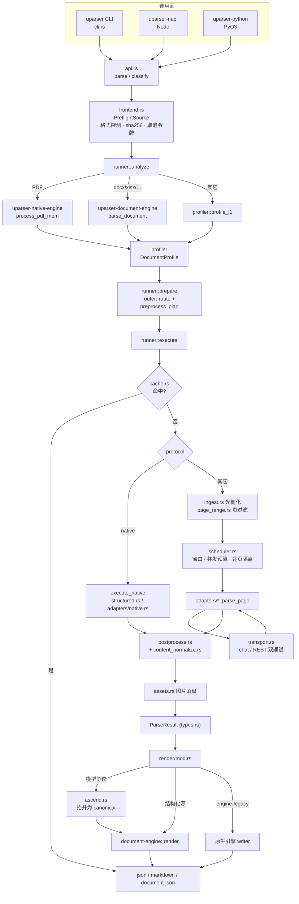
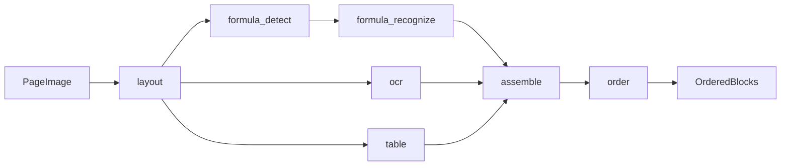

# uparser 技术架构流程图

> 基准：分支 `feat/architecture-v2`，HEAD `6e1e792`（2026-09-09），工作区干净。
> 方法：直接读 `uparser/crates/**` 源码得出，不引用其它文档的转述。
> 规模：`uparser-core` 39 个模块 + 11 个 adapter；`uparser-document-engine` 9 种格式前端；
> 另有 `uparser-native-engine` / `uparser-napi` / `uparser-python` 三个 crate。

**与既有文档的分工**（三份都还有效，覆盖面不同，冲突时以本文为准，因为本文的基准最新）：

| 文档 | 覆盖 | 基准 |
|---|---|---|
| 本文 | 当前**模块结构与数据流全景**，含 Mermaid 图 | HEAD `6e1e792`（2026-09-09） |
| `CLI_NATIVE_PIPELINE_MINERU_VLM_AUTO_TECHNICAL_FLOW.md` | `native`/`pipeline`/`mineru-vlm`/`auto` **四条 CLI 路径**的逐步细节 | 早于本文 |
| `ARCHITECTURE_FLOW_AND_REDUNDANCY_ANALYSIS.md` | **冗余/死代码**审计与整改台账 | HEAD `44649fb`（2026-09-02） |

> 冗余分析文档里"三个 Markdown 实现仍然并存"的结论**已经过时**：M3 渲染器统一之后，
> `render::render_markdown` 只剩两条分支（canonical 渲染器 + `--markdown-source
> engine-legacy` 的原生引擎 writer），模型协议与结构化源共用同一个渲染器。

---

## 1. Workspace 分层

```
┌──────────────────────────────────────────────────────────────────────────┐
│  调用面（3 个，共用同一核心）                                               │
│    uparser CLI              uparser-napi           uparser-python        │
│    cli.rs + main.rs         (napi-rs, Node)        (PyO3)                │
│                    └─────────────┬─────────────┘                         │
│                                  ▼                                       │
│                api.rs  ── parse / classify / parse_canonical_document    │
├──────────────────────────────────────────────────────────────────────────┤
│  uparser-core ── 编排 + 协议适配 + 统一 IR                                 │
├───────────────────────────────┬──────────────────────────────────────────┤
│ uparser-native-engine         │ uparser-document-engine                  │
│ 纯 Rust / lopdf / 零模型       │ 结构化格式前端 + canonical 模型 + 唯一渲染器│
│ 文本层·版面·表格·Markdown      │ docx pptx xlsx csv epub rtf odf doc ppt  │
│ 无 PDFium、无 OCR、无外部服务   │ model.rs / render / detect / package     │
└───────────────────────────────┴──────────────────────────────────────────┘
```

`lib.rs` 的可见性策略：只有 `api`/`cli`/`types`/`frontend`/`runner`/`router`/
`protocol_spec`/`adapters`/`ingest`/`imaging`/`render`/`testing` 是 `pub`，其余
`pub(crate)`，这样某个模块失去最后一个调用方时 `dead_code` 能真正报出来。
`transport`/`tensor_wire`/四个 `pipeline_*` 解码器在非默认的 `internals` feature 下才 `pub`
（仅供 `examples/*` 手工冒烟脚本）。

---

## 2. 主流程：`frontend` → `runner`（analyze → prepare → execute）→ `render`

```
                          输入字节 + 文件名
                                 │
                                 ▼
   ┌──────────────────────────────────────────────────────────┐
   │ frontend.rs  PreflightSource            不可变输入身份     │
   │  · 格式探测：容器签名 / 分隔符语法 / Unknown                │
   │  · sha256（缓存键的一部分）· CancellationToken             │
   └────────────────────────────┬─────────────────────────────┘
                                ▼
   ┌──────────────────────────────────────────────────────────┐
   │ runner::analyze                       → AnalysisReport   │
   ├──────────────────────────────────────────────────────────┤
   │  PDF        → native-engine::process_pdf_mem             │
   │                + profiler::profile_l2_result             │
   │  结构化格式  → document-engine::parse_document             │
   │                + profiler::profile_structured_document    │
   │  其它       → profiler::profile_l1（仅格式/元数据）        │
   │                                                          │
   │  ★ 产物装进 AnalysisArtifacts，后续 execute 直接复用，     │
   │    不会二次解析                                            │
   └────────────────────────────┬─────────────────────────────┘
                                ▼
   ┌──────────────────────────────────────────────────────────┐
   │ runner::prepare                       → PreparedRun      │
   │  · router.rs::route → RouteDecision                      │
   │      Explicit(--protocol) | Auto(按 profile 选)           │
   │  · preprocess_plan → 光栅 DPI（默认 200，对齐 MinerU）/ 页范围│
   │  · semantic.rs（可选 L3 语义分类，低置信度时才调模型）        │
   └────────────────────────────┬─────────────────────────────┘
                                ▼
   ┌──────────────────────────────────────────────────────────┐
   │ runner::execute / execute_with_hooks                     │
   │                                                          │
   │  ① cache.rs 查缓存 —— 所有模式统一，含 native              │
   │     key = sha256(bytes) + protocol + endpoint + model     │
   │           + execution_fingerprint                        │
   │     命中 → 直接返回（附回 profile/route 元数据）            │
   └──────┬───────────────────────────────────┬───────────────┘
          │ protocol == "native"              │ 其它协议
          ▼                                   ▼
 ┌──────────────────────┐        ┌─────────────────────────────────────┐
 │ execute_native       │        │ materialize_page_source             │
 │                      │        │  ingest.rs 光栅化（pdfium feature）  │
 │ Structured(document) │        │  page_range.rs 页过滤（--pages）     │
 │  → structured.rs     │        └──────────────┬──────────────────────┘
 │    to_parse_result   │                       ▼
 │                      │        ┌─────────────────────────────────────┐
 │ Pdf(artifact)        │        │ scheduler.rs::run_source            │
 │  → adapters/native.rs│        │  · 处理窗口（window_size）           │
 │    可选 hybrid OCR    │        │  · 跨页并发预算 Semaphore            │
 │    （pdfium feature） │        │  · 逐页失败隔离；单页 panic 不致命     │
 │                      │        │  · on_window 流式回调 / on_progress  │
 └──────────┬───────────┘        └──────────────┬──────────────────────┘
            │                                   ▼
            │                         adapters/*::parse_page
            │                         （见 §3；内部可多轮编排）
            │                                   │
            └─────────────────┬─────────────────┘
                              ▼
   ┌──────────────────────────────────────────────────────────┐
   │ postprocess.rs   段落几何合并                              │
   │   └ content_normalize.rs  CJK 标点/空白规范化               │
   │ assets.rs        图片按 sha256 内容寻址落盘 → asset_path    │
   │ cache.rs         写回                                     │
   └────────────────────────────┬─────────────────────────────┘
                                ▼
                    ParseResult（types.rs 统一 IR）
                                │
                                ▼
   ┌──────────────────────────────────────────────────────────┐
   │ render/mod.rs::render_markdown                           │
   │   结构化源            ─────────────► document-engine       │
   │   模型协议 → ascend.rs ─────────────► ::render::markdown   │
   │   native + engine-legacy ──────────► 原生引擎自带 writer   │
   └──────────────────────────────────────────────────────────┘
              --format json | markdown | document-json
```

### Mermaid 版



---

## 3. 协议适配层

`protocol_spec.rs` 用**声明式表**描述每个协议的执行形状与线上契约，`adapters/*` 只实现
差异部分。`uparser protocols` 子命令直接把这张表打出来。

| 协议 | mode | shape | transport | preprocess | decode | coordinates | order |
|---|---|---|---|---|---|---|---|
| `native` | Native | NativeDocument | InProcess | SourceSemantic | NativeArtifact | SourceSemantic | SourceSemantic |
| `tesseract` | Native | OneShotPage | InProcess | PageImage | OcrBoxes | PixelAbs | FromModel |
| `mineru-vlm` | ModelProtocol | LayoutThenRecognize | OpenAiChatCompletions | HardResize | CustomToken | Norm0To1000 | GeometricFallback |
| `dots-ocr` | ModelProtocol | OneShotPage | OpenAiChatCompletions | SmartResize | StrictJson | PixelAbs | FromModel |
| `generic-vlm` | ModelProtocol | OneShotPage | OpenAiChatCompletions | PageImage | Markdown | None | FromModel |
| `monkeyocr-v2` | ModelProtocol | LayoutThenRecognize | OpenAiChatCompletions | PixelBounds | PythonLiteral | Norm0To1000 | FromModel |
| `paddleocr` | ModelProtocol | StructuredService | PaddleOcrService | PageImage | OcrBoxes | PixelAbs | GeometricFallback |
| `paddlex-structure` | ModelProtocol | StructuredService | PaddleOcrService | PageImage | StructuredEnvelope | None | FromModel |
| `pipeline` | Pipeline | StageGraph | PipelineStages | StageGraph | StageOutputs | PixelAbs | AdapterComputed |
| `mock` | Test | Mock | None | None | Mock | PixelAbs | FromModel |

`ProtocolAdapter` trait（`adapters/mod.rs`）只有一个执行方法：

```rust
async fn parse_page(&self, page: &RenderedPage, ctx: &ParseCtx) -> Result<Vec<Block>, PageError>;
```

多轮协议（版面→按块识别）在 `parse_page` 内部自行编排，不由调度器拆分——这是当初
把"build_requests→dispatch→parse"三段式换掉的原因：三段式表达不了"第二轮请求依赖
第一轮解析结果"。

`CoordinateKind::None` 是显式的"**没有几何**"（`generic-vlm`/`paddlex-structure`
返回的是权威 Markdown），与 `FullPage`（给整页框）区分开——避免下游把伪造的整页框
当成实测坐标去做几何合并。

### `pipeline` 的阶段图

`stage_graph.rs::PIPELINE_V2_STAGE_GRAPH`：带类型的依赖图（每个节点声明
`accepts`/`produces`/`depends_on`/`on_failure`），执行前先做图解析校验。



Rust 侧自己做预处理与解码，服务端只做模型前向：

- `pipeline_layout.rs` — PP-DocLayoutV2 预处理 + 检测解码
- `pipeline_ocr.rs` — PP-OCRv6 预处理 + CTC 解码
- `pipeline_formula.rs` — PP-FormulaNet-plus-M 预处理 + token 解码
- `pipeline_table.rs` — 有线/无线表格候选打分与选择
- `tensor_wire.rs` — 与 bare 模型服务之间的二进制张量信封

---

## 4. 共享能力模块

| 归类 | 模块 | 职责 |
|---|---|---|
| 图像 / 几何 | `imaging.rs` | hard/smart resize、crop、rotate |
| | `geometry.rs` | 反归一化、IoU 去重、bbox 消毒（越界/翻转/最小尺寸） |
| 原始输出解码 | `output_parse.rs` | custom-token / strict-json / python-literal 三套容错解析 |
| | `otsl.rs` | OTSL token 序列 → HTML 表格（跨行跨列） |
| 内容修复 | `formula_repair.rs` | 括号配平、`wrap_display_math`、`strip_display_math` |
| | `robustness.rs` | 退化输出检测 + 升温重试 |
| 语义归一 | `category_map.rs` | 各协议原生类目 → 统一类目词表 |
| | `reading_order.rs` | 递归 XY-cut 阅读顺序兜底（列优先再行） |
| 传输 | `transport.rs` | chat-completions 与 REST 双通道，429/5xx/坏 JSON 重试、抖动退避、全局超时、并发闸 |
| 反向入口 | `markdown_ir.rs` | 权威 Markdown 协议的输出**反解**回 IR（否则会被当散文转义） |
| 其它 | `agent_config.rs` | 端点/模型解析 |
| | `shape_executor.rs` | 并发区域识别的确定性收集与传输层错误边界 |
| | `testing.rs` | `MockDispatch` 离线测试替身 |

---

## 5. CLI 子命令

| 命令 | 作用 |
|---|---|
| `parse` | 主命令。`--mode auto\|native\|protocol\|pipeline`、`--protocol`、`--endpoint`、`--model`、`--format`、`--markdown-source`、`--pages`、`--max-concurrency`、`--window-size`、`--no-cache`、`--stream`、`--assets-dir`/`--no-assets`、`--no-postprocess`，以及 pipeline 的分阶段端点参数 |
| `classify` | 只跑 analyze，输出 `DocumentProfile` |
| `plan` | 只跑 analyze+prepare，输出路由与预处理计划，不执行 |
| `cache stat\|clear` | 缓存管理 |
| `doctor` | 端点可达性 / 本地 CPU 内存探测 |
| `protocols` | 打印每个协议的 spec 摘要 + 运行期能力（`category_vocab`/`emitted_signals`/`model_stages`/`provides_reading_order`） |

Agent-first 契约：**stdout 只放结果，stderr 只放日志**，退出码语义化（0 成功 / 1 用法
错误 / 依赖缺失、超时等各有码位），错误以结构化对象输出。

---

## 6. 三个当前值得注意的结构性事实

1. **native-engine 在 `analyze` 阶段就对每个 PDF 跑过一次**，产物同时供 L2 画像、路由
   和 native 执行复用。所以 `--protocol auto` 的画像是"真解析"而不是启发式，而这份
   成本无论最终走哪条路都已经付了。
2. **渲染器只有一个**：所有模型协议经 `ascend.rs` 抬升到 canonical 模型后，与
   docx/xlsx 走同一个 `document-engine::render`。好处是修一处全协议受益；风险是错一处
   全协议受损——2026-09-09 修的公式转义缺陷正是出在这条汇聚路径上
   （见 `BENCHMARK_REPORT.md` Part B §3）。
3. **缓存在 `execute` 的最前面**，对 native 同样生效（源码注释标为 O3.2；此前 native
   会在每次调用时重新解析）。

---

## 7. 怎么核对这张图

```bash
# §3 表格里的 name / mode / shape / transport / coordinates（键名 coordinate_system）
# / decode（键名 raw_output_format）可以直接从这里核对；该命令还额外给出
# category_vocab、emitted_signals、model_stages、provides_reading_order。
# 但 preprocess 与 order 两列只在 protocol_spec.rs 源码表里，命令不输出。
uparser/target/release/uparser protocols

# §2 的 analyze+prepare 两段（格式证据、路由决策、预处理计划、复用产物），不执行解析。
# 注意输出里的 reused_artifacts: ["native_pdf_analysis"] —— 就是 §6 第 1 条说的产物复用。
uparser/target/release/uparser plan <file>

# §1 的规模数字
ls uparser/crates/uparser-core/src/*.rs | wc -l          # 39
ls uparser/crates/uparser-core/src/adapters/*.rs | wc -l # 11
```
