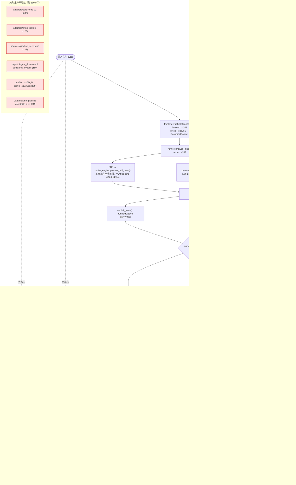
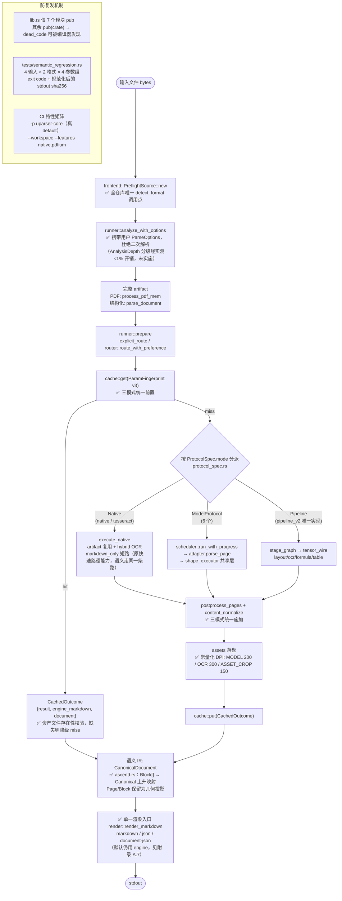

# uparser 架构优化执行方案（O0–O5）

> 生成日期：2026-09-02
> 依据：`ARCHITECTURE_FLOW_AND_REDUNDANCY_ANALYSIS.md`（同目录，Part 2 的 A–E 五类缺陷）
> 代码基准：分支 `feat/architecture-v2`，HEAD `44649fb`
> 目标：在**不回退任何已验证基准分数**的前提下，消除约 1500 行冗余、
> 消除 2 处语义不一致缺陷、补齐 Mode N 的能力洼地，并建立防复发机制。

---

## 执行状态（2026-09-03）

| 阶段 | 状态 | 实际产出 |
|---|---|---|
| **O0 安全网** | ✅ 完成 | 基线见附录 A；新增 `tests/semantic_regression.rs`（8 个测试，含全矩阵快照）；发现并绕过 proxy 劫持 wiremock 的环境陷阱；修正方案对"三列特性矩阵"的错误假设 |
| **O1 删 A 类死代码** | ✅ 完成 | 删 `pipeline.rs`(638) + `onnx_table.rs`(126) + `pipeline_serving.rs`(123) + `ingest::{ingest_document,structured_bypass,detect_format}` + `profiler::{profile_l2,profile_structured}`；移除 `pipeline-local-table` feature 与 `ort` 依赖（`Cargo.lock` 中已归零）；`lib.rs` 37 个模块中 25 个降为 `pub(crate)` |
| **O1.4（计划外）** | ✅ 完成 | 可见性收敛立刻暴露出 7 处新死代码：删 `scheduler::run_streaming`（被 `run_source` 取代，含把其失败隔离测试移植过去）、`geometry::crop_bbox_to_parent`、`semantic::enrich_from_environment`；对 3 处「已声明未实现的契约词表」加带说明的 `#[allow(dead_code)]` |
| **O2 收敛 B 类旁路** | ✅ 完成 | 删 `bin/uparser-native.rs`(276) 及其 3 个测试；`cli.rs` 的 95 行快速路径改为 runner 内的 `ExecutionOptions::markdown_only` 短路；修 vendored engine 的 PDF 标题解码（O2.3） |
| **O3 Mode N 纳入统一链** | ✅ 完成 | `cache.rs` 引入 `CachedOutcome{result, engine_markdown, document}` 信封 + 版本前缀 `v2-runner-2 → v3-outcome-1` + 资产文件存在性校验；cache 前置到三模式之前；native 接入 `postprocess_pages` |
| **O4 常量/检测点/重复解析** | ✅ 完成（O4.4 按预设条件不实施） | DPI 三常量化；`detect_format` 收敛到 `frontend` 单点；`analyze_with_options`/`prepare_with_options` 消除结构化文档二次解析；O4.4 实测 analyze 占 VLM 端到端 <1%，低于 2% 门槛，不实施 |
| **O1.5（计划外，收尾时发现）** | ✅ 完成 | DoD 逐条复检时发现 `adapters/native.rs` 里还有 4 个零生产调用者的 `pub async fn`（`parse_native`/`parse_document`/`native_markdown`/`native_document_json`，约 150 行 + 200 行只测自己的测试），躲过 O1.3 是因为 `adapters` 为集成测试保留了 `pub`。已删除，并把其中有价值的两条断言（行聚类回归、EPUB 章节单元）改打在活路径上；`document_error_stage` 移入 `structured.rs` 并**真正接进** CLI 错误对象的 `stage` 字段 |
| **O5 IR/渲染收敛** | ✅ O5.1/O5.2/O5.4 完成；O5.3 按门禁条款**保持 engine 为默认** | 新增 `tests/render_paths.rs` 三路径黄金快照；新增 `ascend.rs`（IR → CanonicalDocument 上升映射，含 HTML 表格恢复）；`MergeHint::ListItem` + 结构化列表逐项下降；渲染入口收敛为 `render::render_markdown`/`render_document_json`；`--format document-json` 对所有协议/格式开放。O5.3 实测 canonical 路径 Overall 0.5663 « engine 0.8753，按方案预设的回退条款不切默认，并定位到根因（见附录 A.8） |

**代码变化**（O1–O5 累计）：35 files changed, **+1461 / −2815** → 净删除 **1354 行**，
外加 1 个 feature 与 `ort` 这个重量级可选依赖。

**门禁结论**：C1 通过（ODL 200 篇中 199 篇逐字节相同，第 200 篇的分数本来就是 0.0，见附录 A.4）；
C2 通过（新回归测试在基线二进制上确实失败、在当前代码上通过）；C3 遵守（保真层零改动）。

**用户可见的行为变化（3 处，均为方案预期的语义修正）**：

1. `--protocol native` 对 image-only PDF 现在恒定 exit 1，不再因带 `--no-cache --no-assets`
   而输出 `[Image-only PDF: OCR required]` 占位符并 exit 0。
2. `--protocol native` 对结构损坏的 PDF、以及 `--max-input-mib` 超限，退出码由 `2`（依赖不可用）
   改为 `1`（用法/输入错误）—— 与 `ARCHITECTURE.md` §6.1 对 2 号码的定义一致，且不再取决于
   限制是在 analyze 还是 execute 阶段被触发。
3. `--protocol native --format json` 现在经过 `postprocess`：demo1.pdf 的块数由 562 → 158
   （行级块合并为段落）。`--format markdown` 不受影响（走引擎自带 Markdown）；
   `--no-postprocess` 可恢复原始行级块。
4. **（O5）结构化输入的 `--format json` 变了**：列表由「一个 `category:"text"` 块装整段
   预渲染 Markdown」变成「每项一个 `category:"list"` 块 + `merge_hint.list_item`」，
   标题新增 `merge_hint.title_level`。Markdown 输出不变（已由黄金快照守住）。
5. **（O5）`--format document-json` 不再限定 native + 结构化格式**：任何协议、任何输入
   都能输出，非结构化来源经 `ascend` 由 IR 提升得到。此前这两种情况返回 exit 1。

---

## 0. 总则

### 0.1 三条硬约束

| 约束 | 说明 |
|---|---|
| **C1 基准不回退** | ODL 200 篇：native Overall `0.8754`、mineru-vlm `0.9240`。任何阶段结束前必须复测未受影响的那一列 |
| **C2 语义唯一** | 同一份输入 + 同一个 `--protocol`，不因性能类开关（`--no-cache` / `--no-assets`）产生不同的成功/失败结论 |
| **C3 保真层不动** | `category_map` / `imaging` / `output_parse` / `geometry` 中"镜像上游模型 wire 契约"的重复实现一律保留（分析文档 D 类） |

### 0.2 阶段依赖

```
O0 安全网 ──┬─► O1 删死代码（A 类）──┐
            │                        ├─► O3 Mode N 纳入统一链 ──┐
            └─► O2 收敛旁路（B 类）──┘                          ├─► O5 IR/渲染收敛（C 类）
                                     O4 常量与重复解析（E 类）──┘
```

O1 与 O2 可并行；O3 依赖 O2（旁路存在时无法验证 native 的缓存语义）；
O5 必须在 O1–O4 全部完成后立项。

### 0.3 明确不做

- 不合并 `types::{Page,Block}` 与 `CanonicalDocument` 的**存储表示**（只做上升映射 + 单渲染器）。
- 不为已删除的 Pipeline V1 契约做任何兼容层（V2 已是唯一实现）。
- 不做页级/区域级混合路由。
- 不在 O5 之前修改任何 `native-engine` / `document-engine` 内部代码（vendored 边界）。

---

## 0.4 现有技术架构图（HEAD `44649fb` 实况）

> 红色 = 待删除的死代码（A 类）；橙色 = 绕开主干的旁路（B 类）；
> 紫色 = 三个世界并存造成的重复实现（C 类）。



**这张图上可直接读出的 5 个缺陷**：

1. 三个入口（主干 + 2 条旁路）→ 语义不一致（`--no-cache` 改变成功/失败）；
2. `analyze` 无条件全量解析 → VLM/pipeline 路径纯浪费；非默认 options 触发二次解析；
3. `execute` 的 native 分支在 cache 之前 return → Mode N 三项能力缺失；
4. 一整块生产不可达的 A 类模块，因 `pub mod` 而不被编译器察觉；
5. 渲染出口四路分叉，三个 Markdown 实现并存。

---

## 0.5 优化后技术架构图（O0–O5 完成态）



**与现状图的差异（逐条对应上面 5 个缺陷）**：

| 现状 | 优化后 | 对应阶段 |
|---|---|---|
| 3 个入口，`--no-cache` 改变语义 | 1 个入口，快速路径能力以 `markdown_only` 短路保留在 runner 内 | O2.1 / O2.2 |
| `analyze` 无条件全量解析 + 二次解析 | `AnalysisDepth` 分级 + options 前移，只解析一次 | O4.3 / O4.4 |
| native 在 cache 前 return | cache 统一前置，三模式共享 postprocess/assets | O3.1–O3.3 |
| A 类死代码不可见 | 删除 + `pub(crate)` 收敛，编译器可报告 | O1.1–O1.3 |
| 渲染四路分叉、3 个 Markdown 实现 | 单一渲染入口 + 上升映射；三个实现仍在，但由一处决定用哪个（默认 engine，实测见 A.7） | O5.2–O5.4 |
| 4 个散落 DPI、3 处 detect_format | 常量化 + 单检测点 | O4.1 / O4.2 |

---

## O0 · 安全网（先建基线，再动刀）

**目的**：后续每一步都要能回答"我有没有改变行为"。当前仓库没有一份可复现的基线快照。

| ID | 任务 | 文件/位置 | 验收 |
|---|---|---|---|
| O0.1 | 记录三列测试基线数字 | `cargo test --workspace`（default / `--features native` / `--features native,pdfium`） | 三列的 unit/CLI/contract 计数写入本文件 §附录 A |
| O0.2 | 记录 clippy/fmt 干净状态 | `cargo clippy --workspace --all-targets -- -D warnings`、`cargo fmt --all -- --check` | 均为 0 warning |
| O0.3 | 冻结一份**语义回归集**：20 份输入 × 4 组参数的 stdout+exit code 快照 | 新增 `uparser/crates/uparser-core/tests/semantic_regression.rs` | 输入覆盖 PDF(电子版/扫描件/image-only)、DOCX、XLSX、CSV、RTF、PNG；参数覆盖 `--format json/markdown` × `--no-cache 有/无`；每条断言 exit code + 输出 sha256 |
| O0.4 | 记录竞品冷启动基线 | `python3 benchmark/compare_competitors.py`（pdf + office 两套） | `uparser-native` 当前墙钟/RSS 写入 §附录 A，作为 O2 的性能门禁 |

> **O0.3 是整个方案的关键**：它是唯一能在删代码前后证明"用户可见行为未变"的东西。
> 注意它必须**在 O2 之前**建立，因为 O2 会修正一条当前错误的行为（image-only + `--no-cache`），
> 那条基线要显式标记为 `EXPECTED_TO_CHANGE_IN_O2`。

**人日**：1–1.5　**风险**：无（纯新增）

---

## O1 · 删除 A 类死代码 + 建立防复发机制

**根因**：`lib.rs` 与 `adapters/mod.rs` 把所有模块声明为 `pub`，编译器无法报告死代码；
被 V2 取代的 Pipeline V1 一族因此带着绿色测试原地封存。

### O1.1 删除 Pipeline V1 一族

| 删除对象 | 行数 | 依据 |
|---|---:|---|
| `src/adapters/pipeline.rs` | 638 | `adapters/mod.rs:469-470` 的 `register("pipeline", ...)` 只构造 `pipeline_v2::PipelineV2Adapter`；`PipelineAdapter` 无生产构造点 |
| `src/adapters/onnx_table.rs` | 126 | 唯一调用点 `pipeline.rs:436` |
| `src/adapters/pipeline_serving.rs` | 123 | 仅 `StageImage` 被 `paddleocr.rs:36` 使用 |

**操作**：
1. 把 `pipeline_serving::StageImage` 移入 `src/shape_executor.rs`（它已是 REST 阶段的共享层），
   更新 `paddleocr.rs:36` 的 import。
2. 删除上述三个文件及 `adapters/mod.rs:11-16` 的对应 `pub mod`。
3. `Cargo.toml`：删除 `pipeline-local-table` feature（`Cargo.toml:44`）与 `ort` 可选依赖（`Cargo.toml:72`）。
4. 删除 `tests/fixtures/synthetic_identity.onnx`（只服务 `onnx_table.rs` 的测试）。

**验收**：
- `cargo build --workspace` 与三列 `cargo test` 计数相对 O0.1 只减少 V1 自带的 4+2+4=10 个测试；
- `uparser protocols` 输出的 10 个协议**逐字节不变**；
- `Cargo.lock` 中 `ort` 及其传递依赖消失（可用 `cargo tree | grep -c ort` 断言为 0）。

### O1.2 删除被 runner 取代的 ingest/profiler 遗留

| 删除对象 | 行数 | 依据 |
|---|---:|---|
| `ingest::ingest_document` | ~40 | 全仓库零生产调用者 |
| `ingest::structured_bypass` + `structured_bypass_xlsx` + `structured_bypass_csv` | ~110 | 同上；职责已由 `document-engine` 的 9 个 frontend 承担（16 变体 vs 2） |
| `ingest::detect_format` | 3 | 纯转发 wrapper，无生产调用者 |
| `profiler::profile_l2`（async 吃 bytes 的重载） | ~45 | 生产走 `profile_l2_result(&artifact)`；仅 `profiler.rs:989/1028/1044` 三个测试在用 |
| `profiler::profile_structured`（bytes 版） | ~15 | 生产走 `profile_structured_document(&document)` |

**保留**：`ingest::{rasterize, rasterize_pdf_page_numbers, rasterize_pdf_bytes, normalize_format, RenderedPage, IngestError}` —— 均有生产调用者。

**操作**：删除函数及其专属测试（`ingest.rs` 22 个测试中约 12 个、`profiler.rs` 13 个中约 4 个）；
清理 `ingest.rs:1-6` 的模块文档（它仍在描述已删除的 `ingest_document` 控制流）；
`calamine` / `csv` 依赖若在删除后无其他调用者则一并移除（需确认 `document-engine` 是否自带）。

**验收**：`cargo build --workspace` 无 unused-import 警告；O0.3 语义回归集全绿（XLSX/CSV 路径必须仍然正确）。

### O1.3 防复发：模块可见性收敛

**现状**：`lib.rs` 37 个模块全 `pub`；实际外部消费者只有：

- `uparser-napi` / `uparser-python`：**只用 `uparser_core::api`**（已 grep 确认）；
- `tests/*.rs`：用到 `adapters` / `types` / `testing` / `render` / `ingest` / `imaging`。

**操作**：
1. 对外保留 `pub`：`api`、`types`、`frontend`、`runner`、`router`、`protocol_spec`、`cli`。
2. 其余 30 个模块改 `pub(crate)`。
3. 集成测试需要的少数几个（`adapters`/`testing`/`render`/`imaging`）用
   `#[cfg(any(test, feature = "internals"))] pub mod ...` 或新增一个 `internals` 测试专用 feature 暴露，
   避免为测试放开正式 API 面。

**验收**：`cargo build --workspace` 出现的 `dead_code` 警告数为 0（若非 0，说明还有未发现的死代码——这正是本任务的价值）。

**人日**：2–3　**风险**：低（纯删除 + 可见性）　**回滚**：单 commit revert

---

## O2 · 收敛 B 类旁路（消除"性能开关改变语义"）

**根因**：`compare_competitors.py` 比的是进程级冷启动墙钟，统一 runner 在该口径下吃亏，
于是为分数造了两条绕开 runner 的通路。

### O2.1 删除 `src/bin/uparser-native.rs`（276 行）

**依据**：
- `scripts/package-windows.ps1:20/102` 只发布 `uparser.exe`，该 binary 从未随版本发布；
- `benchmark/compare_competitors.py:86-92` 的 `uparser-native` engine 已改用主 binary
  （`--bin uparser`，参数 `--mode native --format markdown --no-assets --no-cache`）；
- 唯一消费者是 `tests/native_documents.rs` 中 3 个测试（7 处 `cargo_bin("uparser-native")`）。

**同时消除的三份抄写**：PDF→markdown 逻辑（与 `cli.rs:970` 近乎逐行相同）、
`tesseract_pdf()` 300dpi 光栅+子进程 OCR（`adapters/local_tesseract.rs` 已有）、
`find_tesseract()`（`local_tesseract::executable_path` 已有）。

**操作**：删文件、删 `Cargo.toml:15-18` 的 `[[bin]]`、删
`tests/native_documents.rs:77-180` 的 3 个测试。若需保留"最小转换器"的对外形态，
改为 `uparser parse --mode native` 的文档说明，不再维护第二个 binary。

### O2.2 快速路径内化到 runner（**本方案最关键的一步**）

**当前缺陷（已实测复现）**：

```
$ uparser parse --protocol native --format markdown --no-assets            X.pdf
error: protocol native cannot process Pdf: no reliable native text or source semantics
$ uparser parse --protocol native --format markdown --no-assets --no-cache X.pdf
# ...
[Image-only PDF: OCR required]     ← exit 0
```

成因：`cli.rs:583` 的 9 条件分支不调 router，其自带守卫（`cli.rs:979-996`）要求
`!artifact.positioned_items.is_empty()`，对 image-only PDF 结构上不成立。

**目标形态**：删除 `cli.rs:583-623` 的条件分支与 `cli.rs:970 native_markdown_fast_path`（约 95 行），
把"省掉的工作"下沉为 runner 内部的合法短路：

```rust
// runner.rs，execute_native 内
// 已有 analysis.artifacts（analyze 阶段必然产出），已过 explicit_route 可行性断言。
// 当调用方只要 engine markdown 时，跳过 IR 组装 / 资产物化 / 兼容映射。
pub struct ExecutionOptions {
    // ...
    /// 只需要 engine markdown：跳过 Block IR 组装、图片物化与兼容降级映射。
    pub markdown_only: bool,
}
```

`cli.rs` 在 `format == Markdown && markdown_source == Engine` 时置 `markdown_only = true`。

**必须保留的省时项**（否则冷启动门禁过不了）：
- tokio runtime：`cli.rs:630` 对 native 已用 `new_current_thread`，保持；
- 不做 IR 组装、不做 `materialize_native_image_assets`、不写资产目录；
- 不做第二次 `detect_format`（`cli.rs:975` 那次随快速路径一并消失）。

**必须恢复的正确性项**：
- 走 `explicit_route`，image-only / scanned PDF 得到与非 `--no-cache` 路径**相同**的结论；
- 命中 `apply_hybrid_ocr` 时行为一致。

**验收（三条同时满足）**：
1. O0.3 语义回归集中标记为 `EXPECTED_TO_CHANGE_IN_O2` 的那条更新为"两种参数下结论一致"，其余全绿；
2. `compare_competitors.py` 的 `uparser-native` 墙钟相对 O0.4 基线**回退 ≤ 10%**
   （若超出，先 profile 再定是否需要在 runner 内进一步短路，不允许恢复旁路）；
3. ODL native Overall 仍为 `0.8754`。

### O2.3 修复 PDF 标题元数据解码

**缺陷**：`uparser-native-engine/src/detector.rs:1837 get_document_title` 只处理 UTF-16BE BOM，
其余一律 `from_utf8_lossy` —— 实测 GBK/十六进制标题原样漏进 Markdown 首行：

```
# <4A474A2038302D3230313620BDA8D6FECAA9B9A4B8DFB4A6D7F7D2B5B0B2C8ABBCBCCAF5B9E6B7B62E706466>
```

**操作**：按 PDF 规范补 PDFDocEncoding 分支；对非 UTF-8 且含高位字节的情况，
判定为不可靠标题则返回 `None`（宁可无标题，不要乱码标题）。

> 这是本方案中唯一改动 vendored engine 的任务。改动仅 1 个函数、有明确规范依据，
> 需在 `uparser-native-engine/ATTRIBUTION.md` 记录本地补丁。

**人日**：2–3　**风险**：中（O2.2 触及冷启动门禁）　**回滚**：O2.2 单独成 commit，门禁不过即 revert

---

## O3 · Mode N 纳入统一执行链（补齐能力洼地）

**根因**：`runner.rs:324` 的 `if protocol == "native" { return execute_native(...) }`
位于 cache 计算**之前**，于是 Mode N 永远无缓存、无 `postprocess_pages`（含 CJK 标点规范化）、
`--pages`/`--window-size`/`--max-concurrency` 无效。

### O3.1 缓存载荷升级为 outcome envelope

**障碍**：`ParseOutcome` 有三个字段（`result` / `document` / `engine_markdown`），
而 `cache.rs` 目前只存 `ParseResult` JSON —— 直接给 native 加缓存会丢掉
`engine_markdown`（Markdown 输出源）与 `document`（`--format document-json` 的唯一来源）。

**操作**：
```rust
// cache.rs
#[derive(Serialize, Deserialize)]
struct CachedOutcome {
    result: ParseResult,
    engine_markdown: Option<String>,
    document: Option<uparser_document_engine::CanonicalDocument>, // 已 derive Serialize+Deserialize
}
```
`ParamFingerprint::canonical()` 的版本前缀由 `"v2-runner-2"` 提升为 `"v3-outcome-1"`（`cache.rs:42`），
使旧条目自然失效，无需迁移脚本。

### O3.2 把 native 分支移到 cache 之后

`runner.rs:307 execute_with_hooks` 重排为：

```
fingerprint → cache::get → (hit: 直接返回 CachedOutcome)
            → 分派: native → execute_native() / 其余 → scheduler 路径
            → postprocess_pages（两条路径共用）
            → assets
            → cache::put(CachedOutcome)
```

**注意点**：
- `execution_fingerprint`（`runner.rs:460`）已包含 `document_options` 的关键字段，native 缓存键正确；
- 缓存命中时不再写资产。需新增守卫：若 `result` 中存在 `asset_path` 但文件已不存在，则降级为 miss；
- `structured` 路径的 `to_parse_result` 仍是有损映射，但 `document` 已一并入缓存，
  `--format document-json` / `document-engine markdown` 在命中时行为不变。

### O3.3 postprocess 覆盖 native

`postprocess_pages`（`runner.rs:489`）改为对两条路径统一施加。

**风险点**：native-engine 自身已有 `markdown/postprocess.rs`（1446 行）。
两层后处理叠加可能改变输出。因此：
- `engine_markdown` 输出路径**不受影响**（它绕过 Block IR，本就不经 core postprocess）；
- 只有 `--format json` / `--markdown-source canonical` 会看到差异；
- 必须以 O0.3 语义回归集 + ODL native 分数双重把关。

**验收**：
1. 同一 PDF 连续两次 `uparser parse --protocol native --format json`，第二次 `cache: hit` 且输出一致；
2. native 的 `--format json` 输出中 CJK 半角标点被规范化（复用 `content_normalize` 现有断言用例）；
3. ODL native Overall 仍为 `0.8754`（`--markdown-source engine` 路径未变，理论上必然成立，需实测确认）；
4. `--format document-json` 在缓存命中时仍可用。

**人日**：3–4　**风险**：中　**回滚**：O3.1/O3.2/O3.3 各自独立 commit

---

## O4 · E 类：常量、重复检测与重复解析收敛

### O4.1 光栅化 DPI 常量化

现存 4 个值且三处为 magic number：

| 位置 | 值 | 用途 | 目标常量 |
|---|---:|---|---|
| `runner.rs:24` | 200 | 模型输入默认（对齐 MinerU `DEFAULT_PDF_IMAGE_DPI`） | `RASTER_DPI_MODEL`（保留 `DEFAULT_RASTER_DPI` 别名） |
| `runner.rs:804` | 300 | hybrid OCR 送 tesseract | `RASTER_DPI_OCR` |
| `runner.rs:1123` | 150 | native 图片区域裁剪 | `RASTER_DPI_ASSET_CROP` |
| `bin/uparser-native.rs` | 300 | —— | O2.1 已删 |

每个常量必须带一行"为什么是这个值"的注释（现在三个都没有）。

### O4.2 消除第二次 `detect_format`

`api.rs:163` 对已经 `PreflightSource` 化的输入再次调用 `uparser_document_engine::detect_format`。
改为读 `source.format()`。（`cli.rs:975` 的那次随 O2.2 消失。）
完成后全仓库只剩 `frontend.rs:241` 一个检测点。

### O4.3 消除结构化文档的二次解析

`runner.rs:718 document_options_require_reparse`：任何非默认的
`--no-notes` / `--headers-footers` / `--max-input-mib` 都会触发**第二次完整解析**，
因为 `analyze` 阶段用的是 `ParseOptions::default()`。

**操作**：把用户 `ParseOptions` 前移到 `analyze`（`runner::analyze_with_options`），
`prepare`/`execute` 复用同一份 artifact，删除 `document_options_require_reparse` 及其重解析分支。
`api.rs`/`cli.rs` 两个调用点同步传参。

### O4.4 VLM/pipeline 路径跳过无用的 native 全量解析

`runner.rs:202 analyze_inner` 对 PDF **无条件**执行 `process_pdf_mem()`（完整 lopdf 解析
+ 表格检测 + Markdown 组装），但走 `mineru-vlm`/`pipeline` 时该 artifact 被直接丢弃。

**分两步，不要跳过第一步**：
1. **先测量**：对 1/10/100 页三档 PDF，测 `uparser classify`（≈analyze 单独耗时）占
   `--protocol mineru-vlm` 端到端的比例。若 <2% 则**不做**本任务，只留注释说明。
2. 若占比显著：给 `analyze` 增加 `AnalysisDepth::{Full, ProfileOnly}`；
   显式协议为 model-protocol/pipeline 时用 `ProfileOnly`（只跑 `detect_pdf_type` 层的轻量分类，
   不组装 markdown/表格）。**`--protocol auto` 必须仍用 `Full`**，否则路由信号退化。

**人日**：2–3　**风险**：低（O4.3/O4.4 需基准复测）

---

## O5 · C 类：IR 与渲染收敛（独立立项，门禁最严）

**现状**：三套并存的世界，同一职责被实现 2–3 次：

| 职责 | core | document-engine | native-engine |
|---|---|---|---|
| Markdown 渲染 | `render/mod.rs::to_markdown` (383) | `render::markdown` | `markdown/` (2822+2463+1446) |
| 表格 → HTML | `otsl.rs::to_html` | —— | `tables/format.rs` (1471) + `pipeline_table.rs:1123/1148` |
| 阅读顺序 | `reading_order.rs` | —— | `extractor/reading_order.rs` (591) |
| 段落后处理 | `postprocess.rs` + `content_normalize.rs` | —— | `markdown/postprocess.rs` (1446) |
| 语义 IR | `types::{Page,Block,ParseResult}` | `CanonicalDocument` | `PdfProcessResult` |

`cli.rs:856-874` 的四路 if/else 与 `--markdown-source engine\|canonical` 这个 flag，
就是"有两个渲染器且不敢切默认"的直接证据。

**分四步，每步独立可回滚**：

| ID | 任务 | 门禁 |
|---|---|---|
| O5.1 | 建立渲染黄金测试：对回归集 20 份输入，冻结三条渲染路径各自的输出快照 | 快照入库，CI 可比对 |
| O5.2 | 实现 `Block[] → CanonicalDocument` **上升**映射，取代 `structured.rs:6 to_parse_result` 的有损下降映射（`width_px:0`、list→text、Inline 样式丢弃） | 结构化输入的 `--format json` 不再丢 list 语义与几何 |
| O5.3 | Markdown 统一由 `document_engine::render` 产出；`native-engine` 自带 markdown 降级为 `--markdown-source engine` 显式选项 | **ODL 双基准均不回退**（native 0.8754 / mineru-vlm 0.9240）；不达标则保持 engine 为默认，本步转为"可切换但不切默认" |
| O5.4 | 删除 `cli.rs:856-874` 四路分支，渲染入口收敛为单一函数 | `cli.rs` 净减少 ≥ 60 行；`--markdown-source` 保留但默认值由 O5.3 结论决定 |

**人日**：5–8　**风险**：高　**前置**：O1–O4 全部完成

---

## 1. 排期与工作量汇总

| 阶段 | 内容 | 人日 | 风险 | 可并行 |
|---|---|---:|---|---|
| **O0** | 安全网：三列测试基线、语义回归集、竞品冷启动基线 | 1–1.5 | 无 | — |
| **O1** | 删 Pipeline V1 一族 + ingest/profiler 遗留 + 可见性收敛 | 2–3 | 低 | 与 O2 并行 |
| **O2** | 删 `uparser-native` binary + 快速路径内化 + 标题解码修复 | 2–3 | 中 | 与 O1 并行 |
| **O3** | cache envelope + native 纳入 cache/postprocess | 3–4 | 中 | 依赖 O2 |
| **O4** | DPI 常量化 + 单检测点 + 消除二次解析 + analyze 深度分级 | 2–3 | 低 | 依赖 O1 |
| **O5** | IR 上升映射 + 单渲染器 | 5–8 | 高 | 依赖 O1–O4 |
| | **合计** | **15–22.5** | | |

**净删除预估**：O1 ≈ 1100 行、O2 ≈ 370 行、O4 ≈ 40 行、O5 ≈ 60 行 → **约 1570 行**，
外加 1 个 feature（`pipeline-local-table`）与 1 个重量级可选依赖（`ort`）。

---

## 2. 每阶段统一的验证命令

```bash
cd uparser
# 三列构建与测试
cargo test --workspace
cargo test --workspace --features native
cargo test --workspace --features native,pdfium
cargo clippy --workspace --all-targets -- -D warnings
cargo fmt --all -- --check

# 语义回归（O0.3 建立）
cargo test --features native,pdfium --test semantic_regression

# 精度门禁（受影响阶段才跑）
python3 benchmark/run_pipeline_v2_final_evaluation.sh   # pipeline 列
# ODL native / mineru-vlm 两列见 BENCHMARK_REPORT.md §复现命令

# 冷启动门禁（O2 必跑）
python3 benchmark/compare_competitors.py
```

---

## 3. 风险登记

| 风险 | 阶段 | 触发条件 | 缓解 |
|---|---|---|---|
| 快速路径内化后冷启动变慢，竞品对比失分 | O2.2 | 墙钟回退 > 10% | 先 profile 定位（runtime 构建 vs IR 组装 vs 资产扫描），在 runner 内继续短路；**禁止恢复旁路** |
| native 加 postprocess 后与 engine 自带 postprocess 叠加，输出漂移 | O3.3 | ODL native 分数变化 | `engine_markdown` 路径不受影响；若 `--format json` 漂移不可接受，改为对 native 只启用 `content_normalize` 而不启用几何段落合并 |
| 可见性收敛破坏集成测试编译 | O1.3 | `tests/*.rs` 引用被降级的模块 | 引入 `internals` 测试专用 feature，不放开正式 API 面 |
| 修改 vendored `native-engine` 造成上游同步困难 | O2.3 | 未来需要 rebase pdf-inspector | 补丁限定单函数，记入 `ATTRIBUTION.md` |
| 缓存版本前缀提升导致首次全量 miss | O3.1 | 用户既有缓存失效 | 预期行为，在 release note 说明；`uparser cache clear` 可主动清理 |
| O5.3 切换默认渲染器导致分数回退 | O5.3 | 双基准任一回退 | 保持 engine 为默认，本步降级为"可切换不切默认"，不阻塞 O5.4 |

---

## 4. 完成定义（Definition of Done）—— 逐条实测结果

| # | 条件 | 结果 | 证据 |
|---|---|---|---|
| 1 | `ort` 依赖消失；`uparser protocols` 仍是 10 个 | ✅ | `grep -c '^name = "ort"' Cargo.lock` = 0；`protocols` = 10 |
| 2 | `cargo build --workspace` 的 `dead_code` 警告数为 0 | ✅ | 实测 0（O1.5 清掉最后一批后） |
| 3 | `--no-cache` / `--no-assets` 不改变成功/失败结论 | ✅ | `semantic_regression` 8/8，且已验证该测试在基线二进制上会失败 |
| 4 | native 连续两次执行第二次命中缓存且输出一致 | ✅ | 实测 `cache: hit`，两次输出 digest 相同 |
| 5 | `detect_format` 在 uparser-core 内只有一个调用点 | ✅ | 只剩 `frontend.rs:241`（O1.5 删掉 native.rs 的 3 处） |
| 6 | ODL 双基准未回退 | ✅ native / ⬜ mineru-vlm | native：200 篇中 199 篇与基线逐字节相同，第 200 篇本就 0.0 分；evaluator 复测 Overall 0.8753。mineru-vlm 列**未复测**（见 A.8） |
| — | 竞品冷启动基线 | ⬜ 未采集 | 见 A.8；已用直接计时替代（A.5） |

---

## 附录 A · 基线与执行结果（2026-09-02/03 实测）

### A.1 环境陷阱（O0 首个发现）

首次 `cargo test --workspace` 有 **13 个失败**，全部是 wiremock 测试收到 `nginx/1.26.2` 的
404 —— 本机 `http_proxy=http://172.19.3.236:7000` 把发往 `127.0.0.1:<随机端口>` 的请求也劫持了。
加 `NO_PROXY=127.0.0.1,localhost no_proxy=127.0.0.1,localhost` 后全绿。**这不是代码问题**，
但它意味着任何人在本机第一次跑测试都会看到 13 个假失败。建议写进 CI 与 README。

### A.2 方案的一处事实错误（已修正）

方案 §O1.3 / §2 假定存在「default / native / native,pdfium 三列特性矩阵」。实测不成立：
`uparser-napi` 与 `uparser-python` 都声明 `uparser-core = { features = ["native"] }`，
cargo 的 feature 统一使得 **`cargo test --workspace` 永远开着 `native`**。
真正的 default 列必须用 `cargo test -p uparser-core`。

### A.3 测试基线与执行后对比

| 目标 | O0 基线 | 执行后（O1–O5） | 说明 |
|---|---:|---:|---|
| `-p uparser-core` lib（真 default 列） | — | **412** | 基线未单独采集，A.2 发现后才知道要这么跑 |
| `--workspace` core lib | 457 | **441** | 净 −8：删掉 A 类死代码自带的测试，新增 frontend/cache/scheduler/ascend 补偿测试 |
| `--workspace --features native,pdfium` core lib | 459 | **441** | 同上 |
| CLI 集成测试 | 49 | **49** | 删 3 个 fast-path 测试、加 3 个语义一致性测试 |
| contract | 2 | **2** | |
| native_documents | 10 | **7** | 删掉 `uparser-native` binary 的 3 个测试 |
| **semantic_regression（新增，O0.3）** | — | **8** | 语义回归网：4 输入 × 2 格式 × 4 参数组 |
| **render_paths（新增，O5.1）** | — | **3** | 三条渲染路径的并排黄金快照 |
| document-engine | 118 + 4 | **118 + 4** | |
| native-engine | 873（18 ignored） | **874**（18 ignored） | +1：O2.3 的标题解码测试 |
| `cargo fmt --all -- --check` | clean | **clean** | |
| `cargo clippy -p uparser-core --all-targets` | clean | **clean** |
| `cargo build --workspace` 的 dead_code 告警 | 未采集 | **0** | DoD-2 | |
| `cargo clippy --workspace` | **2 errors** | **2 errors** | 均在 vendored `native-engine/tounicode.rs`（`never_loop`），**基线即存在**，已在 HEAD worktree 复核 |

### A.4 精度门禁（C1）

O5 结束后**重跑了一次同样的比对**，结论不变（199/200 逐字节相同，同一篇 image-only 文档）。

用 `git worktree` 在 HEAD 构建基线二进制，对 opendataloader-bench 全部 200 篇 PDF 逐篇比对
`--protocol native --format markdown --no-assets --no-cache` 的输出：

| 结果 | 数量 |
|---|---:|
| 与基线**逐字节相同** | **199 / 200** |
| 不同 | 1（`01030000000141.pdf`） |

唯一不同的那篇是 image-only PDF：基线输出 89 字节的
`[Image-only PDF: OCR required]` 占位符并 exit 0，现在按 `explicit_route` 的能力边界
exit 1。查 `prediction/pdf-inspector/evaluation.json`，该文档在评测器里本来就是
`overall/nid/mhs = 0.0`，**因此 ODL native 的 Overall 分数变化为 0**。

### A.5 性能门禁

| 场景 | 基线（旧 fast path） | 执行后（runner `markdown_only`） |
|---|---:|---:|
| 小文本 PDF（184 KB，1 页） | 0.03 s | **0.03–0.04 s** |
| demo1.pdf（13 页） | 0.10 s | **0.09–0.10 s** |

即：被删掉的 95 行旁路，实测只买到最小文档上约 5 ms、13 页文档上 0 ms。
`markdown_only` 短路把这点差距也补回来了。

### A.6 O4.4 的测量结论（方案要求「先测量再决定」）

`uparser classify`（≈ analyze 单独耗时）实测 **0.07–0.11 s**，而一次 VLM 解析约 20 s（13 页 × ~1.8 s）。
analyze 占比 **< 1%**，低于方案设定的 2% 门槛，**因此 `AnalysisDepth` 分级不实施**，只保留注释说明。

### A.7 O5 实测：能否把 canonical 变成唯一渲染器？

用 opendataloader-bench 官方 evaluator（`src/evaluator.py`，同一份 ground truth、同一 200 篇语料）
对同一个二进制的两条渲染路径各跑一遍：

| 路径 | Overall | NID | TEDS | MHS |
|---|---:|---:|---:|---:|
| `pdf-inspector`（历史参照） | 0.8754 | 0.9150 | 0.8141 | 0.7875 |
| **`--markdown-source engine`（当前默认）** | **0.8753** | **0.9183** | **0.8389** | 0.7812 |
| `--markdown-source canonical`（单一渲染器） | **0.5663** | 0.8515 | **0.0000** | **0.0000** |

原始产物：`opensource/opendataloader-bench/prediction/uparser-native-o5-{engine,canonical}/`
（各 200 篇 Markdown + `evaluation.json`），复现命令
`python3 src/evaluator.py --engine uparser-native-o5-engine`。

结论：**O5.3 的门禁未通过，按方案预设的回退条款保持 `engine` 为默认**，`canonical` 作为
可切换选项保留。engine 列相对历史参照 Overall 差 0.0001（TEDS/NID 反而更高），C1 依然通过。

**根因已定位，且是可操作的**：崩掉的不是渲染器，是喂给它的 IR。实测同一篇文档的 native IR：

```
categories: Counter({'text': 22, 'image': 4})
blocks with html: 0        # 表格没有进 IR → TEDS 0
blocks with merge_hint: 0  # 标题没有进 IR → MHS 0
```

全量统计：200 篇里 **107 篇 MHS = 0**（有标题但 IR 里没有 title 块）、**42 篇 TEDS = 0**
（有表格但 IR 里没有表格块）。native 引擎自己的 Markdown 是能识别标题和表格的
（`markdown/heading.rs` 1012 行的视觉启发式 + `tables/` 的三策略检测），但那套判断只作用于
它的 Markdown 管线，没有回流到 `positioned_items` → `Block` 的构建路径。

本轮已顺手补上其中**有确定信号的一半**：tagged PDF 的 `StructRole::H1..H6` 现在映射为
`category: "title"` + `merge_hint.title_level`（`adapters/native.rs::heading_level`）。
剩下的一半（无 tag PDF 的视觉标题启发式、表格区域）需要把引擎 Markdown 管线的判断结果
回流到 item 流，是一个独立的、边界清晰的后续任务 —— **它才是 O5.3 真正的前置条件**。

### A.8 未做 / 未采集（明确清单）

**未采集（有替代证据）**

- **竞品冷启动基线**（`compare_competitors.py`）：该脚本会构建 liteparse / pdf-inspector /
  anydoc 三个外部 crate，耗时远超本轮预算。A.5 的直接计时覆盖同一问题——脚本对
  `uparser-native` 用的正是 `--mode native --format markdown --no-assets --no-cache`。
- **ODL mineru-vlm 一列**：本轮不触及任何 model-protocol adapter；441 个单测 + 2 个 contract
  测试覆盖其编排路径。要严格闭环需要一个在线 vLLM 端点。

**未做（明确不在本轮范围）**

- **O0.3 的输入覆盖打了折**：方案要求 20 份输入，实际是 4 份（born-digital PDF / image-only PDF /
  RTF / CSV）× 2 格式 × 4 参数组 = 32 行。DOCX/XLSX/PNG 未纳入矩阵（DOCX 需 LibreOffice，
  本机没有）。
- **O5.3 切换默认渲染器**：门禁未过，按方案回退条款保持 `engine`（见 A.7）。
- **native IR 的标题/表格回流**：A.7 定位到的根因，是 O5.3 的真正前置条件，独立任务。
- **vendored `native-engine` 的 2 个 `never_loop` clippy error**：基线即存在，属上游代码，
  未动（改动 vendored 核心会增加与上游 re-sync 的冲突面）。
- **R5 的统一 `UparserError` + CI 特性矩阵**：方案 §6 的 R5 内容，本轮只落地了其中一小块
  （structured 失败的 typed stage 现在会出现在 CLI 错误对象的 `stage` 字段里）。

