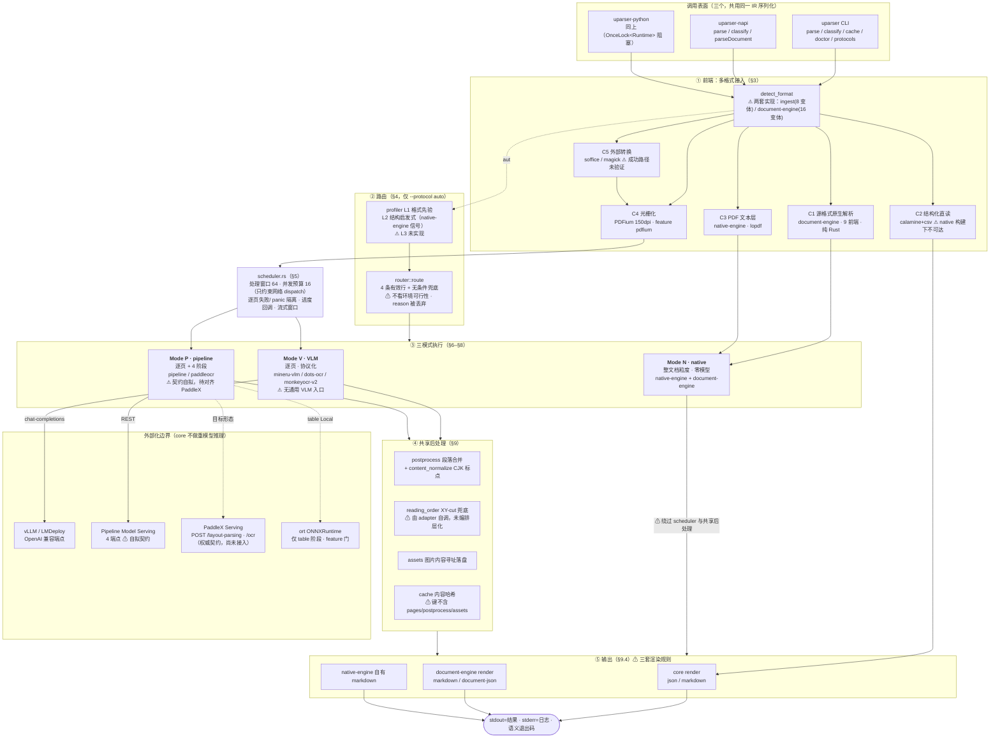
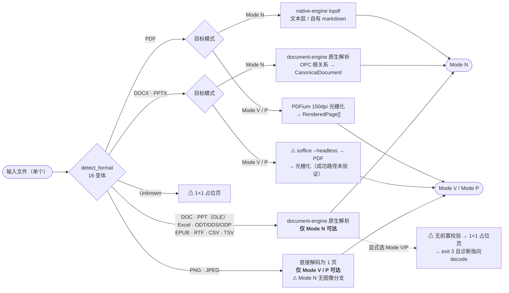
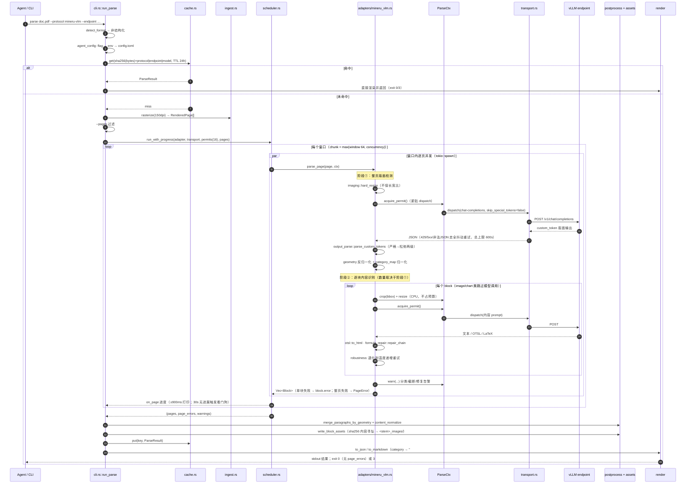
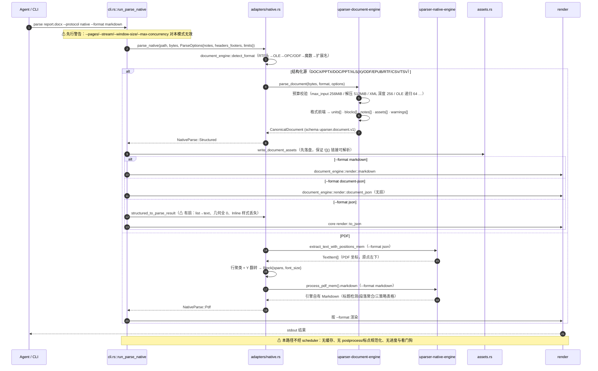
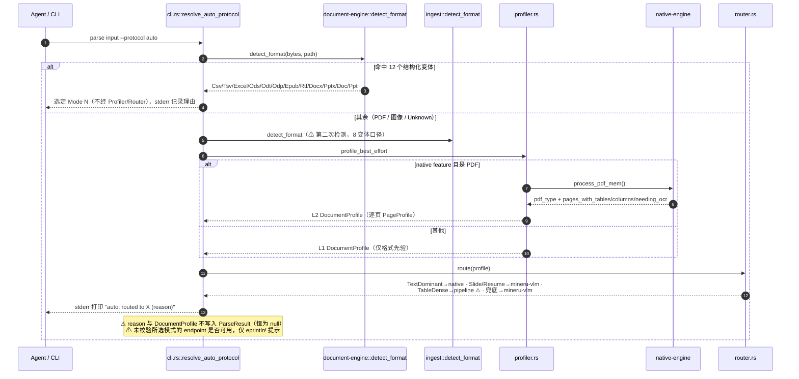
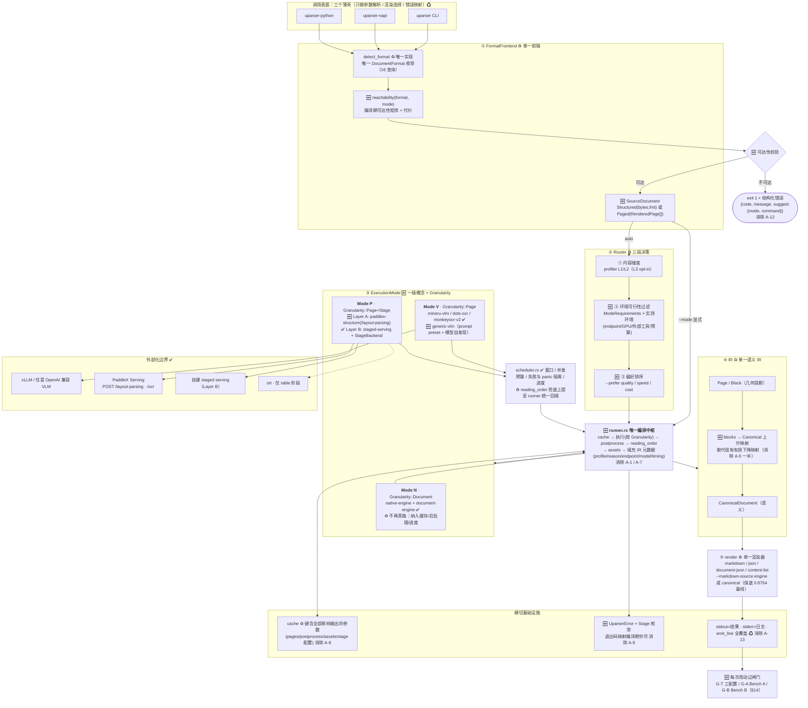

# uparser 技术架构设计 v1.0（as-built 规范）

> **本文档与 `ARCHITECTURE.md`（v0.9）的关系**
> `ARCHITECTURE.md` 是 v0.1→v0.9 的**设计演进史**，保留不动，用于追溯"为什么这样设计"。
> 本文档（v1.0）是**按当前源码逐模块核对后重写的现状规范**（as-built），去掉全部版本增量叙述，
> 以**三模式（native / pipeline / VLM）**为骨架。二者冲突时，**以本文档为准**。
>
> **如何阅读**：本文档描述"代码现在是什么"，不是"设计希望是什么"。
> 凡标注 **⚠ 现状偏差** 的段落，是已核实的实现与设计意图不一致处，**如实记录而非隐藏**；
> 其收敛方案见 `CORE_ARCHITECTURE_REVIEW_AND_REFACTOR_PLAN.md` 与 `THREE_MODE_ARCHITECTURE_AND_PLAN.md`，
> 本文档不重复实施计划。
>
> 核对基准：`uparser/crates/` 全部源码（`uparser-core` 13,990 行 / `uparser-document-engine` 11,534 行 /
> `uparser-native-engine` 内部化引擎 / `uparser-napi` 71 行 / `uparser-python` 94 行）；
> 实测基准：`uparser/target/release/uparser`（`--features native,pdfium`）。

---

## 目录

- [0. 总览：架构全景图与执行时序](#0-总览架构全景图与执行时序)
- [1. 产品定位与 Agent-first 契约](#1-产品定位与-agent-first-契约)
- [2. 三模式：一级概念](#2-三模式一级概念)
- [3. 前端：多格式接入与可达性](#3-前端多格式接入与可达性)
- [4. 路由：Profiler + Router](#4-路由profiler--router)
- [5. 编排：Scheduler 与执行模型](#5-编排scheduler-与执行模型)
- [6. Mode N · native（零模型）](#6-mode-n--native零模型)
- [7. Mode V · VLM（协议适配层）](#7-mode-v--vlm协议适配层)
- [8. Mode P · pipeline（多模型分阶段）](#8-mode-p--pipeline多模型分阶段)
- [9. IR 与渲染](#9-ir-与渲染)
- [10. 缓存 / 资产 / 错误模型 / CLI 面](#10-缓存--资产--错误模型--cli-面)
- [11. 现状能力矩阵与验证等级](#11-现状能力矩阵与验证等级)
- [12. 开放问题（清理版）](#12-开放问题清理版)
- [13. 架构优化的收益](#13-架构优化的收益)
- [14. 评测依据与不回退闸门](#14-评测依据与不回退闸门)
- [附录 A. 工程结构与模块清单](#附录-a-工程结构与模块清单)

---

## 0. 总览：架构全景图与执行时序

本章是全文的入口视图：一张**架构全景图**、一张**多格式分流图**、三张**执行时序图**。
图中 `⚠` 标注的是 as-built 的已知偏差（正文对应章节有详细说明），不是设计意图。

### 0.1 架构全景图



### 0.2 多格式接入分流图

**一次调用处理一个文件**（CLI 签名是 `uparser parse <path>`，无批量入口）；
批处理由调用方循环驱动，评测 harness 即如此（`opendataloader-bench` 的适配器逐篇 `subprocess.run`）。
下图是**格式 → 通道 → 模式**的完整分流，对应 §3.4 的可达性矩阵。



> 关键事实：**`auto` 会正确分流**（结构化格式直接选 Mode N），而**显式指定 Mode V/P 时没有可达性校验**——
> 这正是 §12.3 的 A-12，已经污染过一次真实评测（Bench B 的 native 行，见 §14.1 口径警告 2）。

### 0.3 时序图 1：Mode V 逐页两阶段（以 mineru-vlm 为例）



### 0.4 时序图 2：Mode N 多格式（结构化源 + PDF 两条子路径）



### 0.5 时序图 3：`--protocol auto` 的路由决策



---

## 1. 产品定位与 Agent-first 契约

**定位**：供**编码 Agent 以子进程方式调用**的统一文档解析器。Rust 单一核心 + 三个调用表面
（CLI / Node napi-rs / Python PyO3）。模型推理一律**外部化**——core 自身不做重模型推理
（唯一例外：Mode P 的 `table` 阶段可选本地 ONNX，见 §8）。

**Agent-first 契约（一等规约，`cli.rs`）**：

| 项 | 规约 | 源码 |
|---|---|---|
| 输出分离 | stdout 只输出结果（JSON / Markdown / NDJSON）；一切日志、进度、诊断走 stderr | `cli.rs` 全局 |
| 语义退出码 | `0` 成功 / `1` 用法错误 / `2` 依赖不可用 / `3` 部分页失败 / `4` 内部错误 | `EXIT_SUCCESS`…`EXIT_INTERNAL` |
| 结构化错误 | `--format json` 失败时 stdout 输出 `{"error":{"code","message","protocol","stage"}}` | `emit_error()` |
| 断管容错 | stdout 关闭（`\| head`）视为正常结束，不 panic | `emit_line()` |

**⚠ 现状偏差**：`emit_line()` 仅用于 Mode N 分支；主 parse 路径与缓存命中、结构化旁路、
`--stream` 分支仍是裸 `println!`，`uparser parse … | head` 在这些路径下仍会 panic。

---

## 2. 三模式：一级概念

三种模式在**执行粒度、依赖、成熟度**上根本不同，是理解本系统的第一层划分。

| | **Mode N · native** | **Mode V · VLM** | **Mode P · pipeline** |
|---|---|---|---|
| 本质 | 零模型：读 PDF 文本层 / 读源格式语义 | 生成式视觉模型逐页理解 | 判别式多模型分阶段流水线 |
| 执行粒度 | **整文档一次**（`parse_document`） | **逐页**（`parse_page`），页内可再逐块 | 逐页 + 阶段内逐块 |
| 外部依赖 | **无**（纯 Rust，无 PDFium、无 OCR、无服务） | OpenAI 兼容端点（vLLM/LMDeploy）+ GPU | 3 个 Remote 阶段服务（+ 可选本地 ONNX） |
| 实现 | `adapters/native.rs` → `uparser-native-engine` + `uparser-document-engine` | `adapters/{mineru_vlm,dots_ocr,monkeyocr_v2}.rs` | `adapters/{pipeline,pipeline_serving,onnx_table,paddleocr}.rs` |
| 走 Scheduler | **否**（专用旁路，见 §5 偏差） | 是 | 是 |
| 走共享后处理 | 否 | 是 | 是 |
| 实测（opendataloader-bench 200 篇） | Overall **0.8754**，**0.046 s/篇** | mineru-vlm Overall **0.9284**（榜首），1.81 s/篇 | 无 |
| 验证等级 | 基准实测 | mineru-vlm 真实端点 + 基准；其余仅离线 mock | 契约自拟，未端到端验证 |
| 适用 | 电子版 PDF、Office/开放格式源文件、无 GPU、要快 | 扫描件、复杂版面、表格保真要求高 | 需要按阶段分配算力、表格专用模型 |

**`--protocol` 与模式的对应**（`Registry::with_builtins()` 注册 7 项）：

```
Mode N : native
Mode V : mineru-vlm | dots-ocr | monkeyocr-v2
Mode P : pipeline | paddleocr
测试   : mock
```

**⚠ 现状偏差 1**：模式在代码里**没有对应的类型**（无 `ExecutionMode`），只有 7 个平铺的 protocol
字符串 + `#[cfg(feature)]` + 特判分支。`native` 在 `Registry` 中的注册项是**不可用的假注册**
（其 `parse_page()` 返回解释性 `PageError`），真实入口是 `cli.rs::run_parse_native` / `api.rs::parse_native`。

**⚠ 现状偏差 2**：Mode V **没有通用 VLM 入口**。三个协议都是对特定文档解析模型 wire 契约的逆向实现；
通用对话/视觉模型（Qwen3.8-27B 等）直出 Markdown 的路径只存在于 `benchmark/gen_qwen_omnidoc.py`
（Python 脚本直连 chat-completions + OmniDocBench 官方通用 VLM 参考 prompt），
其 1651 页实测结果（Text Edit 0.0481 / Reading Order Edit 0.1522 / Table TEDS 0.7920）
**无法通过 `uparser` 复现，也无法在生产中使用**。

---

## 3. 前端：多格式接入与可达性

### 3.1 五条接入通道

| 通道 | 实现 | 服务模式 | 外部依赖 |
|---|---|---|---|
| **C1** 源格式原生解析 | `uparser-document-engine`：`formats/{csv,sheet,docx,doc,pptx,ppt,odf,epub,rtf}` | Mode N | 无（纯 Rust） |
| **C2** 结构化直读 | `ingest::structured_bypass`（`calamine` + `csv`） | 仅非 `native` 构建 | 无 |
| **C3** PDF 文本层提取 | `uparser-native-engine`（lopdf）`extract_text_with_positions_mem` / `process_pdf_mem` | Mode N | 无 |
| **C4** 光栅化 | `ingest::rasterize` / `rasterize_pdf_bytes`（PDFium，150 dpi） | Mode V / P | `pdfium` feature（首次构建下载二进制） |
| **C5** 外部转换 | `ingest::normalize_format`（`soffice` / `magick`，60s 超时，`kill_on_drop`，独立 `UserInstallation` profile） | Mode V / P | LibreOffice / ImageMagick |

### 3.2 格式检测

存在**两套**实现与两个 `DocumentFormat` 枚举：

| | `ingest::detect_format` | `uparser_document_engine::detect_format` |
|---|---|---|
| 变体 | 8：Pdf/Docx/Pptx/Xlsx/Csv/Png/Jpeg/Unknown | 16：+Doc/Ppt/Excel/Odt/Ods/Odp/Rtf/Epub/Tsv |
| 手段 | `file-format` 魔数 + `.csv` 扩展名兜底 | RTF 头 → OLE(`cfb`) 探测 → ZIP 内 OPC 根关系 / ODF `mimetype` → 魔数 → 扩展名兜底 |
| 用于 | 缓存前格式判断、`ingest_pages` 分发、Profiler L1 | `auto` 的结构化格式判定、Mode N 内部分发 |

**⚠ 现状偏差**：`cli.rs` 与 `api.rs` 都对同一份 bytes **检测两次**；两者对
`.doc/.ppt/.odt/.ods/.odp/.epub/.rtf/.tsv` 的结论必然不一致（前者 `Unknown`、后者精确），
这是 §3.4 不可达格的直接成因。

### 3.3 结构化旁路（XLSX/CSV 不经视觉识别）

设计意图：已结构化的表格源直接读单元格，跳过光栅化与模型调用。

现状有**两条实现**，由 feature 决定走哪条：

```
非 native 构建 : ingest::structured_bypass → Block{source=StructuredNative, html=<table>}
                 protocol 字段 = "structured_bypass:{xlsx|csv}"
native  构建   : 两处调用点均被 #[cfg(not(feature = "native"))] 关闭
                 → 仅当 --protocol auto 时由 document-engine 承担（protocol = "native:{csv|excel|…}"）
                 → 显式 --protocol <VLM/pipeline> 时无人承担 ⚠
```

**⚠ 现状偏差**：生产推荐构建是 `--features native,pdfium`，因此 `ingest::structured_bypass`
及 core 对 `calamine`/`csv` 的直接依赖在生产中**完全不可达**；且 C2 缺 TSV（C1 有）。

### 3.4 格式 × 模式 可达性矩阵（实测）

`✅` 可用 · `⚠` 依赖未验证的外部工具 · `❌` 不可达

| 输入 | Mode N | Mode V | Mode P |
|---|:--:|:--:|:--:|
| PDF（电子版） | ✅ C3 | ✅ C4 | ✅ C4 |
| PDF（扫描件） | ❌ 无 OCR，输出空 | ✅ | ✅ |
| PNG / JPEG | ❌ `formats::parse` 无该分支 | ✅ 直接解码为一页 | ✅ |
| DOCX / PPTX | ✅ C1 | ⚠ C5 | ⚠ C5 |
| DOC / PPT（OLE） | ✅ C1 | ❌ | ❌ |
| XLSX / XLS | ✅ C1 | ❌ | ❌ |
| CSV / TSV | ✅ C1 | ❌ | ❌ |
| ODT / ODS / ODP | ✅ C1 | ❌ | ❌ |
| EPUB / RTF | ✅ C1 | ❌ | ❌ |

**❌ 的实际表现（实测，release 二进制）**：

```
$ uparser parse --protocol mineru-vlm --endpoint <任意> t.rtf     # .csv/.doc/.odt 同理
exit=3
page_errors[0] = {"stage":"decode",
                  "message":"failed to decode rasterized page: The image format could not be determined"}
pages = []
$ uparser parse --protocol auto t.rtf
exit=0  protocol="native:rtf"  pages=1        # 能力其实具备
```

即：不可达组合**在执行前没有校验**，落到 `rasterize_or_fallback` 的 1×1 占位页；
占位页的 `png_bytes` 是原始文件字节，adapter 侧解码即失败 → **请求不会发出**（不会产生静默错误内容），
但诊断指向错误的层（decode），也不提示"Mode N 可直接解析该格式"。

### 3.5 输入资源预算（document-engine，`options.rs`）

面向不可信输入的硬预算，Mode N 独有：

```
max_input_bytes 256 MiB · max_entry_bytes 128 MiB · max_total_uncompressed 512 MiB
max_archive_entries 100_000 · max_xml_depth 256 · max_record_depth 64（OLE 递归，故更紧）
max_xml_nodes 2_000_000 · max_expansion 4_000_000 · max_asset_bytes 128 MiB · max_text_bytes 64 MiB
```

`ParseOptions{include_assets: true, include_notes: true, include_headers_footers: false}`，
CLI 通过 `--no-notes` / `--headers-footers` / `--max-input-mib` 暴露。

---

## 4. 路由：Profiler + Router

### 4.1 实际控制流（as-built）

`cli.rs::run_parse` 与 `api.rs::parse` 各自实现同一条链：

```
1. 读文件 → ingest::detect_format
2. structured_bypass?                      # 仅非 native 构建（见 §3.3）
3. --protocol auto ?
   ├─ document_engine::detect_format 命中 12 个结构化变体 → 直接 "native"（不经 Profiler/Router）
   └─ 否则 → profile_best_effort（L2 若可用，否则 L1）→ router::route → protocol
4. agent_config::resolve_endpoint_model(effective_protocol, --endpoint, --model)   # 仅 CLI
5. protocol == "native" ? → Mode N 旁路（§6）
6. cache::get → Registry::build → ingest_pages → --pages 过滤
7. Scheduler::run_with_progress / run_streaming → adapter.parse_page
8. postprocess → assets → cache::put → render
```

**⚠ 现状偏差**：`ingest::ingest_document`（v0.9 设计的规范编排器）**无任何调用者**，只有自身单测；
真实编排是 `cli.rs` 与 `api.rs` 的两份重复实现（`ingest_pages` / `rasterize_or_fallback` /
`profile_best_effort` 三个函数在两文件中逐字重复），且能力不对齐（见 §11.2）。

### 4.2 Profiler（`profiler.rs`）

| 层 | 实现 | 成本 | 产出 |
|---|---|---|---|
| **L1** | `profile_l1(format)`：纯格式先验。Pptx→`Slide`/0.6/`Mixed`；Xlsx·Csv→`Spreadsheet`/0.9/`TableDense`；其余→`Unknown`/0.1/`Mixed` | 零 | `DocumentProfile`（`page_profiles` 为空） |
| **L2** | `profile_l2(pdf_bytes, format)`，`#[cfg(feature="native")]`：调 `uparser_native_engine::process_pdf_mem()`，取 `pdf_type`（`TextBased`/`Scanned`/`ImageBased`/`Mixed`）+ `layout.pages_with_tables` / `pages_with_columns` / `pages_needing_ocr` | 低（纯 Rust，无模型） | 逐页 `PageProfile` + 聚合 `kind`/`dominant_content` |
| **L3** | **未实现** | — | `ProfileLevel::L3`/`TableSubtype`/`ChartSubtype` 已声明但无生产者 |

L2 的诚实边界（源码注释自承）：`text_density`/`image_density` 是 needs-OCR 的 **0/1 粗代理**
（引擎给的是逐页路由判定，不是连续覆盖率）；`has_chart_region` 恒为 `false`（图表识别属 L3）；
`kind` 只区分 `Report`（文本主导，0.8）/ `Resume`（≤2 页且多栏，0.6）/ `Unknown`（0.3）。

### 4.3 Router（`router.rs`）

按序匹配，末行无条件兜底（永不 panic）：

| 判据 | 选择 | 说明 |
|---|---|---|
| `dominant_content == TextDominant` | `native` | 与实测一致（0.875 分 / 0.046 s），路由最有价值的分叉 |
| `kind == Slide` | `mineru-vlm` | |
| `kind == Resume && dominant_content == Mixed` | `mineru-vlm` | L2 的 Resume 判据较弱 |
| `dominant_content == TableDense` | `pipeline` | **⚠ 指向未端到端验证的模式**（§8） |
| 任一页 `has_chart_region` | `mineru-vlm` | L2 下恒不触发（`has_chart_region` 永假） |
| 兜底 | `mineru-vlm` | reason 含 "unable to reliably classify" |

**⚠ 现状偏差**：
1. Router **只看内容维度**，不看环境可行性。选到 Mode V/P 后仅在 `cli.rs` 用 `eprintln!` 提示
   "没有配置 endpoint，大概率连不上"——提示不参与决策、不影响退出码。
2. `RouteDecision.reason` 与 `DocumentProfile` **只进 stderr**；`ParseResult.document_profile`
   在**所有路径恒为 `null`**（全仓库无一处赋值）。
3. `auto` 的 12 个结构化格式清单在 `cli.rs` 与 `api.rs` 各硬编码一份。
4. `router.rs` 的 `TableDense` 行 reason 文本仍写着 "`pipeline` adapter doesn't exist yet"（已过期）。

---

## 5. 编排：Scheduler 与执行模型

### 5.1 `scheduler.rs` 契约

```rust
Scheduler::new(window_size)
run(adapter, transport, permits, pages)                       -> (Vec<Page>, Vec<PageError>, Vec<String>)
run_with_progress(adapter, transport, permits, pages, on_page) -> 同上   // on_page: FnMut(&PageProgress)
run_streaming(adapter, transport, permits, pages, on_window)   -> 同上   // on_window: FnMut(&[Page], &[PageError], &[String])
PageProgress { page_num, ok, completed, total }
```

- **处理窗口**：`pages.chunks(window_size)`，窗口内并发 `tokio::spawn`，窗口间串行；窗口结束时该批
  `RenderedPage`（含 PNG 缓冲）随即释放 → 峰值内存 ~O(window)。默认 `--window-size 64`。
- **并发预算**：`Arc<Semaphore>`，默认 `--max-concurrency 16`。运行时 `effective_window =
  max(window_size, max_concurrency)`（窗口小于并发预算永远无法喂满）。
- **permit 语义（关键）**：预算**只约束网络 dispatch，不约束页**。scheduler **不**为整页取 permit；
  逐块 fan-out 的 adapter（mineru-vlm / monkeyocr-v2 / pipeline）在**紧贴 dispatch 前**自取 permit
  （CPU 侧 crop/resize/base64 不占预算）。历史事故：scheduler 曾按页持有 permit，导致
  "外层持满 → 内层永远取不到" 的整体死锁（真实 7 页文档挂死 20+ 分钟）；回归测试
  `many_concurrent_pages_with_per_block_permits_does_not_deadlock` 守护此不变量。
- **失败隔离**：逐页 `Result::Err` → `PageError`；adapter 任务 **panic** → `page_panic_error()` 转
  `PageError`（不再 `expect` 传播，其余页结果保留）。
- **warnings 汇总**：`ParseCtx::new_with_shared_warnings` 共享 `Arc<Mutex<Vec<String>>>`，
  `run`/`run_streaming` 第三个返回值即全文档 warnings（`--stream` 的每行 NDJSON 另带 `window_warnings`）。

### 5.2 CLI 侧可观测性

- 进度：`progress: N/total pages (page P ok|error)` → stderr，最小间隔 900 ms，末页必打，单页文档不打。
- 停滞看门狗：每 5 s 检查，若 30 s 无页完成则告警并附 `Semaphore::available_permits()`
  （这正是当年诊断死锁所缺的信号）。

**⚠ 现状偏差**：
1. **无统一编排中枢**。后处理、资产写盘、缓存、IR 组装在 `cli.rs`（非流式路径 + 流式回调）与
   `api.rs` 共 4 处各写一遍；`--stream` 对**克隆页**写资产、聚合结果再写一次。
2. **Mode N 完全不经 scheduler**，因此不享有：缓存、`postprocess`（含 CJK 标点规范化）、
   `--pages`/`--window-size`/`--max-concurrency`、进度与看门狗（CLI 对这些 flag 显式 warn 无效）。
3. `reading_order` 兜底未由 scheduler 统一回填，由 `paddleocr`/`pipeline` 在 `parse_page` 内自调。

---

## 6. Mode N · native（零模型）

### 6.1 组成

Mode N 内部由**两个引擎**分工，按格式分发（`adapters/native.rs::parse_native`）：

```
uparser_document_engine::detect_format(bytes, path)
 ├─ Pdf  ──► uparser-native-engine（lopdf，内部化自 firecrawl/pdf-inspector，MIT）
 │            ├─ extract_text_with_positions_mem → 行聚类 + Y 翻转 → core Block IR   (--format json)
 │            └─ process_pdf_mem().markdown      → 引擎自有 Markdown 管线            (--format markdown)
 └─ 其余 ──► uparser-document-engine（9 个源格式前端）
              └─ parse_document → CanonicalDocument
                   ├─ render::markdown        (--format markdown)
                   ├─ render::document_json    (--format document-json)
                   └─ structured_to_parse_result → core Block IR（有损，见 §9.3）(--format json)
```

`NativeParse::{Pdf(ParseResult), Structured(StructuredDocument)}` 保证**一次解析服务所有输出格式**
（早前每种格式各自重新解析一遍）。

### 6.2 PDF 路径

- 引擎纯 `lopdf`：**无 PDFium、无 OCR、无外部服务**，`--features native` 完全离线可构建
  （`cargo tree` 下已无 liteparse / pdfium）。
- 行聚类：把引擎的 `TextItem`（PDF 坐标，原点左下）按行归并，x 排序，按 `gap > font_size*0.15`
  插空格；`page_top - y` 翻转为左上像素坐标。
- 产出 `Block{source: NativeTextLayer, category: "text", spans: [...] with font_size}` —— 是**唯一**
  真实产出 `spans` + `font_size` 的适配器（`emitted_signals{spans: true, font_size: true}`）。
- `--format markdown` 走引擎自有管线（标题检测 / 段落聚合 / 三策略表格），目前**逐字透传**，
  与上游 pdf-inspector 输出字节一致（基准打平 0.8754）。

### 6.3 结构化路径与 `CanonicalDocument`

`uparser-document-engine` 是**源语义**解析器（不经视觉、不经几何），契约 `schema_version = "uparser.document.v1"`：

```
CanonicalDocument { schema_version, metadata, units[], notes[], assets[], warnings[] }
  DocumentUnit  { kind: Flow|Page|Slide|Sheet|Chapter, index, label, blocks[] }
  Block         = Heading{level,content} | Paragraph | List | Table | BlockQuote
                | CodeBlock | Figure{asset_id,alt,caption} | Rule
  Inline        = Text{style} | Link | Image | Anchor | NoteRef | LineBreak | Formula
  Style         { bold, italic, underline, strike, code, superscript, language }
  Table         { kind: Data|Layout, rows, columns, header_rows, grid: Vec<Vec<CellSlot>>, caption }
  CellSlot      = Origin(Cell{row_span,column_span,value_kind,formula,blocks}) | Covered{origin_row,origin_column}
  CellValueKind = Empty|Text|Number|Boolean|DateTime|Error
  Note          { id, kind: Footnote|Endnote|Comment|SpeakerNote, blocks }
  Asset         { id, media_type, filename, byte_length, sha256, path, bytes(#[serde(skip)]) }
  ParseWarning  { code: OptionalPartSkipped|BrokenRelationship|UnsupportedFeature|StyleCycle
                       |TruncatedContent|InvalidSpanClamped|AssetDropped, part, message }
```

要点：合并单元格用 `Origin`/`Covered` 双槽显式建模（GFM 管道表无法表达 rowspan，故表格对外走 HTML）；
`Asset.bytes` 永不序列化，调用方取内存字节并引用 `path`。

错误模型 `DocumentError{UnsupportedFormat, Malformed{part,detail}, Encrypted,
ResourceLimit{limit,detail}, MissingPart{part}, Io}`，经 `document_error_stage()` 映射为
`PageError.stage` 字符串，再由 `cli.rs::native_failure_exit_code()` 映射退出码
（格式/畸形/缺部件→1；加密/超预算/IO→2；其余→4）。

### 6.4 能力与局限

| | |
|---|---|
| 强项 | 零依赖、0.046 s/篇、源语义无损（样式/合并单元格/脚注/演讲者备注/资产）、离线可构建 |
| 局限 | **无 OCR**（扫描件输出空，设计取舍）；PNG/JPEG 不受支持；表格 TEDS 0.814、标题过检测（引擎 280 vs GT 193） |
| ⚠ 偏差 | 绕过 scheduler → 无缓存/无 postprocess/无标点规范化（§5）；`--format json` 对结构化输入有损（§9.3）；`Registry` 中为假注册（§2） |

---

## 7. Mode V · VLM（协议适配层）

### 7.1 `ProtocolAdapter` 契约（`adapters/mod.rs`）

```rust
#[async_trait]
pub trait ProtocolAdapter: Send + Sync {
    fn name(&self) -> &'static str;
    fn coordinate_system(&self) -> CoordinateSystem;          // Norm0To1000 | Norm0To1 | PixelAbs
    fn provides_reading_order(&self) -> bool;
    fn category_vocab(&self) -> &[&'static str];
    fn raw_output_format(&self) -> RawOutputFormat;           // CustomToken|StrictJson|PythonLiteralEval|OcrBoxes|None
    fn emitted_signals(&self) -> PostprocessSignals;          // { spans, merge_hint, font_size }
    fn model_stages(&self) -> Vec<ModelStage>;
    async fn parse_page(&self, page: &RenderedPage, ctx: &ParseCtx) -> Result<Vec<Block>, PageError>;
}
```

单一 `parse_page` 让 adapter **自行驱动多轮**（单轮 / 两阶段 / 四阶段皆可表达）。

`ParseCtx` 提供的共享能力：

| 方法 | 说明 |
|---|---|
| `dispatch(ChatCompletionRequest)` | OpenAI 兼容；`Dispatcher::Mock` 模式下以 `endpoint` 字符串为 seed key（全部 adapter 离线测试即靠此） |
| `dispatch_rest(endpoint, body, timeout, max_retries)` | 自定义 REST（Mode P / paddleocr），**读调用方自己的** timeout/max_retries |
| `crop(page, bbox_px)` | 解码页 PNG + 裁剪；完全不重叠时返回 `Err`（不再伪造 1×1） |
| `acquire_permit()` | 取文档级并发预算（§5.1） |
| `warn(msg)` / `warnings_snapshot()` | 立即 `eprintln!` + 汇入共享 sink → `ParseResult.warnings` |

`Registry` 存**工厂闭包**（非预建实例），`AdapterOverrides{endpoint, model, pipeline}` 在闭包内套用，
使 `--endpoint`/`--model` 能重配任意被选中的 adapter，无需 `Any`/downcast。

### 7.2 三个 VLM 协议对照（源码级）

| | **mineru-vlm** | **dots-ocr** | **monkeyocr-v2** |
|---|---|---|---|
| 请求/页 | **两阶段**：整页 layout → 逐块 content | **单轮**：整页一次 | **两阶段**：LAYOUT → 逐块识别 |
| 图像预处理 | `hard_resize`（不保长宽比）+ 块裁剪 `resize_by_need`/`rotate_90n` | `smart_resize`（保比、对齐 28px、像素区间） | `resize_by_pixel_bounds`（等比 sqrt 缩放） |
| 原始输出 | `CustomToken`（`<\|box_start\|>…<\|ref_start\|>类别<\|ref_end\|>`） | `StrictJson`（5 级容错链） | `PythonLiteralEval`（手写递归下降，**从不 `eval`**，2 级容错） |
| 坐标 | `Norm0To1000` | `PixelAbs`（模型 resize 后像素 → `rescale_bbox_to_original` + `sanitize_bbox_px`） | `Norm0To1000`（`map_bbox_0to1000_clamped`：换轴+夹取+最小 1px） |
| 类别词表 | 21（小写，含后加的 `list_item`） | 11（Title-Case） | 10（Title-Case） |
| 表格 | OTSL → HTML | OTSL 或字面 HTML 透传 | OTSL → HTML |
| 公式 | `\[…\]` 包裹 | `\[…\]`（与 mineru 共用 `wrap_display_math`） | `$$…$$`（**忠于上游** `core_runner.py`，含幂等守卫） |
| 默认端点 / 模型 | `http://localhost:8000/v1/chat/completions` / `mineru-vlm` | `http://localhost:8000/v1/chat/completions` / `model` | `http://localhost:8888/v1/chat/completions` / `monkeyocrv2` |
| 特殊约定 | 请求体必须 `skip_special_tokens: false`（否则 vLLM 吃掉 box/ref 标记，曾致全页空） | — | layout 调用 `max_tokens: 4096`（忠于上游硬编码，故另加截断告警） |
| 验证 | **真实端点端到端 + 榜首基准** | 仅离线 mock | 仅离线 mock |
| `provides_reading_order` / `emitted_signals` | false / 全 false | false / 全 false | false / 全 false |

### 7.3 共享层（协议无关，只有一份实现）

| 模块 | 关键函数 | 被谁用 |
|---|---|---|
| `imaging.rs` | `to_rgb` `hard_resize` `crop` `rotate_90n` `resize_by_need` `resize_by_pixel_bounds` `smart_resize` `to_png_bytes` `to_base64_data_url` | 全 V/P |
| `geometry.rs` | `denormalize_frac_bbox` `denormalize_0to1000_bbox` `map_bbox_0to1000_clamped` `rescale_bbox_to_original` `sanitize_bbox_px` `iou` `dedupe_by_iou` `crop_bbox_to_parent` `geometry_bounds` | V/P |
| `output_parse.rs` | `parse_custom_tokens`（严格 + 松弛两级）`parse_strict_json`（5 级）`parse_py_literal`/`parse_python_literal_list`（2 级） | 三协议各一 |
| `otsl.rs` | `to_html(raw) -> (String, Vec<String>)`：OTSL→HTML，`xcel` 冲突显式告警、HTML 透传要求闭合 `</table>` | 四处 |
| `formula_repair.rs` | `balance_brackets`（双向）`collapse_repeated_quad` `normalize_tag_eqno` `rebuild_unclosed_env` `repair_chain` `wrap_display_math` | 三协议 |
| `category_map.rs` | `map_{mineru_vlm,dots_ocr,monkeyocrv2,pipeline}_category`，统一走 `normalize_key`（小写 + 去 `-_ `） | V/P |
| `robustness.rs` | `is_degenerate`（滑窗重复检测）`retry_with_temperature`（温度递增，必然终止） | **仅** mineru-vlm / monkeyocr-v2 ⚠ |
| `adapters/mod.rs` | `extract_chat_content`（4 种失败诊断，不再 `unwrap_or("")`）`is_truncated_response`（`finish_reason == "length"`） | 三协议 |

### 7.4 传输层（`transport.rs`）

```
dispatch(ChatCompletionRequest)  /  dispatch_rest(RestRequest)   共用 post_with_retry 骨架
重试条件 : 5xx · 429 · 网络错误 · 200 但响应体非法 JSON
退避     : full jitter，rand(0, min(50ms·2^(n-1), 5s))；熵源为 SystemTime 纳秒（不引入 rand 依赖）
Retry-After: 数值秒生效，上限 30s（HTTP-date 形式不解析，退回抖动退避）
总上限   : OVERALL_DISPATCH_TIMEOUT = 600s 包裹整个重试循环 → TransportError::OverallTimeout
错误     : Exhausted{attempts,message} | ServerError{status,body} | OverallTimeout{limit} | Http(...)
```

### 7.5 ⚠ Mode V 现状偏差汇总

1. 无通用 VLM 入口（§2 偏差 2）——接一个新模型 = 写一个 400–600 行 adapter。
2. `robustness` 只接了 2/3 协议（dots-ocr 单轮整页，形状不匹配，已记录为有意延后）。
3. 三个 adapter 的两阶段 fan-out 骨架（约 35 行）**复制三份**（B.3，未提取共享 helper）——
   与当年造成死锁的"重复逻辑只修一处"同类风险。
4. `provides_reading_order` / `emitted_signals` / `model_stages` 的**唯一消费者是 `uparser protocols`
   这个打印命令**，执行路径从不读取（详见 §9.2）。

---

## 8. Mode P · pipeline（多模型分阶段）

**定位与决策**：Mode P 是**规划中的一等模式**，代码保留在默认构建、继续演进
（`onnx_table` 例外，见下）。它是全仓库唯一"按阶段决定算力放置"的设计。

### 8.1 四阶段与默认后端（`adapters/pipeline.rs`，对齐 MinerU `pipeline` backend）

| Stage | 模型 | 权重形态 | `resource_hint` | 默认后端 | `allows_local` |
|---|---|---|---|---|:--:|
| `layout` | PP-DocLayoutV2 | torch | Heavy | `Remote` | ❌ |
| `ocr` | PaddleOCR-torch | torch | Heavy | `Remote` | ❌ |
| `formula` | Unimernet | torch | Heavy | `Remote` | ❌ |
| `table` | SLANet-Plus / Unet | **已是 ONNX** | Lightweight | `Local`（`ort`） | ✅ |

强约束：三个 `Remote` 阶段**无 Local 实现**，`--layout-backend local` 等在建 adapter 前即
`EXIT_USAGE` 拒绝；`Remote` 阶段失败**永远是逐块 `PageError`，绝不静默回退 Local**
（回退等于让一个可能没有 ONNX 导出的 torch 模型突然在客户机跑，比报错更危险）。
类别映射 `map_pipeline_category` 覆盖 `enum_class.py` 中 pp_doclayout_v2 子集
（`doc_title`/`paragraph_title`/`text`/`abstract`/`image`/`table`/`chart`/`interline_equation`/
`list`/`index`/`header`/`footer`/`page_number`/`footnote`/`vertical_text`/`discarded`）。
`provides_reading_order = false` → `parse_page` 内直接调 `reading_order::assign_reading_order`
（递归 XY-cut，**列优先再行**——两栏版面只有列优先才得到正确顺序，由测试反证得出）。

### 8.2 服务契约：现状 vs 权威契约

**现状（`pipeline_serving.rs`，自拟）**：4 个独立端点，默认 `http://localhost:9001/v1/pipeline/{layout,ocr,formula,table}`，
请求/响应为本项目自定义的 `{Layout,Ocr,Formula,Table}Stage{Request,Response}`（共享 `StageImage` base64-PNG）。
`paddleocr.rs` 同类：自拟 `PaddleOcrRequest/Response`，默认 `http://localhost:8868/predict/ocr_system`。

**权威契约（已在仓库内，`opensource/PaddleOCR-main/docs/version3.x/`）**：

```
POST /layout-parsing            # PP-StructureV3：整份 PDF/图片一次提交
 req {"file": <base64|URL>, "fileType": 0|1,
      "useTableRecognition","useFormulaRecognition","useChartRecognition",
      "useSealRecognition","useDocOrientationClassify","useDocUnwarping",
      "useTextlineOrientation","useRegionDetection","layoutThreshold","layoutNms", …}
 res {"layoutParsingResults":[ 逐页 { "prunedResult": {...},
        "markdown": {"text","images","isStart","isEnd"}, "outputImages", "inputImage" } ],
      "dataInfo": {...}}
POST /ocr                       # 通用 OCR 产线
 req {"file": <base64>, "fileType": 1}  →  res {"ocrResults":[{"prunedResult":…, "ocrImage":…}]}
部署：paddlex --install serving && paddlex --serve --pipeline PP-StructureV3   (FastAPI/uvicorn, :8080)
```

**规范判定**：PP-StructureV3 的 `/layout-parsing` **本身就是一个完整的 pipeline**
（layout+OCR+table+formula+chart+印章+文档矫正，阶段用布尔开关控制）。因此本项目自拟的 4 端点契约
不只是"未验证"，而是**对错了对象**。Mode P 的目标形态应为两层：

```
Layer A · paddlex-structure   单端点 /layout-parsing，契约来自 vendored 官方文档（权威，非猜测）
                              → 让 Mode P 从"零验证"变为可端到端跑
Layer B · staged-serving      现有 4 阶段 + StageBackend{Local,Remote} + onnx_table
                              → 适用自建、需按阶段扩缩容/混合算力的部署；现有代码全部归属此层
```

顺带覆盖三个既有缺口：`markdown.isStart/isEnd` 即**跨页段落合并**信号；`useDocUnwarping` 即
MonkeyOCRv2 的文档矫正缺口；`markdown.images` 直接对接 `assets.rs`。

### 8.3 本地 ONNX（`onnx_table.rs`）

`pipeline-local-table` feature（**非默认**）。本机（Ubuntu 22.04 / glibc 2.35）：`--lib` 可编译，
但链接任何 bin/test 目标失败——`ort` 的 `download-binaries` 预编译静态库引用 glibc ≥ 2.38 符号
（`__isoc23_strtoll` 等）；切 `load-dynamic` 则卡在拉取 `ort.pyke.io`（代理不可达）。
其测试基于合成 identity ONNX fixture，预期在 glibc ≥ 2.38 主机不改代码即通过，**本机未跑绿**。

### 8.4 ⚠ Mode P 现状偏差

1. `ModelStage`/`StageBackend`/`ResourceHint`/`LocalModelSpec`/`RemoteEndpointSpec` 挂在
   **每个 adapter 的 trait 方法**上（`mock`/`native` 也得实现 `model_stages()`），
   语义上应属 Mode P 元数据 —— 是"方向对、位置错"的抽象。
2. 自拟契约（§8.2）与真实 PaddleX 契约并存，需收敛。
3. `router` 把 `TableDense` 自动路由到本模式（§4.3）——在 Layer A 端到端验证前，
   规范建议**仅允许显式 `--mode/--protocol pipeline` 进入**，不作为 `auto` 的自动选择。

---

## 9. IR 与渲染

### 9.1 core IR（`types.rs`）

```rust
Block { geom: Geometry{Rect|Polygon}, geom_frame: CoordFrame{Page|Crop{parent_block,crop_bbox_px}},
        bbox_px, category_raw, category, reading_order, text, html, latex,
        spans: Vec<Span{text,bbox_px,font_size,is_inline_formula}>, merge_hint, confidence,
        source: BlockSource, error,
        asset_bytes: Option<Vec<u8>> (#[serde(skip)]), asset_path: Option<String> (#[serde(default)]) }
Page   { page_num, width_px, height_px, blocks }
ParseResult { source_path, source_sha256, protocol, routed_by: RoutedBy{Explicit|Auto},
              document_profile, model_endpoint, model_name, pages, page_errors,
              capability_notes, warnings, timing }
BlockSource = NativeTextLayer | StructuredNative | OneShotVlm | LayoutThenRecognize | OcrPipeline
```

### 9.2 字段的真实生产者/消费者（核对结果）

| 字段 / 抽象 | 生产者 | 消费者 | 状态 |
|---|---|---|---|
| `geom` / `bbox_px` / `category` / `text` / `html` / `latex` | 全 adapter | postprocess / render | ✅ 正常 |
| `spans` + `font_size` | **仅 native** | 无（signal-enhanced 层未实现） | ⚠ 有产无消 |
| `merge_hint` | **无** | 无 | ⚠ 死类型 |
| `geom_frame::Crop` | **无 adapter 产出** | `geometry::crop_bbox_to_parent`（仅测试） | ⚠ 死变体 |
| `Geometry::Polygon` | paddleocr | `geometry_bounds` → postprocess 用外接矩形；render serde 无损 | ✅ 正常 |
| `asset_bytes` / `asset_path` | 四个 V/P adapter + native 结构化 | `assets::write_*` → `render` 出 `` | ✅ 正常（真实图片实测通过） |
| `warnings` | `ctx.warn()`（4 adapter + otsl + document-engine） | scheduler 汇总 → IR → CLI JSON | ✅ 正常 |
| `page_errors` | scheduler（含 panic 隔离） | 退出码 3 | ✅ 正常 |
| `capability_notes` | **仅** native 结构化路径一条 | — | 基本未用 |
| `document_profile` / `model_endpoint` / `model_name` / `timing` | **无（全路径恒空）** | JSON 输出 | ⚠ 结构性空洞 |
| `emitted_signals` / `provides_reading_order` / `model_stages` | 全 adapter 实现 | **仅 `uparser protocols` 打印** | ⚠ 只被打印、从不被执行路径读取 |

### 9.3 两套 IR 与桥接

`CanonicalDocument`（源语义，§6.3）与 `Page/Block`（几何视图）并存。
桥 `native.rs::structured_to_parse_result` 是**单向有损下降**：

- `Block::List` → `category = "text"`（避免 core 渲染器再加一层 `- `），层级/编号语义丢失；
- 几何 `width_px/height_px/bbox` 全 0（源格式无几何）；
- `Inline` 的 `Style{bold,italic,…}`、`Link`、`Anchor`、`NoteRef`、`Formula` 语义丢失；
- 表格改走 HTML（`render::table_html`）以保住 rowspan/colspan。

### 9.4 三条渲染路径

| 路径 | 输入 | 规则 |
|---|---|---|
| `core render::to_markdown` | `ParseResult` | 优先级 `html` → `latex`（`$$` 包裹）→ `text`（按 `category`：`title`→`# `、`list`→`- `）→ `asset_path`→`` |
| `document_engine::render::markdown` | `CanonicalDocument` | unit 标题、块级递归、列表标记、脚注 `[^id]:`、资产链接、HTML 表格 |
| `uparser-native-engine` 自有 markdown | PDF | 引擎内标题检测 + 段落聚合 + 三策略表格 |

`core render` 的 `category → #/- ` 规则来自一次真实基准修复：此前 `to_markdown` 逐字输出 `text`
而忽略 `category`，导致 VLM 协议正确分类的 title/list 全渲染成普通段落——mineru-vlm 的
`#` 标题仅出现在 1/200 篇、MHS 0.000，Overall 被拖到 0.708；修复后 112/200 篇、MHS 0.878、
Overall 0.928。`native` 的 markdown 不经此渲染器，不受影响。

`render::to_content_list` 存在但**无 CLI 出口**（`--format` 只有 `json|markdown|document-json`）。

---

## 10. 缓存 / 资产 / 错误模型 / CLI 面

### 10.1 内容哈希缓存（`cache.rs`）

```
key   = hex(sha256( source_bytes || 0x00 || "protocol|endpoint|model" ))
value = {stored_at_unix_secs, ParseResult}
布局  = <base>/<key[..2]>/<key>.json      TTL 默认 24h
base  = $UPARSER_CACHE_DIR → $HOME/.cache/uparser → std::env::temp_dir()/uparser-cache
语义  = 任何读取/解析/过期失败都视为干净 miss，绝不报错（缓存是优化，不是真相源）
命令  = uparser cache stat|clear ；uparser parse --no-cache 绕过
```

**⚠ 现状偏差（P0，已实测复现）**：key **不含**其余会改变结果的参数
（`--pages`、`--no-postprocess`、assets 开关、pipeline 各阶段配置），且这些参数生效后**无条件写缓存**：

```
$ uparser parse --protocol mock --pages 999 t.bin   → pages: 0   （写入缓存）
$ uparser parse --protocol mock            t.bin   → pages: 0   （命中缓存，本应为 1）
```

Mode N 完全不参与缓存（§5 偏差 2）。§15 设计的"Profiler 中间产物子键分层"未实现——
`profile_l2` 直接从原始字节一次算出，没有独立可缓存的中间产物。

### 10.2 图片资产（`assets.rs`）

```
default_assets_dir(src) = <src_dir>/<src_stem>_images/        （每文档一目录，避免跨文档碰撞）
write_page_assets / write_block_assets / write_document_assets
内容寻址：sha256(crop_png) 命名，同哈希只写一次（logo/水印天然去重）
无待写资产时不创建目录；写完清空 asset_bytes 并填 asset_path
CLI：--assets-dir <DIR> / --no-assets
```

默认开启（对齐 MinerU 的 `images/` 约定），因此 `--format json` 也会产生文件系统副作用，除非 `--no-assets`。

### 10.3 错误模型

四套错误类型并存，靠 `to_string()` 降级拼接：

```
PageError{page_num, message: String, stage: Option<String>}      # adapter/scheduler 层
IngestError{PdfiumFeatureDisabled, Rasterize, StructuredParse, ToolNotFound,
            ConversionFailed, ConversionTimedOut, UnsupportedFormat, Profiling}
ApiError{FileNotFound, ReadFailed, UnknownProtocol, IngestFailed, NativeParseFailed, …}
DocumentError{UnsupportedFormat, Malformed, Encrypted, ResourceLimit, MissingPart, Io}
TransportError{Exhausted, ServerError, OverallTimeout, Http}
```

**⚠ 现状偏差**：`stage` 是**跨文件的字符串契约**（如 `"native_document.encrypted"` 在
`native.rs::document_error_stage` 产出、`cli.rs::native_failure_exit_code` 消费），编译器无法保护。

### 10.4 CLI 命令面（`cli.rs`，as-built）

```
uparser parse <path>
  --format json|markdown|document-json          (默认 json；document-json 仅 native 结构化)
  --protocol auto|native|mineru-vlm|dots-ocr|monkeyocr-v2|pipeline|paddleocr|mock   (默认 auto)
  --endpoint <url> --model <name>               (flag → UPARSER_ENDPOINT/MODEL → ~/.config/uparser/config.toml 的 [protocol] 段)
  --window-size 64  --max-concurrency 16
  --pages 1-5,7,10-12                           (1-indexed，排序去重，非法值 → exit 1)
  --no-cache  --stream  --no-postprocess
  --assets-dir <DIR>  --no-assets
  --no-notes  --headers-footers  --max-input-mib <N>        (Mode N 结构化专属)
  --layout-backend/--layout-endpoint  --ocr-backend/--ocr-endpoint
  --formula-backend/--formula-endpoint  --table-backend/--table-model-path   (Mode P 专属；
                                          layout/ocr/formula 传 local → exit 1)
uparser classify <path>          # 只跑 Profiler，输出 DocumentProfile JSON
uparser cache stat|clear
uparser doctor <protocol> [--endpoint]   # HTTP 可达性探测（任何 HTTP 响应即"可达"）；
                                         # pipeline 额外报本机 available_parallelism + /proc/meminfo MemAvailable（仅建议）
uparser protocols                # 自省全部内置 adapter 的能力声明（JSON）
```

配置解析 `agent_config.rs`：精简 `[section] key = value` 读取器（不引入 TOML 依赖），
按**生效后的** protocol 取段，显式 flag 永远优先。

**⚠ 现状偏差**：`agent_config` 与 `page_range` 只被 CLI 使用；`api.rs` 无 env/config 解析，
`ParseOptions.pages` 只接 `Vec<u32>` 而非字符串 → 三个表面能力不对等（§11.2）。

---

## 11. 现状能力矩阵与验证等级

### 11.1 模式 × 协议

| 协议 | 模式 | 验证等级 | 实测 | 依赖 | 主要缺口 |
|---|---|---|---|---|---|
| `native` | N | **基准实测** | 0.8754 / 0.046 s（200 篇） | 无 | 无 OCR；绕过 scheduler；`--format json` 对结构化输入有损 |
| `mineru-vlm` | V | **真实端点端到端 + 榜首基准** | 0.9284（NID .947 / TEDS .944 / MHS .878）/ 1.81 s | vLLM(MinerU2.5) + GPU | 需 `skip_special_tokens:false`；类别词表随 checkpoint 漂移 |
| `dots-ocr` | V | 离线 mock | — | vLLM(dots.ocr) | 无真实端点验证；未接 robustness |
| `monkeyocr-v2` | V | 离线 mock | — | vLLM(MonkeyOCRv2) | 同上；文档矫正预处理未实现（有意跳过） |
| `pipeline` | P | 离线 mock（契约自拟） | — | 3 × Remote 服务 | 契约需改对齐 PaddleX；`onnx_table` 本机链接失败 |
| `paddleocr` | P | 离线 mock（契约自拟） | — | PaddleX/PaddleServing | 同上 |
| `mock` | — | 单测专用 | — | 无 | 每页产 2 个可合并块，专供后处理集成验证 |
| （通用 VLM） | V | **产品内不存在** | OmniDocBench 1651 页：Text Edit .0481 / RO Edit .1522 / TEDS .7920（Python 脚本实测） | 任意 OpenAI 兼容 VLM | 无 adapter、无 CLI 入口 |

### 11.2 三个调用表面的能力对齐

| 能力 | CLI | `api.rs`（库） | napi / pyo3 |
|---|:--:|:--:|:--:|
| `parse` / `classify` | ✅ | ✅ | ✅ |
| `parse_canonical_document`（document-json） | ✅ | ✅ | ✅ |
| Markdown 输出 | ✅ | ❌（只回 IR） | ❌ |
| `--stream` / 进度 / 看门狗 | ✅ | ❌ | ❌ |
| env / config.toml 端点解析 | ✅ | ❌ | ❌ |
| `--pages` | ✅（字符串解析） | ⚠ 只接 `Vec<u32>` | ❌ |
| assets / no_postprocess 选项 | ✅ | ✅ | ❌ |
| 退出码 / 结构化错误对象 | ✅ | n/a（`ApiError`） | n/a（异常） |

绑定层保证 IR 一致的方式是**构造性的**：三者都序列化同一个 `Serialize` 实现
（`serde_json::to_string(&ParseResult)`），不是并行维护。

### 11.3 环境/构建约束

| Feature | 默认 | 作用 | 约束 |
|---|:--:|---|---|
| （无） | ✅ | 全部 VLM/pipeline 协议、共享层、CLI | 无网络依赖 |
| `native` | ❌ | Mode N（`uparser-native-engine` + `uparser-document-engine`）、Profiler L2、`document-json` | 纯 Rust，**完全离线可构建** |
| `pdfium` | ❌ | `ingest::rasterize`（Mode V/P 的真实光栅化） | 首次构建从 GitHub 下载 PDFium（约 2 分钟）或用 `~/.cache/pdfium-rs` |
| `pipeline-local-table` | ❌ | Mode P 的 `table` 本地 ONNX | 需 glibc ≥ 2.38（本机 2.35 链接失败） |

生产推荐：`cargo build --release --features native,pdfium`。

**⚠ 现状偏差（A-11，实测证据）**：`native` 特性除"加模式"外还改变 CSV/XLSX 行为（§3.3）、
L2 profiling 可用性（§4.2）、`document-json` 可用性 → 两种构建语义不同。更严重的一层是
**workspace 特征统一**：`uparser-napi` / `uparser-python` 均声明
`uparser-core = { …, features = ["native"] }`，故任何 `--workspace` 构建都强制给 `uparser-core`
打开 `native`。实测：`cargo test --workspace` 与 `cargo test --workspace --features native`
产出同一个测试二进制、计数完全相同（core lib 均 323），而单独的
`cargo test -p uparser-core` 只有 307 —— 差额的 16 个用例即 native 门控部分，
且反向的 `#[cfg(not(feature = "native"))]` 路径（`ingest::structured_bypass`）
**在 workspace 测试中从未被编译执行**。详见 §14.2 口径警告 3。

---

## 12. 开放问题（清理版）

### 12.1 已关闭（v0.9 遗留、现已解决或前提消失）

| 原开放问题 | 结论 |
|---|---|
| MonkeyOCR 依赖独立版面检测模型与"不引入独立 CV 模型"冲突 | 已对齐 v2（单一 vLLM 模型兼做版面+识别），矛盾消失 |
| `native` 内嵌 liteparse 的双重所有 / PDFium 体积权衡 | 前提消失：native 已换 `uparser-native-engine`，liteparse 依赖删除、不再带 PDFium |
| PaddleOCR 服务契约"尚未确认" | 权威契约已在仓库内：`POST /ocr`（`opensource/PaddleOCR-main/docs/version3.x/pipeline_usage/OCR.md`） |
| "Pipeline Model Serving 无行业标准可照搬，需自行设计" | 判断已过期：PP-StructureV3 `POST /layout-parsing` 即完整 pipeline 契约（同上目录） |
| 多格式转换必须依赖 LibreOffice | 前提改变：`uparser-document-engine` 已原生解析 9 类源格式，外部工具降为 Mode V/P 的补充 |
| 共享 postprocess/render 能否协议无关 | 已由三协议 + native 实证：`otsl`/`formula_repair`/`postprocess`/`render` 确实零改动复用 |

### 12.2 仍然开放

| # | 问题 | 现状 |
|---|---|---|
| O-1 | **通用 VLM 无产品入口** | 已有 1651 页实测数据，但只能用 Python 脚本跑 |
| O-2 | **Mode P 契约需从自拟改为对齐 PaddleX** | 两层目标形态已定（§8.2），未实施 |
| O-3 | **signal-enhanced postprocess 未实现** | native 已产出 `spans`+`font_size`，无消费者 |
| O-4 | **跨页段落合并** | 未实现；`/layout-parsing` 的 `isStart/isEnd` 是可用信号来源 |
| O-5 | **标题分级** | 仅扁平；多级需外部 LLM（`--title-leveling-endpoint` 未实现） |
| O-6 | **Profiler L3** | 未实现；ROI 存疑（最有价值的分叉 L2 免费即可判定） |
| O-7 | **页/区域级混合路由** | 仅文档级；需先解决多协议 IR 合并 |
| O-8 | **LibreOffice/ImageMagick 成功路径未验证** | 本机未安装；仅失败路径（ToolNotFound/超时/孤儿进程）有测试 |
| O-9 | **`onnx_table` 环境** | glibc ≥ 2.38 未验证；`load-dynamic` 拉取源不可达 |
| O-10 | **图表精确数据提取** | 不在能力范围；只能生成描述性文字，须如实标注 |
| O-11 | **MonkeyOCRv2 文档矫正** | 本地 torch 辅助模型，无外置等价物；`useDocUnwarping` 可能是解 |

### 12.3 架构债（收敛方案见另两份文档，本文档只登记）

| # | 债务 | 参见 |
|---|---|---|
| A-1 | 无统一编排中枢，编排四处重复；`ingest_document` 死代码 | §4.1 / §5.2 |
| A-2 | 模式无类型；native 假注册 + 专用旁路 | §2 |
| A-3 | 两套格式检测 / 两个 `DocumentFormat` | §3.2 |
| A-4 | 结构化旁路双实现，受 feature 分叉 | §3.3 |
| A-5 | 两套 IR + 有损下降桥；三套 Markdown 渲染器 | §9.3 / §9.4 |
| A-6 | 能力声明只被打印；`merge_hint`/`CoordFrame::Crop` 死类型 | §9.2 |
| A-7 | `document_profile`/`model_endpoint`/`model_name`/`timing` 恒空 | §9.2 |
| A-8 | 缓存键不含全部影响输出的参数（P0） | §10.1 |
| A-9 | 错误模型四分裂 + stage 魔法字符串 | §10.3 |
| A-10 | 三表面能力不对等 | §11.2 |
| A-11 | feature 门承担语义职责 | §11.3 |
| A-12 | 不可达 (格式×模式) 组合无前置校验，诊断误导 | §3.4 |
| A-13 | `emit_line` 未覆盖主路径（断管 panic） | §1 |
| A-14 | 两阶段 fan-out 骨架复制三份 | §7.5 |

---

## 13. 架构优化的收益

本章回答"§12.3 那些架构债为什么值得还"。原则：**每条收益都要能被 §14 的闸门或一个具体指标验证**，
不接受"更优雅""更清晰"这类无法证伪的理由。

### 13.0 目标架构全景图（收敛后，对照 §0.1）

> **这是目标形态，不是现状**。全文其余章节描述 as-built；本图描述收敛后的样子，用于说明
> 13.1–13.5 的收益从何而来。任何一步实施都必须通过 §14 的 G-T / G-A / G-B 闸门。
> 图例：🆕 新增组件 · ♻ 由多份收敛为一份 · ✅ 保持不变



**现状 → 目标 的逐项对照**（每行都指向 §12.3 的债务编号与 `THREE_MODE_ARCHITECTURE_AND_PLAN.md` 的阶段）：

| # | 现状（§0.1） | 目标（本图） | 消除 | 阶段 |
|---|---|---|---|---|
| 1 | 两套 `detect_format` + 两个格式枚举，同一文件检测两次 | 单一 `FormatFrontend`，一次检测 | A-3 | R1.5 / M4 |
| 2 | (格式×模式) 不可达组合无校验，落 1×1 占位页 | `reachability()` 矩阵 + 执行前 exit 1 + 建议模式 | A-12 | R1.5 |
| 3 | 编排分散在 `cli.rs`(×2) + `api.rs` + Mode N 旁路 | `runner.rs` 唯一中枢，三表面为薄壳 | A-1 / A-10 | R1 / M2 |
| 4 | 模式无类型；`native` 假注册 + 专用旁路 | `ExecutionMode` + `Granularity`，Mode N 走 Document lane | A-2 | R2 / M3 |
| 5 | Mode N 无缓存/无后处理/无进度 | 三模式统一享有 | §5 偏差 2 | R2 |
| 6 | Mode V 无通用 VLM 入口 | `generic-vlm`（preset + `/v1/models` 自发现 + 独立超时） | O-1 | R2.5 |
| 7 | Mode P 契约自拟、无端到端验证 | Layer A 对齐 PaddleX；Layer B 保留自建形态 | O-2 | P-A |
| 8 | Router 只看内容，reason/profile 丢弃 | 三段决策 + 决策写入 IR | A-7 / §4.3 偏差 | R2.6 |
| 9 | 两套 IR + 有损下降桥；三套渲染器 | 单一语义 IR + 上升映射 + 单一渲染器 | A-5 | R3 / M4 |
| 10 | 缓存键缺参数（实测污染） | 键含全部影响输出的参数 | A-8 | R0 |
| 11 | 错误四分裂 + stage 魔法字符串 | `UparserError` + `Stage` 枚举 | A-9 | R5 |
| 12 | 断管 panic 只在 Mode N 修过 | `emit_line` 全覆盖 | A-13 | R0 |
| 13 | `--workspace` 测试恒带 native，非 native 路径零覆盖 | feature 与语义解耦 + 三配置闸门 | A-11 | R5 |

**图上没有变化的部分同样重要**：`scheduler.rs` 的窗口/并发预算/失败隔离、共享算法层
（`otsl` / `formula_repair` / `output_parse` / `geometry` / `imaging` / `category_map`）、
外部化边界、Agent-first 契约——这些是已被三个协议 + 基准验证过的设计，**收敛过程中不动**。

### 13.1 正确性收益：消除已经实证的错误类型

这些不是假想风险——每条都已在本仓库真实发生过一次：

| 债务 | 已发生的事实 | 修复后的收益 | 验证方式 |
|---|---|---|---|
| **A-8** 缓存键不含全部影响输出的参数 | 实测：`--pages 999` 写入缓存后，同文档全量解析命中该条目、返回 0 页 | 消除"结果本身正确、但被上一次不同参数的调用串味"这一类**静默错误** | 新增回归用例（G-T） |
| **A-12** (格式 × 模式) 不可达组合无前置校验 | ①实测 `.rtf`/`.csv` + 显式 VLM → exit 3 且诊断指向 `decode`；②**已污染过一次真实评测**：OmniDocBench 的 `native` 历史行 text_edit=1.0 / TEDS=0，因为该数据集输入是 PNG 页面图而 Mode N 不支持图像（§3.4） | 执行前 exit 1 + 建议可用模式，把"跑完 1651 页才发现全错"变成一秒内的用法错误 | 矩阵用例 + G-A/G-B 前置检查 |
| **A-1** 无统一编排中枢（编排四处重复） | `postprocess` / `ingest_document` / `warnings` 三个模块都曾长期"写好、测绿、却没接进任何真实调用路径"；scheduler 死锁也源于"同一并发逻辑在 scheduler 与 adapter 各写一遍" | 新能力接一次即对三模式生效，杜绝"单测绿但集成没接"这一类 | G-T + G-A |
| **A-13** 断管 panic 只在 Mode N 修过 | `uparser parse … \| head` 在主路径仍 panic；Agent 管道调用是常态用法 | 管道场景不再产生 Rust panic trace | CLI 用例 |
| **A-9** 错误模型四分裂 + `stage` 魔法字符串 | `"native_document.encrypted"` 由 `native.rs` 产出、`cli.rs` 消费，编译器无法保护 | 退出码映射变成编译期穷尽匹配 | G-T |

### 13.2 精度收益：有量化依据，不是猜测

**已证实的杠杆**：渲染层一条规则值 **+0.22 Overall**。
`render::to_markdown` 曾逐字输出 `text` 而忽略 `category`，导致 VLM 协议正确分类的 title/list 全部
渲染成普通段落——mineru-vlm 的 `#` 标题只出现在 1/200 篇、MHS **0.000**、Overall 被拖到 **0.708**；
接上 `category → "# " / "- "` 后 112/200 篇、MHS **0.878**、Overall **0.928**。
这说明**共享渲染/后处理层是精度杠杆最大的位置**，而当前它有三份实现（A-5）、Mode N 完全不经过它（§5 偏差 2）。

| 优化 | 精度收益路径 | 当前基线 | 可验证的目标 |
|---|---|---|---|
| **A-5** 渲染器 3→1、Mode N 纳入共享渲染 | native 的 MHS 短板是**标题过检测**（引擎产 280 个 vs GT 193）；它目前不享受任何共享渲染改进 | native MHS **0.7875** | Bench A 的 mhs_mean 上升且 overall 不降 |
| **A-6 / O-3** 实现 signal-enhanced postprocess | native 是全仓库**唯一**真实产出 `spans` + `font_size` 的适配器（§9.2），字号是标题判定与段落合并最直接的信号，现在完全没有消费者 | native teds 0.8141 / mhs 0.7875 | 同上 + 段落合并用例 |
| **O-2** Mode P 对齐 PP-StructureV3 | `/layout-parsing` 的 `markdown.isStart/isEnd` 正是**跨页段落合并**（O-4）所缺的信号；`useDocUnwarping` 覆盖 O-11 的文档矫正缺口 | Mode P 无基线行 | 补齐 Bench A 的 `uparser-pipeline` 行 |
| **A-4 / A-12** 结构化旁路无条件生效 | XLSX/CSV/TSV 直读单元格，精度上限恒高于任何视觉识别 | — | 结构化格式用例 |

**下限约束**：以上任何一项都不得让 §14.2 的两条基线下降——见 G-A / G-B。

### 13.3 能力收益：当前拿不到的东西

| 优化 | 现在的状态 | 收益 |
|---|---|---|
| **O-1** 通用 VLM 入口 | Qwen3.8-27B 已有 1651 页实测（Text Edit **0.0481**、Reading Order Edit **0.1522**，两项都优于 OmniDocBench 官方 Qwen3-VL-235B 参考的 0.063 / 0.166），但只能用 `benchmark/gen_qwen_omnidoc.py` 跑，**产品里无法使用** | 接入后"换一个模型 = 换一个 prompt preset"，而不是写 400–600 行 adapter；已有基准结论首次可在产品内复现 |
| **A-2 / §5 偏差 2** Mode N 纳入统一链 | Mode N 无缓存、无标点规范化、无 `--pages`、无进度 | 同文档二次解析走缓存（量级参考：mineru-vlm 冷 1.81 s/篇 → 缓存命中 0.005 s/篇）；CJK 标点规范化对 Mode N 生效 |
| **A-10** 三表面对齐 | Node/Python 拿不到 Markdown、无 env/config 解析、无 `--pages` | 绑定层与 CLI 能力一致 |
| **A-11** feature 不再承担语义职责 | 两种构建语义不同；且因 workspace 特征统一，`--workspace` 测试**始终**带 `native`，非 native 路径（`structured_bypass`）**零测试覆盖**（§14.2 口径警告 3 实测） | 语义与构建解耦后，一次测试运行即代表生产行为，不再需要靠"跑对哪条命令"来保证覆盖 |

### 13.4 工程收益：维护面可量化

| 项 | 现在 | 收敛后 |
|---|---|---|
| 加一个新输入格式要改几处 | 2 个 `detect_format` + 2 处 `auto` 结构化清单 + 1 处可达性判断 = **5 处** | 1 处（格式枚举 + 矩阵表各一行） |
| 加一个后处理能力要接几处 | `cli.rs` 非流式 + `cli.rs` 流式回调 + `api.rs` + Mode N 旁路 = **4 处** | 1 处（runner） |
| 加一个 VLM 协议 | 新 adapter 400–600 行 | 通用 VLM 走 preset；专有协议仍需 adapter，但 fan-out 骨架不再复制三份（A-14） |
| 死代码/死抽象 | `ingest_document`、`MergeHint`、`CoordFrame::Crop`、`to_content_list`、`default_endpoint_for` ≈ 200 行 | 删除，读者不再把空壳当能力 |
| Markdown 规则真相源 | 3 份 | 1 份（`native` 引擎版保留为 `--markdown-source engine` 对照） |

### 13.5 不做优化的代价（反向论证）

- 每次新增能力都会**再复制一遍**当前的四处编排 → 能力矩阵的缺角只增不减；
- `native` 与 VLM 的输出规则继续分叉 → 未来任何"通用正确性修复"（如 category→markdown 那次）
  只能惠及一半模式，精度提升被结构性地打折；
- 不可达组合继续静默 → 评测/生产里继续产生"看起来跑完了、实际全错"的行（OmniDocBench 的 native 行就是先例）；
- 通用 VLM 继续留在 `benchmark/` 的 Python 脚本里 → 产品与评测两套实现漂移，评测结论无法转化为产品能力。

---

## 14. 评测依据与不回退闸门

**总原则：任何架构优化都必须保证精度不下降。** 本章把"不下降"定义成可执行、可复现、有明确容差的闸门。

### 14.1 两套基准（互不可比）

| | **Bench A · opendataloader-bench** | **Bench B · OmniDocBench** |
|---|---|---|
| 位置 | `opensource/opendataloader-bench/` | `benchmark/OmniDocBench/` + `benchmark/OmniDocBenchData/` |
| 语料 | 200 篇**单页真实 PDF** | **1651 页 PNG 页面图** |
| 指标 | NID↑（阅读顺序）、TEDS↑（表格）、MHS↑（标题）、Overall = 三者等权均值；speed s/篇 | 官方 `quick_match`：Text Edit↓、Formula Edit↓、Table TEDS↑、TEDS-S↑、Reading Order Edit↓ |
| 结果落盘 | `prediction/<engine>/evaluation.json` → `metrics.score.*_mean` | `OmniDocBench/result/<name>_quick_match_metric_result.json` |
| 适用模式 | Mode N ✅ / Mode V ✅ / Mode P（待 Layer A 落地） | **Mode V 专用** |

> **⚠ 口径警告 1**：两套语料与评测体系完全不同，**数字不可跨表比较**。
> **⚠ 口径警告 2**：Bench B 的输入是 PNG，**Mode N 不支持图像输入**（§3.4）——
> `OmniDocBench/result/native_*` 那一行 text_edit=1.0 / TEDS=0.0 是**无效行**，不是 native 的真实水平。
> Mode N 只用 Bench A 做闸门。

### 14.2 当前基线（以磁盘上的结果文件为准）

**Bench A**（`prediction/<engine>/evaluation.json`，2026-08-04，Xeon Platinum 8378A，200 篇，`missing_predictions = 0`）：

| 引擎 | Overall | NID | TEDS | MHS | s/篇 | 备注 |
|---|---|---|---|---|---|---|
| **uparser-mineru-vlm** | **0.9284** | 0.9470 | 0.9439 | 0.8777 | 0.0052 ⚠ | ⚠ 该值为**缓存命中**下的耗时；冷解析约 **1.81 s/篇** |
| **uparser-native** | **0.8756** | 0.9154 | 0.8141 | 0.7875 | 0.0455 | 零模型、无 GPU |
| pdf-inspector（内部化前的上游） | 0.8754 | 0.9150 | 0.8141 | 0.7875 | 0.0316 | native 的对照基线 |
| opendataloader-hybrid（外部参照） | 0.9066 | 0.9337 | 0.9276 | 0.8208 | 0.4627 | 榜单第一档 |
| docling（外部参照） | 0.8817 | 0.8984 | 0.8871 | 0.8240 | 0.7622 | |
| liteparse（外部参照） | 0.5756 | 0.8660 | 0.0000 | 0.0000 | 1.0606 | native 取代的旧引擎 |

统计口径：`nid_count = 200`、`teds_count = 42`、`mhs_count = 107`（并非每篇都有表格/标题 GT）。

**Bench B**（`summarize_omnidoc.py` 输出，全量 1651 页）：

| run | Text Edit↓ | Formula Edit↓ | TEDS↑ | TEDS-S↑ | Reading Order Edit↓ |
|---|---|---|---|---|---|
| `mineru-vlm-2605-surpass-e1-full` | **0.0367** | **0.0948** | **0.9065** | **0.9388** | **0.1285** |
| `mineru-vlm-2605-current` | 0.0682 | 0.0999 | 0.9137 | 0.9446 | 0.1387 |
| `qwen3.8-27b-pure`（通用 VLM，产品外） | 0.0481 | 0.1614 | 0.7920 | 0.8259 | 0.1522 |

**测试基线**（本次实测，全部全绿 EXIT=0）：

| 目标 | `-p uparser-core`<br/>（**真·默认特性**） | `--workspace`<br/>（**实为 native 语义**，见下方警告） |
|---|---:|---:|
| `uparser-core` lib | **307** | **323** |
| `uparser-core` `tests/cli.rs` | 29 | 29 |
| `uparser-core` `tests/contract.rs` | 2 | 2 |
| `uparser-core` `tests/native_documents.rs` | **0**（全被 cfg 掉） | 7 |
| `uparser-document-engine` lib | — | 86 |
| `uparser-document-engine` `tests/mutation.rs` | — | 4 |
| `uparser-native-engine` lib | — | 755 |
| `uparser-native-engine` doc-tests | — | 2 |
| **合计** | **338** | **1,208** |
| lib 用时 | 3.7 s | 272.5 s |

> **⚠ 口径警告 3（本次实测新发现，会让闸门失真）**：
> `cargo test --workspace` 与 `cargo test --workspace --features native` **完全等价**——
> 两次运行产出**同一个测试二进制**（`uparser_core-922ccb536690672a`）、计数逐项相同。
> 原因是 **workspace 特征统一**：`uparser-napi` 与 `uparser-python` 的 `Cargo.toml` 都声明
> `uparser-core = { …, features = ["native"] }`，因此只要一次构建同时包含这两个 crate，
> `uparser-core` 必然带 `native` 编译。
>
> 后果有二：①`CLAUDE.md` 中长期记录的"默认 N 个 / native 特性 M 个"两组数字，实际上从来不是两种配置；
> ②**真正的默认特性配置（307）在 workspace 测试里从未被执行过**——`#[cfg(not(feature = "native"))]`
> 的代码路径（典型：`ingest::structured_bypass`，§3.3）因此**没有任何测试覆盖**。
> 这是 A-11（feature 承担语义职责）比原先记述更严重的一层证据。
> 闸门必须显式跑 `-p uparser-core` 才能覆盖非 native 语义。

### 14.3 闸门定义

| 闸门 | 内容 | 容差 | 性质 |
|---|---|---|---|
| **G-T** 测试 | **三种配置**全绿且用例数不减少：①`cargo test -p uparser-core`（真·默认特性，基线 **338**）②`cargo test --workspace`（含 native 与两个引擎，基线 **1,208**）③`cargo clippy --workspace --all-targets -- -D warnings` + `cargo fmt --all -- --check` 干净。**不要**用 `--workspace --features native` 充当第二种配置——它与 ② 等价（口径警告 3） | 0 | 硬 |
| **G-A** Bench A 精度 | `uparser-native` 与 `uparser-mineru-vlm` 的 `overall/nid/teds/mhs` **均不低于 §14.2 基线 − 0.02**，且 `missing_predictions == 0` | **0.02** | 硬 |
| **G-B** Bench B 精度 | `mineru-vlm` 的 Text/Formula/Reading-Order Edit **升高不超过 +0.02**，TEDS / TEDS-S **下降不超过 0.02** | 0.02 | 硬（仅当改动影响 Mode V 或共享渲染/IR 时必跑） |
| **G-S** 速度 | native ≤ **0.06 s/篇**；mineru-vlm 冷解析（`--no-cache`）≤ **2.2 s/篇** | — | 软（超出需书面说明原因） |
| **G-F** 绝对下限 | bench 自带 `thresholds.json`：nid ≥ 0.90、teds ≥ 0.49、mhs ≥ 0.74、table_detection_f1 ≥ 0.55、elapsed_per_doc ≤ 3.0 | 同文件 `regression_tolerance` | 硬（由 `src/run.py` 自动校验） |

**0.02 这个容差不是自创的**：直接取自 bench 自带 `thresholds.json` 的 `regression_tolerance: 0.02`
（`src/run.py:69` 在校验绝对下限时用的就是它），沿用同一常量以免出现两套判定标准。

**G-F 与 G-A 的分工**：`thresholds.json` 是**面向任意引擎的通用地板**（对我们两个引擎很宽松，
native 的 mhs 0.7875 远高于 0.74）；G-A 才是**面向本项目自身历史成绩的回归闸门**，严格得多。两者都要过。

### 14.4 按改动类型的最小证据要求

| 改动类型 | G-T | G-A | G-B | 额外要求 |
|---|:--:|:--:|:--:|---|
| 纯删除 / 死代码清理 | ✅ | — | — | 说明删除项确无消费者（grep 证据） |
| 编排重构（runner / scheduler） | ✅ | ✅ | — | 真实多页文档（≥7 页）端到端 + 无停滞告警 |
| **渲染器 / IR 改动** | ✅ | ✅ | ✅ | 渲染层影响全部 VLM 协议，两套 bench 都要跑 |
| 前端 / 格式检测 / 可达性 | ✅ | ✅ | — | 补 (格式 × 模式) 矩阵用例，含**不可达组合返回 exit 1** 的断言 |
| 单个 adapter 内部 | ✅ | 该协议有基线则跑 | 同左 | 真实端点冒烟（mineru-vlm 有；其余协议暂无端点则注明） |
| 缓存 / 并发 | ✅ | ✅ | — | 参数组合命中/不命中用例；冷热两次计时 |
| Mode P | ✅ | Layer A 落地后补 `uparser-pipeline` 基线行 | — | 对齐 PaddleX 契约的 schema 用例 |
| 新增 `generic-vlm` | ✅ | — | ✅ | 用产品 CLI 复现 `qwen3.8-27b-pure` 基线（Text Edit 0.0481 ± 0.005） |

### 14.5 复现命令（已在本机验证可用）

```bash
# ── 0. 构建（生产口径）────────────────────────────────────────────
cd uparser && cargo build --release --features native,pdfium

# ── 1. G-T 测试闸门 ─────────────────────────────────────────────
# 必须设 NO_PROXY：否则 transport 的 wiremock 测试会被企业代理拦截，
# 返回 nginx 404 而“假失败”（实测：不设时 9 个用例失败，设置后全绿）。
export NO_PROXY=127.0.0.1,localhost no_proxy=127.0.0.1,localhost
cargo test -p uparser-core        # 真·默认特性（338）：唯一能覆盖 cfg(not(native)) 路径的配置
cargo test --workspace            # 全量（1,208）；注意它已隐含 native（口径警告 3），约需 5 分钟
cargo clippy --workspace --all-targets -- -D warnings
cargo fmt --all -- --check

# ── 2. G-A / G-F：opendataloader-bench（200 篇）──────────────────
cd ../opensource/opendataloader-bench
python src/run.py --engine uparser-native --force
UPARSER_ENDPOINT=http://127.0.0.1:19122/v1/chat/completions \
UPARSER_MODEL=MinerU2.5-2604-1.2B \
  python src/run.py --engine uparser-mineru-vlm --force
# 读数：prediction/<engine>/evaluation.json → metrics.score.{overall,nid,teds,mhs}_mean
#      速度另测：先 uparser cache clear，或给适配器加 --no-cache（见 ⚠ 口径）

# ── 3. G-B：OmniDocBench（1651 页，仅 Mode V）────────────────────
cd ../../benchmark
export NO_PROXY=127.0.0.1,localhost no_proxy=127.0.0.1,localhost
python3 run_uparser_omnidoc.py --name <run-name> --protocol mineru-vlm
python3 summarize_omnidoc.py <run-name>
```

Bench A 的引擎适配器已注册在 `src/engine_registry.py`：`uparser-native` → `pdf_parser_uparser_native.py`
（`parse --protocol native --format markdown --no-assets`，120s 超时）、
`uparser-mineru-vlm` → `pdf_parser_uparser_mineru_vlm.py`
（`--protocol mineru-vlm --format markdown --no-assets --max-concurrency 16`，300s 超时，
端点/模型经 `UPARSER_ENDPOINT`/`UPARSER_MODEL` 覆盖）。二进制路径可用 `UPARSER_BIN` 覆盖。

### 14.6 记账与防过拟合规则

1. **不得针对 GT 调参**。只接受**通用正确性修复**——判据是"该修复对所有走同一代码路径的协议同时生效"。
   `category → #/-` 那次符合（四个 VLM 适配器都受益）；"给某类文档特调阈值"不符合。
2. **每次跑分必须记录**：二进制的 feature 组合、endpoint + model、是否 `--no-cache`、日期、CPU 型号
   （`evaluation.json` 的 `summary` 已含后两项）。
3. **速度必须在冷缓存下测**。基线表里 mineru-vlm 的 0.0052 s/篇是缓存命中值，直接拿它比较会得出错误结论。
4. **基线更新规则**：指标**下降**一律先按回归处理，不得直接改基线；指标**上升**且**独立复现两次**后，
   才更新 §14.2 的基线表，并在 `BENCHMARK_REPORT.md` 记录原因。
5. **外部参照不动**：docling / opendataloader-hybrid / liteparse 的数字取自榜单已公布结果，
   只用于判断"我们处在第几档"，不随本项目改动重跑。
6. **无效行要标注而非删除**：如 Bench B 的 `native` 行（模式不支持该输入形态），保留并标注原因，
   避免后人重复踩坑。

---

## 附录 A. 工程结构与模块清单

```
uparser/                                  Cargo workspace（5 crate，edition 2024）
├── crates/uparser-core/          13,990 行  核心库 + `uparser` CLI 二进制
│   └── src/
│       ├── main.rs cli.rs(1467) api.rs(692)          入口与两份编排 ⚠A-1
│       ├── types.rs(366)                             core IR
│       ├── ingest.rs(732)                            detect/bypass/normalize/rasterize
│       ├── scheduler.rs(651)                         窗口/并发预算/失败隔离/进度/流式
│       ├── transport.rs(580)                         chat-completions + REST，重试/退避/上限
│       ├── cache.rs(321) assets.rs(288)              内容哈希缓存 / 图片落盘
│       ├── profiler.rs(261) router.rs(149)           L1/L2 预分析 / 路由表
│       ├── postprocess.rs(280) content_normalize.rs(164)   段落合并 / CJK 标点+空白规范化
│       ├── reading_order.rs(158) robustness.rs(169)  XY-cut 兜底 / 退化检测+温度重试
│       ├── output_parse.rs(1167) otsl.rs(350) formula_repair.rs(255)
│       ├── geometry.rs(343) imaging.rs(350) category_map.rs(358)
│       ├── page_range.rs(123) agent_config.rs(146) testing.rs(67)
│       ├── render/mod.rs(253)                        json / markdown / content-list
│       └── adapters/  mod.rs(560) mineru_vlm(611) dots_ocr(403) monkeyocr_v2(602)
│                      pipeline(634) pipeline_serving(123) onnx_table(126)
│                      paddleocr(288) native(813) mock(97)
├── crates/uparser-document-engine/ 11,534 行  源语义结构化解析（9 格式 → CanonicalDocument）
│   └── src/ detect.rs model.rs options.rs error.rs ooxml.rs package.rs render/
│            formats/{csv,sheet,docx,doc,pptx,ppt,odf,epub,rtf}
├── crates/uparser-native-engine/          内部化 PDF 引擎（vendored firecrawl/pdf-inspector，MIT）
│                                          纯 lopdf：extractor / tables / markdown / detector
├── crates/uparser-napi/               71 行  Node 绑定（parse / classify / parseDocument）
└── crates/uparser-python/             94 行  Python 绑定（同三函数，OnceLock<Runtime> 阻塞）
```

自研有效代码（不含测试、不含 vendored 引擎）≈ **25,689 行**；含测试约 28,145 行。

**构建 / 测试**（在 `uparser/` 下）：

```
cargo build --workspace                     # 默认特性，无网络依赖
cargo build --release --features native,pdfium      # 生产推荐
cargo test --workspace
cargo clippy --workspace --all-targets -- -D warnings
cargo fmt --all -- --check
```

**相关文档**：`ARCHITECTURE.md`（v0.9 演进史）·
`CORE_ARCHITECTURE_REVIEW_AND_REFACTOR_PLAN.md`（模块级审查 + R0–R5）·
`THREE_MODE_ARCHITECTURE_AND_PLAN.md`（三模式方案 + 新增阶段）·
`BENCHMARK_REPORT.md`（两套基准实测）· `DEVELOPMENT_PLAN.md`（P0–P10 历史阶段）·
`NATIVE_ENGINE_INTERNALIZATION_DESIGN.md`（native 引擎内部化）。
