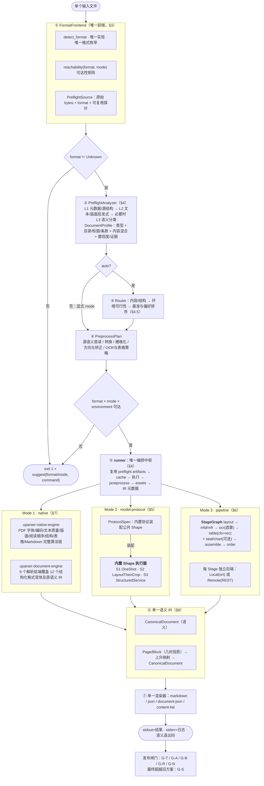
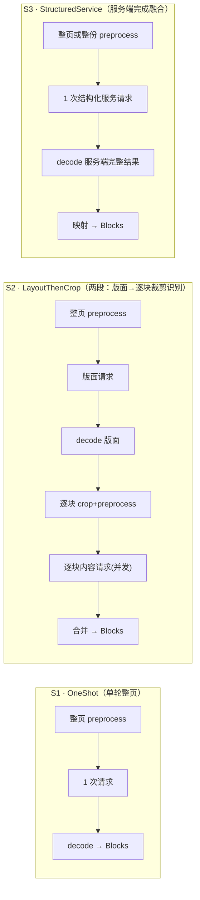
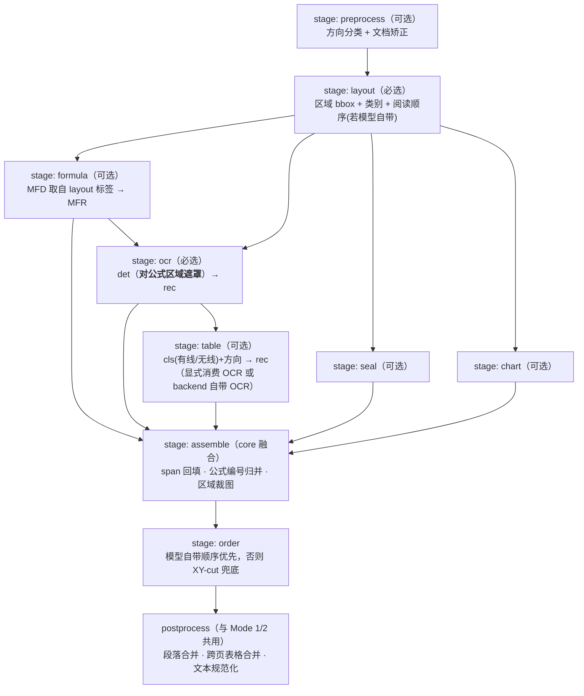

# uparser 技术架构 v2.0 提案：三模式收敛设计

> **性质**：这是**目标架构提案**，不是现状。现状规范见 `ARCHITECTURE_V1.0.md`（as-built），
> 演进史见 `ARCHITECTURE.md`（v0.9）。本文只回答一个问题：
> **在精度、性能和工程可信度均超过旧方案的前提下（`ARCHITECTURE_V1.0.md` §14 闸门），如何把架构做到清晰、不冗余。**
>
> **三模式定义**（用户口径，本文遵循）：
> 1. **native** —— 零模型本地解析
> 2. **model-protocol（模型协议）** —— mineru-vlm / dots.ocr / paddleocr 等；**这类模型非常多，
>    前处理与后处理各不相同**，且**结构形态不止一种**（单轮整页、两段裁剪识别、
>    布局在前＋按布局区域抽取）
> 3. **pipeline** —— 布局 → OCR/公式/表格/顺序等**多个小模型** → 后处理；
>    开源参考 `opensource/MinerU`（pipeline backend）与 `opensource/PaddleOCR-main`（PP-StructureV3）
>
> **另一条硬要求**：多种文件格式的接入必须**统一**。
>
> **默认入口要求**：`--mode auto` 必须执行唯一且可解释的前置链：
> **原始格式检测 → 内容/结构预分析 → 生成预处理计划 → 可行模式过滤与质量/速度/成本排序 → 执行**。
> 预分析至少覆盖目录、标题层级、文本层质量、扫描/图像比例、表格/公式/图表密度，以及书籍、简历、
> 招标文件、投标文件、法律文书、法规、合同、学术论文、财务报告、演示文稿、表格等文档类型。
>
> **原有算法保全要求**：V2 是编排与契约收敛，不是 native 算法重写。`uparser-native-engine`、
> `uparser-document-engine`、`uparser-core` 中现有文档处理算法必须先完整盘点、冻结行为并建立双跑基线，
> 特别是 native 的 PDF/结构化解析、阅读顺序、标题、表格和 Markdown 链；未通过 G-N（§7.4）不得删除、
> 替换或旁路。

---

## 本分支执行状态（2026-08-21）

本节只记录 `feat/architecture-v2` 已落地的代码，不改变下文目标架构和闸门定义。

| 范围 | 状态 | 本分支落点 |
|---|---|---|
| V0 native 能力冻结 | **代码已完成** | `uparser/NATIVE_CAPABILITY_MANIFEST.md` 盘点三个 crate 的算法、契约、测试和 G-N 基线；engine 算法未删除、未改写 |
| V1 统一主链 | **代码已完成** | CLI/API 已收敛到 `runner::execute[_with_hooks]`；runner 统一拥有 registry、scheduler、cache、postprocess、assets 和结果元数据；CLI 已提供 `--mode auto|native|protocol|pipeline`，旧 `--protocol` 保留为无歧义兼容入口 |
| V2 Canonical 契约 | **兼容契约已冻结** | `ParseOutcome` 同时承载 `ParseResult`、可用的 `CanonicalDocument` 与 engine Markdown；结构化输入复用 document-engine，默认 renderer 仍按 G-N 要求不切换 |
| V3 格式前端 | **代码已完成** | 权威 16 变体枚举、内容优先检测、CSV/TSV 受限语法消歧、Unknown 拒绝、扩展名冲突 warning、不可变 digest、`PageSource` 有界窗口/取消已接入；PDF 在页选择后按窗口栅格化，Office 只整份转换为中间 PDF、不会整份栅格化 |
| V4 预分析 | **代码已完成** | L1/L2 的 source quality、目录/标题/编号条款、内容密度、文档类型、confidence/evidence 已进入 `DocumentProfile`；PDF L2 直接复用 native engine 结果，结构化 L2 复用 document-engine artifact；低置信且有文本证据时按条件执行 L3，并保留严格 L2 回退 |
| V5 自动路由/计划 | **代码已完成** | 候选评分、可行性过滤、rejection/reason code、质量/速度/成本偏好、`PreprocessPlan/RunPlan`、`uparser plan`、`--protocol auto` 已接入；auto 在 L2 低置信且有文本证据时可调用 OpenAI-compatible L3 分类端点，缺失/失败严格回退 L2 |
| V6 native 纳入 runner | **代码及 G-N 复测已完成** | PDF/结构化 native 均经统一 runner；PDF analyze artifact 直接携带已定位文本项与 engine Markdown，执行阶段不再二次提取；三个 crate 的原算法和默认 engine Markdown 均保留 |
| V7 ProtocolSpec | **声明及共性 Shape 骨架已完成** | 内置协议统一声明 mode/shape/transport/preprocess/decode/coordinates/order/default endpoint；adapter、runner、`protocols`/`doctor` 共用该目录；S1/S3 的 transport-stage 错误边界及 S2 的并发索引归并已抽入 `shape_executor`，各协议的图像、prompt、坐标、表格/公式和鲁棒性算法原位保留 |
| V8 S3 / 新协议 | **代码已完成；部分外部闸门待跑** | MinerU 2605 已通过真实服务 200 文档复测；新增 `paddlex-structure` 权威 `/layout-parsing` 契约和 `generic-vlm` 整页 Markdown 协议，均接入统一 runner，但对应专用服务及 G-R 尚未验证，仅允许显式选择 |
| V9 StageGraph | **代码已完成；真实 pipeline 基准待跑** | graph 声明 kind/enabled/typed IO/failure policy/table OCR input/必选阶段/终态，resolver 校验依赖、兼容性、外部 OCR、无环并生成确定拓扑序；runner 在页面物化前 resolve，adapter 直调仍做防御性校验，具体 backend/endpoint/feature 可用性由 pipeline adapter 配置层校验且不静默切换 |
| V10 横切收敛 | **代码已完成；默认 renderer 有条件保留** | cache key 已覆盖 RunPlan、执行参数和文档限制；同一取消令牌已贯穿 analyze、条件 L3、Office 转换、PageSource、scheduler 和在途 HTTP，CLI Ctrl-C 接入该令牌；canonical renderer 可显式选择，默认按 G-N 保留 engine；CI 覆盖 baseline/native/workspace 及 pdfium contract |
| V11 超越旧方案收口 | **未完成，G-S 未通过** | 当前覆盖率、Native 性能、Bench A/OmniDocBench 质量仍有明确缺口；按 §1.1 完成定向补测、热点优化、同配置 A/B 和全量质量复测后才允许宣称 V2 超过旧方案 |

当前 `ParseResult` 已携带 `DocumentProfile`、完整 `RouteDecision` 和实际 `PreprocessPlan`；缓存 fingerprint
已升级到 runner 版本并覆盖影响结果的执行参数，避免跨计划误命中。结构化源解析是 baseline capability，
不再因 `native` feature 是否启用而改变 auto 语义。上述“代码完成”不等同于质量闸门通过：需要真实模型
服务或标注集的 G-A/G-B/G-R/G-N/G-S 项必须保留为待验证状态，不得用离线契约测试替代。

### 本分支验证快照

| 验证项 | 结果 |
|---|---|
| Bench A / `uparser-native`（200 文档，2026-08-21） | V2 engine renderer Overall `0.8754249671`、NID `0.9150189060`、TEDS `0.8141173616`、MHS `0.7875113953`、`0.0508103502 s/doc`；200 个预测文件齐全，1 个扫描件被 explicit native 稳定拒绝并为空，与冻结路径逐文件一致 |
| Bench A / `uparser-mineru-vlm`（200 文档，2026-08-21） | MinerU2.5-Pro-2605、4 workers、禁用缓存：Overall `0.9239777374`、NID `0.9433099491`、TEDS `0.9682281233`、MHS `0.8672139566`、失败 `0`、`0.6208099973 s/doc`；相对冻结 Overall 仅 `-0.004390` |
| Bench A / `auto`（200 文档，2026-08-21） | 路由 native `156` / mineru-vlm `44`；Overall `0.8920231867`、NID `0.9280398827`、TEDS `0.9060593328`、MHS `0.7948047238`、失败 `0`、`0.1369879341 s/doc` |
| OmniDocBench / `mineru-vlm`（1,651 页，2026-08-21） | 当前 release、MinerU2.5-Pro-2605、4 workers、禁用缓存：文本/公式 Edit `0.0696597785`/`0.1025847052`，表格/结构 TEDS `0.9060678710`/`0.9374629457`，阅读顺序 Edit `0.1357499101`；生成非零返回码 `0`，1 个仅换行输出；官方 page match 与 665 个 TEDS 样本均无 timeout/error/exception。相对历史 `mineru-vlm-v2` 有增有退，相对 `official` 基线整体仍弱 |
| native artifact 复用 | characterization test 验证 runner 复用 analyze artifact，并逐字保留 engine Markdown |
| 分页与取消 | pdfium 双页 fixture 验证只栅格化选择窗口；延迟 HTTP fixture 验证在途请求可取消；Office 转换 future 复用同一运行级取消令牌 |
| Protocol Shape | registry 在 baseline/native 配置下校验每个 adapter 的 spec 唯一性及 coordinates/order 一致性；S1/S2/S3 离线编排测试通过 |
| StageGraph | resolver 覆盖依赖顺序、必选阶段、external OCR、失败策略和 cycle 反例；runner 在页面物化前消费 `ProtocolSpec.shape`，非法图映射为稳定 API/CLI 错误 |
| mode / cancellation | CLI 覆盖标准 mode、缺失 protocol、兼容参数冲突；API preflight 预取消和在途 L3 取消均有契约测试 |
| renderer | engine 仍为默认；canonical 实测 Overall `0.5668676493`、TEDS/MHS `0`，199/200 输出不同，未通过 G-N，禁止切换默认 |
| 格式/路由/开销 | 16 个权威变体及额外 XLSX 物理变体共 17 cases 均通过；200 PDF plan 零失败，`20.32 docs/s`，median `48.36ms`、P95 `60.39ms` |
| CI | `core --no-default-features`、`core --features native`、workspace、pdfium contract 四类配置已固化 |
| 本地完整回归（2026-08-20） | baseline core `334 + 36 + 2`、native workspace core `349`、document-engine `88`、native-engine `755`、mutation `4` 及全部 doc tests 均通过，零失败；仅保留 native-engine 两项既有编译 warning |
| LLVM 覆盖率（2026-08-21） | 1243 个测试零失败；整体行/函数/Region `86.43%`/`88.76%`/`86.78%`；core/document/native 行覆盖率 `91.08%`/`83.73%`/`85.83%`。`xobjects.rs` `6.80%`、`sheet.rs` `0%`、`tounicode.rs` `53.70%`，未达到 G-S |

完整方法、差值、原始产物路径与哈希见 `ARCHITECTURE_V2.0_EVALUATION_REPORT.md`。本机已有 MinerU
model-protocol 服务并完成真实复测，但没有 generic-vlm/PaddleX/pipeline 服务和 G-R 标注路由集；因此
pipeline Bench A 与真实标注 G-R 仍是发布前外部验收项，不能宣称所有外部模式质量闸门通过。

## 目录

- [1. 设计目标：把"清晰、不冗余"变成可检验的判据](#1-设计目标把清晰不冗余变成可检验的判据)
- [1.1 G-S：超过旧方案的发布闸门](#11-g-s超过旧方案的发布闸门)
- [2. 三模式的精确边界（含 Mode 2 与 Mode 3 的划分准则）](#2-三模式的精确边界含-mode-2-与-mode-3-的划分准则)
- [3. 统一前端：多格式归一](#3-统一前端多格式归一)
- [4. 预分析、自动路由与统一 runner](#4-预分析自动路由与统一-runner)
- [5. Mode 2 设计：ProtocolSpec 声明式装配](#5-mode-2-设计protocolspec-声明式装配)
- [6. Mode 3 设计：小模型 Stage 图](#6-mode-3-设计小模型-stage-图)
- [7. Mode 1 设计：native](#7-mode-1-设计native)
- [8. 统一 IR 与单一渲染器](#8-统一-ir-与单一渲染器)
- [9. 横切设施](#9-横切设施)
- [10. 目录结构与迁移映射](#10-目录结构与迁移映射)
- [11. 冗余消除清单（量化前后对比）](#11-冗余消除清单量化前后对比)
- [12. 落地阶段与闸门](#12-落地阶段与闸门)
- [13. 需要拍板的开放决策](#13-需要拍板的开放决策)

---

## 1. 设计目标：把"清晰、不冗余"变成可检验的判据

"清晰"和"不冗余"如果只是形容词就无法验收。本提案把它们定义成 7 条可数的指标：

| # | 判据 | 现状 | v2.0 目标 |
|---|---|---|---|
| J1 | **真相源唯一**：同一件事只有一份实现 | 格式检测 2、编排 4、Markdown 渲染 3、结构化直读 2 | 各 **1** |
| J2 | **概念数量**：读懂主干需要掌握的一级概念 | 25 个平铺模块 + 7 个 protocol 字符串 + 3 个 feature 门 | **8 个**：Source / Analyze / Route / Mode / Runner / Protocol / Stage / Document |
| J3 | **新增一个模型协议的成本** | 新写 400–600 行 adapter（执行流复制） | 复用既有 Shape 时只新增一份 ~80 行 `ProtocolSpec`，不碰 runner |
| J4 | **新增一个输入格式的改动点** | 5 处（2 个 detect + 2 处清单 + 1 处分发） | **1 处**（格式表一行） |
| J5 | **新增一个后处理能力的接入点** | 4 处（cli 非流式 / cli 流式 / api / native 旁路） | **1 处**（runner） |
| J6 | **零消费者稳定抽象数量** | 7（`emitted_signals`/`merge_hint`/`CoordFrame::Crop`/… 仅被 `protocols` 打印） | **0**（接上消费者或退出稳定 IR；不以此删除 engine 文档算法） |
| J7 | **自动路由可验证** | L1/L2 仅能粗分 Slide/Spreadsheet/Report/Resume，语义类型与目录不可判，route reason 不入结果 | 16 变体检测矩阵 + 文档类型标注集 + route golden + best-feasible-mode regret 闸门（§4.7） |

> 补充硬约束：`ARCHITECTURE_V1.0.md` §14 的 **G-A / G-B / G-T** 与 V2 新增的 **G-R / G-N / G-S**
> 闸门在整个收敛过程中逐阶段生效。`0.02` 只保留为开发期回归告警线，不能作为最终发布成功标准；
> V2 对外宣称超过旧方案必须通过 §1.1 的严格 G-S 闸门。

### 1.1 G-S：超过旧方案的发布闸门

“架构更清晰”不能抵消精度或速度回退。G-S（Surpass Gate）是 V2 的最终发布闸门，要求候选版本在
**同一代码输入、同一模型 checkpoint/endpoint、同一参数、同一硬件、禁用缓存、相同预热和并发**条件下，
与冻结旧 runner 做成对 A/B。不同模型版本的历史结果只能作为产品质量目标，不能归因于框架优化。

#### G-S1：质量必须形成 Pareto 改进

| 路径 | 冻结比较基线 | V2 发布要求 | 当前状态 |
|---|---|---|---|
| Native Bench A | Overall `0.875425`、NID `0.915019`、TEDS `0.814117`、MHS `0.787511` | 四项均不得下降；Overall 必须严格提高，或在 Overall 持平时至少一个关键分项严格提高且其余不退 | **未通过**：四项逐项相同，仅做到保真 |
| MinerU Bench A | 冻结 Overall `0.928368`、NID `0.947010`、TEDS `0.943894`、MHS `0.877728` | 同 checkpoint 成对 A/B 输出不得因 runner 改变；产品候选四项均不低于冻结值，且 Overall 或至少一个短板分项严格提高 | **未通过**：当前 Overall/NID/MHS 分别回退 `0.004390`/`0.003700`/`0.010514`；且 checkpoint 不同，不能归因 |
| OmniDocBench | 历史 `mineru-vlm-2605-surpass-e1-full` 作为指定旧方案基线 | Text/Formula/RO Edit 均不升，Table/Structure TEDS 均不降；至少一项严格改善；1,651 页非零失败和空白输出均为 0 | **未通过**：Text、Formula、RO 和两项 TEDS 均有回退，且有 1 页仅换行 |
| Auto | 每个样本的 best feasible mode | 核心指标 regret 从开发期 `≤0.02` 收紧到 `≤0.01`；相对纯 Native Overall 至少 `+0.02`，且速度至少为全量 VLM 的 `3x` | **未通过**：速度为 `4.53x`，但 Overall 仅 `+0.016598`，且人工标注 G-R 尚未完成 |

质量提升必须报告 bootstrap 置信区间或成对差值分布。任何关键子项的统计显著回退均阻断发布，不能用
表格提升抵消文本、标题或阅读顺序下降。Canonical renderer 在达到 engine 基线前继续保持实验选项。

#### G-S2：性能必须消除架构税

1. Native 冷运行必须不慢于冻结 runner 的 `0.047341 s/doc`，并同时报告 mean、median、P95、CPU 时间、
   峰值 RSS 和每文档解析次数；当前 `0.050810 s/doc`（`+7.33%`）明确判定为未通过。
2. Model-protocol 必须以同一服务做旧/新 runner 交错 A/B；框架自身 median 开销不超过 `2 ms/doc` 或 `2%`
   （取更严格者），吞吐不下降，失败率不得增加。历史命中缓存的 `1.81 s/doc` 不得用作速度基线。
3. Auto 的 detect→analyze→route→plan 不得重复解包、解析或栅格化；显式 Native 只执行格式可达性和执行
   必需分析，非路由所需的 L3/画像延迟加载。共享 artifact 必须用计数器测试证明每文档重解析次数为 0。
4. 性能比较至少重复 5 轮并随机交错顺序，报告中位数和 P95；单轮墙钟、缓存运行或不同 worker 数不能验收。

#### G-S3：覆盖率必须覆盖质量风险，而非只追总数

| 范围 | 当前行覆盖率 | V2 发布下限 |
|---|---:|---:|
| 三个核心包整体 | 86.43% | **≥90%** |
| `uparser-core` | 91.08% | **≥92%** |
| `uparser-document-engine` | 83.73% | **≥88%** |
| `uparser-native-engine` | 85.83% | **≥90%** |
| 本次变更行 | 未建立 | **≥95%** |

关键模块另设硬门槛：`extractor/xobjects.rs ≥80%`、`tounicode.rs ≥85%`、`formats/sheet.rs ≥85%`、
`formats/doc.rs ≥80%`、Native 主入口 `lib.rs ≥80%`。门槛必须由真实或最小化脱敏 fixture 驱动，覆盖正常、
畸形、资源预算、取消和 fallback；不得通过删除分支、排除源文件或只有断言“无 panic”的测试刷高覆盖率。

#### G-S4：16 格式和文档类型必须端到端验收

格式检测 `100%` 只是入口契约，不等于解析质量。每种权威格式至少包含一个真实 fixture，验证适用的文本、
目录/标题、列表、表格、链接、图片、notes/navigation 和 warning；XLS/XLSX/ODS/CSV 及 DOC 是当前 P0。
Book/Resume/Tender/Bid/LegalDocument/Regulation/Contract/AcademicPaper/FinancialReport 等类型必须建立人工标注
的分类与路由集，并执行路由后的最终解析质量，而不是只比较 `RouteDecision`。

#### G-S5：可复现与发布判定

CI 固定 coverage、Bench A smoke、16 格式矩阵和 golden diff；发布机运行完整 Bench A、OmniDocBench、G-R
标注集和五轮性能 A/B。产物必须记录二进制哈希、模型 ID、endpoint 配置、数据集版本、硬件、并发、缓存、
随机种子和逐样本结果。只有 G-S1 至 G-S4 全部通过，V2 状态才能从“架构收敛完成”改为“超过旧方案”。

---

## 2. 三模式的精确边界（含 Mode 2 与 Mode 3 的划分准则）

### 2.1 三模式一览

| | **Mode 1 · native** | **Mode 2 · model-protocol** | **Mode 3 · pipeline** |
|---|---|---|---|
| 谁在"理解"文档 | 没有模型，靠文本层/源格式语义 | **一个外部解析服务**（哪怕内部多轮） | **多个原子小模型**，由 core 编排 |
| 谁负责跨模型融合 | 不适用 | **服务端**（core 只解析其输出） | **core**（遮罩、裁剪、回填、顺序、跨页合并） |
| 典型实现 | lopdf 文本层 / 9 种源格式前端 | mineru-vlm、dots.ocr、MonkeyOCRv2、PP-StructureV3 `/layout-parsing`、通用 VLM | MinerU pipeline backend、PaddleOCR 原子模块自建编排 |
| 粒度 | 整文档 | 逐页（页内可多轮） | 逐页 × 阶段 DAG |
| 主要成本 | CPU | 一次/多次远程推理 | N 个模型的部署与算力放置 |

### 2.2 划分准则：**按"谁做融合"划分，而不是按"几个模型"划分**

这是本提案最关键的一条边界规则，用来消除现状里 `pipeline` 与 `paddleocr` 职责重叠的混乱：

> **若一次调用把"版面＋文本＋表格＋公式"整体交还给 core，则属 Mode 2**（服务端编排）；
> **若 core 需要自己把多个模型的中间结果拼起来（掩码/裁剪/回填/排序），则属 Mode 3**（客户端编排）。

据此，同一个 PaddleOCR 生态**可以有两种正确接法，且互不冗余**：

| 接法 | 归属 | 契约 | 何时选它 |
|---|---|---|---|
| PP-StructureV3 服务：`POST /layout-parsing` 一次给全 | **Mode 2**（Shape = `StructuredService`，融合在服务端） | 权威契约，已在 `opensource/PaddleOCR-main/docs/version3.x/pipeline_usage/PP-StructureV3.md` | 想开箱即用、不关心阶段级算力放置 |
| 拆成 layout / ocr / formula / table 等原子端点，由 core 编排 | **Mode 3** | 原子模块契约（PaddleOCR module_usage / 自建 serving） | 需要按阶段分别扩缩容、混合 Local/Remote、替换个别模型 |

用户提到的"**paddleocr 前面加一个布局模型，再根据布局模型提取文本**"必须按融合位置继续细分：
若一个服务端点返回融合后的完整结果，它是 Mode 2 的 `StructuredService`；若 core 发起 layout、区域 OCR
并自行归并，它就是 Mode 3。不得仅因两个端点属于同一生态而把客户端编排放回 Mode 2。

### 2.3 v2.0 总体架构图



---

## 3. 统一前端：多格式归一

**目标**：把"格式差异"彻底关在前端里，三种模式都只看到 `SourceDocument` 两个变体之一。

### 3.1 唯一的格式表（一处定义，J4）

```rust
// FORMAT_SPECS 是唯一手写清单；枚举、别名、sniffer 分发、可达性和帮助文本均由它派生。
format_specs! {
    Pdf     { aliases: ["pdf"], detector: detect_pdf,     native: PdfText,    visual: Pdfium },
    Doc     { aliases: ["doc"], detector: detect_ole_doc, native: Structured, visual: OfficeToPdf },
    // ...其余条目；Unknown 是检测失败的哨兵，不配置 detector/channel。
}

// 由 format_specs! 生成；下列代码展示展开后的权威枚举。
pub enum DocFormat {                    // 删除 ingest 侧那份 8 变体的重复定义
    Pdf, Doc, Docx, Ppt, Pptx, Excel, Odt, Ods,
    Odp, Rtf, Epub, Csv, Tsv, Png, Jpeg, Unknown,
}

pub struct PreflightSource {
    pub bytes: Arc<[u8]>,
    pub filename_hint: Option<PathBuf>,
    pub digest: ContentDigest,
    pub detection: FormatDetection,
}

pub struct FormatDetection {
    pub format: DocFormat,
    pub evidence: DetectionEvidence,   // Container | Magic | Syntax | ExtensionFallback
    pub warnings: Vec<AnalysisWarning>,
}

pub enum SourceDocument {
    Structured { bytes: Arc<[u8]>, format: DocFormat }, // 源语义可直接解析 → Mode 1
    Paged      { source: Box<dyn PageSource> },          // 按窗口栅格化/解码 → Mode 2 / Mode 3
}

#[async_trait]
pub trait PageSource: Send {
    fn format(&self) -> DocFormat;
    fn content_digest(&self) -> ContentDigest;
    async fn next_window(&mut self, max_pages: usize) -> Result<Vec<RenderedPage>, FrontendError>;
}
```

这里的“16 种”按权威枚举口径计算：15 个可识别格式族加 `Unknown`。`Excel` 覆盖
`xls/xlsx/xlsb/xlsm/xla/xlam`，JPEG 覆盖 `jpg/jpeg`；扩展名别名不重复计数。
`FORMAT_SPECS` 是唯一人工维护点；不得再手写第二份 supported-formats、扩展名或 mode 可达性清单。
宏展开或构建期生成物必须有快照测试，确保表中每个非 `Unknown` 条目都有 detector 和至少一个可达通道。

检测优先级固定为：容器内部权威标识（OLE stream、OOXML root relationship、ODF/EPUB mimetype）→
文件签名/语法（PDF、PNG、JPEG、RTF）→ 仅对无可靠 magic 的 CSV/TSV 使用扩展名与受限语法探测。
文件内容与扩展名冲突时以内容为准并记录 warning；`Unknown` 不猜测、不进入 analyzer。

### 3.2 格式表：一行一格式，同时定义可达性与通道（J1 + J4）

| 格式 | Mode 1 通道 | Mode 2 / 3 通道 | 不可达时的建议 |
|---|---|---|---|
| PDF | lopdf 文本层 | PDFium 栅格化 | — |
| PNG / JPEG | ❌ | 直接解码为 1 页 | 建议 Mode 2 |
| DOCX / PPTX | document-engine 原生 | LibreOffice → PDF → 栅格化 | 工具缺失时建议 Mode 1 |
| DOC / PPT / Excel / ODT / ODS / ODP / EPUB / RTF / CSV / TSV | document-engine 原生 | LibreOffice → PDF → 栅格化（仅当显式要求视觉解析） | 默认建议 Mode 1 |
| Unknown | ❌ | ❌ | exit 1，列出支持的格式 |

**四条硬规则**（消除现状 A-12 / A-4）：

1. **可达性在执行前校验**。不可达组合返回 `exit 1` + 结构化错误 + `suggest{mode, command}`，
   **绝不再落到 1×1 占位页**。
2. **结构化表格源（Excel/CSV/TSV）在 auto 下默认走 Mode 1**；其他 Office/EPUB 仍进入内容分析，
   复杂 DOCX 简历或 PPT 不得因“源格式可解析”被无条件短路。显式 `--mode protocol|pipeline` 时按格式表转换为视觉页。
   Mode 1 的源格式解析能力作为基线编译，不再被 `#[cfg(not(native))]` 反向关闭；因 feature 组合产生的
   编译能力缺失必须在可达性校验中显式报错，不能改变同一协议的解析语义。
3. **一次检测**。`detect_format` 只调用一次，结果随 `PreflightSource` / `SourceDocument` 向下传递；
   analyzer、router、cache、CLI/API 不得各自重新推断格式。
4. **有界分页**。`Paged` 只按 runner 的窗口预算产生页面；取消后停止转换/栅格化并释放临时资源，
   不先构造整份文档的 `Vec<RenderedPage>`。

### 3.3 批量的位置

CLI 保持 `uparser parse <path>` 单文件语义；**批量属于调用方**（Agent 循环 / bench harness）。
若未来要内建批量，只在 runner 之上加一层 `for` + 全局并发预算，不影响本设计任何一层。

---

## 4. 预分析、自动路由与统一 runner

### 4.1 唯一前置链（J5 + J7）

```text
read once
  -> detect_format(bytes, filename_hint)               # §3，唯一检测
  -> PreflightAnalyzer::analyze(source, analysis_cap)  # L1 -> L2 -> 条件 L3
  -> Router::decide(profile, environment, preference)  # 候选过滤 + 排序 + 解释
  -> PreprocessPlanner::resolve(source, decision)       # 只在选定模式后做有损转换
  -> runner::run(source, analysis, decision, plan)
  -> postprocess -> assets -> CanonicalDocument -> render
```

禁止在分析前无条件把 Office/EPUB/表格源转成 PDF：转换会丢失目录、样式、单元格和源语义，正是分类与
路由需要的证据。格式检测和预分析只读取原始输入；转换、栅格化、矫正等实际预处理必须在路由之后执行。

`AnalysisArtifacts` 保存可复用但不序列化的中间结果（源格式结构树、PDF 文本投影、采样页、缩略图、
版面统计）。后续 native 或视觉模式复用这些结果，不得为 classify、route、parse 分别解析/栅格化同一内容。

### 4.2 PreflightAnalyzer：按需递进而不是只看格式

| 层 | 输入与做法 | 必须产出 | 进入下一层的条件 |
|---|---|---|---|
| **L1 · source** | 容器元数据、页/slide/sheet/unit 数、PDF/EPUB outline、DOCX heading/bookmark、PPT 标题、源格式语义 | 原始格式、页数、语言线索、显式目录/outline、结构化源标记 | 非强先验格式，或信息不足以区分候选模式 |
| **L2 · structure/text** | 复用源格式解析或 PDF 文本层；对有界样本计算文本/图像/表格/公式密度、多栏、标题层级、编号条款、页眉页脚重复度，并做多语言关键词/结构规则分类 | source quality、结构信号、内容混合、文档类型候选、逐页信号、置信度和证据 | 置信度低于阈值，且进一步分类可能改变最终模式 |
| **L3 · semantic** | 对确定性采样的文本片段与页面缩略图做一次文档级语义分类；可复用已配置的低成本分类端点 | 细粒度类型、补充 tags、视觉结构信号、校准置信度 | 只在 auto 下按需调用；端点缺失/失败时回退 L2，不伪装成高置信度 |

L1/L2 是 `auto` 的必经阶段。L3 不是每份文档固定付费：只有 `(L2 confidence < threshold)` 且
候选分类会改变 mode/protocol 时才调用；`--profile-level l1|l2|l3` 可设置成本上限。扫描 PDF 或图片没有
可用文本证据时，若 L3 不可用，类型必须保持 `Unknown`，Router 根据 source quality 与版面复杂度选择保守模式。

L1/L2 **必须复用而不是重写** native 算法：PDF 直接消费 `uparser-native-engine` 的 PDF 类型、逐页 OCR
reason、文本编码质量、表格/多栏/复杂版面和结构树结果；结构化文档直接消费 `uparser-document-engine`
产出的 metadata、units、heading/list/table、navigation/anchor、note、asset 与 warning。预分析新增的是跨格式
特征汇总与文档类型判断，不得实现第二套简化版 PDF/Office 解析器。

采样必须确定且有界：覆盖封面、前部目录候选页、中部、尾部，以及 L2 标出的表格/多栏异常页；具体上限
属于 `AnalysisOptions` 并进入缓存指纹。源格式已有 outline/heading tree 时读取完整轻量结构，不以页面采样
替代权威目录。

### 4.3 DocumentProfile：类型、结构与证据分开建模

“有无目录”是结构事实，“书籍/法规”是语义类型，两者不能塞进一个枚举。一个招标文件也可能同时具有
合同、表格密集、法规引用等特征，因此类型采用 primary + tags，所有推断携带置信度和证据来源。

```rust
pub enum DocumentGenre {
    Book,
    Resume,
    Tender,             // 招标文件
    Bid,                // 投标文件
    LegalDocument,      // 判决书、裁定书、法律意见等
    Regulation,         // 法律、行政法规、规章、规范性文件
    Contract,
    AcademicPaper,
    FinancialReport,
    Manual,
    Presentation,
    Spreadsheet,
    GeneralReport,
    Other,
    Unknown,
}

pub enum SourceQuality { Structured, NativeText, Scanned, ImageOnly, Mixed }
pub enum EvidenceSource { Container, Metadata, Outline, NativeText, Layout, SemanticClassifier }

pub struct GenrePrediction {
    pub primary: DocumentGenre,
    pub tags: Vec<DocumentGenre>,
    pub confidence: f32,
    pub evidence: Vec<AnalysisEvidence>,
}

pub struct StructureProfile {
    pub has_toc: EvidenceValue<bool>,
    pub has_cover: EvidenceValue<bool>,
    pub heading_depth: Option<u8>,
    pub numbered_clause_density: f32,
    pub repeated_header_footer_ratio: f32,
    pub multi_column_ratio: f32,
}

pub struct DocumentProfile {
    pub source_format: DocFormat,
    pub source_quality: SourceQuality,
    pub page_or_unit_count: Option<u32>,
    pub genre: GenrePrediction,
    pub structure: StructureProfile,
    pub dominant_content: ContentMix,
    pub page_profiles: Vec<PageProfile>,
    pub analysis_level: ProfileLevel,
    pub warnings: Vec<AnalysisWarning>,
}
```

`AnalysisEvidence` 对外记录规则/信号 id、来源层、页或 unit 索引及贡献分，使分类结论可解释、可回归。
显式 outline/EPUB nav 可将 `has_toc` 标为高置信度；仅检测到“目录”关键词不能单独判真，还要验证连续
条目、页码/锚点或标题对应关系。分类器失败、证据冲突和采样不足都进入 warnings。

### 4.4 PreprocessPlan：分析之后、执行之前

```rust
pub struct PreprocessPlan {
    pub input_channel: InputChannel,       // SourceSemantic | PdfText | VisualPages
    pub conversion: ConversionPlan,        // None | LibreOfficeToPdf | DirectImage
    pub raster: Option<RasterPlan>,         // dpi / page window / color policy
    pub corrections: CorrectionPlan,       // orientation / unwarp / deskew
    pub parse_hints: ParseHints,            // preserve_toc/headings/clauses, table/formula/chart emphasis
    pub reused_artifacts: Vec<ArtifactId>,
}

pub struct RunPlan {
    pub route: RouteDecision,
    pub preprocess: PreprocessPlan,
}
```

- 结构化 Excel/CSV/TSV 默认保留单元格语义，不能为了统一而视觉化。
- 书籍、法规、法律文书若有可靠文本层和标题/条款结构，优先保留 outline、锚点、编号和页眉页脚信息。
- 扫描件、图片或低质量文本层才启用方向检测、矫正、OCR/VLM；是否矫正必须与所选后端能力去重。
- 招投标/财报的表格、印章、签名页信号转为解析 hint，但 hint 不得凭空改变原始内容。

### 4.5 Router：选择“最适合且可执行”的模式

Router 不建立“文档类型 → 模式”的一对一硬编码。数字原生法规和扫描法规则可能属于不同模式；最终决策
同时考虑 `source_format + source_quality + genre/structure + content_mix + environment + preference`。

```rust
pub enum RouteOrigin { Auto, Explicit }

pub struct RouteDecision {
    pub selected: ModeChoice,
    pub origin: RouteOrigin,
    pub candidates: Vec<RouteCandidate>,  // 含得分、可行性、剔除原因和 benchmark 版本
    pub confidence: f32,
    pub reason_codes: Vec<RouteReasonCode>,
}
```

决策固定分三段：

1. **可行性过滤**：格式可达性、endpoint、模型、外部工具、CPU/GPU/内存必须满足；
   `PreprocessPlanner` 为每个候选做无副作用的 plan validation，不可用模式不能靠高分胜出。
2. **质量适配评分**：根据 source preservation、目录/标题/条款、OCR、表格、公式、图表能力和版本化实测基准评分。
3. **偏好排序**：在质量底线内按 `--prefer quality|speed|cost` 排序；无对应语料基准的候选只能使用保守先验并标注。

首版 route policy：

| 文档证据 | 首选方向 | 关键理由/限制 |
|---|---|---|
| Excel/CSV/TSV，或 Office/EPUB 源语义完整且无强视觉耦合 | **native** | 保留单元格、标题、列表、链接和目录；视觉化会降质 |
| Book/Regulation/LegalDocument/Contract，`NativeText` 且版面规整 | **native** | 保留文本、条款与 outline；类型本身不构成调用模型的理由 |
| Resume/Presentation，或多栏碎片化、图文强耦合 | **model-protocol** | VLM 对语义分组与阅读顺序更稳 |
| Tender/Bid/FinancialReport 且表格/公式密集 | **pipeline** 或表格能力已验证的 **model-protocol** | 必须根据 G-B/专项真实样本选择；pipeline 未过闸门前不能成为默认 |
| 扫描件/ImageOnly/Mixed，普通版面 | **model-protocol** | 需要视觉识别；native 不可行 |
| 扫描件且表格/公式/印章等专项内容密集 | **pipeline**（若阶段齐备且已过闸门），否则 **model-protocol** | 不因分类标签自动选择尚不可用的 stage |
| 低置信度/Unknown | 最佳可行的保守默认并记录 warning | 不把猜测写成确定类型；显式列出被剔除候选 |

目录存在主要影响结构保留、标题层级和跨页合并策略，不直接决定模式。招投标、法律、法规等类型也只提供
适配证据；source quality 与实际内容结构始终优先。

### 4.6 Mode 与 runner 契约

```rust
pub enum Mode {
    Native,
    Protocol(ProtocolSpec),
    Pipeline(StageGraph),
}

impl Mode {
    fn granularity(&self) -> Granularity;
    fn requirements(&self) -> ModeRequirements;
}
```

```text
runner::run(PreflightSource, AnalysisReport, RunPlan, Options) -> ParseOutcome
  1. resolve + validate ResolvedRunSpec / PreprocessPlan
  2. cache.get(source.digest + analysis/options/run fingerprint)
  3. materialize SourceDocument，复用 AnalysisArtifacts
  4. Document => mode.parse_document；Page => scheduler.run(PageSource, executor)
  5. postprocess -> assets -> IR metadata(profile/route/timing/warnings) -> cache.put
```

CLI / napi / pyo3 都只是薄壳。`--stream` 是 runner 的有界事件 sink；取消必须传播到 analyzer、转换、
`PageSource`、scheduler 和所有 stage task。显式 `--mode` 仍执行格式检测、可达性和必要的预处理分析，但可跳过
不会影响执行的 L3 语义分类；`--mode auto` 使用完整链。旧 `--protocol` 写法只作兼容别名。

### 4.7 产品入口与 G-R 路由闸门

```text
uparser classify <input>                         # 输出 DocumentProfile，不完整解析
uparser plan <input> [--prefer quality|speed|cost] # 输出候选、剔除原因和 PreprocessPlan
uparser parse <input> --mode auto                # 默认完整自动链
uparser parse <input> --mode protocol --protocol mineru-vlm  # 专家显式覆盖
```

新增 **G-R**，与 G-T/G-A/G-B 同时生效：

1. **格式矩阵**：16 个枚举变体均有 fixture；内容/扩展名冲突、畸形容器、CSV/TSV 歧义均有反例，
   支持格式 fixture 检测必须 100%，`Unknown` 不得进入解析。
2. **结构矩阵**：显式 outline、隐式目录、无目录、伪“目录”关键词、标题层级和编号条款均有黄金用例。
3. **类型语料**：Book/Resume/Tender/Bid/LegalDocument/Regulation/Contract/AcademicPaper/
   FinancialReport/Presentation/Spreadsheet 至少覆盖中英文、数字原生与扫描子集；报告 macro-F1、置信度
   calibration 和 Unknown/低置信度召回，不允许只报告总体 accuracy。首个可合入阈值由冻结基线确定，
   之后不得下降；在基线建立前不宣称这些细分类已完成。
4. **路由黄金表**：每个 `source_quality × genre × content_mix × environment` 代表组合断言 selected、
   fallback、reason code 和 preprocess plan；不得选择不可用模式。
5. **结果闸门**：在多模式均可运行的路由评测集上实际执行候选，自动选择结果相对最佳可行模式的核心指标
   开发期回退不得超过 0.02，最终发布按 G-S 收紧到 0.01；同时单列延迟与调用成本，不能用“分类正确”
   替代解析质量。
6. **复用与失败**：classify→parse 不重复源解析/采样栅格化；L3 超时、无 endpoint、取消和低置信度均有
   确定 fallback，且 `DocumentProfile`、完整候选和 route reason 写入 ParseResult/API，而非只写 stderr。

---

## 5. Mode 2 设计：ProtocolSpec 声明式装配

这是回应"**这类模型非常多，前处理和后处理都不太一样**"的核心设计。

**思路**：把已确认可复用的协议差异收进**数据**（每协议一份 spec），把共性收进少数 Shape 执行器。
新增协议若落在既有 Shape 内，只新增声明，不修改 runner；只有出现无法由既有 Shape 忠实表达的新执行结构时，
才新增 Shape。v2 只覆盖仓库内置协议。

### 5.1 三种内置结构形态（Shape）——公共模板各实现一次



| Shape | 典型协议 | 请求次数/页 | 关键差异 |
|---|---|---|---|
| **S1 OneShot** | dots.ocr、generic-vlm（Qwen 等） | 1 | 版面＋分类＋内容＋顺序一体化返回 |
| **S2 LayoutThenCrop** | mineru-vlm、MonkeyOCRv2 | 1 + N（N = 区块数） | 第二轮请求**依赖**第一轮版面结果；需裁剪与坐标帧换算 |
| **S3 StructuredService** | PP-StructureV3 `/layout-parsing` | 1 | 服务端完成布局/OCR/表格/公式融合；core 只验证、解码和映射完整结果 |

> core 自己执行 layout + M 次区域 OCR + 归并时属于 Mode 3，不得扩张 S3 来绕过 §2.2 的边界。
> 三种模板之外若出现新结构，先用内置 adapter 验证其行为；至少两个协议确实共享时，再把它提升为
> 公共 Shape，避免为假设中的协议提前扩张 core。

### 5.2 ProtocolSpec：内置协议的声明式差异

```rust
pub struct ProtocolSpec {
    pub name: &'static str,
    pub shape: Shape,                  // S1 | S2 | S3
    pub wire: Wire,                    // ChatCompletions{skip_special_tokens,…} | Rest{schema}
    pub preprocess: PreProcess,        // HardResize{w,h} | SmartResize{factor,min_px,max_px}
                                       // | PixelBounds{min,max} | AspectFit{max_edge} | None
    pub request: RequestSpec,          // prompt 模板（阶段可分）+ sampling（temperature/max_tokens…）
    pub decode: Decode,                // CustomToken | StrictJson | PythonLiteral | OcrBoxes | Markdown
    pub coords: CoordSpec,             // Norm0To1000 | Norm0To1 | PixelAbs(+ resized→original 换算)
    pub categories: &'static [(&'static str, Category)],   // 原生词表 → 统一类别
    pub content: ContentRules {        // 后处理差异
        skip_recognition: &'static [Category],  // image/chart 只裁图不识别
        table_format: TableFormat,              // Otsl | HtmlPassthrough | Cells
        formula_wrap: FormulaWrap,              // BracketDisplay(`\[..\]`) | DoubleDollar(`$$..$$`) | None
        repair_chain: &'static [Repairer],
    },
    pub robustness: RobustnessSpec,    // 退化重试（温度递增）、截断告警、局部失败隔离粒度
    pub reading_order: OrderSource,    // FromModel | GeometricFallback
}
```

`PreProcess`、`Decode`、`Repairer` 等枚举是 v2 内置协议的 DSL。新增枚举原语时只修改 Mode 2 执行器与
对应测试，不允许在 runner、router、scheduler、cache 或 renderer 中增加协议分支。

### 5.3 现有与新增协议的装配表

| 协议 | shape | preprocess | decode | coords | table / formula | order |
|---|---|---|---|---|---|---|
| `mineru-vlm` | S2 | `HardResize`（不保长宽比）＋块级 `resize_by_need` | `CustomToken` | `Norm0To1000` | Otsl / `\[..\]` | FromModel |
| `dots-ocr` | S1 | `SmartResize`（28px 对齐，像素区间） | `StrictJson`（5 级容错） | `PixelAbs` + 回原图换算 | Otsl 或 HTML 透传 / `\[..\]` | FromModel |
| `monkeyocr-v2` | S2 | `PixelBounds`（sqrt 等比） | `PythonLiteral`（2 级容错） | `Norm0To1000`（换轴+夹取） | Otsl / `$$..$$` | FromModel |
| **`paddlex-structure`** 🆕 | **S3** | `AspectFit`（整页/整份提交） | `Rest` + `prunedResult`/`markdown` | `PixelAbs` | 服务端表格 HTML / 服务端公式 | FromModel（版面模型带顺序） |
| **`generic-vlm`** 🆕 | S1 | `SmartResize` | `Markdown`（整页 Markdown 直出） | 无 bbox（整页块） | 由 prompt 约定 | 文本序即顺序 |

新增落在既有 Shape 内的协议只填一份 spec（~80 行）。若需要新增 DSL 原语，只修改 Mode 2 执行器及其
测试；runner、并发、缓存、后处理与渲染不改。

### 5.4 `paddlex-structure` 的契约（权威，来自 vendored 文档）

```
POST /layout-parsing
 req {"file": <base64|URL>, "fileType": 0|1,
      "useDocOrientationClassify","useDocUnwarping","useTextlineOrientation",
      "useSealRecognition","useTableRecognition","useFormulaRecognition",
      "useChartRecognition","useRegionDetection","layoutThreshold","layoutNms", …}
 res {"layoutParsingResults":[ 逐页 {"prunedResult":{…版面+内容…},
        "markdown":{"text","images","isStart","isEnd"}, "outputImages","inputImage"} ]}
POST /ocr        req {"file","fileType"} → res {"ocrResults":[{"prunedResult", "ocrImage"}]}
部署：paddlex --install serving && paddlex --serve --pipeline PP-StructureV3
```

顺带解决三个既有缺口：`markdown.isStart/isEnd` → 跨页段落合并信号；`useDocUnwarping` → 文档矫正；
`markdown.images` → 直接对接 assets。

---

## 6. Mode 3 设计：小模型 Stage 图

**参考实现**：`opensource/MinerU`（`mineru/backend/pipeline/`）与 `opensource/PaddleOCR-main`（PP-StructureV3）。
两者的阶段集合已核对如下，v2.0 的 `StageGraph` 取二者并集并保留可选开关。

### 6.1 两个参考实现的真实阶段集

| | MinerU pipeline backend | PaddleOCR PP-StructureV3 |
|---|---|---|
| 版面 | `PPDocLayoutV2LayoutModel`（**自带 reading-order head**，`order_logits`） | 版面区域检测模块（20/23 类，另有区域检测子模块） |
| 公式 | MFD 由版面 label（`display_formula`/`inline_formula`）给出 → MFR `UnimernetModel` | 公式识别子产线（UniMERNet / PP-FormulaNet(_plus)）（可选） |
| OCR | OCR det（**对公式区域做遮罩**）→ OCR rec；另有表格内 OCR | 通用 OCR 子产线（det + rec + 文本行方向） |
| 表格 | `PaddleTableClsModel`（有线/无线）＋ `MineruTableOrientationClsModel` → `PaddleTableModel`(SLANet-Plus) / `UnetTableModel` | 表格识别子产线 v2（可选） |
| 印章 / 图表 | — | 印章文本识别子产线、图表解析模块（均可选） |
| 预处理 | — | 文档图像预处理子产线（方向分类 + 文本图像矫正）（可选） |
| 顺序 | 版面模型自带；另有 `xycut_pp_sorter`（pptx 路径） | 多栏阅读顺序恢复 |
| 后处理 | `para_split`（段落合并）、`cross_page_table_merge`、`formula_number` 优化、`cut_image_and_table`、标题分级（**LLM-aided，可选**） | Markdown 转换 |

### 6.2 v2.0 的 StageGraph



图中的 `formula -> ocr` 是启用 formula 时的条件依赖；禁用时 OCR 直接消费 layout。table 始终等待 OCR；
若所选 Remote table backend 自带 OCR engine，则在 `TableStageSpec` 中显式声明为 `OcrInput::Internal`。

**阶段契约**：各阶段业务输入输出不同，不能伪装成同一个 Rust 数据形状；StageGraph 统一编排生命周期，
各 StageSpec 使用对应的强类型输入输出，并在执行前校验依赖。

```rust
pub struct StageNode {
    pub id: StageId,
    pub kind: StageKind,
    pub enabled: bool,
    pub backend: StageBackend,          // Local(ort) | Remote(endpoint + schema)
    pub resource_hint: ResourceHint,
    pub depends_on: Vec<StageId>,
    pub on_failure: FailurePolicy,
}
```

`StageGraph::resolve` 必须在读取输入文件前完成：检查无环、必选阶段、条件依赖、输入输出兼容，以及失败
策略声明是否与依赖关系一致。Local/Remote backend、endpoint 和编译 feature 的可用性由 pipeline adapter 的
配置校验层在执行前检查；运行期不静默切换 backend。

**三条设计约束**（直接来自参考实现的事实，不是臆测）：

1. **OCR 必须在公式之后**：MinerU 的 OCR det 走的是**公式区域被遮罩**的图；顺序颠倒会把公式当普通文本识别。
2. **table 阶段依赖 OCR 能力**：`TableStageSpec` 必须声明 `OcrInput::External`（消费图中的 OCR 结果）
   或 `OcrInput::Internal`（Remote 服务自身持有 OCR engine），graph resolver 据此校验，不能靠注释约定。
3. **阅读顺序优先取模型**：PP-DocLayoutV2 自带 reading-order head，几何 XY-cut 只作兜底
   （与现状 `provides_reading_order=false` 一刀切不同）。

### 6.3 后端放置与两种部署形态

| Stage | 权重形态 | 默认后端 | 允许 Local |
|---|---|---|---|
| layout | torch | Remote | ❌（除非确认 ONNX 导出） |
| ocr | torch | Remote | ❌ |
| formula | torch | Remote | ❌ |
| **table** | **已是 ONNX** | **Local（ort）** | ✅ |
| seal / chart | torch | Remote | ❌ |
| preprocess | 轻量 | Remote | 待评估 |

- **形态 A（推荐起步）**：直接用 PaddleX 原子模块服务 / MinerU 自建服务作为各 stage 的 Remote 端点。
- **形态 B**：仅 `table` 走本地 `ort`，其余 Remote —— 即现状默认，保留。
- **禁止**：`Remote` 不可用时**静默回退 Local**（一个可能没有 ONNX 导出的 torch 模型突然在客户机跑，
  比明确报错更危险）。此规则维持现状不变。

> 若用户只想"开箱即用、不做阶段级放置"，正确答案是 **Mode 2 的 `paddlex-structure`**，
> 而不是把 Mode 3 配成单端点——这正是 §2.2 划分准则要防止的冗余。

---

## 7. Mode 1 设计：native

### 7.1 所有权边界：保留三个现有算法资产

V2 的“迁入 `modes/native/`”只移动 `uparser-core/src/adapters/native.rs` 的适配和编排代码，**不合并、
不重写、不裁剪**两个 engine crate。`uparser-native-engine`、`uparser-document-engine` 继续作为独立 crate；
`uparser-core` 通过稳定 API 调用它们并完成自动路由、artifact 复用、IR 映射和渲染选择。

| 所有者 | 必须保留的现有文档处理能力 | V2 中的使用方式 |
|---|---|---|
| `uparser-native-engine` | PDF 类型与扫描/混合判定、逐页 OCR reason、文本质量；content stream/XObject/字体宽度与编码/ToUnicode/CMap/CJK/RTL/ligature；坐标、链接、表单、下划线；自适应成行、页码与重复页眉页脚、多栏/报纸版面和阅读顺序；structure tree；标题/段落/drop-cap/list/code/caption；heuristic/line/vector-grid/rect/structure-tree/financial 等表格检测与 Markdown；逐页、区域和 hybrid extraction API | 原样作为 native PDF 算法内核；分析阶段复用分类和版面 artifact，执行阶段复用同一次提取结果 |
| `uparser-document-engine` | 9 个 parser frontend 覆盖 DOC/DOCX/PPT/PPTX/Excel/ODT/ODS/ODP/RTF/EPUB/CSV/TSV；容器与关系解析、编码；metadata、标题样式、列表、合并单元格/表头/值类型、链接、图片、notes、header/footer、EPUB nav/anchor；资源预算、warning 与 `CanonicalDocument` | 原样作为结构化 native 内核和权威源语义；不得先转 PDF 再声称等价 |
| `uparser-core` | `reading_order`、`geometry`、`postprocess`、`content_normalize`、`formula_repair`、`otsl`、`output_parse`、`category_map`、`imaging`、`robustness`，以及 native adapter 中一次解析、资产落盘、错误语义和兼容映射 | 可移动目录和收敛调用点，但算法实现先保真迁移；确认重复前不得以同名或功能相近为由合并 |

“保留”不仅指源码文件仍存在，还包括默认参数、阈值、处理顺序、中间信号、warning/error、分页语义和
Markdown/IR 可观察行为。`NATIVE_ENGINE_INTERNALIZATION_DESIGN.md` 中已经内部化并经基准验证的能力是 V2
输入基线，不因新架构重新选型。J6 只清理无消费者的稳定契约；疑似无调用的文档算法先进入保留清单并补
characterization test，未证明冗余前不得删除。

### 7.2 native 两条现有输出链不能被错误等同

当前 PDF Markdown 调用 `process_pdf_mem()` 的完整 engine pipeline；JSON 则由 positioned `TextItem`
经 `build_pages` 映射为 page/block。后者没有天然承载前者全部标题、段落、结构树和多策略表格决策。因此：

1. runner 接入初期保留 engine Markdown 为权威输出，不允许用当前兼容 `ParseResult` 重新渲染后直接替换。
2. 新的 Canonical IR 必须能表达 engine 已作出的 heading/list/table/reading-order/link/style 等语义；缺字段时
   先扩展无损映射或保留 engine artifact，不能把算法结果压平成纯文本。
3. 同一 PDF 的分析、Markdown 和 JSON 路径共享一次 engine extraction；共享的是 artifact，不是绕过 engine
   在 core 内重做字体、阅读顺序或表格算法。
4. 只有在逐文档 Markdown golden、IR invariant、Bench A 的 Overall/RO/Table/Heading 以及性能均通过后，
   `--markdown-source canonical` 才能成为默认；否则继续使用 `engine`。

### 7.3 迁移纪律：先盘点，后双跑，再切换

Mode 1 纳入 runner 仍是目标：获得统一缓存、postprocess、进度/取消、warnings 和结果画像，并由 §3.2 在
执行前拦截图像输入。但迁移按以下不可跳过的顺序进行：

1. 生成 `native-capability-manifest`：记录上述三个 crate 的模块/关键符号、调用者、默认选项、输入 fixture、
   输出 invariant、golden/benchmark 和目标归属；代码移动前冻结该清单。
2. 为清单中缺少覆盖的算法先补 characterization tests；测试记录现状行为，不在迁移提交中顺便调参。
3. 新旧 runner 对同一固定语料双跑，比较 detected type、OCR pages/reasons、结构/表格/标题/阅读顺序、
   assets/notes/warnings、Markdown 与 Canonical IR；差异必须逐项批准，不能只看进程成功。
4. 一个能力只有在调用已切换、测试与真实基准通过后才能删除旧编排；engine 算法文件不因 adapter 切换删除。
5. 算法优化与架构迁移分开提交、分开基准。V2 迁移默认要求行为等价；主动改进必须有独立消融数据。

### 7.4 G-N：native 算法保全闸门

G-N 与 G-T/G-A/G-R 同时生效，并阻断任何涉及上述三个 crate 文档算法的迁移合并：

1. **清单完整**：`native-capability-manifest` 中所有能力都有 owner、源符号、现有/新增测试、目标调用点和状态；
   未盘点符号不得移动或删除。
2. **格式能力不减**：document engine 支持的每个格式分别验证 metadata、block/inline、heading/list、table、
   link、asset、note/navigation 等适用语义；不能用“12 个格式均能返回文本”代替字段级保真。
3. **PDF 子能力不减**：固定语料逐项比较 PDF type、OCR reason、encoding/ToUnicode、行与阅读顺序、标题、
   页码/页眉页脚、表格各策略、链接和 Markdown；golden 差异必须有明确的预期变更记录。
4. **core 算法不旁路**：每个迁移后的调用点证明仍执行适用的 normalize、geometry、reading order、formula/
   table repair、category mapping、postprocess 和 robustness 逻辑，或记录为何该模式不适用。
5. **真实基准不回退**：保持 G-A 的 native 0.8756 约束，并分别报告 Overall、Reading Order、Table、Heading
   与性能；任何子项出现统计显著回退都阻断默认路径切换，不能以其他子项上涨抵消。G-N 证明算法保真，
   最终版本还必须通过 G-S，证明相对冻结方案存在严格质量提升且已消除性能架构税。

---

## 8. 统一 IR 与单一渲染器

```
CanonicalDocument            唯一语义 IR（units / blocks / inline / table grid / notes / assets / warnings）
   ▲ 上升映射（新增）
Page / Block                 几何投影（Mode 2/3 天然产出；Mode 1-PDF 也有）
   │
   └─ 单一渲染器 → markdown | json | document-json | content-list
```

统一执行结果必须保留“识别出了什么、为何这样路由、实际做了哪些预处理”，使 CLI/API 能解释和复现
auto 决策，而不是只返回渲染文本或把 reason 写入 stderr：

```rust
pub struct ParseOutcome {
    pub document: CanonicalDocument,
    pub profile: DocumentProfile,
    pub route: RouteDecision,
    pub preprocess: PreprocessPlan,
    pub timing: RunTiming,
    pub warnings: Vec<UparserWarning>,
}
```

显式 `--mode` 也生成 `RouteDecision`，其 `origin` 标记为 `Explicit`，并记录未采用 auto 候选排序的原因；
因此下游不需要根据不同入口猜测结果字段是否存在。

- **删除现有的有损下降映射**（`structured_to_parse_result`：list→text、几何全 0、Inline 样式丢失）。
- `--markdown-source engine|canonical`：native-engine 自有 Markdown 保留为 `engine`，
  **默认切换前必须 Bench A 不回退**（native 0.8756 是 pdf-inspector 同源基线）。
- **删除零消费者抽象**（J6）：`merge_hint`、`CoordFrame::Crop`、`provides_reading_order`；
  `spans`/`font_size` **保留并接上消费者**（signal-enhanced 后处理，直接对着 native 的标题过检测短板）。
- `CanonicalDocument`、`PageOutput` 与各 Stage 输入输出的兼容规则在迁移协议前冻结；协议私有响应不得
  泄漏进 renderer，没有消费者的字段不得进入稳定 IR。

---

## 9. 横切设施

| 设施 | v2.0 规则 |
|---|---|
| 缓存 | source digest + `AnalysisOptions`/分类规则或 prompt 版本 + route policy/benchmark catalog 版本 + `ResolvedRunSpec.cache_fingerprint` + IR schema version；分析 artifact、ParseResult、render 各用独立子键 |
| 并发 | run 级 `ResourceBudget` 分别限制 network dispatch、CPU task、GPU session 与 external process；Stage 按 `resource_hint` 申请预算，不得自建无界并发 |
| 取消/资源 | 一个 run cancellation token 向 analyzer、semantic classifier、转换、`PageSource`、scheduler、transport、stage task 传播；退出前 drain/abort 并释放临时资源 |
| 错误 | 单一 `UparserError` + `ErrorStage` 枚举（Detect/Analyze/Route/Convert/Render/各执行 stage），退出码映射编译期穷尽；保留稳定 code/source |
| 可观测 | `timing` 覆盖 detect/analyze/route/preprocess/mode/protocol/stage；进度回调覆盖完整自动链；stall 看门狗保留 |
| 输出契约 | stdout=结果 / stderr=日志 / 语义退出码；`emit_line` 全路径覆盖（断管不 panic） |
| feature | 只控制**是否编译进某能力**，**不改变语义**；并解决 workspace 特征统一导致 `cfg(not(native))` 路径零覆盖的问题 |

---

## 10. 目录结构与迁移映射

```
crates/
├── uparser-native-engine/      保留独立 crate、算法模块与测试；只按需要扩展 artifact API
├── uparser-document-engine/    保留独立 crate、格式前端、CanonicalDocument 与测试
└── uparser-core/src/
    ├── frontend/          detect.rs  source.rs  reachability.rs  rasterize.rs  convert.rs
    ├── analysis/          mod.rs  source_probe.rs  structure.rs  semantic.rs  sampling.rs
    │                      taxonomy.rs  evidence.rs  artifacts.rs
    ├── route/             router.rs  policy.rs  scorer.rs  feasibility.rs
    │                      preprocess_plan.rs  benchmark_catalog.rs
    ├── runner/            mod.rs  scheduler.rs  cache.rs  assets.rs  progress.rs     ← 新增 runner，其余迁移
    ├── modes/
    │   ├── native/        pdf.rs  structured.rs                                      ← 仅迁 adapters/native.rs
    │   ├── protocol/      shape_oneshot.rs  shape_layout_crop.rs  shape_structured_service.rs
    │   │                  spec.rs  decode/  preprocess.rs
    │   │                  specs/{mineru_vlm,dots_ocr,monkeyocr_v2,paddlex_structure,generic_vlm}.rs
    │   └── pipeline/      graph.rs  stages/{layout,ocr,formula,table,seal,chart,assemble,order}.rs
    │                      serving.rs  onnx_local.rs
    ├── ir/                document.rs(canonical)  profile.rs  route.rs  geometry.rs(page/block)  ascend.rs
    ├── shared/            imaging.rs  geometry_ops.rs  otsl.rs  formula_repair.rs
    │                      output_parse.rs  category_map.rs  postprocess.rs  content_normalize.rs
    │                      reading_order.rs  robustness.rs  transport.rs
    ├── render/            markdown.rs  json.rs  document_json.rs  content_list.rs
    └── cli/               args.rs  run.rs  classify.rs  plan.rs  errors.rs
```

| 现有文件 | 去向 |
|---|---|
| `crates/uparser-native-engine/` | **原位保留完整 crate**；先通过 G-N，仅为共享一次提取结果增加稳定 artifact/API，不把 PDF 算法搬进 core |
| `crates/uparser-document-engine/` | **原位保留完整 crate**；继续拥有 9 个格式前端和源语义 CanonicalDocument，不用通用转换器替代 |
| `adapters/{mineru_vlm,dots_ocr,monkeyocr_v2}.rs`（1,616 行） | 先保真迁入对应 spec/执行器，再把经证明相同的骨架收进 S1/S2 Shape |
| `adapters/paddleocr.rs`（288 行，自拟契约） | 重写为 `specs/paddlex_structure.rs`（S3，权威契约） |
| `adapters/{pipeline,pipeline_serving,onnx_table}.rs`（883 行） | 迁入 `modes/pipeline/`，扩为 StageGraph（**保留，继续演进**） |
| `adapters/native.rs`（813 行） | 仅将适配/编排迁入 `modes/native/`；保留一次解析、PDF/structured 分流、资产与错误语义，并以 G-N 双跑后去掉旁路 |
| `cli.rs`(1,467) / `api.rs`(692) 的编排部分 | 合并入 `runner/` |
| `ingest.rs`(732) | 拆入 `frontend/`；`structured_bypass` 交给 `modes/native/structured.rs` |
| `profiler.rs` / `router.rs` | 迁入 `analysis/` 与 `route/`；替换现有只支持 4 个粗类型的 `DocumentProfile` 和硬编码顺序表 |
| core 文档算法：reading order / geometry / postprocess / normalize / formula repair / OTSL / output parse / category map / imaging / robustness | 先登记 manifest、原样迁入 `shared/`；不得在架构迁移提交中改实现或因功能相似误合并 |

---

## 11. 冗余消除清单（量化前后对比）

| 项 | 现状 | v2.0 | 依据 |
|---|---|---|---|
| 格式检测实现 | 2（8 变体 / 16 变体） | **1** | J1 |
| 格式枚举 | 2 | **1** | J1 |
| 编排实现 | 4（cli 非流式/流式、api、native 旁路） | **1** | J5 |
| Markdown 渲染规则 | 3 | **1**（+`--markdown-source` 显式对照） | J1 |
| 结构化直读实现 | 2（其中 1 份生产不可达） | **1** | §3.2 规则 2 |
| Mode 2 执行流实现 | 3 份复制（含 fan-out 骨架复制 3 遍） | **3 个内置 Shape 执行器**；只抽取已由至少两个协议证明相同的骨架 | J3 |
| 新增协议成本 | 400–600 行 | 复用既有 Shape 时 **~80 行 spec**；新执行结构显式新增 Shape；均不改 runner | J3 |
| 零消费者抽象 | 7 | **0** | J6 |
| 死代码 | `ingest_document`、`to_content_list` 无出口、`default_endpoint_for` 手抄表 | 删除或接上出口 | J6 |
| IR 恒空字段 | 4（profile/endpoint/model/timing） | **0**（runner 统一填充） | §4.1 |
| 预分析/路由控制流 | CLI/API 各一份 best-effort 调用，结构化格式另有短路 | **1** 条 detect→analyze→route→plan 链，CLI/API/classify/plan 共用 | J5/J7 |
| 文档类型 | 7 个枚举但生产仅可靠产生 Slide/Spreadsheet/Report/Resume | primary + tags + structure + confidence/evidence；以 G-R 标注集验收 | J7 |

净行数不作为硬闸门。以“复用既有 Shape 的协议不改 runner”“无重复执行流”“非法 StageGraph 执行前失败”
等行为指标验收，避免为追求净减行数而制造过度声明式的大枚举。

---

## 12. 落地阶段与闸门

| 阶段 | 内容 | 闸门（`ARCHITECTURE_V1.0.md` §14） |
|---|---|---|
| **V0** | 冻结 `native-capability-manifest` 并补 characterization tests；`emit_line` 全覆盖、CLI 单 runtime、取消传播与统一错误骨架 | G-T + **G-N 清单完整性** + cancellation/resource tests |
| **V1** | `runner` 唯一主链，cli/api 变薄壳；保留旧 adapter 兼容入口并建立新旧双跑工具 | G-T + G-A + **G-N** |
| **V2** | 冻结 versioned Canonical IR / PageOutput / Stage IO；建立无损兼容映射，默认 renderer 暂不切 | G-T + G-A + **G-N** + IR golden/mutation tests |
| **V3** | `FormatFrontend` 统一；权威 16 变体枚举、内容优先检测、可达性矩阵、`PageSource` | G-T + G-A + G-R + **G-N 格式检测保真**/背压/取消 |
| **V4** | `PreflightAnalyzer` L1/L2、目录/标题/条款结构、类型 taxonomy、evidence/artifact 复用；`classify` 共用入口 | G-T + G-R + **G-N artifact 复用保真**/结构矩阵/类型冻结基线 |
| **V5** | 条件 L3、Router 候选评分、`PreprocessPlan/RunPlan`、`plan` 命令与 auto 默认链 | G-T + G-R 路由黄金/失败降级/route-result 闸门 |
| **V6** | Mode 1 纳入 runner并复用 source/PDF analysis artifact；G-N 全通过后才删除 native 旧旁路 | G-T + G-A + G-R + **G-N**（native 0.8756 及子能力不回退） |
| **V7** | 保真迁 mineru-vlm、monkeyocr-v2、dots-ocr；抽取 S1/S2 | G-T + G-A + **G-B** + G-R |
| **V8** | 实现 S3；新增 generic-vlm、paddlex-structure | G-T + G-B + G-R（复现 Qwen 基线 Text Edit 0.0481±0.005） |
| **V9** | Mode 3 StageGraph，执行前验证依赖与输入输出；补 pipeline Bench A 行 | G-T + graph contract tests + pipeline benchmark + G-R |
| **V10** | 单一 renderer 候选切换、缓存 fingerprint、feature 语义解耦、CI 三配置；canonical 未达到 engine Markdown 时不切默认 | G-T + **G-A + G-B + G-R + G-N** |
| **V11** | 按覆盖率风险补齐 XObject/ToUnicode/Sheet/DOC/Native 主入口测试；消除 Native runner 架构税；优化 Native、MinerU 与 Auto 短板；完成同配置五轮 A/B、Bench A、OmniDocBench 和人工标注 G-R 全量复测 | **G-S1 + G-S2 + G-S3 + G-S4 全部通过**；否则只能发布为架构兼容版，不得宣称超过旧方案 |

**顺序理由**：最先冻结现有算法资产和行为，再稳定 runner/IR 与 16 格式入口；随后实现
analysis→route→plan，三种模式才能接入同一自动链并复用 artifact。native 先双跑保真、后撤旁路；协议先
行为保真、后抽公共 Shape；StageGraph 在已有统一执行链后落地，renderer 最后且有条件切换。V11 不是继续
重构，而是用覆盖率暴露的高风险路径和真实评测差值驱动定向优化，最终证明新架构在质量、性能、可靠性上
形成可复现的 Pareto 改进。

---

## 13. 需要拍板的开放决策

| # | 决策点 | 选项 | 建议 |
|---|---|---|---|
| D1 | PaddleX 首个接法 | (a) `paddlex-structure` 单端点（Mode 2/S3） (b) 自建 layout+ocr graph（Mode 3） | **(a)**：契约权威、可立即端到端验证；(b) 留给 V9 |
| D2 | Mode 3 的默认 Remote 服务形态 | (a) PaddleX 原子模块服务 (b) MinerU 自建 serving (c) 现状自拟契约 | **(a)**，(c) 作为兼容保留 |
| D3 | `generic-vlm` 输出粒度 | (a) 整页 Markdown 一个块 (b) 解析成 blocks | **(a) 默认 + (b) 可选**（`--vlm-output`） |
| D4 | 默认 Markdown 渲染源 | (a) 维持 engine (b) 切 canonical | V2 建黄金测试，V10 **Bench A 不回退才切** |
| D5 | 标题分级 | (a) 保持扁平 (b) 接 LLM（MinerU 也是 llm-aided 才做） | **(a) 默认 + (b) 可选** |
| D6 | 跨页表格/段落合并 | (a) 几何启发式 (b) 用 `markdown.isStart/isEnd` 信号 | **(b) 优先**（有信号时），(a) 兜底 |
| D7 | auto 的 L3 策略 | (a) 仅在低置信且会改变路由时自动调用 (b) 永远关闭 (c) 每份文档必调 | **(a)**：满足细分类需求，同时控制成本并保留确定 fallback |
| D8 | 文档类型模型 | (a) primary + tags，结构信号独立 (b) 单一互斥大枚举 | **(a)**：招投标/合同/法规引用等天然重叠，单枚举会丢信息 |

---

**相关文档**：`ARCHITECTURE_V1.0.md`（现状规范 + 闸门定义）·
`ARCHITECTURE.md`（v0.9 演进史）· `CORE_ARCHITECTURE_REVIEW_AND_REFACTOR_PLAN.md`（模块级审查）·
`THREE_MODE_ARCHITECTURE_AND_PLAN.md`（三模式初版方案）·
`NATIVE_ENGINE_INTERNALIZATION_DESIGN.md`（native 引擎来源、算法边界与基准）·
`BENCHMARK_REPORT.md`（两套基准实测）· `COVERAGE_REPORT.md`（三个核心包覆盖率与补测优先级）·
`ARCHITECTURE_V2.0_OPTIMIZATION_EXECUTION_PLAN.md`（G-S/V11 优化执行计划）。
