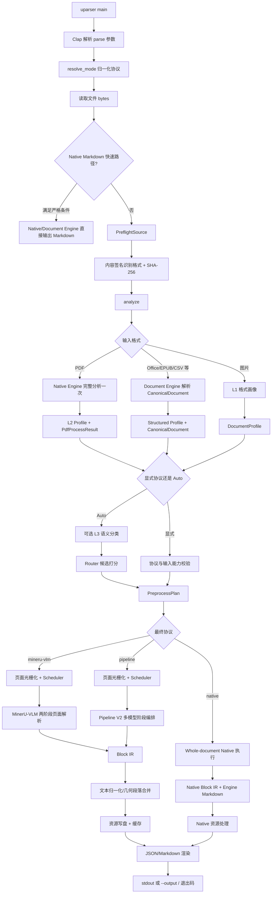
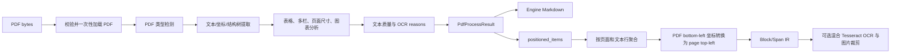
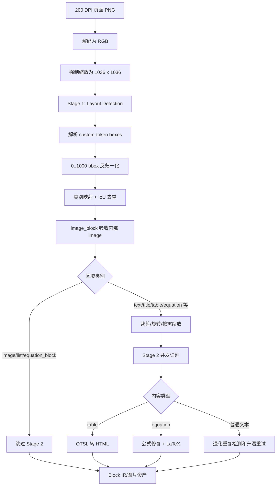
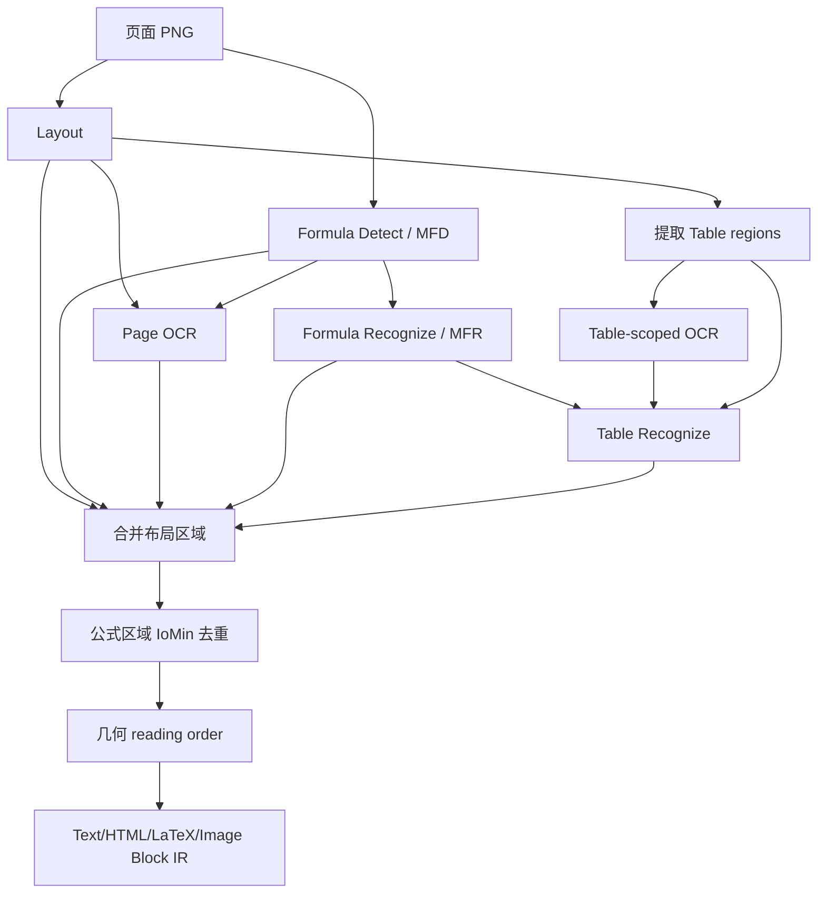
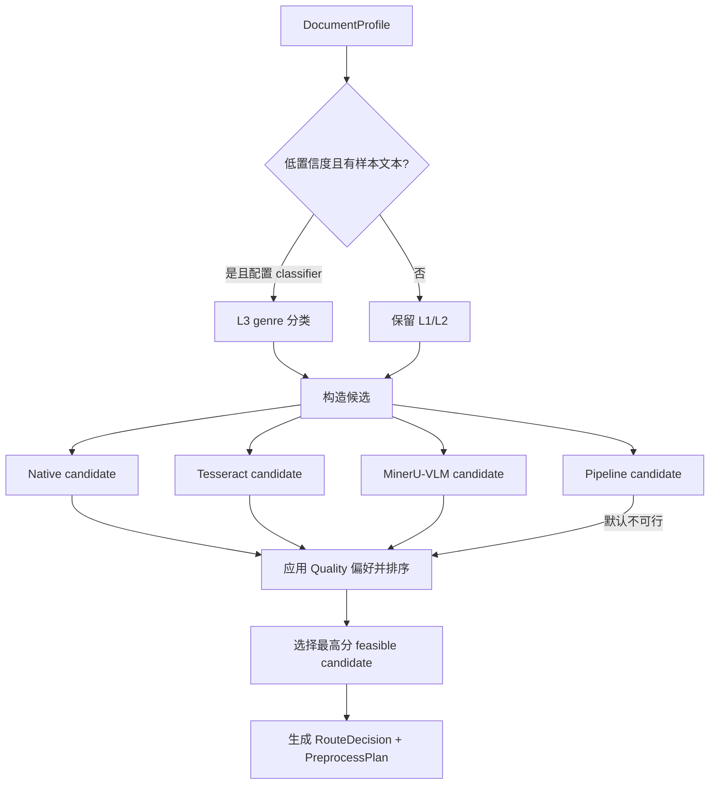
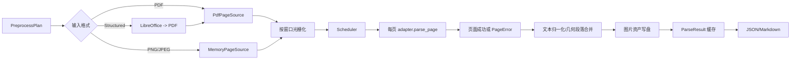

# CLI 到 Native、Pipeline、MinerU-VLM、Auto 技术流程分析

> 分析基线：当前仓库实现  
> 范围：`uparser` CLI、preflight、profiler、router、runner、scheduler、Native Engine、MinerU-VLM Adapter、Pipeline V2 Adapter 和公共渲染链路

## 1. 核心结论

CLI 中这四种选择并不完全同级：

- `--mode native`
- `--mode pipeline`
- `--mode protocol --protocol mineru-vlm`
- `--mode auto`

也可以使用兼容写法 `--protocol native|pipeline|mineru-vlm|auto`。CLI 最终都会将选择归一化为内部协议名。

需要优先理解以下实现事实：

1. 所有 PDF 即使最终走 MinerU-VLM 或 Pipeline，也会先调用 Native Engine 完成一次全文分析，生成 L2 `DocumentProfile` 和可复用的 `PdfProcessResult`。
2. Native 是整文档、零模型执行，不进入页面 Scheduler，也不使用非 Native 协议的公共结果缓存。
3. 当前注册的 `pipeline` 是 `PipelineV2Adapter`，不是仍保留在源码中的旧 `PipelineAdapter`。
4. 默认 Auto 环境明确将 Pipeline 标记为不可行，因此 Auto 当前不会选择 Pipeline。
5. Auto 不只可能选择 Native 和 MinerU-VLM：扫描件在本地 Tesseract 可用时会优先路由到 `tesseract`。
6. Native Markdown 与 Native JSON/Canonical Markdown 使用两条不同的数据轨道，目前不是严格的“一份 IR，多种 renderer”。

## 2. 总体技术流程



## 3. CLI 与公共前置流程

`main.rs` 只负责 Clap 参数解析和退出码映射。`cli.rs::resolve_mode` 将 `--mode` 与 `--protocol` 组合归一化：

| CLI 选择 | 内部协议 |
|---|---|
| `--mode native` | `native` |
| `--mode pipeline` | `pipeline` |
| `--mode protocol --protocol mineru-vlm` | `mineru-vlm` |
| 未指定或 `--mode auto` | `auto`，随后由 Router 替换为具体协议 |

正常路径读取完整文件后创建 `PreflightSource`。格式识别以内容签名为准，而不是盲信扩展名；同一阶段计算 SHA-256，后续用于输入身份和缓存键。

### 3.1 Analyze 阶段

`runner::analyze_inner` 根据输入格式分流：

- PDF：调用 `uparser_native_engine::process_pdf_mem()`，返回 `PdfProcessResult`，再映射为 L2 profile。
- 结构化文档：调用 Document Engine，解析为 `CanonicalDocument` 并生成 structured profile。
- PNG/JPEG：仅根据格式生成 L1 profile。
- 未知格式：preflight 失败。

因此显式 MinerU-VLM 和 Pipeline 对 PDF 也会支付一次 Native Engine 全文分析成本。这次分析结果在 Native 路径会直接复用；视觉协议执行时则仍需再次将 PDF 光栅化。

### 3.2 Prepare 阶段

Auto 请求会在 L2 分析后尝试语义增强。只有 genre 置信度低于 `0.65`、存在非空样本文本且配置了 `UPARSER_CLASSIFIER_ENDPOINT` 时，才会发送 L3 分类请求；失败会保留 L2 结果并记录 warning。

显式协议不会执行 L3 分类，而是构造 `RouteOrigin::Explicit`，校验协议存在性、编译能力和输入适用性。例如显式 Native 会拒绝 `Scanned`、`ImageOnly` 和 `Unknown` source quality。

随后生成 `PreprocessPlan`：

- Native PDF：`PdfText`，不转换、不光栅化，复用 `native_pdf_analysis`。
- Native structured：`SourceSemantic`，直接复用 canonical document。
- 视觉协议 + PDF：`VisualPages`，默认 200 DPI。
- 视觉协议 + 图片：`DirectImage`。
- 视觉协议 + structured：LibreOffice 转 PDF，再按 200 DPI 光栅化。

## 4. Native 模式



### 4.1 Native Engine 产物

`PdfProcessResult` 同时承载：

- `pdf_type`
- Engine Markdown
- 页面数和处理耗时
- `pages_needing_ocr` 与机器可读 OCR reasons
- 标题、置信度和布局复杂度
- `positioned_items`
- tagged PDF 的结构角色
- 页面尺寸和图表区域

Engine 加载 PDF 一次，在同一分析/提取过程中生成分类、Markdown 和几何信息。乱码字体、GID 编码、稀疏文本和扫描页会进入 OCR reason 体系；严重不可信时 Markdown 会被抑制。

### 4.2 两条输出轨道

Native Markdown 默认优先返回 Engine Markdown，其中包含 Engine 自己的标题、段落分组和表格恢复结果。

Native JSON 则使用 `positioned_items` 构造 `Page -> Block -> Span`：文本项先按页面和基线聚合为行，坐标从 PDF 左下原点转换为页面左上原点，再映射公式、注释、图片和图表语义。

选择 `--markdown-source canonical` 时会从 Block IR 走公共 Markdown renderer。两条轨道可能在表格结构、标题判断、段落边界和阅读顺序上产生差异。

### 4.3 Native 特殊行为

- Native 是整文档执行，`--pages`、`--stream`、`--window-size`、`--max-concurrency` 和 `--raster-dpi` 对其无效。
- Native 在 `runner::execute_with_hooks` 中提前分叉，因此不会读取或写入非 Native 公共结果缓存。
- 编译了 PDFium 时，可针对部分乱码/扫描页执行混合 Tesseract OCR，并对图片区域进行页面光栅化和裁剪。
- 未编译 PDFium 时仍保留图片几何，但会标记资产无法物化。

### 4.4 CLI 快速路径

同时满足下列条件时，CLI 绕过常规 runner：

- 显式 `native`
- Markdown + engine source
- `--no-cache --no-assets`
- 非 stream、未指定 pages/assets dir
- 未关闭 postprocess
- window/concurrency 使用默认值

PDF 直接调用 Native Engine；structured 文档直接调用 Document Engine。该路径不附加 route/profile/preprocess 等执行元数据。

## 5. MinerU-VLM 模式



### 5.1 Stage 1：整页布局

页面先被非等比强制缩放为 `1036 x 1036`，编码为 data URL，向 OpenAI-compatible chat-completions endpoint 发送 `Layout Detection` prompt。返回值不是标准 JSON，而是 MinerU custom-token grammar。

解析后执行：

1. 将 `0..1000` 归一化 bbox 恢复为原始光栅页面像素坐标。
2. 将模型类别映射为公共类别。
3. 使用 `IoU >= 0.8` 去除近似重复区域。
4. 对 MinerU 2605 的 `image_block` 父区域吸收重叠比例达到 90% 的内部 `image` 区域。

### 5.2 Stage 2：区域内容识别

除 `image`、`image_block`、`list`、`equation_block` 外，其余区域执行 crop、旋转和按需缩放，然后按区域类别使用不同 prompt：

- table：Table Recognition，输出 OTSL，再转换成 HTML。
- equation：Formula Recognition，执行公式修复并包装为 LaTeX。
- 其他：Text Recognition，输出普通文本。

区域请求在单页内并发，并共享整个文档的 Semaphore。CPU 裁剪和编码不占 permit，只有网络 dispatch 占用并发预算。

普通文本响应若出现已知重复循环，会提高 temperature 重试；表格和公式不应用该启发式，以避免破坏结构精度。

### 5.3 阅读顺序与 IR

MinerU-VLM Adapter 声明 `provides_reading_order = false`，Block 的 `reading_order` 为空。区域基本保留 Stage 1 返回顺序，公共 postprocess 只会按当前顺序合并几何上邻近的普通文本块，不会运行完整的模型级阅读顺序恢复。

## 6. Pipeline 模式

当前内置 registry 将协议名 `pipeline` 构造为 `PipelineV2Adapter`。旧 `pipeline.rs::PipelineAdapter` 仍保留用于兼容和测试，但 CLI 默认不会实例化它。



### 6.1 真实执行批次

Pipeline V2 使用五类远程模型 stage：layout、formula detect、OCR、formula recognize 和 table。

每页执行顺序为：

1. 并行执行 layout 与 formula detection。
2. 校验 layout/formula regions。
3. 从 layout 中提取 table regions，并将它们临时重标为 text，形成 table-scoped OCR 输入。
4. 并行执行页面 OCR、公式识别和表格专用 OCR。
5. 若存在表格，将 table region、table OCR spans 和 formula spans 送入 table recognition。
6. 合并所有区域，删除与 MFD 区域 `IoMin >= 0.7` 的 layout 公式重复项。
7. 排除表格内部的独立公式区域，避免重复输出。
8. 使用几何 reading-order 算法排序。
9. 将文本、表格 HTML、公式 LaTeX、图片裁剪映射为公共 Block IR。

表格必须额外执行 table-scoped OCR，因为普通页面 OCR 会排除 table 类别；如果没有这一步，table model 得不到与单元格结构绑定的文本 spans。

### 6.2 Endpoint

默认 Pipeline V2 服务基址为 `http://localhost:9001`：

- `/v2/pipeline/layout:batch`
- `/v2/pipeline/mfd:batch`
- `/v2/pipeline/ocr:batch`
- `/v2/pipeline/mfr:batch`
- `/v2/pipeline/table:batch`

可以整体覆盖基址，也可以使用 CLI 参数分别覆盖各 stage endpoint。当前 CLI 会拒绝这些模型 stage 的 `local` backend 和 Rust 进程内 table model path。

### 6.3 StageGraph 与运行时差异

`PIPELINE_V2_STAGE_GRAPH` 声明了依赖关系、输入输出类型和 failure policy：

- layout：`AbortPage`
- formula detect/OCR/formula/table：`IsolateRegion`
- assemble/order：`AbortPage`

但当前 `run_workflow` 对各阶段结果普遍直接使用 `?` 传播错误。也就是说，StageGraph 的 `IsolateRegion` 目前主要是声明和静态图校验，尚未完整落实为运行时区域级降级；任一关键远程 stage 失败通常会形成整页 `PageError`。

## 7. Auto 模式



### 7.1 默认候选规则

Native：

- structured 或可靠 native text 显著加分。
- text-dominant、spreadsheet、book、technical standard、regulation、legal、contract 加分。
- presentation 和多栏 resume 减分。
- scanned、image-only、unknown 不可行。

Tesseract：

- 仅 scanned/image-only 适用。
- 必须编译 PDFium 且本地 Tesseract 可用。
- 满足条件时基础分 130，通常高于 MinerU-VLM。

MinerU-VLM：

- 默认可行，Quality 偏好额外加 5 分。
- scanned、image-only、mixed 加 45 分。
- presentation 加 35，resume 加 25，unknown genre 加 10。

Pipeline：

- table-dense 加 60。
- tender、bid、financial report 加 25。
- Quality 偏好额外加 10。
- 但默认 `RoutingEnvironment.pipeline = false`，所以无论分数多高都不会被 Auto 选中。

### 7.2 Auto 的能力边界

Auto 中的“model protocol available”不是动态健康检查，默认直接为 `true`。因此 Auto 可以选择 MinerU-VLM，即使 endpoint 未配置或服务未启动；CLI 只会输出 hint，真正的连通性错误要到 adapter dispatch 时才发生。

显式 Pipeline 则被视为操作员已经确认远程 stages 可用，因此 prepare 阶段允许执行，实际健康状况同样在请求时暴露。

## 8. 非 Native 公共执行链路



有效 Scheduler window 为：

```text
max(window_size, max_concurrency, 1)
```

每个窗口完成后才拉取下一批页面，因此 PDF 光栅缓冲的峰值大致受窗口大小约束。页面 task 可以并发执行，而网络请求还要获取共享 Semaphore；MinerU-VLM 的区域级 fan-out 和 Pipeline 的 stage 并行都共享同一个文档并发预算。

单页 adapter 失败会记录 `PageError`，不立即终止其他页面。最终只要存在 page errors，CLI 返回 `EXIT_PARTIAL = 3`。输入、转换、缓存或 runner 级失败则按 dependency/internal 等语义退出码返回。

## 9. 公共后处理、资源和渲染

非 Native adapter 输出 Blocks 后，默认运行：

1. 文本标点和空白归一化。
2. 将垂直间距不超过 8 px、左边界差不超过 20 px 的相邻普通文本块合并。
3. CJK 换行连接时不插入 ASCII 空格。
4. 修复简单英文行末连字符断词。
5. 图片/图表资产写入目标目录并填充 `asset_path`。
6. 写入基于 source bytes、protocol、endpoint、model 和执行参数的缓存。

公共 Markdown renderer 按 Block 内容优先级输出 HTML、LaTeX、文本或资产链接，并依据规范化 category 生成标题和列表标记。

Native 正常执行在进入公共 Scheduler、缓存和 postprocess 前已经分叉。Native 的资源物化和输出选择由独立逻辑完成，这是当前四条链路之间最明显的架构不对称。

## 10. 四种模式对比

| 维度 | Native | MinerU-VLM | Pipeline V2 | Auto |
|---|---|---|---|---|
| CLI 类型 | 独立 mode | model protocol | 独立 mode | 独立 mode |
| 核心输入 | PDF text/structured semantics | 页面图像 | 页面图像 | 先 profile，再选择 |
| PDF 前置 Native 分析 | 是，且复用 | 是 | 是 | 是 |
| 外部模型 | 无；混合 OCR 可用 Tesseract | 单一 VLM endpoint，两轮协议 | 五类远程模型 stage | 取决于路由结果 |
| 调度粒度 | 整文档 | 页面 + 区域 | 页面 + stage | 取决于路由结果 |
| 阅读顺序 | Engine Markdown 或 positioned line order | 无显式 reading order | 几何 reading order | 取决于路由结果 |
| 表格 | Native 三策略恢复 | Stage 2 OTSL -> HTML | layout + table OCR + table model | 取决于路由结果 |
| 公共 cache | 不使用 | 使用 | 使用 | Native 不用，其他使用 |
| stream/pages | 不支持真正分页流式 | 支持 | 支持 | 选到 Native 时无效 |
| Auto 可选 | 是 | 是 | 当前否 | 本身是选择器 |

## 11. 架构风险与改进方向

### 11.1 Auto 能力探测不完整

Router 使用静态 `RoutingEnvironment`，不会实时探测 endpoint；Pipeline 又被永久设为不可行。更完整的设计应将 `doctor`/health check 结果注入 routing environment，并区分“已配置”“可连接”“模型兼容”三个层次。

### 11.2 PDF 视觉协议存在重复工作

PDF 先由 Native Engine 完整提取用于 profile，随后视觉协议再用 PDFium 光栅化。Auto 需要这份分析，但显式 MinerU-VLM/Pipeline 是否必须运行完整 Markdown 提取值得评估；可以考虑 Analyze-only Native artifact，减少显式视觉模式的前置成本。

### 11.3 Native 双轨输出一致性

Engine Markdown 和 positioned-item IR 在表格、标题与段落结构上不等价。长期应由 Native Engine 暴露稳定的语义几何 IR，并由同一份 IR 渲染 Markdown/JSON。

### 11.4 Pipeline failure policy 尚未闭环

StageGraph 声明了 `IsolateRegion`，但 workflow 实现仍以整页错误传播为主。应为 formula、OCR、table 分别实现局部降级，并在 Block 或 warning 中保留失败阶段和区域信息。

### 11.5 MinerU-VLM 阅读顺序能力不足

Adapter 不生成显式 reading order，公共 postprocess 也不是完整阅读顺序算法。多栏、浮动图表和复杂论文页面可能依赖模型输出的偶然顺序；可考虑在 Stage 1 后应用统一 XY-cut/阅读顺序模块。

### 11.6 Structured 视觉路径重复解析/转换

Structured 输入先解析为 CanonicalDocument 用于 profile，随后视觉协议又从原始 bytes 调 LibreOffice 转 PDF。当前并没有从 canonical artifact 生成视觉页面，`reused_artifacts` 更接近规划元数据而非真正的数据复用。

## 12. 关键源码索引

- CLI 入口：`uparser/crates/uparser-core/src/main.rs`
- CLI 参数、mode 解析和输出：`uparser/crates/uparser-core/src/cli.rs`
- Preflight 与页面源：`uparser/crates/uparser-core/src/frontend.rs`
- Analyze、Prepare、Execute：`uparser/crates/uparser-core/src/runner.rs`
- L1/L2 profile：`uparser/crates/uparser-core/src/profiler.rs`
- L3 语义增强：`uparser/crates/uparser-core/src/semantic.rs`
- Auto Router：`uparser/crates/uparser-core/src/router.rs`
- Scheduler：`uparser/crates/uparser-core/src/scheduler.rs`
- Adapter Registry：`uparser/crates/uparser-core/src/adapters/mod.rs`
- Native Adapter：`uparser/crates/uparser-core/src/adapters/native.rs`
- MinerU-VLM Adapter：`uparser/crates/uparser-core/src/adapters/mineru_vlm.rs`
- Pipeline V2 Adapter：`uparser/crates/uparser-core/src/adapters/pipeline_v2.rs`
- Pipeline StageGraph：`uparser/crates/uparser-core/src/stage_graph.rs`
- Native Engine：`uparser/crates/uparser-native-engine/src/lib.rs`
- 公共 postprocess：`uparser/crates/uparser-core/src/postprocess.rs`
- 公共 renderer：`uparser/crates/uparser-core/src/render/mod.rs`
