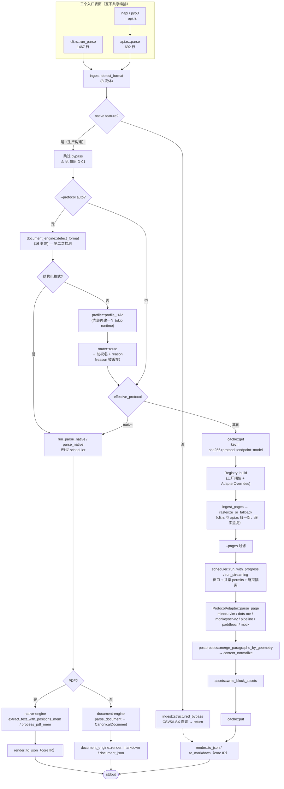

# uparser 自研核心模块架构审查与重构执行方案

审查范围：`uparser/crates/uparser-core`（13,990 行）、`uparser-document-engine`（11,534 行）、
`uparser-napi`（71 行）、`uparser-python`（94 行）。**不含** `uparser-native-engine`
（vendored pdf-inspector，视为外部引擎，仅审查其调用边界）。

审查方法：逐文件读取 + 跨模块调用图（`grep` 消费者反查）+ 对照 `ARCHITECTURE.md` §2/§5/§13
的设计意图。以下每条结论都标注了可复核的文件:行。

---

## 1. 现状技术架构流程图

### 1.1 请求主流程（实际代码路径，非设计文档路径）



### 1.2 模块依赖分层（消费者反查结果）

```
入口层     cli.rs(1467)            api.rs(692)         napi(71)/pyo3(94)
           │  ├ agent_config ◄── 仅 CLI 可用（bindings 无 env/config 解析）
           │  ├ page_range   ◄── 仅 CLI 可用（api 只接 Vec<u32>）
           │  └ render(core) ◄── 仅 CLI 可用（bindings 拿不到 markdown）
编排层     scheduler(651)  ── 只服务 parse_page 系协议；native 不经过
契约层     adapters/mod.rs(560): ProtocolAdapter + ParseCtx + Registry
协议层     mineru_vlm(611) dots_ocr(403) monkeyocr_v2(602) pipeline(634)
           paddleocr(288) mock(97) native(813)   pipeline_serving(123) onnx_table(126)
共享算法   output_parse(1167) otsl(350) imaging(350) geometry(343) category_map(358)
           formula_repair(255) postprocess(280) content_normalize(164)
           reading_order(158) robustness(169)
基础设施   transport(580) cache(321) ingest(732) assets(288) types(366)
分析层     profiler(261) router(149)
另一套栈   uparser-document-engine: detect(246) model(348) formats/*(6,200+) render(966)
```

关键的**消费者缺口**（`grep` 实测，非推测）：

| 模块 / 抽象 | 生产者 | 消费者 | 结论 |
|---|---|---|---|
| `ingest::ingest_document`（§13.1a 规范编排器） | — | **仅自身单测** | 死代码 |
| `PostprocessSignals` / `emitted_signals()` | 7 个 adapter 都实现 | **无** | 抽象空转 |
| `MergeHint`（`types.rs:53`） | **无**（只有 types 单测） | postprocess 不读 | 死类型 |
| `CoordFrame::Crop` | **无 adapter 产出** | geometry.rs 有 helper | 死变体 |
| `provides_reading_order()` | 7 个 adapter 实现 | **无** | 抽象空转 |
| `ParseResult.document_profile` | **恒为 None（全路径）** | render/JSON 输出 | 字段恒空 |
| `ParseResult.model_endpoint/model_name` | **恒为 None** | 同上 | 字段恒空 |
| `ParseResult.timing` | **恒为空 map** | 同上 | 字段恒空 |
| `render::to_content_list` | — | 仅测试（无 `--format` 出口） | 无出口 |
| `reading_order::assign_reading_order` | — | 仅 pipeline/paddleocr 自调 | 未编排层化 |
| `robustness.rs` | — | 仅 mineru-vlm/monkeyocr-v2 | 覆盖 2/6 |

### 1.3 三条 Markdown 生成路径（同一产品，三套规则）

```
--protocol mineru-vlm/dots-ocr/... ──► core render::to_markdown
                                        规则：html > latex > text(category→#/-) > 
--protocol native  且  输入是 PDF   ──► native-engine 自带 markdown 管线
                                        规则：heading 检测 + 段落聚合 + 三策略表格
--protocol native  且  输入是 DOCX… ──► document_engine::render::markdown
                                        规则：CanonicalDocument → GFM（list/table/note/asset）
```

三者对标题层级、列表标记、表格形态、图片链接的处理规则**互不一致**，
且 `--format markdown` 的实际语义随协议与输入格式漂移（`cli.rs:886-977`）。

---

## 2. 冗余模块设计（Redundancy）

| 编号 | 冗余项 | 证据 | 影响 |
|---|---|---|---|
| **R-01** | **两套格式检测 + 两套 `DocumentFormat` 枚举** | `ingest.rs:17-54`（8 变体，CSV 仅靠扩展名）vs `document-engine/detect.rs:9-76`（16 变体，含 OLE/OPC 深度识别）。`cli.rs:383` 与 `cli.rs:1149` 对同一份 bytes 检测两次 | 两处可给出不同结论；新增格式要改两处 |
| **R-02** | **结构化直读双实现** | `ingest::structured_bypass`（calamine+csv，core 直接依赖这两个 crate）vs `document-engine/formats/{csv,sheet}.rs`（同样 calamine+csv，能力更强：TSV/ODS/合并单元格/预算） | core 侧在生产构建（`--features native`）下**完全不可达**，是纯负担 |
| **R-03** | **§13.1a 编排器 3 份实现** | 规范版 `ingest::ingest_document`（无人调用）；`cli.rs::ingest_pages/rasterize_or_fallback/profile_best_effort`；`api.rs` 中同名三函数**逐字重复** | 修一处漏两处，正是历史上多次 bug 的成因模式 |
| **R-04** | **三套 Markdown 渲染器** | 见 §1.3 | 同一文档换协议输出风格突变，无法做统一黄金测试 |
| **R-05** | **两套 IR + 有损单向桥** | `types::{Block,Page,ParseResult}` vs `model::CanonicalDocument`；桥 `native.rs:237-330`：list 被降级为 text（注释自承）、几何全填 0、`Inline` 样式全丢 | `--format json` 与 `--format document-json` 对同一文档信息量不同 |
| **R-06** | **parse 编排双实现（已在注释中承认）** | `api.rs:8-17` 模块注释；能力实测不对等：api 无 `agent_config`、无 markdown/document-json、无 stream/progress；bindings 无 `pages`/`assets`/`no_postprocess` | “三表面调同一核心”的目标事实上未达成 |
| **R-07** | **推测性协议栈** | `pipeline`(634) + `pipeline_serving`(123) + `onnx_table`(126) + `paddleocr`(288) ≈ 1,171 行，REST 契约均为**自拟、无真实服务验证**；`onnx_table` 在本机连链接都不通过 | 6 协议中仅 mineru-vlm 真实端到端验证、native 有基准；维护面/收益严重失衡 |
| **R-08** | **默认端点第二真相源** | `cli.rs:1249-1261` `default_endpoint_for` 手抄各 adapter 默认端点 | 改 adapter 默认值会静默漂移 |
| **R-09** | **`to_content_list` 无出口** | `OutputFormat` 只有 Json/Markdown/DocumentJson | 死输出格式 |

**冗余量级估算**：可直接删除或委托掉的重复实现约 **1,400–1,900 行**（R-02 约 120 行、R-03 约 180 行、
R-07 约 1,171 行若下沉为 experimental、R-08/R-09 约 60 行），另有约 400 行属于“合并而非删除”（R-03/R-06 的编排统一）。

---

## 3. 架构设计缺陷（Defects）

按严重度排序。P0 = 已构成真实错误输出或数据污染。

> **后续实测修正（见 `THREE_MODE_ARCHITECTURE_AND_PLAN.md` §1.2）**：用已构建的 release 二进制
> （`--features native,pdfium`）实测后，D-01 的定级由 **P0 下调为 P1**——占位页的 `png_bytes` 是原始
> 文件字节，adapter 侧 `image::load_from_memory` 会先失败，因此**请求不会发出、不会产生静默错误输出**；
> 实际表现是 `exit=3` + 指向错误层的诊断 `failed to decode rasterized page`（stage=decode），
> 且不提示“native 模式可直接解析该格式”。D-02（缓存污染）已实测复现，**仍为 P0**。

### P0

**D-01 生产构建下 CSV/XLSX 显式协议会喂给 VLM 一张 1×1 空白图**（定级见上方修正）
`cli.rs:384` 与 `api.rs:236` 的 `structured_bypass` 调用都带 `#[cfg(not(feature = "native"))]`，
而 `SKILL.md:75` 推荐的生产构建正是 `--features native,pdfium`。
路径复核：`--protocol mineru-vlm x.csv` → bypass 被 cfg 掉 → 非 native 分支 → `ingest_pages` 的
`_` 兜底 → `rasterize_or_fallback` → `image::load_from_memory` 失败 → **1×1 占位页** → 送入 VLM。
退出码 0，无 warning。这正是历史上已修过一次、又被 native 特性重新引入的同类缺陷。
（仅 `--protocol auto` 侥幸正确，因为 auto 分支另有结构化格式判断。）

**D-02 缓存键不含影响输出的参数，导致跨调用结果污染**
`ParamFingerprint` 只含 `protocol/endpoint/model`（`cache.rs`），但 `cli.rs:750` / `api.rs` 在
`--pages`、`--no-postprocess`、`--assets-dir/--no-assets`、pipeline 各 stage 配置生效后**无条件写缓存**。
故 `uparser parse --pages 1 doc.pdf` 之后，`uparser parse doc.pdf` 会命中缓存并**只返回第 1 页**（TTL 24h 内）。
同理 `--no-postprocess` 的未合并结果会污染后续正常调用。

### P1

**D-03 主力协议走旁路：`ProtocolAdapter` 抽象泄漏**
`native` 不实现 `parse_page`（`native.rs` 明确返回解释性 `PageError`），因此 `cli.rs:452` / `api.rs:213`
用专用分支绕过 scheduler。代价是 native 路径同时失去：内容哈希缓存、`postprocess` 段落合并、
`content_normalize` 标点规范化、`--pages/--window-size/--max-concurrency`、进度回调与 stall 看门狗、
warnings 汇总。而它在 `Registry::with_builtins()`（`adapters/mod.rs:362`）里的注册项是**不可用的假注册**，
只会出现在 `uparser protocols` 的能力清单里。

**D-04 能力声明系统整体空转**
`emitted_signals()`/`PostprocessSignals`/`spans`/`font_size`/`MergeHint`/`CoordFrame::Crop`/
`provides_reading_order()` 全部**无消费者**（§1.2 表）。`ARCHITECTURE.md` §5/§14 设计的
“postprocess 两层：纯几何 + 信号增强，按 `emitted_signals` 降级”只实现了纯几何层。
`native` 是唯一声明 `spans: true` 的 adapter，却因 D-03 从不经过 postprocess。

**D-05 IR 可观测性字段恒空**
`document_profile`/`model_endpoint`/`model_name`/`timing` 在**所有代码路径**恒为 None/空（已 grep 验证无一处 `Some`）。
其中 `--protocol auto` 明明算出了 `DocumentProfile` 与 `RouteDecision.reason`，却只 `eprintln!` 到 stderr 后丢弃
（`cli.rs:417`）——与“Agent 可自省路由决策”的设计目标（§13.5）直接背离，且 JSON 消费者永远看不到。

**D-06 特性门改变语义，CI 默认构建测不到生产语义**
`native` 特性除“加协议”外还改变：CSV/XLSX 行为（D-01）、L2 profiling 可用性、`document-json` 可用性、
auto 路由的格式清单。默认构建（CI 主跑）与生产构建（`native,pdfium`）是两套语义。

### P2

**D-07 编排职责错位，stream 与非 stream 行为分叉**
postprocess、asset 写盘、reading-order 回填分散在 CLI/api 层各写一遍：
`cli.rs:603-619`（stream 窗口回调，对**克隆页**写 asset）+ `cli.rs:707-748`（聚合结果再写一次），
`api.rs:326-345`（只有聚合版）。reading-order 由 pipeline/paddleocr 在 adapter 内部自调，
scheduler 从不统一回填。任何后处理新增都要在 4 个地方同步。

**D-08 路由/结构化格式清单硬编码两处**
`cli.rs:1149-1171` 与 `api.rs:238-266` 各硬编码同一份 12 变体 `DocumentFormat` 清单。
`router.rs:53` 的 reason 文本还残留 “`pipeline` adapter doesn't exist yet” 的过期描述。

**D-09 错误模型四分裂 + stage 魔法字符串**
`PageError{message:String, stage:Option<String>}`、`IngestError`、`ApiError`、`DocumentError`
之间靠 `to_string()` 拼接降级。`stage` 用字符串约定（`"native_document.encrypted"` 等）在
`native.rs:207-218` 产出、`cli.rs:989-1004` 消费，**跨文件字符串契约**，编译器无法保护。

**D-10 CLI 在 auto 路径下创建两个 tokio 多线程 runtime**
`cli.rs:1125` `profile_best_effort` 内 `Runtime::new()`，随后 `cli.rs:540` 又 `Runtime::new()`。
线程池翻倍；且若该函数未来被 async 上下文调用会直接 panic。

**D-11 断管（broken pipe）保护只覆盖 native 路径**
`emit_line`（`cli.rs:1050`，专为 `| head` 场景加的）只在 native 分支使用；
主 parse 路径仍是裸 `println!`（`cli.rs:394/509/626/760`），`uparser parse ... | head` 仍会 panic。

**D-12 资源治理只覆盖网络路径**
`permits` 只约束网络 dispatch（正确的修复），但 native/document-engine 的 CPU 密集解析
除 `max_input_bytes` 外无任何并行度/内存预算；`--window-size` 对其无效（CLI 已 warn，但等于承认无治理）。

**D-13 输出格式与协议的耦合不可自省**
`document-json` 仅 native-structured 可用；`markdown` 的渲染器随协议+输入格式三分。
`uparser protocols` 不暴露这些约束，Agent 只能试错。

---

## 4. 执行方案

原则：**先止损（P0）→ 再统一编排（结构收敛）→ 再决定抽象存废 → 最后收敛渲染/IR**。
每阶段独立可发布，且以“真实端点 7 页文档回归 + benchmark 不回退（native 0.8754 / mineru-vlm 0.9284）”为共同 Gate。

### 阶段 R0 — P0 止损（预计 1–2 天，改动 < 300 行）

| 任务 | 内容 | 涉及文件 | 验收 |
|---|---|---|---|
| T-R0.1 | 结构化直读改为**无条件、协议无关**的前置步骤：删除两处 `#[cfg(not(feature="native"))]`；native 构建下委托 `document-engine`（能力更强），非 native 构建保留 core 实现 | `cli.rs:384`, `api.rs:236` | 新增测试：`--features native` 下 `--protocol mineru-vlm x.csv` 返回结构化结果且**不发起任何请求**（MockDispatch 断言零 dispatch） |
| T-R0.2 | `ParamFingerprint` 扩展为覆盖全部影响输出的参数（pages/no_postprocess/assets 开关/pipeline stage 配置/engine options 摘要）；无法纳入的一律禁止写缓存 | `cache.rs`, `cli.rs`, `api.rs` | 新增测试：`--pages 1` 后的全量 parse **不**命中缓存；`--no-postprocess` 结果不污染默认调用 |
| T-R0.3 | `emit_line` 替换主路径全部 `println!` | `cli.rs` | `uparser parse ... \| head -1` 退出码正常、无 panic 输出 |
| T-R0.4 | CLI 单 runtime：把 runtime 创建上提到 `run_parse`/`run_classify` 顶部，`profile_best_effort` 改为 async | `cli.rs` | 进程内 runtime 只建一次（测试用线程数或注入计数验证） |

### 阶段 R1 — 统一编排内核（3–5 天，净减约 300 行）

| 任务 | 内容 | 涉及文件 | 验收 |
|---|---|---|---|
| T-R1.1 | 新增 `runner.rs`：**唯一**实现 §13.1a 规范流水线 `detect → structured lane / native lane / model lane → postprocess → assets → cache → 填充 IR 元数据`。输入 `RunRequest`，输出 `ParseOutcome{result, markdown_source, profile, decision}` | 新 `runner.rs` | — |
| T-R1.2 | `cli.rs` 与 `api.rs` 降级为薄壳：仅做参数解析、渲染选择、exit code / 错误映射。删除 `ingest_pages`/`rasterize_or_fallback`/`profile_best_effort` 的重复副本与死代码 `ingest::ingest_document` | `cli.rs`, `api.rs`, `ingest.rs` | 两文件合计减少 ≥ 250 行；现有 25 CLI + 全部 api 测试不改断言通过 |
| T-R1.3 | 结构化格式清单与 auto 路由收敛到 `router.rs`（单一真相源），清理 `router.rs` 过期 reason 文本 | `router.rs`, `runner.rs` | 硬编码清单只剩一处（grep 验证） |
| T-R1.4 | 填充 IR：`document_profile`、`model_endpoint`、`model_name`、`routed_by` 的 reason（新增 `RoutedBy::Auto{reason}` 或 `capability_notes`）、`timing`（detect/ingest/model/postprocess/render 五个打点） | `runner.rs`, `types.rs` | `--protocol auto` 的 JSON 输出含非空 profile + reason + timing；bindings 同样可见 |
| T-R1.5 | `agent_config` 端点/模型解析下沉到 `runner`（bindings 亦获得 env/config 支持），或在文档中明确其为 CLI 专属并加 `ParseOptions::resolve_from_env` 显式开关 | `runner.rs`, `agent_config.rs` | Node/Python 测试：设置 `UPARSER_ENDPOINT` 后无需传参即可解析 |

### 阶段 R2 — 协议抽象修正（3–5 天）

| 任务 | 内容 | 验收 |
|---|---|---|
| T-R2.1 | `ProtocolAdapter` 引入 `fn granularity() -> Granularity{Page, Document}`，并加 `async fn parse_document(&self, doc: &SourceDocument, ctx) -> Result<Vec<Page>, PageError>`（Page 系提供默认实现 = 走 scheduler；Document 系覆写）。`runner` 按 granularity 选执行策略 | native 通过 `Registry` 正常可达，`parse_page` 的解释性错误分支删除；`uparser protocols` 输出 granularity |
| T-R2.2 | native 纳入统一后处理链：postprocess（含 content_normalize）、cache、assets、progress、warnings 汇总 | 新增测试：native 结果的 CJK 标点被规范化；同文档二次 parse 命中缓存（记录耗时下降） |
| T-R2.3 | 能力声明二选一并落地：**保留** `spans`/`font_size`（native 已产出）并实现 postprocess 的信号增强层（基于 font_size 的标题分级 + 基于 spans 的跨行合并）；**删除** `MergeHint`、`CoordFrame::Crop`、`provides_reading_order`（改由 runner 依据 `reading_order.is_none()` 统一回填 XY-cut） | 删除项 grep 无残留；`emitted_signals` 至少被 postprocess 读取一次并有降级测试 |
| T-R2.4 | `reading_order` 回填上提到 runner，pipeline/paddleocr 内部调用删除 | 两 adapter 减少重复；新增“无序 blocks 经 runner 后有序”的测试 |

### 阶段 R3 — 渲染与 IR 收敛（5–8 天，风险最高，分三小步）

| 任务 | 内容 | 验收 |
|---|---|---|
| T-R3.1 | 先建**跨渲染器黄金测试**：同一组语义块分别经 core render / document-engine render 输出，把差异逐条记录为 snapshot（不改行为，只暴露差异） | snapshot 落库，差异清单成文 |
| T-R3.2 | 以 `CanonicalDocument` 为唯一**语义 IR**：新增 `blocks → CanonicalDocument` 上升映射（VLM 的 title/list/table/formula/image → `Block::{Heading,List,Table,Figure}` + `Inline::Formula`），替代现有有损的下降映射 | 上升 + 下降往返测试；VLM 协议的 markdown 由 document-engine renderer 产出后 benchmark mhs 不低于 0.878 |
| T-R3.3 | `--format markdown` 语义显式化：新增 `--markdown-source engine\|canonical`（默认 canonical，native-PDF 保留 engine 以守住 0.8754 基准）；`--format content-list` 补出口或删除 `to_content_list`；`document-json` 支持能力在 `uparser protocols` 中自省 | benchmark 双分数不回退；`protocols` 输出含 output-format 能力矩阵 |
| T-R3.4 | 合并 `DocumentFormat`：core 的 8 变体枚举改为 document-engine 枚举的 re-export（保留 serde 兼容映射） | 只剩一个 `detect_format` 调用点（grep 验证） |

### 阶段 R4 — 收缩推测性模块（1–2 天）

| 任务 | 内容 | 验收 |
|---|---|---|
| T-R4.1 | `pipeline` / `pipeline_serving` / `onnx_table` / `paddleocr` 移到非默认 `experimental-protocols` feature（或独立 crate），默认不编译 | 默认构建体积/编译时间下降；`--protocol pipeline` 在默认构建下给出明确的 “需 experimental 特性” 用法错误（exit 1） |
| T-R4.2 | `uparser protocols` 每项增加 `validation: verified-live \| offline-only \| speculative-contract` 字段 | Agent 可据此避免选到未验证协议 |
| T-R4.3 | `default_endpoint_for` 改为 `ProtocolAdapter::default_endpoint()` trait 方法，删除 `cli.rs` 手抄表 | 第二真相源消失 |

### 阶段 R5 — 错误模型与 CI 特性矩阵（2–3 天）

| 任务 | 内容 | 验收 |
|---|---|---|
| T-R5.1 | 统一 `UparserError`（thiserror）+ `Stage` 枚举替换 stage 魔法字符串；exit code 映射表单点化，三表面共享 | `native_document.*` 字符串全部消失；错误码映射有穷尽 match（编译期保证） |
| T-R5.2 | CI 增加特性矩阵：`default` / `native` / `native,pdfium` 三种构建均跑全量测试 | 三列全绿 |
| T-R5.3 | 新增“生产语义”集成测试集：CSV+显式协议、DOCX 无 LibreOffice、`--pages` 与缓存交互、`\| head` 断管、auto 路由 IR 元数据 | 每条对应 R0–R2 的一个已修缺陷，构成回归网 |

---

## 5. 明确不建议做的事

- **不要**现在把 `Block/Page` 存储表示与 `CanonicalDocument` 合并成单一结构体：几何视图与语义视图
  的关注点确实不同，R3.2 的“上升映射 + 单一渲染器”已能消除输出不一致，成本远低于换存储层。
- **不要**为 `pipeline`/`paddleocr` 再补契约细节（含 T-5.7 参考部署）：在没有真实服务可对齐前，
  每一行都是猜测性维护面，应先执行 R4.1 降级。
- **不要**为 `--protocol auto` 加页级/区域级混合路由：文档级路由的元数据（D-05）尚未打通，
  先把 profile/reason 落进 IR 再谈更细粒度。

## 6. 排期与依赖

```
R0 (1-2d, 无依赖, 可立即发布)
 └─ R1 (3-5d, 依赖 R0.1/R0.4)
     ├─ R2 (3-5d, 依赖 R1.1 runner)
     │   └─ R3 (5-8d, 依赖 R2.1 granularity + R2.3 signals)
     └─ R4 (1-2d, 可与 R2 并行)
         └─ R5 (2-3d, 依赖 R1/R2 的错误路径定型)
```

总计约 **15–25 人日**，净代码变化预计 **-1,200 ~ -1,800 行**（删冗余）+ **+600 ~ +900 行**
（runner 统一编排、信号增强层、上升映射、测试）。
