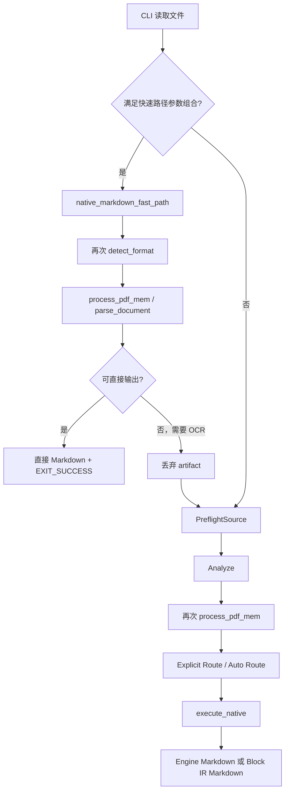
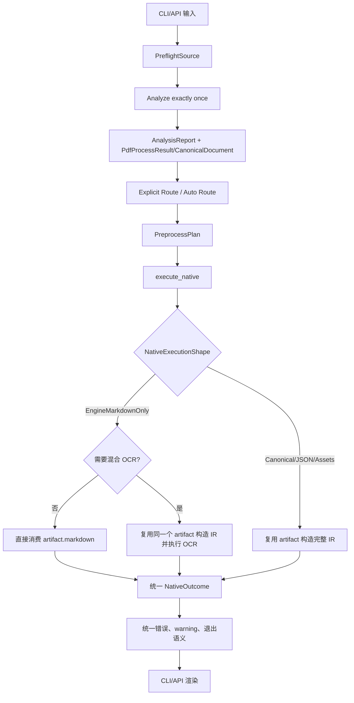

# Native Markdown 快速路径架构评审与改进方案

> 评审范围：CLI `native_markdown_fast_path`、Native prepare/execute、混合 OCR、错误和退出码契约、CLI/API 一致性  
> 评审基线：当前仓库实现

## 1. 评审结论

Native Markdown 快速输出的性能目标合理，但目前优化被放置在 CLI 层，并且发生在 `PreflightSource -> Analyze -> Route` 之前。这导致系统中存在两套 Native 执行路径，而且两条路径在可达性判断、错误类型、退出码、扫描件处理和 Markdown fallback 上并不等价。

当前问题已经超出单纯的代码重复：同一个输入只因增加或删除 `--no-cache --no-assets`，就可能从“成功并输出占位 Markdown”变成“Native 不可达”。这会破坏 CLI 面向自动化调用方承诺的语义退出码契约。

建议保留 Markdown-only 优化能力，但将其迁入统一的 Native Runner，在完成一次 Preflight、Analyze 和 Route 后，根据输出需求决定是否跳过 IR、资产和元数据构建，并始终复用第一次分析得到的 `PdfProcessResult`。

## 2. 当前架构



快速路径入口位于：

```text
uparser/crates/uparser-core/src/cli.rs:527-569
```

正常 Native 执行分支位于：

```text
uparser/crates/uparser-core/src/runner.rs:307-325
uparser/crates/uparser-core/src/runner.rs:506-580
```

## 3. 问题清单

### P1：参数改变了输入的成功/失败语义

快速路径遇到没有 positioned items 的纯图片 PDF 时，会生成：

```markdown
[Image-only PDF: OCR required]
```

随后返回 `EXIT_SUCCESS = 0`。

正常路径则先生成 `DocumentProfile`，显式 Native 对以下 source quality 返回 `PrepareError::Unreachable`：

- `Scanned`
- `ImageOnly`
- `Unknown`

因此以下命令可能产生不同的成功状态：

```powershell
# 快速路径：成功并输出 OCR required 占位符
uparser parse scan.pdf --mode native --format markdown --no-cache --no-assets

# 正常路径：preflight_failed / Native unreachable
uparser parse scan.pdf --mode native --format markdown
```

`--no-cache` 和 `--no-assets` 不应决定文档是否可以由 Native 处理。这会直接影响 Agent、shell script 和服务包装层根据退出码采取的后续动作。

同类问题也存在于损坏 PDF：快速路径错误被映射为 `EXIT_DEPENDENCY/native_parse_failed`，正常 Analyze 错误被映射为 `EXIT_USAGE/preflight_failed`。

### P1：快速路径绕过统一能力校验

快速路径在构造 `PreflightSource` 之前执行，因此绕过：

- authoritative format detection 结果和 warnings
- Native 编译/runtime capability 判断
- `DocumentProfile.source_quality` 检查
- explicit/auto route contract
- `PreprocessPlan`
- 统一 cancellation token
- 统一错误分类和执行元数据

这破坏了当前架构原本清晰的职责边界：Prepare 应决定一次执行是否有效，Execute 应只消费已经验证的计划。当前 CLI 自己成为了第二个 Runner。

### P2：OCR 回退时完整解析两次

快速路径首先调用：

```rust
uparser_native_engine::process_pdf_mem(bytes)
```

当检测到扫描页、疑似乱码或 mojibake 时返回 `Ok(None)`。调用方随后进入正常流程，而 `runner::analyze_inner()` 会再次调用 `process_pdf_mem()`。

第一次生成的 `PdfProcessResult` 没有被携带到正常执行路径，导致 PDF 被重新加载、检测、提取和生成 Markdown。最复杂、最需要 OCR 的文档反而承担两次完整 Native 分析成本。

### P2：用用户参数控制内部优化架构

当前快速路径要求：

```rust
no_cache
&& no_assets
&& !no_postprocess
```

但 Native 在 `runner::execute_with_hooks()` 中位于公共 cache 逻辑之前，实际上无论 `no_cache` 是什么都不会使用公共缓存。因此 `--no-cache` 在 Native 中没有实际缓存行为，却决定是否进入完全不同的执行架构。

`!no_postprocess` 同样不自然：快速路径不运行公共 postprocess，但只有用户没有指定 `--no-postprocess` 时才进入。这表明快速路径条件来自 benchmark 命令形状，而不是由执行能力推导。

### P2：CLI 与 API 行为不一致

CLI 可以绕过 Runner，API 则始终执行：

```text
PreflightSource -> prepare -> execute
```

因此同一 Native Markdown 请求经由 CLI 和 API 可能具有不同的：

- source-quality 校验
- 扫描件结果
- 错误类型和退出语义
- Markdown fallback
- 性能和解析次数

优化应位于 core execution 层，由 CLI、API 和语言绑定共同复用，而不是只存在于某个 frontend。

### P2：Native Markdown 实际存在三条渲染轨道

当前可能产生三类 Native Markdown：

1. `artifact.markdown`：Native Engine 完整 Markdown pipeline。
2. 快速路径 `to_markdown_from_items(positioned_items)`。
3. `NativeAdapter` 构建 Block IR 后由公共 renderer 生成的 canonical Markdown。

第二和第三条路径对标题、公式、结构树角色、图片、caption、段落边界和阅读顺序的处理不完全相同。因此快速和正常执行不仅性能不同，输出语义也可能不同。

### P3：可观测性不足

快速路径不产生 `ParseResult`，也不附加：

- route decision
- document profile
- preprocess plan
- warnings
- capability notes
- page errors

对于 Markdown-only 输出，缺少 JSON 元数据本身可以接受；但图片型 PDF 以成功码输出占位符且 stderr 没有结构化 warning，使调用方难以区分“成功解析”与“没有任何正文，只检测到需要 OCR”。

### P3：测试没有覆盖路径等价性

现有测试覆盖：

- structured 文档快速输出
- 普通 PDF 快速输出
- malformed PDF 快速失败
- image-only PDF 输出标题/占位符并成功

但缺少：

- fast path 与正常路径退出码一致性
- fast path 与正常路径 Markdown 等价性
- CLI 与 API 等价性
- OCR fallback 只执行一次 Native Engine
- PDFium/no-PDFium 构建矩阵
- `--no-cache`、`--no-assets` 不改变输入可达性的契约测试

## 4. 目标架构



设计原则：

1. 输入只检测一次。
2. Native Engine 只运行一次。
3. 所有 frontend 使用相同的 Prepare 和 Execute。
4. 输出格式只影响执行形状和物化成本，不影响 route 可达性。
5. 快速路径与完整路径必须共享错误和退出语义。
6. 需要升级到 OCR/IR 时复用 Analyze 生成的 artifact。

## 5. 建议的数据结构

在 core runner 中引入明确的 Native 输出需求，而不是由 CLI 参数组合隐式判断：

```rust
#[derive(Debug, Clone, Copy, PartialEq, Eq)]
pub enum NativeExecutionShape {
    EngineMarkdownOnly,
    CanonicalMarkdown,
    ParseResultJson,
    DocumentJson,
}
```

将其放入 `ExecutionOptions` 或单独的 Native execution options：

```rust
pub struct NativeExecutionOptions {
    pub shape: NativeExecutionShape,
    pub include_assets: bool,
    pub allow_hybrid_ocr: bool,
}
```

`ParseOutcome` 可以继续承载 `engine_markdown`，但 Markdown-only 模式不必构造完整 `ParseResult`。为了保持统一 metadata，可以考虑返回轻量结果：

```rust
pub enum NativePayload {
    EngineMarkdown(String),
    Parsed {
        result: ParseResult,
        document: Option<CanonicalDocument>,
        engine_markdown: Option<String>,
    },
}
```

如果不希望扩大 `ParseOutcome`，也可以保留现有结构并构造最小 `ParseResult`，但这会削弱 Markdown-only 优化的价值。

## 6. 执行流程改造

### 6.1 删除 CLI 前置解析职责

`cli::run_parse()` 不再直接调用：

- `detect_format`
- `process_pdf_mem`
- `parse_document`
- `to_markdown_from_items`

CLI 只负责：

1. 参数解析和互斥检查。
2. 构造 `PreflightSource`。
3. 构造带有 `NativeExecutionShape` 的 options。
4. 调用统一 prepare/execute。
5. 渲染 outcome 并映射退出码。

### 6.2 Analyze 只执行一次

保留现有 `AnalysisArtifacts`：

```rust
enum AnalysisArtifacts {
    Pdf(PdfProcessResult),
    Structured(CanonicalDocument),
    None,
}
```

所有 Native 分支必须消费这里的 artifact，不允许在 execute 或 CLI 中再次调用完整解析函数。

### 6.3 在 execute_native 内选择快速执行形状

对于 PDF：

```text
AnalysisArtifacts::Pdf(artifact)
  -> route 已统一验证
  -> EngineMarkdownOnly?
     -> 无目标 OCR reasons 且 artifact.markdown 非空：直接返回 Markdown
     -> 需要 OCR：artifact -> NativeAdapter IR -> hybrid OCR -> canonical Markdown
     -> markdown 为空：执行统一的 typed fallback policy
```

对于 structured 文档：

```text
AnalysisArtifacts::Structured(document)
  -> options 与首次解析一致：直接 render
  -> options 要求 notes/header/limits 变化：按当前逻辑重新解析
```

Structured 的重解析属于输入选项变化，而不是快速路径回退，应与 PDF artifact 丢失区分开。

## 7. 必须统一的产品契约

### 7.1 Image-only PDF

必须在以下两种方案中明确选择一种，不能由快速路径条件决定：

方案 A，严格 Native：

- 显式 Native 对 image-only PDF 返回不可达错误。
- 建议用户使用 Auto、Tesseract 或 MinerU-VLM。
- 所有输出格式和 frontend 均返回相同失败语义。

方案 B，诊断性成功：

- 显式 Native 成功返回占位文档。
- `warnings` 包含 typed `ocr_required`。
- Markdown 输出占位符，JSON 输出 profile/reason。
- 所有 frontend 和参数组合行为一致。

从现有测试和 CLI 文案看，代码已经倾向方案 B；若保留该产品行为，应修改 `explicit_route()`，允许 Native 对 image-only 输入产生诊断性结果，而不是只给快速路径开例外。

### 7.2 Malformed PDF

统一定义为输入/依赖错误或 usage 错误。更合理的是：

- 文件存在但内容损坏：`EXIT_DEPENDENCY` 或独立的 invalid-input code。
- 未知协议/非法参数：`EXIT_USAGE`。

无论是否 Markdown-only，都必须映射为相同 `error_code` 和 exit code。

### 7.3 Cache

Native 当前完全绕过公共 cache。应明确选择：

- 支持 Native cache，并将 output shape/options 纳入 fingerprint；或
- 明确 Native 不缓存，`--no-cache` 对 Native 仅为兼容性 no-op。

无论选择哪一种，`no_cache` 都不应参与 execution shape 判断。

## 8. 分阶段迁移计划

### 阶段 1：先锁定行为契约

1. 决定 image-only Native 的统一语义。
2. 决定 malformed PDF 的统一错误分类。
3. 添加当前 fast/full 差异的回归测试，先让差异可见。

### 阶段 2：引入 NativeExecutionShape

1. 在 core 定义明确枚举。
2. CLI 将 format/markdown-source 映射为 execution shape。
3. API 同样暴露或推导 execution shape。

### 阶段 3：将优化迁入 execute_native

1. 删除 CLI 中 `native_markdown_fast_path()` 的直接调用。
2. `execute_native()` 从 `AnalysisArtifacts` 消费 artifact。
3. EngineMarkdownOnly 无需 IR 时直接返回。
4. 需要 OCR/资产/Canonical 时再构造 IR。

### 阶段 4：统一错误和可观测性

1. Prepare/Execute 使用同一 typed errors。
2. image-only/ocr-required 进入 warnings/capability notes。
3. CLI 只做稳定的 error-to-exit-code 映射。

### 阶段 5：清理和性能验证

1. 删除重复 detect/parse 代码。
2. 确认 Native Engine 每个请求只调用一次。
3. 比较迁移前后的 benchmark 延迟、RSS 和输出 byte diff。

## 9. 验收测试

### 9.1 行为矩阵

对以下输入分别执行 fast-eligible 和 full-option 命令：

- 正常文本 PDF
- 表格 PDF
- Mixed PDF
- image-only PDF
- suspected-garbled PDF
- malformed PDF
- CSV/DOCX/PPTX/EPUB

要求：

- route 可达性一致。
- exit code 一致。
- error code 一致。
- Engine Markdown 请求的正文一致；允许 warning/metadata 有明确差异。

### 9.2 CLI/API 等价性

对同一 bytes、protocol 和 execution shape：

- CLI 与 API 返回相同正文。
- 相同错误映射到同一种 core error。
- image-only 和 malformed 输入行为一致。

### 9.3 单次解析证明

为 Native Engine 注入测试计数器或 facade，断言：

- 正常 EngineMarkdownOnly：`process_pdf_mem` 一次。
- OCR upgrade：仍然一次。
- canonical/JSON：仍然一次。

### 9.4 Feature 矩阵

至少覆盖：

- `native + pdfium`
- `native` without `pdfium`
- without `native`

要求编译能力差异只影响 OCR/资产能力，不改变无关错误语义。

### 9.5 性能门槛

对 benchmark-critical Native Markdown 命令验证：

- 输出与迁移前快速路径逐字节一致，除非有批准的契约修复。
- 延迟回退设置明确阈值，例如不超过 5%。
- OCR upgrade 不再出现两次完整 Native Engine 分析。

## 10. 优先级建议

| 优先级 | 工作项 | 原因 |
|---|---|---|
| P0 | 统一 image-only 和 malformed PDF 的退出语义 | 当前已影响自动化控制流 |
| P0 | 将首次 `PdfProcessResult` 复用到 OCR fallback | 消除明确的重复全文解析 |
| P1 | 引入 `NativeExecutionShape` 并迁移到 runner | 消除 CLI 第二套执行系统 |
| P1 | CLI/API 等价性测试 | 防止 frontend 行为继续分叉 |
| P1 | fast/full 行为矩阵 | 固化统一契约 |
| P2 | Native cache 策略 | 清理 `--no-cache` 的伪语义 |
| P2 | Native Markdown 单 IR 长期重构 | 消除三条渲染轨道 |

## 11. 最终判断

当前设计的主要问题不是存在快速路径，而是快速路径拥有了输入识别、解析、fallback 和成功判定权。它绕过统一的 Prepare/Execute 生命周期，使性能优化改变了产品语义。

正确方向是：保留 Markdown-only execution shape，把它下沉到 `execute_native()`；所有请求先完成一次统一 Preflight、Analyze 和 Route，再由 Native Runner 决定是否构造 IR、执行 OCR或物化资产。这样既能保持 benchmark 所需的低开销，也能恢复 CLI/API、fast/full 和不同参数组合之间的一致性。

## 12. 关键源码

- `uparser/crates/uparser-core/src/cli.rs`
- `uparser/crates/uparser-core/src/runner.rs`
- `uparser/crates/uparser-core/src/api.rs`
- `uparser/crates/uparser-core/src/frontend.rs`
- `uparser/crates/uparser-core/src/adapters/native.rs`
- `uparser/crates/uparser-core/src/profiler.rs`
- `uparser/crates/uparser-core/tests/cli.rs`
- `uparser/crates/uparser-native-engine/src/lib.rs`
