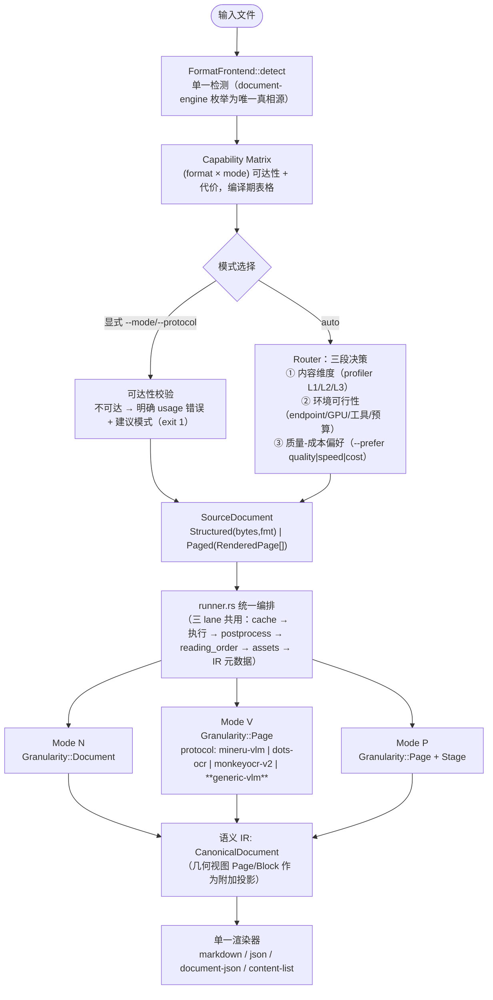

# uparser 三模式架构（native / pipeline / VLM）：现状设计说明与完善方案

配套文档：`CORE_ARCHITECTURE_REVIEW_AND_REFACTOR_PLAN.md`（模块级冗余与缺陷清单、R0–R5 阶段）。
本文从**三种解析模式**的视角，把链路按「前端多格式 → 文件路由 → 模式选择 → 执行 → 后处理 → 输出」
重新切一遍，先说明**现在的技术架构设计**（含实测验证），再给出完善方案。

本文所有“实测”均用仓库内已构建的 `uparser/target/release/uparser`
（`--features native,pdfium`，`uparser protocols` 报 7 个协议）执行得到。

---

# Part I · 现状技术架构设计

## 0. 分层总览


**当前实现与该分层的偏差（后面每节会给证据）**：

- ① 前端有 **两套格式检测 + 五条互不知情的接入通道**，(格式 × 模式) 的可达性从未被显式建模；
- ② 路由是**文档级、内容维度单一**的，不看“环境是否具备该模式所需资源”；
- ③ 三模式的**成熟度差三个数量级**（Mode V 有榜首实测、Mode N 有基准、Mode P 无真实服务）；
- ④ 共享后处理**只覆盖 Mode V/P**，Mode N 全部绕过；
- ⑤ 三条渲染路径规则各异。

---

## 1. ① 前端：多格式支持的现状

### 1.1 五条互不知情的接入通道

| 通道 | 实现 | 服务的模式 | 依赖 | 验证状态 |
|---|---|---|---|---|
| C1 原生结构化解析 | `document-engine/formats/{docx,doc,pptx,ppt,sheet,csv,odf,epub,rtf}` | **仅 Mode N** | 纯 Rust，零外部依赖 | 有单测 + 变异测试（617 行） |
| C2 结构化直读 | `ingest::structured_bypass`（calamine + csv） | 仅非 native 构建 | 纯 Rust | **生产构建下不可达**（cfg 掉） |
| C3 PDF 文本层提取 | `native-engine`（lopdf） | 仅 Mode N | 纯 Rust | benchmark 实测 0.8754 |
| C4 光栅化 | `ingest::rasterize`（pdfium，150dpi） | Mode V / Mode P | PDFium 二进制（feature 门） | 实测可用 |
| C5 外部转换 | `ingest::normalize_format`（soffice / magick） | Mode V / Mode P | LibreOffice / ImageMagick | **成功路径从未验证**（本机未安装）；magick 分支实际无调用者 |

### 1.2 格式 × 模式 可达性矩阵（**实测**）

`✅` 可用；`⚠` 依赖未验证的外部工具；`❌` 不可达且报错误导。

| 输入格式 | Mode N（native） | Mode V（VLM） | Mode P（pipeline） | 备注 |
|---|---|---|---|---|
| PDF（电子版） | ✅ C3 | ✅ C4 | ✅ C4 | 唯一三模式全通的格式 |
| PDF（扫描件） | ❌（无 OCR，输出空） | ✅ | ✅ | 设计取舍，已在基准报告写明 |
| PNG / JPEG | ❌（engine `formats::parse` 无该分支） | ✅（直接解码为一页） | ✅ | C5 的 magick 分支形同虚设 |
| DOCX / PPTX | ✅ C1 | ⚠ C5（LibreOffice） | ⚠ C5 | 两条完全不同的路，输出质量不可比 |
| DOC / PPT（OLE） | ✅ C1（cfb 探测） | ❌ | ❌ | `ingest::DocumentFormat` 无 Doc/Ppt 变体 |
| XLSX / XLS | ✅ C1 | ❌ | ❌ | 生产构建下 C2 被 cfg 掉 |
| CSV / TSV | ✅ C1 | ❌ | ❌ | C2 还缺 TSV |
| ODT / ODS / ODP | ✅ C1 | ❌ | ❌ | |
| EPUB / RTF | ✅ C1 | ❌ | ❌ | |

**❌ 格的真实表现（实测，不是推断）**：

```
$ uparser parse --protocol mineru-vlm --endpoint <dead> t.rtf   # 同 t.csv
exit=3
page_errors[0] = { "stage": "decode",
                   "message": "failed to decode rasterized page: The image format could not be determined" }
pages = []
```

即：**既没走能解析它的 native 引擎，也没告诉用户该换模式，还给了一个指向错误层（decode）的诊断。**
对照 `--protocol auto` 同一文件：`exit=0, protocol=native:rtf, pages=1` —— 能力是有的，只是显式模式选择时不可达。

> 修正一处此前 `CORE_ARCHITECTURE_REVIEW_AND_REFACTOR_PLAN.md` §3 D-01 的定级：
> 在 native 构建下这**不是**“静默产出错误结果（exit 0）”，而是“失败 + 误导性诊断 + 无降级建议”，
> 因为占位页的 `png_bytes` 是原始文件字节，adapter 侧解码即失败、请求不会发出。
> 定级由 P0 下调为 P1；`--pages` 污染缓存那条 P0 仍然成立（见 §1.4 实测）。

### 1.3 两套格式检测

| | `ingest::detect_format` | `document_engine::detect_format` |
|---|---|---|
| 变体数 | 8（Pdf/Docx/Pptx/Xlsx/Csv/Png/Jpeg/Unknown） | 16（+Doc/Ppt/Excel/Odt/Ods/Odp/Rtf/Epub/Tsv） |
| 识别手段 | `file-format` 魔数 + `.csv` 扩展名 | RTF 头 + OLE/cfb 探测 + OPC 根关系 + ODF mimetype + 魔数 + 扩展名兜底 |
| 谁在用 | 缓存键前的格式判断、`ingest_pages` 分发、profiler L1 | `auto` 路由的结构化格式判断、Mode N 内部分发 |

`cli.rs:383` 与 `cli.rs:1149` 对**同一份 bytes 检测两次**，`api.rs` 同样。
两者对 `.doc/.odt/.epub/.rtf` 的结论**必然不一致**（前者 Unknown、后者精确），这正是 §1.2 ❌ 格的直接成因。

### 1.4 前端与缓存的交互缺陷（P0，实测）

```
$ uparser parse --protocol mock --pages 999 t.bin   → pages: 0   （并写入缓存）
$ uparser parse --protocol mock            t.bin   → pages: 0   （命中缓存，应为 1）
```
缓存键只含 `sha256 + protocol + endpoint + model`，不含 `--pages / --no-postprocess / assets / pipeline 阶段配置`。

---

## 2. ② 路由：文件 → 模式

### 2.1 现状实现

```
auto 时：
  ① document_engine::detect_format
     └─ 命中 12 个结构化变体之一 → 直接选 Mode N（不经 profiler/router）
  ② 否则 ingest::detect_format → profiler
     ├─ L1：仅按格式给先验（pptx→Slide 0.6；xlsx/csv→Spreadsheet 0.9；其余 Unknown 0.1）
     └─ L2：native feature 且是 PDF 时，用 native-engine 的 pdf_type +
            pages_with_tables / pages_with_columns / pages_needing_ocr
  ③ router::route（文档级，按序匹配，末行无条件兜底）
```

`router.rs` 有效行只有 4 条：

| 条件 | 选择 | 评价 |
|---|---|---|
| `TextDominant` | native | ✅ 与实测一致（0.875 分、0.046 s） |
| `kind == Slide` | mineru-vlm | ✅ 合理 |
| `Resume && Mixed` | mineru-vlm | 合理但 L2 的 Resume 判据很弱（`page_count<=2 && 多栏`） |
| `TableDense` | **pipeline** | ⚠ 指向一个无真实服务、契约自拟的模式 |
| 兜底 | mineru-vlm | 合理 |

### 2.2 路由层的三个结构性问题

1. **不看环境可行性**：router 只看内容维度。选到 Mode V/P 后才在 `cli.rs:444` 用 `eprintln!` 提示
   “没有配置 endpoint，大概率连不上”——提示不参与决策，也不影响退出码。
2. **决策信息全丢**：`RouteDecision.reason` 与 `DocumentProfile` 只进 stderr，
   `ParseResult.document_profile` 全路径恒为 `null`（已 grep 验证无一处赋值）。
3. **清单双写 + 描述过期**：12 个结构化格式变体在 `cli.rs:1149` 与 `api.rs:238` 各硬编码一份；
   `router.rs:53` 仍写着 “`pipeline` adapter doesn't exist yet”。
4. **L3 缺失**：`ProfileLevel::L3`、`TableSubtype`、`ChartSubtype` 均已声明、无人产出，
   `has_chart_region` 在 L2 恒为 `false`（源码注释自承“L2 不声称能分辨图表”）。

---

## 3. ③ 三模式执行架构详解

### 3.1 Mode N · native（零模型）

```
输入 ──► document_engine::detect_format
          ├─ PDF        ──► native-engine（lopdf）
          │                  ├─ extract_text_with_positions_mem → 行聚类 + Y 翻转 → core Block IR（--format json）
          │                  └─ process_pdf_mem().markdown       → 引擎自带 Markdown（--format markdown）
          └─ 结构化 9 类 ──► document-engine → CanonicalDocument
                              ├─ render::markdown        （--format markdown）
                              ├─ render::document_json   （--format document-json）
                              └─ structured_to_parse_result → core Block IR（--format json，有损）
```

设计特征与代价：
- **整文档粒度**：不实现 `ProtocolAdapter::parse_page`（返回解释性 `PageError`），因此在
  `cli.rs:452` / `api.rs:213` 用专用分支**绕过 scheduler**；其在 `Registry` 中的注册项是不可用的假注册。
- 绕过 scheduler 的连带损失：**无缓存、无 postprocess（含 CJK 标点规范化）、`--pages/--window-size/
  --max-concurrency` 无效（CLI 会 warn）、无进度/stall 看门狗、warnings 不汇总**。
- **一个模式里两个引擎、两套 IR、两个渲染器**：PDF 走 lopdf + core IR；结构化走 document-engine + Canonical IR。
  `--format json` 对结构化输入是有损降级（list→text、几何全 0、Inline 样式丢弃，`native.rs:237-330` 注释自承）。
- 实测：Overall **0.8754**、**0.046 s/篇**、零 GPU；短板是表格 TEDS 0.814 与标题过检测（280 vs GT 193）。

### 3.2 Mode V · VLM（逐页、协议化）

```
RenderedPage ──► scheduler（窗口 64 / 共享 permits 16 / 逐页隔离 / 进度回调）
                  └─► ProtocolAdapter::parse_page
                        ├─ mineru-vlm    两阶段：layout → 逐块 crop → content（custom_token 语法）
                        ├─ dots-ocr      单轮：smart_resize → 一次调用（strict JSON）
                        ├─ monkeyocr-v2  两阶段（Python-literal 输出，手写递归下降解析）
                        └─ paddleocr     检测+识别（自拟 REST 契约）
                  └─► 共享算法：output_parse / otsl / formula_repair / category_map / geometry / imaging / robustness
```

设计特征与代价：
- 每个协议都是**对某个具体模型的原生 wire 契约的逆向实现**（prompt、resize 策略、输出语法、类别词表各不相同）。
  优点是保真；代价是**接一个新模型 = 写一个新 adapter（约 400–600 行）**。
- **通用 VLM 无入口**：用户提到的 Qwen3.8-27B 这类“通用对话/视觉模型直出 Markdown”的模式，
  在产品里**完全不存在**——它只活在 `benchmark/gen_qwen_omnidoc.py`（Python 脚本直连 chat-completions，
  用 OmniDocBench 官方通用 VLM 参考 prompt）。该脚本自己的注释就写明了原因：
  “Qwen3.8-27B 不是针对 uparser 任何协议语法训练的文档解析模型”。
  于是 OmniDocBench 全量 1651 页的实测结果（Text Edit 0.0481、Reading Order 0.1522、Table TEDS 0.7920）
  **无法通过 `uparser` 复现，也无法在生产里使用**。这是当前三模式设计里最大的一块缺口。
- 验证成熟度：mineru-vlm 真实端点端到端 + 榜首实测（0.9284）；dots-ocr / monkeyocr-v2 **仅离线 mock 验证**；
  paddleocr 契约自拟且无服务。
- robustness（退化重试）只接了 mineru-vlm / monkeyocr-v2 两个；reading-order 兜底只在 paddleocr/pipeline 内部自调。

### 3.3 Mode P · pipeline（多模型分阶段）

```
RenderedPage ──► layout（PP-DocLayoutV2，Remote 强制）
                  ├─► ocr（PaddleOCR-torch，Remote 强制）
                  ├─► formula（Unimernet，Remote 强制）
                  └─► table（SLANet+，Local via ort 默认 / Remote 可选）
                 └─► reading_order::assign_reading_order（自调）
```

设计特征与代价：
- `StageBackend{Local, Remote}` + `allows_local` 是**整个仓库唯一一处“按阶段决定算力放置”的设计**，思路正确：
  重模型外置、轻模型（已是 ONNX 的 table）可本机。
- 但落地状态是：**四个阶段的 REST 契约全部自拟、无任何真实服务对齐**（`pipeline_serving.rs` 123 行）；
  `onnx_table` 在本机 glibc 2.35 下**连链接都不通过**；参考部署（T-5.7）未做。
- 却仍是 `router` 对 `TableDense` 的**默认推荐**——一条会把用户导向不可用模式的路由行。

### 3.4 三模式能力矩阵（现状）

| 能力 | Mode N | Mode V | Mode P |
|---|:--:|:--:|:--:|
| 内容哈希缓存 | ❌ | ✅ | ✅ |
| postprocess 段落合并 + 标点规范化 | ❌ | ✅ | ✅ |
| reading-order 兜底 | 引擎内建 | ❌（除 paddleocr） | ✅（adapter 自调） |
| `--pages` / 窗口 / 并发预算 | ❌ | ✅ | ✅ |
| `--stream` NDJSON | ❌ | ✅ | ✅ |
| 进度 + stall 看门狗 | ❌ | ✅ | ✅ |
| warnings 汇总进 IR | 部分（结构化路径有） | ✅ | ✅ |
| 图片资产落盘 | ✅（两条路径各写一次） | ✅ | ✅ |
| `--format document-json` | 仅结构化输入 | ❌ | ❌ |
| 退化重试（robustness） | n/a | 2/4 协议 | ❌ |
| 需要 GPU / endpoint | 否 | 是 | 是（3 个阶段） |
| 真实验证等级 | 基准实测 | 1/4 真实端点 | **0** |

### 3.5 三模式质量/成本对照（实测汇总，用于路由决策）

| | Mode N | Mode V · mineru-vlm | Mode V · 通用 VLM（Qwen3.8-27B） | Mode P |
|---|---|---|---|---|
| Overall（opendataloader-bench，200 篇） | 0.8754 | **0.9284**（榜首） | 未接入，无法测 | 无 |
| Table | 0.814 | **0.944** | 0.792（OmniDocBench TEDS，异语料） | 无 |
| Reading order | 0.915 | **0.947** | 0.1522 edit↓（异语料） | 无 |
| 速度 | **0.046 s/篇** | 1.81 s/篇（GPU） | ~180s 超时 17/1651 页 | 无 |
| 扫描件 | ❌ | ✅ | ✅ | ✅（设计上） |
| 硬依赖 | 无 | vLLM + GPU | 任意 OpenAI 兼容 VLM | 3 个 Remote 服务 |

> 跨语料数字不可直接比较（Part A 与 Part B 是两套评测体系），此表只用于确定“模式偏好序”，不用于精确排名。

---

# Part II · 完善方案

## 4. 目标架构



## 5. 六个关键设计决策

### D1. 单一前端契约 + 显式可达性矩阵（解决 §1.2 / §1.3）

- `document_engine::DocumentFormat` 升为**唯一格式枚举**，`ingest::DocumentFormat` 改为其 re-export
  （保留 serde 兼容映射），检测只做一次。
- 新增编译期表：`fn reachability(format, mode) -> Reachability{Native, ViaConversion{tool}, Unsupported{suggest: Mode}}`。
- 不可达组合在**执行前**返回 `EXIT_USAGE` + 结构化错误，并给出建议：
  ```json
  {"error":{"code":"format_not_supported_by_mode","format":"rtf","mode":"vlm",
            "message":"rtf 无法光栅化为页面；native 模式可直接解析",
            "suggest":{"mode":"native","command":"uparser parse --protocol native x.rtf"}}}
  ```
  —— 取代现在那句指向错误层的 `failed to decode rasterized page`。
- `ViaConversion` 分支（DOCX/PPTX → LibreOffice → PDF）在工具缺失时报 `EXIT_DEPENDENCY` 并建议 Mode N；
  ImageMagick 分支若确认无调用者则删除（Mode V 本就直接解码图片）。

### D2. Mode 抽象与 runner 统一（解决 §3.1 / §3.4 的能力不齐）

- `ExecutionMode{Native, Vlm, Pipeline}` 为**面向用户的一级概念**，`--protocol` 降为模式内的实现选择：
  `--mode native|vlm|pipeline|auto` + `--protocol <impl>`；保留 `--protocol native` 等旧写法作别名，不破坏兼容。
- `ProtocolAdapter` 增 `granularity()`，`runner` 按粒度选执行策略；native 的假注册消除。
- 缓存、postprocess、reading-order 兜底、assets、进度、warnings 由 **runner 统一施加于三模式**，
  Mode N 因此获得缓存与标点规范化（当前 CJK 标点规范化只有 VLM 路径享受，是明显的不一致）。

### D3. 新增 `generic-vlm` 协议：把 Qwen 这类通用 VLM 产品化（本轮最大增量）

现状是“基准里能测、产品里不能用”。设计：

```
--mode vlm --protocol generic-vlm \
  --endpoint http://host:8094/v1/chat/completions --model <auto-discover> \
  [--prompt-preset omnidocbench|table-focused|minimal] [--prompt-file p.txt] \
  [--vlm-output markdown|blocks]
```

- **契约**：整页图片 → 单次 chat-completions → Markdown 文本。内置 OmniDocBench 官方通用 VLM
  参考 prompt 作为 `omnidocbench` preset（与 `benchmark/gen_qwen_omnidoc.py` 共用同一份文本，避免第二真相源）。
- **输出映射**：`--vlm-output markdown`（默认）→ 一页一个 `Block{category:"page_markdown", text}`，
  渲染时直通；`blocks` → 复用现有 `otsl`/`formula_repair`，按 Markdown 标题/列表/表格切块，
  使其能进入 postprocess 与统一渲染。
- **模型自发现**：请求前 `GET /v1/models` 取当前 id（`gen_qwen_omnidoc.py` 已验证的防御手段，
  起因是真实踩过的 `SO_REUSEPORT` 双模型同端口事故），`--model` 显式给定时跳过。
- **超时/并发**：该类端点单请求可达 180s（实测 17/1651 页超时），故 `generic-vlm` 的默认
  `timeout` 独立于其他协议（建议 300s）并纳入 `Transport` 的 C5 总时长上限。
- **收益**：接入任意 OpenAI 兼容 VLM（Qwen/GPT/Gemini 代理…）从“写 500 行 adapter”变成“换一个 preset”，
  且 OmniDocBench 的既有结论首次可在产品内复现。

### D4. 路由升级为三段决策（解决 §2.2）

```
① 内容维度：profiler L1/L2（现有）+ L3 可选（--profile-level l3，单次低成本模型调用）
② 环境可行性过滤：ModeRequirements{needs_endpoint, needs_gpu_hint, needs_tool, stage_endpoints}
   × 实际环境（endpoint 解析结果 + doctor 探测缓存 + 工具存在性）→ 剔除不可行模式
③ 偏好排序：--prefer quality|speed|cost（默认 quality），用 §3.5 的实测偏好序打分
```

修订后的路由表（含模式，而非只有协议名）：

| 内容判据 | 首选 | 环境不满足时降级 |
|---|---|---|
| 电子版、文本主导 | Mode N | — （零依赖，永远可行） |
| 结构化源格式（docx/xlsx/csv/odf/epub/rtf/doc/ppt…） | Mode N | — |
| 扫描件 / image-dense | Mode V · mineru-vlm | Mode V · generic-vlm → 报错（Mode N 无 OCR，不做假降级） |
| 表格密集 | Mode V · mineru-vlm（实测 TEDS 0.944） | Mode N（0.814）+ warning |
| 幻灯片 / 简历式多栏 | Mode V · mineru-vlm | Mode N + warning |
| 无法分类 | Mode V · mineru-vlm | Mode N + warning |
| 显式要求分阶段算力放置 | Mode P | 报错（禁止把 Mode P 作为自动兜底） |

关键改动：**`TableDense → pipeline` 这条行删掉**（指向未验证模式），改为 mineru-vlm，
Mode P 仅在用户显式选择时进入。同时 `DocumentProfile` + 决策 reason + 被剔除模式的原因写入 `ParseResult`。

### D5. IR 与渲染收敛（承接配套文档 R3）

- `CanonicalDocument` 为唯一**语义 IR**；`Page/Block` 保留为**几何投影**（VLM/pipeline 天然产出几何，Mode N-PDF 也有）。
- 新增 `blocks → CanonicalDocument` **上升**映射，取代现有有损的下降映射；Markdown 统一由
  `document-engine::render` 产出；`native-engine` 自带 markdown 保留为 `--markdown-source engine`
  （守住 0.8754 基准，切换默认前必须 benchmark 不回退）。
- `--format` 与模式的耦合关系写入 `uparser protocols` 输出（能力自省），不再靠试错。

### D6. 模式成熟度显式化（解决 §3.3 的“路由到不可用模式”）

- `uparser protocols` 每项增加 `validation: verified-live | offline-only | speculative-contract` 与
  `mode` 字段；`pipeline`/`paddleocr`/`onnx_table`/`pipeline_serving` 移入非默认
  `experimental-protocols` feature；默认构建下选中它们给出明确用法错误。

---

## 6. 合并后的实施路线（含配套文档 R0–R5）

| 阶段 | 内容 | 人日 | 依赖 | 关键验收 |
|---|---|---|---|---|
| **R0** | P0 止损：缓存键纳入 pages/no-postprocess/assets/stage 配置；`emit_line` 全覆盖；CLI 单 runtime | 1–2 | — | 实测复现的 `--pages 999` 污染场景转为通过测试 |
| **R1** | `runner.rs` 统一编排；删 `ingest_document` 死代码与 cli/api 三处重复；IR 元数据（profile/reason/timing/endpoint/model）落盘 | 3–5 | R0 | cli+api 合计 −250 行；`auto` 的 JSON 含非空 profile 与 reason |
| **R1.5（新）** | **前端统一**：单一 `DocumentFormat` + 单次检测 + `reachability()` 矩阵 + 不可达的结构化 usage 错误与模式建议；删除 magick 死分支 | 2–3 | R1 | §1.2 矩阵每个 ❌ 格都有一条断言其错误码/建议的测试；`.rtf/.doc/.csv + --mode vlm` 不再报 decode 错误 |
| **R2** | 模式抽象：`granularity()`；native 纳入统一后处理链（缓存/标点/进度/warnings）；能力声明存废（保留 spans+font_size 并实现信号增强层，删 MergeHint/CoordFrame::Crop/provides_reading_order） | 3–5 | R1 | native 二次 parse 命中缓存；native 输出 CJK 标点被规范化；benchmark 0.8754 不回退 |
| **R2.5（新）** | **`generic-vlm` 协议**：prompt preset（与 bench 共用文本）、模型自发现、独立超时、markdown/blocks 双输出 | 3–4 | R2 | 用 `uparser parse --mode vlm --protocol generic-vlm` 在 OmniDocBench 子集上复现 Qwen3.8-27B 基线（Text Edit ≈0.048，容差 ±0.005） |
| **R2.6（新）** | **路由三段决策**：环境可行性过滤 + `--prefer` + 修订路由表（删除 TableDense→pipeline）+ 决策落 IR | 2–3 | R1.5/R2.5 | 无 endpoint 环境下 `auto` 对扫描件给出明确不可行错误而非连接失败；对电子版仍选 Mode N |
| **R3** | 渲染与 IR 收敛（黄金测试 → 上升映射 → 默认渲染器切换 → 格式枚举合并） | 5–8 | R2 | 双基准（0.8754 / 0.9284）不回退；markdown 只剩一个默认渲染器 |
| **R4** | 推测性模块降级为 `experimental-protocols`；`validation`/`mode` 字段；`default_endpoint()` 上 trait | 1–2 | 可与 R2 并行 | 默认构建不含 ort/pipeline_serving |
| **R5** | 统一 `UparserError` + `Stage` 枚举；CI 特性矩阵（default / native / native,pdfium）；生产语义回归集 | 2–3 | R1/R2 | 三列全绿；魔法字符串 stage 归零 |

总计 **22–35 人日**（原 15–25 + 新增三阶段 7–10）。

## 7. 建议的执行顺序与理由

1. **R0 + R1.5 先做**：这两个阶段修的是“用户按文档正确使用却拿到错误/误导结果”的问题，
   与代码整洁无关，收益最直接（且 R1.5 的可达性矩阵会顺手把 §1.2 的一整片 ❌ 变成明确可操作的提示）。
2. **R2.5 优先于 R3**：`generic-vlm` 是**新增能力**（当前产品完全缺失，且已有 1651 页实测数据等着被复现），
   而 R3 是**存量收敛**（高风险、需守两个基准分数）。先补能力，再收敛表达。
3. **R2.6 紧跟 R2.5**：新增一个模式实现后，路由若不同时升级，`auto` 无法把它用起来。
4. **Mode P 不投入新工作**，只做 R4 的降级：在没有真实服务可对齐前，`pipeline` 的每一行新代码都是猜测性维护面。

## 8. 明确不做

- 不为 Mode P 补契约细节或参考部署（先降级，待有真实 PaddleX/自建 serving 再评估）。
- 不做页级/区域级混合路由（文档级路由的元数据尚未打通，见 D4 ①）。
- 不合并 `Block/Page` 与 `CanonicalDocument` 的**存储表示**（只做上升映射 + 单渲染器，成本/收益更优）。
- 不为通用 VLM 继续做 prompt 调优（`QWEN_PROMPT_IMPROVEMENT_PLAN.md` 已在全量 1651 页上两次验证为负）。
