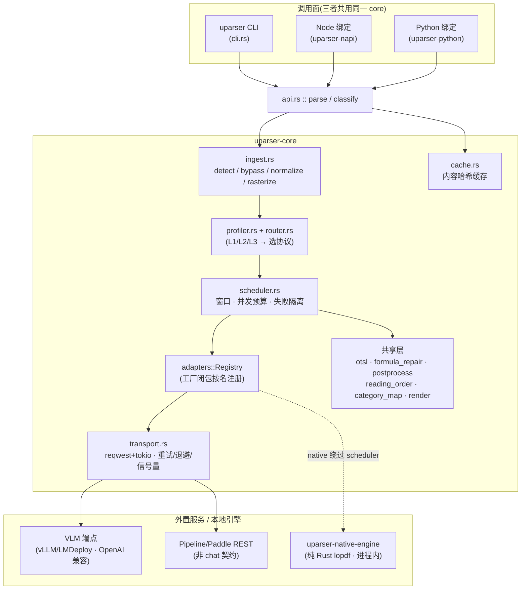
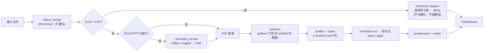
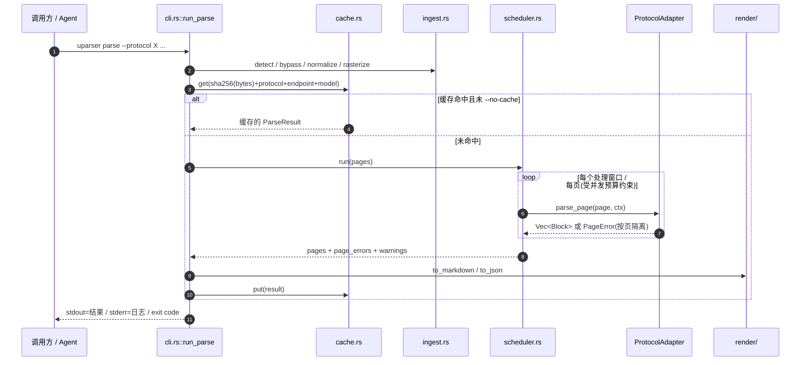
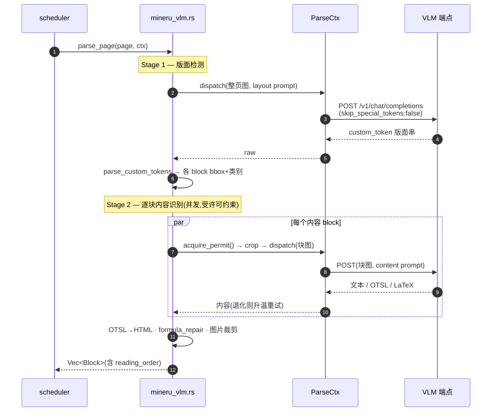
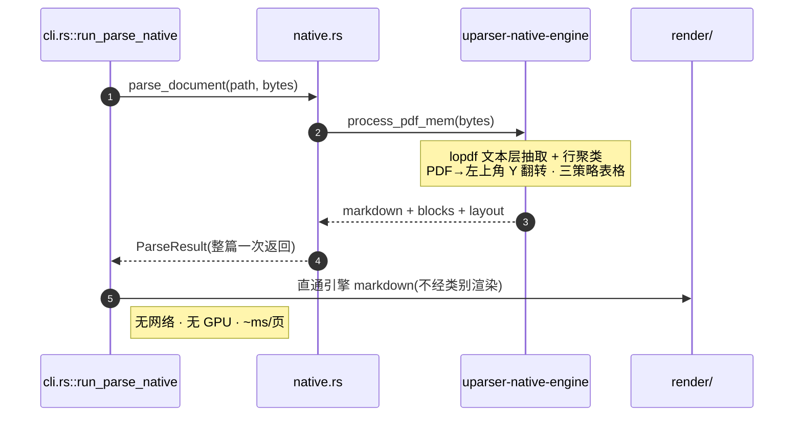
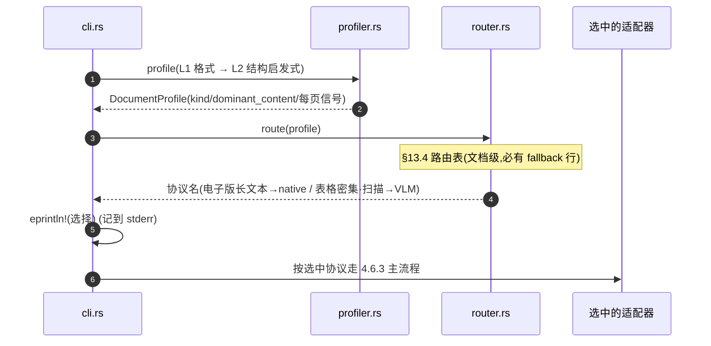

# uparser 全面文档：使用指南 · 技术架构 · 评测依据 · Skill 使用

> 面向对象:开发者与编码 Agent(Claude Code / Codex / OpenCode)。
> 本文档汇总 `uparser` 的使用方法、技术架构、基准评测依据,以及作为 Claude Code Skill 的调用方式。
> 权威参考:`ARCHITECTURE.md`(设计)、`DEVELOPMENT_PLAN.md`(分期任务)、`BENCHMARK_REPORT.md`(实测)、`skills/uparser/`(Skill)。
> 更新日期:2026-08-05

---

## 目录

1. [项目定位](#1-项目定位)
2. [快速开始](#2-快速开始)
3. [使用文档(CLI)](#3-使用文档cli)
4. [技术架构](#4-技术架构)
5. [六大解析协议详解](#5-六大解析协议详解)
6. [评测依据(opendataloader-bench)](#6-评测依据opendataloader-bench)
7. [Skill 使用](#7-skill-使用)
8. [常见问题与故障排查](#8-常见问题与故障排查)

---

## 1. 项目定位

`uparser` 是一个**统一文档解析 CLI**(Rust 实现),把文档转成干净的 **Markdown** 或结构化 **JSON 中间表示(IR)**——包含带边界框(bbox)、类别、表格、公式、阅读顺序的 block。它专为编码 Agent 作为**子进程**驱动而设计:

- **stdout = 结果**(Markdown 或 JSON)
- **stderr = 日志/进度/告警**
- **exit code = 语义化**(可直接分支判断)

它诞生于研究工作区 `uparserstudio`——该仓库在 `opensource/` 下并置了一组开源文档解析项目(MinerU、dots.ocr、MonkeyOCRv2、liteparse、pdf-inspector 等)用于对比研究,`uparser` 则把其中的优秀思路抽取、统一成一个产品。

**核心设计理念:**

- **Rust core + 语言绑定**:核心为 `uparser-core` crate,Node(napi-rs)/Python(PyO3)仅为绑定层,不是实现语言(仿照 `opensource/liteparse` 的模式)。
- **模型推理一律外置**:除极少数轻量本地模型外,所有模型推理都通过外部服务(vLLM/LMDeploy 的 OpenAI 兼容端点,或轻量 REST 契约),**从不在进程内跑重模型**——这样才不会拖垮 Agent 所在的客户端机器。
- **协议可插拔**:通过 `ProtocolAdapter` trait 支持六种解析协议(见 §5)。

---

## 2. 快速开始

### 2.1 获取二进制

若 `uparser` 不在 PATH,从仓库的 `uparser/` 工作区构建:

```bash
cd uparser

# 仅 native(纯 Rust,无 GPU,无需下载 PDFium):
cargo build --release --features native

# 加上 pdfium(VLM/OCR 协议光栅化页面所需):
cargo build --release --features native,pdfium
```

二进制产物在 `uparser/target/release/uparser`。
辅助脚本 `skills/uparser/scripts/find_uparser.sh` 会定位或构建它并打印路径:

```bash
skills/uparser/scripts/find_uparser.sh --build --features "native,pdfium"
```

### 2.2 三条最常用命令

```bash
# ① 电子版 PDF → Markdown(快、本地、无 GPU):
uparser parse --protocol native --format markdown report.pdf > report.md

# ② 最高质量的视觉模型解析(需要 vLLM 端点):
uparser parse --protocol mineru-vlm \
  --endpoint http://127.0.0.1:19122/v1/chat/completions \
  --model MinerU2.5-2604-1.2B \
  --format markdown scan.pdf > scan.md

# ③ 让 uparser 自动选引擎:
uparser parse --protocol auto --format markdown mystery.pdf > out.md
```

---

## 3. 使用文档(CLI)

### 3.1 子命令总览

| 子命令 | 作用 |
|---|---|
| `parse <path>` | 解析文档为 Markdown/JSON(主命令) |
| `classify <path>` | 只跑 Profiler,输出 `DocumentProfile`(不调模型,便于决策/估算成本) |
| `doctor <protocol> [--endpoint]` | 健康检查:探测端点可达性;`pipeline` 额外报告本地 CPU/内存 |
| `protocols` | 以 JSON 列出每个内置协议的能力(坐标系、是否有阅读顺序信号、各阶段资源提示) |
| `cache stat` / `cache clear` | 内容哈希缓存的查看/清理 |

### 3.2 `parse` 关键参数

| 参数 | 说明 | 默认 |
|---|---|---|
| `--protocol <name>` | `native` / `mineru-vlm` / `dots-ocr` / `monkeyocr-v2` / `pipeline` / `paddleocr` / `auto` / `mock` | `mock` |
| `--format <markdown\|json>` | 输出格式 | `json` |
| `--endpoint <url>` | 覆盖适配器默认端点(VLM/OCR 协议用;`native`/`mock` 忽略) | — |
| `--model <name>` | 覆盖默认模型名 | — |
| `--pages <range>` | 只解析指定页,1 起始,如 `1-5`、`3`、`1,5,10-12` | 全部 |
| `--max-concurrency <N>` | 全文档共享的并发模型请求数(页级+块级共用一个预算) | 16 |
| `--window-size <N>` | 每个处理窗口一起光栅化/处理的页数(限制峰值内存 ~O(window)) | 64 |
| `--no-cache` | 跳过内容哈希缓存,强制重新解析 | 关 |
| `--stream` | 增量输出 NDJSON,每个处理窗口一行(大文档用) | 关 |
| `--no-postprocess` | 跳过 `merge_paragraphs_by_geometry`,返回各适配器原始未合并 block(调试用) | 关 |
| `--assets-dir <dir>` | 图片/图表 block 裁剪图的写入目录 | `<源文件名>_images/` |
| `--no-assets` | 完全不写图片资产(不产生 `` 链接,无文件系统副作用) | 关 |
| `pipeline` 专属 | `--layout-backend/-endpoint`、`--ocr-backend/-endpoint`、`--formula-backend/-endpoint`、`--table-backend/--table-model-path` | 见 §5.5 |

### 3.3 输出契约(Agent 必读)

- **stdout** 只承载结果:Markdown(`--format markdown`)或 JSON `ParseResult`(`--format json`,默认)。请重定向到文件或捕获。
- **stderr** 承载日志、进度、告警。**切勿把 stdout+stderr 混在一起解析。**
- **exit code 语义化**——直接分支:

| Code | 含义 | Agent 应对 |
|---|---|---|
| 0 | 成功 | 使用结果 |
| 1 | 用法错误(参数/flag 有误) | 修正命令 |
| 2 | 依赖/环境错误(如 LibreOffice 缺失、端点不可达) | 装/修环境后重试 |
| 3 | 部分成功(部分页失败) | 结果可用,检查 JSON 里 `page_errors` |
| 4 | 内部错误 | 上报;可 `--no-cache` 重试 |

- `--format json` 出错时是结构化对象:`{"error":{"code":...,"message":...,"protocol":...,"stage":...}}`。

### 3.4 JSON `ParseResult` 结构

```jsonc
{
  "source_path": "...", "source_sha256": "...", "protocol": "native",
  "document_profile": { ... },            // --protocol auto / classify 时存在
  "pages": [
    { "page_num": 1, "width_px": 1275, "height_px": 1651,
      "blocks": [
        { "category": "title", "category_raw": "title",
          "bbox_px": [x0,y0,x1,y1], "reading_order": 0,
          "text": "…", "html": null, "latex": null,
          "asset_path": "doc_images/<hash>.png",  // 图片/图表 block
          "spans": [ ... ] }
      ] }
  ],
  "page_errors": [ { "page_num": 3, "message": "...", "stage": "content" } ],
  "warnings": [ "..." ]
}
```

类别已归一化:`title` / `text` / `list` / `table` / `figure`(`image`)/ `formula` / `header` / `footer` / `page_number` 等。
Markdown 渲染映射:`title → "# "`、`list → "- "`、表格 → HTML、公式 → `$$…$$`、图片 → ``。

### 3.5 常用配方

```bash
# RAG 用的 JSON IR(带 bbox/类别的 block):
uparser parse --protocol native --format json paper.pdf > paper.json

# 大文档只取部分页:
uparser parse --protocol mineru-vlm --endpoint <url> --model <m> --pages 1-3,7 big.pdf

# 先分类(不调模型)决定路由/成本:
uparser classify paper.pdf

# 大批量前先确认端点可达:
uparser doctor mineru-vlm --endpoint http://127.0.0.1:19122/v1/chat/completions

# 强制新解析(跳过缓存):
uparser parse --protocol native --no-cache doc.pdf

# 大文档流式 NDJSON(每窗口一行):
uparser parse --protocol mineru-vlm --endpoint <url> --model <m> --stream huge.pdf
```

### 3.6 多格式接入

`uparser` 接受 PDF、DOCX、PPTX、XLSX、CSV 和图片:

- **PDF**:直通。
- **DOCX/PPTX/图片**:先经 **LibreOffice**(`soffice`)/ **ImageMagick**(`magick`)转 PDF——这些输入需安装对应工具,缺失则 exit code 2。
- **XLSX/CSV**:直接按结构化数据读取单元格(**不光栅化、不调模型**),走 `structured_bypass` 快路径。

控制流固定顺序:`detect_format → structured_bypass? → normalize_format → rasterize → profiler → router → parse`(ARCHITECTURE.md §13.1a)。

---

## 4. 技术架构

### 4.1 总体形态

```
uparser/                              Rust workspace(与 opensource/ 同级)
└── crates/
    ├── uparser-core/                 核心库 + `uparser` CLI 二进制
    ├── uparser-napi/                 Node.js 绑定(napi-rs)
    ├── uparser-python/               Python 绑定(PyO3)
    └── uparser-native-engine/        内部化的纯 Rust 解析引擎(源自 pdf-inspector)
```

三种调用面(CLI / Node / Python)都调用 `uparser_core::api` 的同两个函数 `parse` / `classify`,IR 序列化由**同一份 `Serialize` 实现**保证一致性。

### 4.2 核心模块(`uparser-core/src/`)

| 模块 | 职责 |
|---|---|
| `types.rs` | 统一 IR:`Block` / `Page` / `ParseResult` / `Geometry`(rect vs polygon)/ `CoordFrame` / `DocumentProfile` |
| `adapters/mod.rs` | `ProtocolAdapter` trait(`#[async_trait]`)+ `Registry`(工厂闭包,按名注册)+ `ParseCtx`(dispatch 真实/Mock 传输) |
| `adapters/*.rs` | 六个协议适配器 + `mock`(见 §5) |
| `transport.rs` | reqwest+tokio 的 OpenAI 兼容客户端;重试/退避/信号量并发;`dispatch_rest`(非 chat 的 REST 契约) |
| `scheduler.rs` | 文档级调度:处理窗口、跨页共享并发预算、按页失败隔离、`run_streaming`(流式)、`run_with_progress`(进度回调) |
| `cache.rs` | 内容哈希缓存:`sha256(bytes)+protocol+endpoint+model` 作 key,TTL 默认 24h |
| `ingest.rs` | `detect_format` / `structured_bypass` / `normalize_format` / `rasterize`(pdfium 门控) |
| `imaging.rs` / `geometry.rs` | 各协议的图像缩放/裁剪/旋转 + bbox 反归一化/去重/裁剪 |
| `output_parse.rs` | 各协议原始输出解析(custom-token 文法 / strict-JSON / Python 字面量解析) |
| `otsl.rs` | OTSL token 序列 → HTML 表格(rowspan/colspan);**三协议共享,自 P1 未改** |
| `formula_repair.rs` | LaTeX 修复链(括号平衡/去重/环境重建)+ `wrap_display_math`;**共享** |
| `postprocess.rs` | 纯几何段落合并;`content_normalize.rs` 提供 CJK 标点规范化 |
| `reading_order.rs` | 递归 XY-cut 几何阅读顺序回退(`paddleocr`/`pipeline` 用) |
| `category_map.rs` | 各协议原生类别 → 归一化类别(带大小写/分隔符不敏感的 `normalize_key`) |
| `profiler.rs` / `router.rs` | L1/L2/L3 内容预分析 + 文档级路由表 |
| `render/mod.rs` | Markdown / JSON / content-list 渲染 |
| `cli.rs` / `api.rs` | Agent-first CLI 契约 / 库级 `parse`·`classify` |

### 4.3 ProtocolAdapter 契约(v0.9 重构)

关键设计:适配器围绕单个 `async fn parse_page(page, ctx)` 构建(`#[async_trait]` 保证 `dyn` 安全)。

- 旧的 `build_requests → dispatch → parse` 线性三段式**无法表达两阶段协议**(mineru-vlm / monkeyocr-v2,其 stage-2 请求依赖 stage-1 解析出的版面)——故适配器通过 `ParseCtx` 自行驱动内部多轮编排。
- `native` 是例外:它整篇一次性解析,`parse_page` 返回解释性 `PageError`,真正入口是 `parse_document()`(CLI 里 `run_parse_native` 直接分派,绕过 scheduler)。

### 4.4 共享层(协议无关,只有一份实现)

`otsl.rs`、`formula_repair.rs`、`postprocess.rs`、`render/` 被多个协议**逐字复用**——这是本项目 Gate G2/G3 反复验证的核心成果:证明这些层真正协议无关。适配器只对 `geometry`/`category_map`/`imaging`/`output_parse` 做**纯增量**的协议特定函数。

### 4.5 调度与并发(踩过的坑)

一个真实的生产级死锁曾在此出现并修复:`scheduler` 曾为整个 `parse_page` 持有页级信号量许可,而两阶段协议内部又对每个块申请同一信号量——并发页一多就互相等待、全体饿死。修复:**去掉页级许可**,只在**每个网络请求**处申请许可(正确的节流粒度)。这类"设计正确但从未接入真实调用路径"的缺陷是本项目反复出现并逐个修复的一类问题。

### 4.6 架构流程图与时序图

> 以下为 Mermaid 图,GitHub / 支持 Mermaid 的 Markdown 渲染器可直接显示。

#### 4.6.1 分层架构图(三调用面 → 统一 core → 外置服务)



#### 4.6.2 控制流(固定顺序,ARCHITECTURE.md §13.1a)



#### 4.6.3 时序图:CLI `parse` 总流程(带缓存)



#### 4.6.4 时序图:`mineru-vlm` 两阶段(layout → 逐块识别)



#### 4.6.5 时序图:`native` 整篇解析(绕过 scheduler)



#### 4.6.6 时序图:`--protocol auto`(Profiler → Router → Parse)



---

## 5. 六大解析协议详解

运行 `uparser protocols` 可得机器可读的能力矩阵。

| 协议 | 模型? | 需端点 | OCR/扫描件 | 强项 | 成本 |
|---|---|---|---|---|---|
| `native` | 无 | 否 | 否 | 最快、电子版文本/标题/表格 | ~ms/页 |
| `mineru-vlm` | VLM(MinerU2.5) | 是(OpenAI 兼容) | 是 | 阅读顺序+表格最佳 | ~1–2 s/页 |
| `dots-ocr` | VLM | 是 | 是 | 单轮 OCR VLM | ~1–2 s/页 |
| `monkeyocr-v2` | VLM | 是 | 是 | 两阶段 layout→recognize | ~1–2 s/页 |
| `pipeline` | 多模型(layout/ocr/formula/table) | 多为是 | 是 | 经典模块化流水线 | 视配置 |
| `paddleocr` | OCR | 是 | 是 | detect+recognize + 几何阅读顺序 | 视配置 |
| `auto` | — | 视路由 | — | 由 profile 自动选协议 | — |
| `mock` | 无 | 否 | 否 | 仅冒烟测试(非真实输出) | 极小 |

### 5.1 `native` — 零模型文本层

纯 Rust 引擎(内部化自 `opensource/pdf-inspector`,基于 lopdf,**无 PDFium、无 OCR**)。提取 PDF 文本层并渲染完整 Markdown(标题、段落、三策略表格)。整篇解析,绕过网络 scheduler。

- 构建:`--features native`(无需下载 PDFium)。
- 最适合:电子版 PDF、追求速度、离线/无 GPU。
- 局限:扫描/纯图页产出很少/为空(无 OCR)——这类应路由到 VLM。

### 5.2 `mineru-vlm`(质量首选,已实测)

两阶段:版面检测 → 逐块内容识别,针对 OpenAI 兼容端点上的 MinerU2.5 视觉模型。输出 OTSL→HTML 表格、LaTeX 公式,并裁剪图片区域。

```bash
uparser parse --protocol mineru-vlm \
  --endpoint http://HOST:PORT/v1/chat/completions \
  --model MinerU2.5-2604-1.2B \
  --format markdown --max-concurrency 16 doc.pdf
```

- 需要 `pdfium` 特性(页面光栅化):构建 `--features native,pdfium`。
- 已针对真实 `MinerU2.5-2604-1.2B` vLLM 端点端到端验证(7 页/107 页真实 PDF)。
- 关键修正:请求体须显式 `skip_special_tokens: false`,否则 vLLM 会吃掉 `custom_token` 文法依赖的 `<|box_start|>` 等特殊 token。

### 5.3 `dots-ocr` / `monkeyocr-v2`

与 `mineru-vlm` 同样的调用形态(`--endpoint`/`--model`),不同模型契约。`dots-ocr` 单轮;`monkeyocr-v2` 两阶段(其原始输出是 Python 字面量列表,用手写递归下降解析器处理,绝不 `eval`)。均离线验证,尚无各自的真实端点验证。

### 5.4 `pipeline` — 传统多模型流水线

四阶段 layout→ocr→formula→table,每阶段独立声明后端:

- `Local`(进程内轻量 ONNX,经 `ort` crate,需 `pipeline-local-table` 特性)——默认仅 `table` 阶段用。
- `Remote`(轻量 "Pipeline Model Serving" REST 端点)——`layout`/`ocr`/`formula` 默认远程(其原始权重是 torch,ONNX 可移植性未定)。

`layout`/`ocr`/`formula` 没有 Local 实现,给它们传 `local` 是用法错误(exit 1)。

### 5.5 `paddleocr`

detect+recognize OCR + 从零实现的 XY-cut 几何阅读顺序回退。单一固定 `text` 类别。需 PaddleOCR 风格 REST 端点(`--endpoint`)。

### 5.6 `auto` — Profiler + Router

先跑 Profiler(L1 格式 + L2 结构启发式,不调模型),再由 Router 按 §13.4 路由表选协议,把选择记到 stderr,然后解析。不确定文档类型时用。可先用 `uparser classify <file>` 查看决策(输出 `DocumentProfile`:`kind`、`dominant_content`、每页 `has_table_region`/`needs_ocr` 等)。

### 5.7 端点与服务

VLM 协议对接 **OpenAI 兼容的 `/v1/chat/completions`** 端点(vLLM/LMDeploy)。例:用 vLLM 服务 `MinerU2.5-Pro-2604-1.2B`,再 `--endpoint http://127.0.0.1:PORT/v1/chat/completions --model MinerU2.5-2604-1.2B`。大批量前用 `uparser doctor` 验证可达性。`pipeline`/`paddleocr` 用各自轻量(非 chat)REST 契约。

---

## 6. 评测依据(opendataloader-bench)

> 完整报告见 `BENCHMARK_REPORT.md`。语料:`opensource/opendataloader-bench/pdfs`,200 篇单页真实 PDF,同一 harness/evaluator。
> 指标:Reading Order = NID、Table = TEDS、Heading = MHS,**Overall = 三者等权均值**;Speed = s/篇(越低越好)。

### 6.1 结果速览

| 引擎 | Overall | Reading Order | Table | Heading | 速度 s/篇 | 依赖 |
|---|---|---|---|---|---|---|
| **uparser · mineru-vlm** | **0.9284** 🥇 | **0.9470** 🥇 | **0.9439** 🥇 | **0.8777** 🥇 | 1.81(GPU) | vLLM(MinerU2.5) |
| opendataloader-hybrid(榜首参照) | 0.907 | 0.934 | 0.928 | 0.821 | 0.463 | 布局模型 |
| docling(参照) | 0.882 | 0.898 | 0.887 | 0.824 | 0.762 | 模型 |
| **uparser · native** | 0.8754 | 0.9150 | 0.8141 | 0.7875 | **0.046** | **零模型/纯 Rust** |
| pdf-inspector(baseline) | 0.8754 | 0.9150 | 0.8141 | 0.7875 | 0.032 | 纯 Rust |
| mineru(榜单参照) | 0.831 | 0.857 | 0.873 | 0.743 | 5.962 | 模型 |
| edgeparse(参照) | 0.837 | 0.894 | 0.717 | 0.706 | 0.036 | 纯 Rust |
| **liteparse(榜单)** | 0.576 | 0.866 | 0.000 | 0.000 | 1.061 | PDFium+OCR |

### 6.2 三条主结论

1. **mineru-vlm 集成拿下全场第一**(Overall 0.928 > 榜首 hybrid 0.907),且阅读顺序/表格/标题**三项全部第一**。表格保真度 0.944 甚至显著超过榜单里 MinerU 自己的 0.873——说明 uparser 对 MinerU2.5 的编排 / OTSL→HTML 转换质量很高。
2. **native(纯 Rust、零模型)在无 GPU、~23× 速度优势下拿到 0.875**,精度与速度两个维度**全面碾压 liteparse**(0.875 vs 0.576;0.046 vs 1.061 s/篇)——达成"native 全面超过 liteparse"的既定目标。
3. **本次评测暴露并修复了一个关键渲染缺陷**:`render::to_markdown` 曾直接输出 `block.text` 而忽略 `block.category`,导致 mineru-vlm 正确分类的 `title`/`list` 全退化成普通段落,MHS 被清零(仅 1/200 篇有 `#`)。修复(`title→"# "`、`list→"- "`)后 mineru-vlm 的 Overall 从 **0.708 跃升到 0.928**——**+0.22 完全来自渲染层,而非模型**,且是通用正确性修复(所有 VLM 协议受益),非针对 GT 调参。

### 6.3 可复现方法

- 接入:新增 `pdf_parser_uparser_native.py`、`pdf_parser_uparser_mineru_vlm.py`、`pdf_parser_pdf_inspector.py`,注册进 `engine_registry.py`。
- 运行:`python src/run.py --engine <name> --force` → `prediction/<name>/evaluation.json`。
- 二进制:`cargo build --release --features native,pdfium`。
- 局限:native 无 OCR,扫描件输出为空(设计取舍,交由 VLM 路由);mineru-vlm 分数依赖具体 checkpoint 与 endpoint;榜单参照值取自 bench README 已公布结果。

### 6.4 选型建议

| 场景 | 推荐 | 理由 |
|---|---|---|
| 电子版 PDF、无 GPU、要快 | **native** | 0.046 s/篇、零依赖、0.875 分,碾压 liteparse |
| 追求最高质量、有 GPU | **mineru-vlm** | 0.928 全场第一,表格/阅读顺序最佳 |
| 扫描件 | **mineru-vlm** | native 无 OCR(扫描件会空);VLM 直接识别 |
| 不确定文档类型 | **auto / 先 classify** | profiler 路由:电子版长文本→native,表格密集/扫描→VLM |

---

## 7. Skill 使用

`uparser` 已封装为 Claude Code Skill,位于 `skills/uparser/`:

```
skills/uparser/
├── SKILL.md                     技能说明(触发条件、快速上手、输出契约、配方)
├── references/
│   ├── protocols.md             协议参考(能力矩阵、端点配置、JSON 结构)
│   └── config.example.toml      端点配置模板(→ ~/.config/uparser/config.toml)
└── scripts/
    ├── ensure_uparser.sh/.ps1   确保二进制就位:PATH→缓存→下载 Release→源码构建
    ├── uparser-run.sh/.ps1      配置化包装器:自动下载 + 注入 --endpoint/--model
    ├── find_uparser.sh          定位/构建 uparser 二进制并打印路径
    └── build-windows.ps1        Windows 源码构建(需 rustup + MSVC)
```

### 7.0 安装(只需装 skill,二进制自动下载)

```bash
# 全局(任意目录可用)
cp -r skills/uparser ~/.claude/skills/uparser
# 或项目级(仅该仓库内可用)
cp -r skills/uparser <项目>/.claude/skills/uparser
```

**无需手动准备二进制**:首次调用时 `ensure_uparser.sh` 按如下顺序解析出 `uparser` 并缓存到 `~/.cache/uparser/bin/`:

1. `uparser` 已在 PATH → 直接用;
2. 缓存已有 → 复用;
3. 否则从 GitHub Release 下载版本固定的预编译包(`v0.1.0`,Linux x86_64;直连优先→`ghfast.top` 镜像兜底),校验 `SHA256SUMS` + 冒烟测试;
4. 平台不支持(非 x86_64 / glibc<2.35 / Windows 无 exe)→ 回退源码构建。

覆盖变量:`UPARSER_VERSION`(版本)/ `UPARSER_REPO`(仓库)/ `UPARSER_HOME`(缓存根)。

验证安装:

```bash
# 直接下载/定位二进制并打印路径
~/.claude/skills/uparser/scripts/ensure_uparser.sh
# 或经配置化包装器跑一次(会自动确保二进制就位)
~/.claude/skills/uparser/scripts/uparser-run.sh parse --protocol native --format markdown some.pdf | head
```

在 Claude Code 里输入 `/uparser` 能补全,即表示 skill 已被发现。

> 说明:Claude Code 只从 `~/.claude/skills/<name>/`(用户级)或 `<项目>/.claude/skills/<name>/`(项目级)发现 skill。仓库里的 `skills/uparser/` 需先拷到上述位置才会生效。

### 7.1 触发时机

当用户想做以下任一事时,应使用该 Skill(**即使没点名 "uparser"**):

- 从 PDF / Office / 图片文档提取文本、表格、公式、阅读顺序、图片;
- 把文档转成 Markdown;
- OCR / VLM 解析扫描件;
- 解析前先分类文档类型/版面;
- 把文档内容喂进 RAG / LLM 流水线;
- 在"快速本地文本解析" vs "高精度视觉模型解析"之间选择;
- 上次解析给出乱码/空输出、需要换引擎重试。

### 7.2 如何调用

在 Claude Code 中,Skill 会在匹配到上述意图时自动被考虑;也可由用户显式 `/uparser` 触发。Skill 内部的工作流:

1. 用 `scripts/ensure_uparser.sh`(或直接经 `uparser-run.sh`)确保二进制就位——首次会自动下载/构建并缓存;
2. 按 §5 的选型表选 `--protocol`(不确定就先 `uparser classify` 或用 `--protocol auto`);
3. 若已配置 `~/.config/uparser/config.toml`,用 `scripts/uparser-run.sh parse ...` 让端点/模型自动注入;否则直接 `uparser parse ... --endpoint <url>`;
4. 以子进程运行,**stdout 取结果、stderr 取日志、按 exit code 分支**;
5. 需要更深的协议/端点细节时读 `references/protocols.md`。

### 7.3 Skill 里的关键约定(供 Agent 遵循)

- 默认走 `native` 作为快路径;质量/表格/扫描件才上 `mineru-vlm`(需端点)。
- 图片默认裁剪写到 `<源文件名>_images/` 并在 Markdown 里用 `` 引用;不想要文件系统副作用就 `--no-assets`。
- 大文档用 `--stream` 增量 NDJSON;只验证某几页用 `--pages`。
- 强端点可把 `--max-concurrency` 提到 32–100;脆弱/共享端点则调低。

---

## 8. 常见问题与故障排查

| 症状 | 可能原因 | 处理 |
|---|---|---|
| 输出为空 / 乱码 | 用 `native` 解析扫描件(无 OCR) | 换 `mineru-vlm` 或其他 VLM 协议 |
| exit code 2 | LibreOffice/ImageMagick 未装,或端点不可达 | 装工具;或 `uparser doctor <protocol> --endpoint <url>` 排查 |
| exit code 3 | 部分页失败 | 结果仍可用,检查 JSON 的 `page_errors` |
| VLM 请求疑似丢特殊 token | vLLM 默认 `skip_special_tokens: true` | mineru-vlm 已内置 `skip_special_tokens: false`,升级到当前版本 |
| 首次 `--features pdfium` 构建慢 | 构建脚本从 GitHub 下载 PDFium 预编译包 | 给足时间(约 2 分钟);或预填 `~/.cache/pdfium-rs` |
| `pipeline` 传 `--layout-backend local` 报错 | `layout`/`ocr`/`formula` 无 Local 实现 | 只 `table` 阶段支持 `local`;其余用 `remote` |
| 想强制重新解析 | 命中了内容哈希缓存 | 加 `--no-cache` |
| Markdown 里标题没有 `#` | 旧版渲染器忽略 `category`(已修复) | 升级到含渲染修复的版本(见 §6.2) |

### 构建 / 测试 / lint(在 `uparser/` 下)

```bash
cargo build --workspace
cargo test --workspace
cargo clippy --workspace --all-targets -- -D warnings
cargo fmt --all -- --check
```

默认全绿、无需额外 flag 或网络。`pdfium` / `native` / `pipeline-local-table` 均为**非默认**特性,按需开启。

---

*本文档为汇总性说明。设计细节以 `ARCHITECTURE.md` 为准,任务分期以 `DEVELOPMENT_PLAN.md` 为准,实测数据以 `BENCHMARK_REPORT.md` 为准,Skill 行为以 `skills/uparser/SKILL.md` 为准。*
