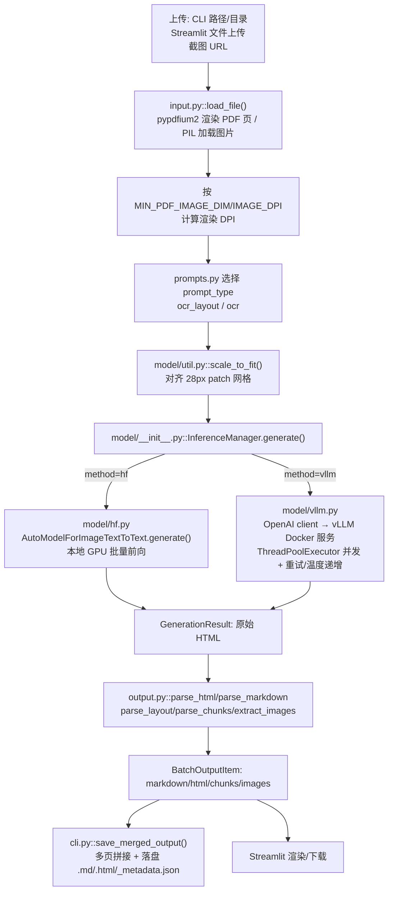

# Chandra 架构深度解读报告

> 项目路径：`opensource/chandra`　|　上游：`datalab-to/chandra`

## 1. 项目概述

Chandra 是 Datalab 开源的文档智能 OCR 工具，核心是一个 Qwen2-VL 系视觉语言模型（默认 checkpoint `datalab-to/chandra-ocr-2`），采用"**图像 → 带 `data-bbox`/`data-label` 属性的 HTML**"的输出范式，而非直接输出 JSON。模型可本地通过 HuggingFace `transformers` 推理，也可作为客户端连接一个通过 Docker 启动的 vLLM OpenAI 兼容服务。仓库本身**不包含 FastAPI/Flask REST 服务**，对外的"服务"边界就是 vLLM 的 OpenAI 兼容 HTTP 接口；应用层提供的是 CLI、Python API 和一个 Streamlit demo。

## 2. 模块结构

| 路径 | 职责 |
|---|---|
| `chandra/settings.py` | pydantic-settings 全局配置：DPI、模型 checkpoint、vLLM 连接信息等 |
| `chandra/input.py` | 文件摄入：PDF/图片 → `PIL.Image` 列表 |
| `chandra/prompts.py` | OCR 提示词模板 + 允许的 HTML 标签/属性白名单 |
| `chandra/output.py` | HTML → markdown/分块/bbox/图片提取的后处理 |
| `chandra/util.py` | `draw_layout()` 调试可视化 |
| `chandra/model/__init__.py` | `InferenceManager` —— 顶层推理编排器 |
| `chandra/model/schema.py` | `BatchInputItem`/`BatchOutputItem`/`GenerationResult` 数据契约 |
| `chandra/model/hf.py` | 本地 HF/transformers 推理后端 |
| `chandra/model/vllm.py` | 远程 vLLM/OpenAI 兼容 API 后端 |
| `chandra/model/util.py` | `scale_to_fit()` 图像缩放、`detect_repeat_token()` 抗幻觉检测 |
| `chandra/scripts/cli.py` | `chandra` CLI 入口 |
| `chandra/scripts/app.py` / `run_app.py` | Streamlit demo（`chandra_app`） |
| `chandra/scripts/screenshot_app.py` | `chandra_screenshot` —— 网页截图后 OCR |
| `chandra/scripts/vllm.py` | `chandra_vllm` —— 启动 vLLM Docker 服务 |
| `chandra/scripts/olmocr_bench.py` | 对比 olmOCR-bench 的评测脚本 |

## 3. 技术架构流程图

## 4. 应用层：前处理

- 入口 `chandra/input.py::load_file(filepath, config)`：用 `filetype.guess()` 判断 PDF/图片。
  - PDF → `load_pdf_images()`：`pypdfium2.PdfDocument` 打开，`doc.init_forms()` + `flatten()` 展平表单/注释，按 `scale_dpi = max((MIN_PDF_IMAGE_DIM/min_page_dim)*72, IMAGE_DPI)` 计算渲染 DPI 后逐页转为 PIL 图像。
  - 图片 → `load_image()`：PIL 打开，若小于 `MIN_IMAGE_DIM`（1536）则用 LANCZOS 上采样。
  - `parse_range_str()` 解析形如 `"1-5,7,9-12"` 的页码范围字符串。
- Prompt 构造（`chandra/prompts.py`）：`OCR_LAYOUT_PROMPT`/`OCR_PROMPT` 要求模型输出 HTML，块级元素带归一化 0-1000 的 `data-bbox="x0 y0 x1 y1"` 与 `data-label`（Caption/Table/Text/Figure/Equation-Block/Form/Diagram/Blank-Page 等），限制在 `ALLOWED_TAGS`/`ALLOWED_ATTRIBUTES` 白名单内（含 `<math>`、`<chem>`、带 colspan/rowspan 的表格）。
- 送入模型前，`model/util.py::scale_to_fit()` 将图像缩放到 `[1792,28]~[3072,2048]` 区间并对齐 28px 网格（对应 Qwen2-VL 视觉编码器 patch 尺寸），通过分块归约循环最小化畸变。

## 5. 模型服务层

编排类：`chandra/model/__init__.py::InferenceManager(method="hf"|"vllm")`，`.generate(batch)` 按 `method` 分发。

- **本地 HF 后端**（`chandra/model/hf.py`）：构造时一次性 `AutoModelForImageTextToText.from_pretrained(MODEL_CHECKPOINT, dtype=bfloat16, device_map=...)` + `AutoProcessor`；`generate_hf()` 用 `processor.apply_chat_template` 构造对话，左填充成批张量，`model.generate(max_new_tokens=..., eos_token_id=[...,"<|im_end|>"])`，整批一次前向（真批处理），设备由 `device_map`/`TORCH_DEVICE` 管理。
- **远程 vLLM 后端**（`chandra/model/vllm.py::generate_vllm()`）：`openai.OpenAI` 客户端指向 `VLLM_API_BASE`（默认 `http://localhost:8000/v1`），图像 base64 编码为 `image_url` data-URL；`ThreadPoolExecutor(max_workers=min(64, len(batch)))` 每页一个请求并发。健壮性：`detect_repeat_token()` 检测退化重复输出，触发时以 `temperature + 0.2*(retries+1)`（上限 0.8）重试，最多 `MAX_VLLM_RETRIES`（默认 6）次，API 错误则指数退避。
- vLLM 服务本身由 `chandra/scripts/vllm.py::main()` 以 Docker 容器（`vllm/vllm-openai:v0.17.0`）启动，按 GPU 显存自动调节 `--max-num-seqs`/`--max-num-batched-tokens`（以 H100 80GB 为基准，按比例适配 A10/L4/4090 等），并开启 `--enable-prefix-caching`、`--gpu-memory-utilization .85`。
- 输入输出契约：两后端统一返回 `GenerationResult(raw, token_count, error)`，`raw` 恒为带 `data-label`/`data-bbox` 的 HTML 文本，而非 JSON。

## 6. 应用层：后处理

全部集中在 `chandra/output.py`，由 `InferenceManager.generate()` 生成后调用：

- `parse_html()`：遍历顶层 `
`，丢弃 `Blank-Page`，可选剔除 Header/Footer/Image/Figure，为图片块注入确定性文件名 `{md5}_{div_idx}_img.webp`，清理模型幻觉出的裸 ``，为裸文本自动包 `
`。
- `parse_markdown()`：在 `parse_html()` 基础上用自定义 `Markdownify` 转换——`<math>` 转 KaTeX `$`/`$$`，表格保留原始 HTML（不转 md 表格），处理链接转义。
- `parse_layout()`/`parse_chunks()`：提取每个顶层 div 的 `data-bbox`（0-1000 归一化）并按 `BBOX_SCALE`（默认 1000）反算回图像像素坐标，产出 `LayoutBlock(bbox, label, content)`——即阅读顺序 + 坐标 + 标签结构。
- `extract_images()`：按 bbox 从原始页面 PIL 图裁剪 Image/Figure 块，返回 `{img_name: PIL.Image}`。
- 单页契约 `BatchOutputItem`：`markdown, html, chunks, raw, page_box, token_count, images, error`。
- **多页合并在 CLI 层完成**（非库内）：`chandra/scripts/cli.py::save_merged_output()` 拼接多页 markdown/HTML（可选分页符），聚合 token/分块/图片数量元数据，写出 `{name}.md`/`{name}.html`/`{name}_metadata.json`，图片存入对应子目录。

## 7. 入口与部署

- **CLI**：`chandra <input> <output> --method [hf|vllm] --page-range ... --batch-size ...`，遍历文件/目录，`load_file` → 按 batch-size 分批（vllm 默认 28，hf 强制为 1）→ `InferenceManager.generate` → `save_merged_output`。
- **Python API**：`from chandra.model import InferenceManager; InferenceManager(method=...).generate([BatchInputItem(...)])`。
- **Streamlit demo** `chandra_app`：文件上传、PDF 页选择、hf/vllm 模式切换，调用 `ocr_layout()`（`InferenceManager.generate` + `parse_layout` + `draw_layout`），markdown/HTML/bbox 可视化三个 tab，支持下载。
- **`chandra_screenshot`**：网页截图后走同一 OCR 流水线。
- **`chandra_vllm`**：非 Python 服务，用于拉起真正的 vLLM Docker 容器。
- 无独立 FastAPI/Flask REST 服务；对外服务边界即 vLLM 的 OpenAI 兼容端点。

## 8. 配置项汇总

单一配置源：`chandra/settings.py::Settings(BaseSettings)`（pydantic-settings，读取 `local.env`）。关键字段：`IMAGE_DPI=192`、`MIN_PDF_IMAGE_DIM=1024`、`MIN_IMAGE_DIM=1536`、`MODEL_CHECKPOINT="datalab-to/chandra-ocr-2"`、`TORCH_DEVICE`、`MAX_OUTPUT_TOKENS=12384`、`TORCH_ATTN`、`BBOX_SCALE=1000`、`VLLM_API_KEY`/`VLLM_API_BASE`/`VLLM_MODEL_NAME`/`VLLM_GPUS`/`MAX_VLLM_RETRIES=6`。全局单例 `settings` 在 `input.py`/`output.py`/`hf.py`/`vllm.py`/`model/__init__.py` 中导入，可按调用逐次覆盖（如 `bbox_scale`、`vllm_api_base`、`max_output_tokens`）。

## 9. 使用的模型清单

Chandra 本身只使用**一个**核心 OCR 模型；其余出现在代码/文档中的"模型名"均为基准测试对比对象（Gemini、GPT-5、Qwen 3 VL 等），并非 chandra 实际加载的模型。另有一个 HuggingFace 数据集（非模型）用于评测脚本。

| 模型 (HF repo id / 名称) | 用途 | 加载方式 | 代码位置 (file:line) | 默认/可配置 |
|---|---|---|---|---|
| `datalab-to/chandra-ocr-2` | 核心文档 OCR + 版面解析模型（基于 Qwen3-VL 架构微调，见 README Credits），将图像/PDF页面转为结构化 HTML/Markdown/JSON | 本地 Transformers 推理：`AutoModelForImageTextToText.from_pretrained` + `AutoProcessor.from_pretrained` | `chandra/model/hf.py:94-98`（加载）, `chandra/settings.py:12`（默认值） | 可配置，通过 `settings.MODEL_CHECKPOINT`（环境变量 `MODEL_CHECKPOINT`，也可写入 `local.env`） |
| 同上 (`datalab-to/chandra-ocr-2`，served-model-name=`chandra`) | 同上，但通过远程/自建 vLLM OpenAI 兼容服务调用 | 远程服务：`openai.OpenAI` client 调用 vLLM server 的 `/v1/chat/completions`；vLLM 服务器由 `chandra/scripts/vllm.py` 用 `vllm/vllm-openai:v0.17.0` docker 镜像启动，`--model settings.MODEL_CHECKPOINT --served-model-name settings.VLLM_MODEL_NAME` | 调用：`chandra/model/vllm.py:36-54`（client 初始化、`model_name = settings.VLLM_MODEL_NAME`）；服务启动：`chandra/scripts/vllm.py:79-91` | 可配置：`settings.MODEL_CHECKPOINT`（同上）、`settings.VLLM_MODEL_NAME`（默认 `"chandra"`）、`settings.VLLM_API_BASE`（默认 `http://localhost:8000/v1`）、`settings.VLLM_API_KEY`（默认 `"EMPTY"`），均在 `chandra/settings.py:12,19-22` |
| `allenai/olmOCR-bench` | 评测数据集（非模型），用于 `olmocr_bench.py` 基准测试脚本下载测试样本 | `huggingface_hub` snapshot 下载 (`repo_id=...`) | `chandra/scripts/olmocr_bench.py:125` | 硬编码，不可通过 settings 配置 |

`InferenceManager`（`chandra/model/__init__.py:10-18`）根据构造参数 `method`（`"hf"` 或 `"vllm"`，默认 `"vllm"`）决定走本地 Transformers 推理还是远程 vLLM 服务，两条路径最终都指向同一个 `datalab-to/chandra-ocr-2` checkpoint。README 中出现的 Gemini 2.5/2.0 Flash、GPT-5 Mini、Qwen 3 VL 8B、dots.ocr、olmOCR 等仅为对比基准，代码中未被加载或调用。
