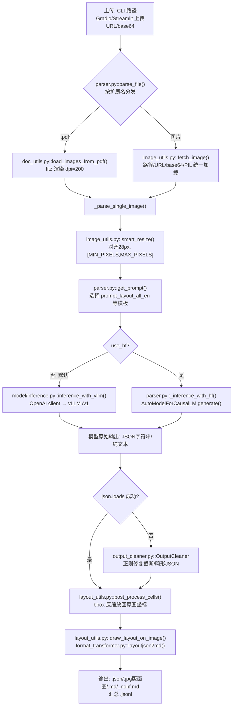

# dots.ocr 架构深度解读报告

> 项目路径：`opensource/dots.ocr`　|　上游：`studio-dots-ai/dots.ocr` (rednote-hilab)

## 1. 项目概述

dots.ocr 是一个**单一视觉语言模型**（`rednote-hilab/dots.mocr`，Qwen2.5-VL 系）驱动的文档解析项目：一次模型调用即可同时完成版面检测、类别分类、阅读顺序排序与内容识别，输出一段 **JSON 数组**（每个元素是一个 `{bbox, category, text}` 的版面单元），再由应用层将 JSON 渲染为 Markdown/HTML/LaTeX。模型服务默认通过 vLLM 以 OpenAI 兼容接口提供，也支持本地 HuggingFace `transformers` 推理。核心亮点是 `output_cleaner.py` 对模型截断/畸形 JSON 的正则修复能力。

## 2. 模块结构

| 路径 | 职责 |
|---|---|
| `dots_ocr/parser.py` | 核心编排器 `DotsOCRParser` + CLI 入口 |
| `dots_ocr/model/inference.py` | `inference_with_vllm()` —— OpenAI client 调用 vLLM 服务 |
| `dots_ocr/utils/consts.py` | `MIN_PIXELS`/`MAX_PIXELS`/`IMAGE_FACTOR`=28、支持的图片后缀 |
| `dots_ocr/utils/prompts.py` | `dict_promptmode_to_prompt` —— 所有任务提示词模板 |
| `dots_ocr/utils/doc_utils.py` | PyMuPDF (`fitz`) PDF→图片：`fitz_doc_to_image`、`load_images_from_pdf` |
| `dots_ocr/utils/image_utils.py` | `smart_resize`、`fetch_image`（路径/URL/base64/PIL 统一加载）、`PILimage_to_base64` |
| `dots_ocr/utils/layout_utils.py` | `pre_process_bboxes`/`post_process_cells`/`post_process_output`/`draw_layout_on_image` |
| `dots_ocr/utils/format_transformer.py` | `layoutjson2md`：JSON cells → Markdown/HTML/LaTeX |
| `dots_ocr/utils/output_cleaner.py` | `OutputCleaner` —— 正则修复畸形/截断模型 JSON 输出 |
| `demo/` | `demo_hf.py`/`demo_vllm*.py`/`demo_gradio*.py`/`demo_streamlit.py` |
| `docker/` | `Dockerfile`（基于 `vllm/vllm-openai`）+ `docker-compose.yml` |
| `tools/download_model.py` | HF/ModelScope 权重下载 |

## 3. 技术架构流程图

## 4. 应用层：前处理

- 入口 `DotsOCRParser.parse_file(input_path, ...)`（`parser.py:297`）按扩展名分发：
  - `.pdf` → `parse_pdf()` → `load_images_from_pdf()`（`doc_utils.py:42`）：`fitz.open` 打开，逐页 `fitz_doc_to_image(page, target_dpi=dpi)`（默认 dpi=200）渲染为 PIL RGB 图。
  - 图片（`.jpg/.jpeg/.png`）→ `parse_image()` → `fetch_image()`（`image_utils.py:84`），支持本地路径/http(s) URL/`data:image` base64/`PIL.Image`。
- 每页/每图进入 `_parse_single_image()`（`parser.py:143`）：
  1. 可选 `fitz_preprocess` 以目标 DPI 重新渲染以提升清晰度（`get_image_by_fitz_doc`）。
  2. `fetch_image(origin_image, min_pixels, max_pixels)` 统一转 RGB。
  3. `smart_resize(height, width, factor=28, min_pixels=3136, max_pixels=11289600)`（`image_utils.py:29`，Qwen2.5-VL 风格缩放）：尺寸对齐 28 的倍数，总像素落在 `[MIN_PIXELS, MAX_PIXELS]`，保持长宽比（拒绝长宽比 > 200 的图）。
  4. `get_prompt(prompt_mode, bbox, ...)`（`parser.py:133`）从 `dict_promptmode_to_prompt`（`prompts.py`）选择模板；`prompt_grounding_ocr` 模式下目标 bbox 通过 `pre_process_bboxes` 映射到缩放后坐标并拼入 prompt 文本。
- 提示词模板（`prompts.py`）：`prompt_layout_all_en`（全量版面+OCR→单个 JSON，类别含 Caption/Footnote/Formula/List-item/Page-footer/Page-header/Picture/Section-header/Table/Text/Title，要求 Formula→LaTeX、Table→HTML、其余→Markdown，且按阅读顺序排序）、`prompt_layout_only_en`（仅检测）、`prompt_ocr`、`prompt_grounding_ocr`、`prompt_web_parsing`、`prompt_scene_spotting`、`prompt_image_to_svg`、`prompt_general`。

## 5. 模型服务层

通过 `DotsOCRParser.__init__` 的 `use_hf` 标志二选一：

- **vLLM 服务（默认，生产路径）**：`_inference_with_vllm()` → `inference_with_vllm()`（`model/inference.py`）用 `openai` SDK 调用 OpenAI 兼容 chat-completions 端点（`http://{ip}:{port}/v1`）。图像以 `image_url` base64 data-URI 发送（`PILimage_to_base64`）；文本内容前置 `<|img|><|imgpad|><|endofimg|>` 特殊 token 避免 vLLM 自动插入多余换行。参数含 temperature/top_p/max_completion_tokens/model_name。
  - 服务启动方式：`vllm serve <model_path> --tensor-parallel-size 1 --gpu-memory-utilization 0.8/0.9 --chat-template-content-format string --served-model-name ... --trust-remote-code`；`docker/Dockerfile` 基于 `vllm/vllm-openai:v0.9.1`，`docker-compose.yml` 为旧版 vLLM 打补丁以注册自定义模型 `DotsOCR.modeling_dots_ocr_vllm`（vLLM ≥0.11.0 已原生合并支持）。
- **本地 HF 推理（`use_hf=True`）**：`_load_hf_model()` 加载 `AutoModelForCausalLM`/`AutoProcessor`（`flash_attention_2`、bf16、`device_map="auto"`）；`_inference_with_hf()` 构造 Qwen-VL 风格对话，配合 `qwen_vl_utils.process_vision_info`、`processor.apply_chat_template`，`model.generate(max_new_tokens=24000)`。
- 输入输出契约：一张图 + 一段文本 prompt（chat message）→ 原始字符串（版面模式下应为 JSON cells 数组，纯 OCR 模式下为文本）。

## 6. 应用层：后处理

`post_process_output(response, prompt_mode, origin_image, input_image, min_pixels, max_pixels)`（`layout_utils.py:202`）：

- 纯文本模式（`prompt_ocr`、表格/公式单模式）直接原样返回。
- 其他模式 `json.loads(response)` 解析为 `[{bbox, category, text}, ...]`；成功则 `post_process_cells()` 按 `smart_resize` 记录的缩放比例把 bbox 反算回原图坐标。
- JSON 解析失败（`json_load_failed=True`）时回退到 `OutputCleaner.clean_model_output()`（`output_cleaner.py`）：正则修复缺失的 `},{` 分隔符、截断最后一个不完整字典、去重字典/bbox、包裹 `[...]`，并有多级降级解析（逐个提取合法字典，或通过 bbox/category/text 正则抢救单个不完整字典）。
- 下游 `_parse_single_image` 调用：
  - `draw_layout_on_image(origin_image, cells)`（`layout_utils.py:31`）——按类别着色画框，渲染为 `{name}.jpg`。
  - `layoutjson2md(origin_image, cells, text_key='text')`（`format_transformer.py:145`）——生成最终 Markdown：Picture 单元从原图裁剪并 base64 内嵌 ``；Formula 单元经 `get_formula_in_markdown` 包装/清洗为 `$$...$$`；其余单元经 `clean_text` 清洗后按模型输出顺序（模型自身按提示词要求排序）拼接；同时生成跳过 Page-header/footer 的 `_nohf` 版本。
- 每页输出：`{name}.json`（cells）、`{name}.jpg`（版面叠加图）、`{name}.md`/`{name}_nohf.md`，并汇总为顶层 `{filename}.jsonl`（每行含路径、`page_no`、`input_height/width`）。

## 7. 入口与部署

- **CLI**：`python3 dots_ocr/parser.py <input_path> [--prompt MODE] [--ip/--port/--protocol] [--bbox x1 y1 x2 y2] [--dpi] [--num_thread] [--use_hf] [--min_pixels/--max_pixels]`（`parser.py main()`，argparse）；PDF 多页通过 `ThreadPool(num_thread)` 并发解析。
- **vLLM demo**：`demo/demo_vllm.py`（通用版面/网页/场景提示词）、`demo/demo_vllm_svg.py`、`demo/demo_vllm_general.py`。
- **HF demo**：`demo/demo_hf.py` —— 独立 transformers 推理脚本。
- **Web UI**：`demo/demo_gradio.py`、`demo_gradio_batch.py`、`demo_gradio_annotion.py`（封装 `DotsOCRParser`，支持上传及 ip/port/min-max pixels 配置）、`demo/demo_streamlit.py`。
- **快速开始**：安装 → `python3 tools/download_model.py` → `vllm serve rednote-hilab/dots.mocr ...` → 运行 `demo/demo_vllm.py` 或 `dots_ocr/parser.py demo/demo_image1.jpg`。

## 8. 配置项汇总

- `dots_ocr/utils/consts.py`：全局像素上下限/缩放因子/支持的图片后缀。
- `dots_ocr/utils/prompts.py`：任务提示词模板字典（唯一权威来源）。
- `DotsOCRParser.__init__` 参数即运行时配置对象（protocol/ip/port/model_name、temperature/top_p/max_completion_tokens、num_thread、dpi、output_dir、min/max_pixels、use_hf）——无外部 YAML/JSON 配置文件，全部通过构造函数/CLI 参数传入。
- `docker/docker-compose.yml` + `docker/Dockerfile`：vLLM 服务部署层配置（GPU 设备、模型权重挂载、served-model-name）。

## 9. 使用的模型清单

该仓库（rednote-hilab/dots.mocr，原 dots.ocr）本身不训练模型，只是一个基于单个多模态 VLM 的布局解析/OCR 前端，支持 vLLM 服务化推理与本地 Transformers 推理两种模式，SVG 解析场景使用同系列的另一个 checkpoint。

| 模型 (HF repo id) | 用途 | 加载方式 | 代码位置 (file:line) | 默认/可配置 |
|---|---|---|---|---|
| `rednote-hilab/dots.mocr` | 主模型：版面检测+OCR+Markdown/JSON 输出（3B 参数、基于 1.7B LLM 的多模态 VLM） | vLLM OpenAI 兼容 HTTP 服务（`vllm serve` + `openai.OpenAI` client） | 下载：`tools/download_model.py:8`（`--name` 默认值）；启动命令：`README.md:577`（`vllm serve rednote-hilab/dots.mocr --served-model-name model`）；推理默认值：`dots_ocr/model/inference.py:16`（`model_name='rednote-hilab/dots.mocr'`）；demo CLI：`demo/demo_vllm.py:13`、`demo/demo_vllm_general.py:13` | 可配置，通过 `--model_name`/`model_name=` 参数，或 `demo/demo_gradio.py:42-46`（`MODEL_SERVERS["dots.mocr"]`，`ip`/`port_vllm`） |
| `rednote-hilab/dots.mocr`（本地权重） | 与上相同，但走本地 HF Transformers 推理（无需起 vLLM 服务） | `transformers.AutoModelForCausalLM.from_pretrained` + `AutoProcessor.from_pretrained`（`trust_remote_code=True`, `flash_attention_2`, bf16, `device_map="auto"`） | `dots_ocr/parser.py:62-76`（`_load_hf_model`，固定路径 `model_path = "./weights/DotsOCR"`）；另见 `demo/demo_hf.py:57-66`（路径为 `./weights/DotsMOCR`） | 硬编码本地路径，不可通过参数改；需先用 `tools/download_model.py` 下载到该目录；由 `DotsOCRParser(use_hf=True)` 触发（`dots_ocr/parser.py:35,53-56`） |
| `rednote-hilab/dots.mocr-svg` | SVG 解析变体（将图表/公式/logo 等解析为 SVG 代码） | 同上，vLLM 服务方式 | 启动命令：`README.md:580`（`vllm serve rednote-hilab/dots.mocr-svg ... --served-model-name model`）；demo CLI：`demo/demo_vllm_svg.py:13`；Gradio 多模型配置：`demo/demo_gradio.py:48-51`（`MODEL_SERVERS["dots.mocr-svg"]`） | 可配置（不同端口/`served-model-name`），`demo_gradio.py:81` 中 `prompt_image_to_svg` 自动路由到该模型 |
| `rednote-hilab/dots.ocr`、`rednote-hilab/dots.ocr.base` | README 中提及的历史/基础版本（前代模型，现已被 dots.mocr 取代） | 同架构（vLLM/HF） | `README.md:31-33` | 仅文档提及，代码默认值已全部指向 `dots.mocr` |

其余关键位置：`dots_ocr/utils/consts.py:1-3` 定义 `MIN_PIXELS`/`MAX_PIXELS`/`IMAGE_FACTOR`（图像预处理参数，非模型 ID）；`dots_ocr/parser.py:366`（CLI `--model_name` 默认值为字符串 `"model"`，对应 vLLM 启动时 `--served-model-name model`，而非真实 HF repo id）。模型下载支持 HuggingFace（`huggingface_hub.snapshot_download`）和 ModelScope 两种源，由 `--type` 参数切换（`tools/download_model.py:14-20`）。
