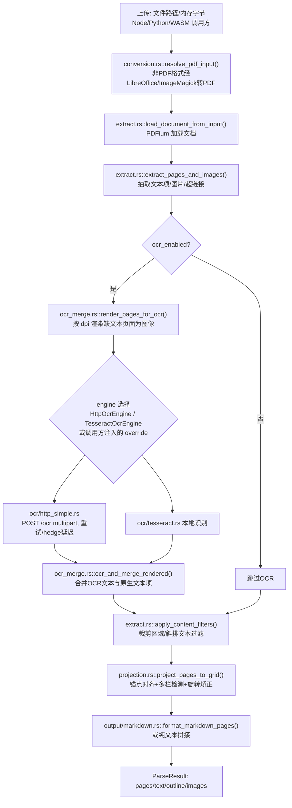

# LiteParse 架构深度解读报告

> 项目路径：`opensource/liteparse`　|　上游：`run-llama/liteparse`

## 1. 项目概述

LiteParse 与其他四个项目本质不同：它**不依赖任何 VLM/大模型**做核心文本抽取，而是用 Rust 原生调用 PDFium 直接抽取 PDF 文本层，配合自研的"空间网格投影"（spatial grid projection）算法重建版面阅读顺序。OCR 是**可选的、可插拔**的一环——仅对文字层缺失/稀疏的嵌入图像区域触发，通过一个自定义 HTTP 契约（`OCR_API_SPEC.md`）对接任意外部 OCR 引擎（内置 Tesseract，或 EasyOCR/PaddleOCR/SuryaOCR 等示例 HTTP 服务）。核心库为 Rust workspace，向 Node.js（napi-rs）、Python（PyO3）、WASM（wasm-bindgen）提供绑定。

## 2. 模块结构

| 路径 | 职责 |
|---|---|
| `crates/liteparse/src/main.rs` | CLI 入口（clap） |
| `crates/liteparse/src/lib.rs` | 库根 |
| `crates/liteparse/src/parser.rs` | `LiteParse` 编排器（本报告核心） |
| `crates/liteparse/src/config.rs` | 配置类型与默认值 |
| `crates/liteparse/src/types.rs` | 核心数据类型（`ParseResult`/`TextItem` 等） |
| `crates/liteparse/src/extract.rs` | 基于 PDFium 的原始文本抽取 |
| `crates/liteparse/src/render.rs` | 页面渲染/截图 |
| `crates/liteparse/src/conversion.rs` | 非 PDF 格式转换（LibreOffice/ImageMagick） |
| `crates/liteparse/src/projection.rs` | **空间网格投影**（版面重建，最复杂模块） |
| `crates/liteparse/src/ocr_merge.rs` | OCR 结果与原生文本的合并 |
| `crates/liteparse/src/ocr/mod.rs` | `OcrEngine` trait |
| `crates/liteparse/src/ocr/tesseract.rs` | 内置 Tesseract OCR |
| `crates/liteparse/src/ocr/http_simple.rs` | HTTP OCR 服务客户端 |
| `crates/liteparse/src/output/{json,text}.rs` | 输出格式化器 |
| `crates/liteparse-napi` / `-python` / `-wasm` | 各语言绑定 |
| `packages/node`/`python`/`wasm` | 对应语言的发行包（CLI 封装） |
| `ocr/easyocr`、`ocr/paddleocr`、`ocr/suryaocr` | 示例 OCR HTTP 服务实现 |
| `OCR_API_SPEC.md` | OCR 服务必须实现的 HTTP 契约文档 |

## 3. 技术架构流程图

## 4. 应用层：前处理

入口 `LiteParse::parse_input()`（`crates/liteparse/src/parser.rs`）：

1. `conversion::resolve_pdf_input(input, password, false)`（非 wasm32 平台）：非 PDF 输入（DOCX/XLSX/PPTX/图片）自动经系统工具（LibreOffice/ImageMagick）转换为 PDF；同名函数在 `screenshot_input()` 中也复用。
2. `resolve_target_pages()` 解析 `--target-pages` 页码范围字符串。
3. `extract::load_document_from_input()` 用 `pdfium::Library::init()` 加锁后加载文档（PDFium 本身非线程安全，通过进程级全局锁 `Library` 串行化 FFI 调用）。
4. `extract::extract_pages_and_images()` 一次性抽取文本项、（可选）图片栅格、（可选）超链接、（可选）单字级 word boxes。
5. 若 `ocr_enabled`，在**同一次 PDF 加载中**用 `ocr_merge::render_pages_for_ocr(&document, &pages, dpi, ocr_grayscale)` 预渲染需要 OCR 的页面为图像——`ocr_grayscale` 由所选引擎的 `prefers_grayscale()` 决定，避免为纯灰度引擎多余传输 RGB 数据。
6. PDFium 锁在此处释放（`lib` drop），后续 OCR 网络请求与投影计算在锁外并发执行。

## 5. 模型服务层

LiteParse 没有传统意义上的"大模型服务"，OCR 引擎通过 `crate::ocr::OcrEngine` trait 抽象，三种实现：

- **`ocr_engine_override`**：调用方（如 WASM 侧 JS 回调）注入的自定义引擎，优先级最高。
- **`HttpOcrEngine`**（`ocr/http_simple.rs`）：向 `ocr_server_url` 发起 `POST /ocr`（`multipart/form-data`，字段 `file`+`language`），响应契约见 `OCR_API_SPEC.md`：`{"results":[{"text","bbox":[x1,y1,x2,y2],"confidence","polygon"}]}`；支持重试与 `hedge_delays_ms`（对冲请求，多个并发请求取最快响应）配置（`OcrRetryConfig`）。
- **`TesseractOcrEngine`**（`ocr/tesseract.rs`，`tesseract` feature）：内置本地 Tesseract 识别，无网络依赖。
- 仓库额外提供三个**参考 OCR 服务端实现**（`ocr/easyocr`、`ocr/paddleocr`、`ocr/suryaocr`，各自 `server.py` + `Dockerfile`），均实现该 HTTP 契约，可直接作为 `--ocr-server-url` 的后端，内部可替换成任意引擎（EasyOCR/PaddleOCR/SuryaOCR/云 API）。
- 并发模型：`LiteParse` 结构体 `Send + Sync`，可跨线程共享；PDFium 部分强制串行，OCR 请求与 `projection` 网格投影（对 OCR 密集文档耗时最长的两部分）在锁外并发运行（`ocr_merge::ocr_and_merge_rendered` 内部按 `num_workers` 做并发调度）。

## 6. 应用层：后处理

- `extract::apply_content_filters(&mut pages, crop_box, skip_diagonal_text)`：在 OCR 合并之后、投影之前执行，同时过滤掉 OCR 产生的裁剪区域外文本和斜排文本，确保被过滤内容不会进入版面重建。
- `projection::project_pages_to_grid(pages)`（`projection.rs`，全仓库最复杂模块）：
  - 锚点对齐系统跟踪文本左/右/居中/浮动对齐；
  - "前向锚点"在行间传递对齐信息；
  - 多栏版面检测；
  - 90°/180°/270° 旋转文字的阅读顺序矫正；
  - OCR 合并：保留置信度与来源标记（原生 vs OCR）到最终输出。
- `output::markdown::format_markdown_pages(&parsed_pages, &outline, image_mode)`：按 `ImageMode::Embed` 决定是否内嵌图片引用 ``；`ParseResult.images` 与 markdown 中的 `id` 一一对应，调用方无需解析 markdown 即可匹配。
- 多页输出以 `\n\n-----\n\n` 分隔拼接为整篇 `text`；每页同时保留独立 `ParsedPage.markdown`/`.text`。
- 另有 `parse_from_pages()` 快捷路径：调用方自行提供已抽取的 `Page`（如外部抽取器有自己的字体修复流程），跳过 PDFium 与 OCR，仅执行投影+格式化，全同步无 `.await`。

## 7. 入口与部署

- **Rust CLI**：`crates/liteparse/src/main.rs`（clap 参数：`--target-pages`、`--ocr-server-url`、`--dpi`、`--image-mode` 等）。
- **Rust 库**：`LiteParse::new(config)` → `.parse()`/`.parse_input()`/`.screenshot()`/`.is_complex()`。
- **Node.js**：`packages/node/src/lib.ts` 导出 `LiteParse` 类，`cli.ts` 提供同名 CLI，`native.ts` 加载原生二进制。
- **Python**：`packages/python/liteparse/parser.py` 导出 `LiteParse` 类，`cli.py` 提供 CLI，`types.py` 定义 dataclass 类型。
- **WASM**：`crates/liteparse-wasm/` 通过 `wasm-bindgen` 暴露 `LiteParse`，OCR 引擎必须由 JS 侧回调注入（浏览器无内置 Tesseract/HTTP 引擎选项被禁用）。
- **OCR 服务部署**：`ocr/{easyocr,paddleocr,suryaocr}` 各自的 `Dockerfile` 可独立部署为符合 `OCR_API_SPEC.md` 的 HTTP 服务，供 `--ocr-server-url` 指向。
- 顶层还有 `Dockerfile`/`full.Dockerfile`，用于打包完整 LiteParse 运行环境。

## 8. 配置项汇总

`crates/liteparse/src/config.rs::LiteParseConfig`：`target_pages`、`max_pages`、`password`、`dpi`、`image_mode`（`ImageMode::Embed` 等）、`output_format`（`Markdown`/其他）、`ocr_enabled`、`ocr_server_url`、`ocr_server_headers`、`ocr_hedge_delays_ms`、`ocr_language`、`ocr_failure_fatal`、`num_workers`、`emit_word_boxes`、`extract_links`、`crop_box`、`skip_diagonal_text`、`include_complexity`、`quiet`。此外环境变量 `LITEPARSE_FONT_DB_DIR` 可配置一个字形轮廓→Unicode 的字体数据库目录，`LiteParse::new()` 会据此自动注入 `FontDbResolver` 修复异常字体的乱码字形。

## 9. 使用的模型清单

**核心库（`crates/liteparse`）本身不内置任何 ML/OCR 模型**：PDF 解析走 PDFium（非 ML），`FontDbResolver`（`crates/liteparse/src/font_db_resolver.rs`、`parser.rs:49`，环境变量 `LITEPARSE_FONT_DB_DIR`）只是字形形状匹配数据库，用于修复混淆字体的字形映射，与 ML/OCR 模型无关。核心唯一涉及"模型"的地方是内置的 Tesseract 引擎（`crates/liteparse/src/ocr/tesseract.rs`），它调用系统/`tesseract-rs` 提供的 Tesseract LSTM 引擎，并按需下载官方 `tessdata_best` 语言训练数据。其余三个高精度 OCR 引擎均为**可选的外部参考服务器实现**（`ocr/easyocr`、`ocr/paddleocr`、`ocr/suryaocr`），通过 HTTP 与核心库解耦。

| 模型/引擎 | 用途 | 加载方式 | 代码位置 (file:line) | 默认/可配置 |
|---|---|---|---|---|
| Tesseract LSTM + `tessdata_best` traineddata（如 `eng.traineddata`、`chi_sim.traineddata` 等） | 核心库内置OCR识别 | 首次使用时从 `https://github.com/tesseract-ocr/tessdata_best` 自动下载至本地缓存目录，再由 `tesseract-rs` 加载 | `crates/liteparse/src/ocr/tesseract.rs:7`（下载URL常量）、`:78-90`（`TesseractAPI::new`/`init`）、`:185-200`（`ensure_traineddata`下载逻辑） | 默认引擎；语言可配置，`tessdata_path`/`TESSDATA_PREFIX` 可覆盖 |
| EasyOCR `easyocr.Reader`（CRAFT检测 + CRNN识别，按语言自动下载官方预训练权重） | 参考OCR服务器 | `easyocr.Reader([language], gpu=False)`，首次调用时EasyOCR库自动从其模型仓库下载对应语言权重 | `ocr/easyocr/server.py:49`；依赖版本锁定于 `ocr/easyocr/pyproject.toml:8`（`easyocr>=1.7.2`） | 可选服务器，语言按请求动态切换/重建Reader |
| PaddleOCR 3.x（PP-OCR系列文本检测+识别+方向分类模型，具体checkpoint由PaddleOCR SDK按`lang`自动选取） | 参考OCR服务器 | `PaddleOCR(lang=..., use_textline_orientation=True, ...)`，首次运行自动下载对应模型 | `ocr/paddleocr/server.py:26-31`（初始化）、`:65-70`（语言切换时重建） | 可选服务器，依赖 `ocr/paddleocr/pyproject.toml:10-11`（`paddleocr>=3.4.0`、`paddlepaddle>=3.3.0`） |
| Surya 2（VLM式OCR基础模型，自定义 `qwen35` 架构GGUF权重，经Hugging Face分发） | 参考OCR服务器，单一多语言模型 | `SuryaInferenceManager()` + `RecognitionPredictor`，通过llama.cpp（`SURYA_INFERENCE_BACKEND=llamacpp`）加载，首次请求时从Hugging Face下载GGUF权重 | `ocr/suryaocr/server.py:17-24`（后端环境变量设置）、`:131-132`（模型初始化）；依赖 `ocr/suryaocr/pyproject.toml:8`（`surya-ocr>=0.20.0,<0.21.0`）；`ocr/suryaocr/Dockerfile:29-38`（GPU/HF_HOME缓存配置） | 可选服务器，无需按语言配置，权重缓存目录经 `HF_HOME` 可配置 |
