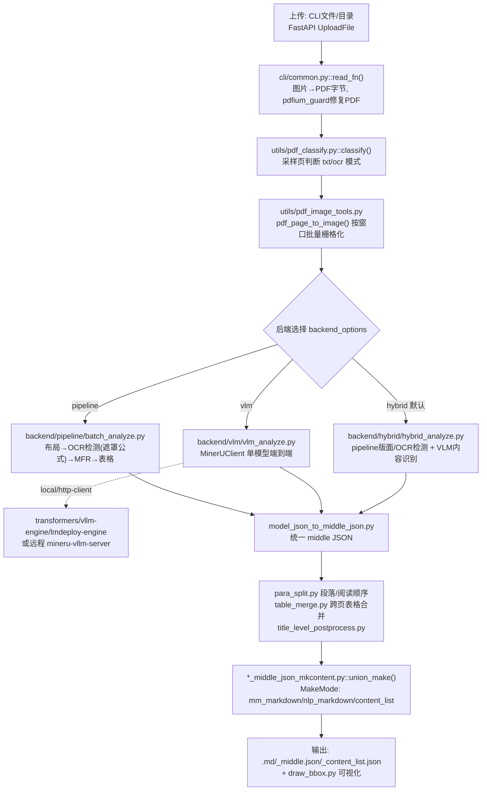

# MinerU 架构深度解读报告

> 项目路径：`opensource/MinerU`　|　上游：`opendatalab/MinerU`

## 1. 项目概述

MinerU 是 OpenDataLab 的 PDF/文档结构化抽取工具，支持**三种可切换的分析后端**：`pipeline`（经典多模型 CV 流水线：版面检测→OCR→公式识别→表格识别）、`vlm`（单一多模态大模型端到端抽取）、`hybrid`（默认后端，版面/OCR检测复用 pipeline 廉价模型，内容识别交给 VLM）。每种后端既可本地推理，也可通过 vLLM/LMDeploy/OpenAI 兼容服务器远程调用。所有后端最终都归一化为统一的 **middle JSON** 中间表示，再渲染为 Markdown/结构化内容列表。项目内建 CLI、FastAPI 异步任务服务、Gradio demo、负载均衡路由（router）等丰富的部署形态。

## 2. 模块结构

| 路径 | 职责 |
|---|---|
| `mineru/cli/client.py` | `mineru` CLI 主入口（批处理、进度、后端选择） |
| `mineru/cli/common.py` | 所有入口共用的 `do_parse`/`aio_do_parse` 编排逻辑 |
| `mineru/cli/fast_api.py` | `mineru-api`：FastAPI 异步任务服务 |
| `mineru/cli/gradio_app.py` | `mineru-gradio` demo UI |
| `mineru/cli/router.py` | `mineru-router`：多后端负载均衡代理 |
| `mineru/cli/vlm_server.py` | 启动 `mineru-vllm-server`/`-lmdeploy-server`/`-openai-server` |
| `mineru/cli/backend_options.py` | 后端名称枚举与归一化 |
| `mineru/backend/pipeline/` | 经典 CV 流水线：`pipeline_analyze.py`/`batch_analyze.py`/`model_init.py`/`pipeline_magic_model.py`/`para_split.py` |
| `mineru/backend/vlm/` | 单 VLM 后端：`vlm_analyze.py`/`vlm_magic_model.py`/`model_output_to_middle_json.py` |
| `mineru/backend/hybrid/` | 混合后端：`hybrid_analyze.py`/`hybrid_magic_model.py` |
| `mineru/backend/office/` | DOCX/PPTX/XLSX 处理 |
| `mineru/model/{layout,mfr,ocr,table,vlm}/` | 具体模型权重与推理封装 |
| `mineru/data/` | I/O 抽象：本地文件/S3/多桶读写 |
| `mineru/utils/pdf_image_tools.py` | pdfium 栅格化 |
| `mineru/utils/pdf_classify.py` | 文本层质量启发式判断 txt/ocr 模式 |
| `mineru/utils/config_reader.py` | `mineru.json` 配置读取 |
| `mineru/utils/llm_aided.py` | 可选：外部 LLM 辅助标题精修 |

## 3. 技术架构流程图

## 4. 应用层：前处理

- 入口 `mineru/cli/client.py:main()`（Click CLI）与 `mineru/cli/fast_api.py`（`UploadFile`）都归一走 `mineru/cli/common.py:do_parse`/`aio_do_parse`。
- 图片转 PDF：`images_bytes_to_pdf_bytes()`（`cli/common.py`）。
- PDF 修复/规范化与页码范围选择：`convert_pdf_bytes_to_bytes()` → `rewrite_pdf_bytes_with_pdfium()`；底层由 `mineru/utils/pdfium_guard.py` 包装 `pdfium.PdfDocument` 的打开/关闭并做线程安全保护。
- **文本层质量分类**：`mineru/utils/pdf_classify.py:classify(pdf_bytes)` 通过 `pypdf.PdfReader` + pdfium 采样若干页检测嵌入文本覆盖率/质量，决定走 `txt`（有文本层）还是 `ocr`（需视觉识别）模式。
- 栅格化：`mineru/utils/pdf_image_tools.py::pdf_page_to_image()`/`page_to_image()` 按 `DEFAULT_PDF_IMAGE_DPI` 渲染为 PIL 图并返回 `{img_base64, img_pil, scale}`；`load_images_from_pdf_doc()`/`aio_load_images_from_pdf_bytes_range()` 按**处理窗口**（`get_processing_window_size()`，默认 64 页）分批加载，避免超大文档一次性占满内存。

## 5. 模型服务层

后端常量定义于 `mineru/cli/backend_options.py`：`BACKEND_PIPELINE`、`BACKEND_VLM_ENGINE`、`BACKEND_HYBRID_ENGINE`（本地推理）、`BACKEND_VLM_HTTP_CLIENT`、`BACKEND_HYBRID_HTTP_CLIENT`（远程客户端）；**默认后端为 `hybrid-engine`**。

- **Pipeline 后端**（`mineru/backend/pipeline/`）：`MineruPipelineModel`/`ModelSingleton`（`model_init.py`）持有本地模型——版面 `PPDocLayoutV2LayoutModel`、公式 `UnimernetModel`/`FormulaRecognizer`（可切换 `pp_formulanet_plus_m`，由 `MINERU_FORMULA_CH_SUPPORT` 控制）、OCR `PytorchPaddleOCR`、表格 `PaddleTableClsModel`+`PaddleTableModel`(SLANet)/`UnetTableModel`。`batch_analyze.py:BatchAnalyze` 按页批量顺序执行 `run_layout_inference`→`run_ocr_inference`(遮罩行内公式)→`run_mfr_inference`→表格识别，可选线程锁（`MINERU_ENABLE_PIPELINE_INFERENCE_LOCKS`）。
- **VLM 后端**（`mineru/backend/vlm/vlm_analyze.py`）：单一多模态模型（`opendatalab/MinerU2.5-Pro-...`）经 `mineru_vl_utils.MinerUClient` 驱动，支持 `transformers`/`vllm-engine`/`vllm-async-engine`/`lmdeploy-engine`/`mlx-engine`（本地）以及 `http-client`（调用由 `mineru/cli/vlm_server.py` 启动的远程 `mineru-vllm-server`/`mineru-lmdeploy-server`/`mineru-openai-server`，底层 `mineru/model/vlm/vllm_server.py`/`lmdeploy_server.py`）。
- **Hybrid 后端**（`mineru/backend/hybrid/hybrid_analyze.py`）：复用 pipeline 的版面+OCR检测模型（`HybridModelSingleton`）做低成本结构定位，复用 VLM 后端做内容识别；`effort` 参数（`medium`/`high`）控制多少内容交给 VLM vs. 廉价版面映射（`MEDIUM_EFFORT_LAYOUT_LABEL_TO_VLM_TYPE`）。
- **远程编排**：`mineru-router`（`cli/router.py`）在多个 `vlm-http-client` 后端间做负载均衡；`mineru-api`（`fast_api.py`）无论选用哪种后端，统一提供异步任务队列前端。

## 6. 应用层：后处理

各后端将模型原始输出转换为统一的 **middle JSON**（`{"pdf_info":[...], "_backend":..., "_version_name":...}`），通过 `init_middle_json()` 创建，各自的 `model_json_to_middle_json.py`/`model_output_to_middle_json.py`/`hybrid_model_output_to_middle_json.py` 填充。Pipeline 后端的收尾（`pipeline_magic_model.py` → `finalize_middle_json`/`finalize_middle_json_from_preproc`）依次执行：

- `optimize_formula_number_blocks`（公式编号优化）；
- `para_split.para_split()`（段落/阅读顺序分组）；
- `cross_page_table_merge`（`utils/table_merge.py`/`table_continuation.py`，跨页表格合并）；
- `apply_title_leveling_to_pdf_info`（`title_level_postprocess.py`，标题层级归一化，可选调用 `llm_aided.py` 外部 LLM 辅助判断）；
- `_post_block_process`。

`MagicModel` 系列类（`pipeline_magic_model.py`/`vlm_magic_model.py`/`hybrid_magic_model.py`）负责把原始框/文本/公式latex/表格html归一化为 `para_blocks`/`preproc_blocks`。

最终渲染：各 `*_middle_json_mkcontent.py` 的 `union_make()` 把 middle JSON 转成 `MakeMode`（`utils/enum_class.py`）指定的输出格式——`mm_markdown`（含图片的多模态 markdown）、`nlp_markdown`（纯文本）、`content_list`/`content_list_v2`（结构化 JSON 块列表）。CLI/`do_parse` 落盘 `*.md`、`*_middle.json`、`*_content_list.json`，并可用 `utils/draw_bbox.py` 生成版面/span 可视化图片。

## 7. 入口与部署

- **CLI**：`mineru` → `mineru.cli.client:main`（批量解析，进度 UI，后端选择，effort、OCR 语言参数）。
- **服务**（`pyproject.toml [project.scripts]`）：
  - `mineru-api` → `fast_api.py:main`（FastAPI+uvicorn，异步任务端点，`X-MinerU-Task-Id` header，schema 见 `cli/api_protocol.py`）；
  - `mineru-gradio` → `gradio_app.py:main`；
  - `mineru-router` → `router.py:main`（多后端负载均衡）；
  - `mineru-vllm-server`/`mineru-lmdeploy-server`/`mineru-openai-server` → `vlm_server.py`（模型服务）；
  - `mineru-models-download`。
- **Python API**：`mineru.cli.common.do_parse`/`aio_do_parse` 可直接调用；`demo/demo.py` 演示。
- **Docker**：`docker/global/Dockerfile`、`docker/china/*.Dockerfile`（corex/dcu/gcu/kxpu/maca/mlu/musa/npu/ppu 等国产加速卡变体）、`docker/compose.yaml`。

## 8. 配置项汇总

`mineru.template.json`（拷贝为 `~/mineru.json`，或经 `MINERU_TOOLS_CONFIG_JSON` 覆盖路径），经 `mineru/utils/config_reader.py` 读取：`bucket_info`（S3 凭据）、`latex-delimiter-config`、`llm-aided-config`（外部 LLM 标题增强）、`models-dir`（`pipeline`/`vlm` 本地模型路径）、`model-source`（`huggingface`/`modelscope`/`auto`）、`config_version`；读取函数含 `get_device()`、`get_processing_window_size()`、`get_formula_enable()`/`get_table_enable()`。后端名称归一化/校验在 `mineru/cli/backend_options.py`（`normalize_backend`，兼容旧别名如 `vlm-auto-engine`→`vlm-engine`）。模型标识/路径集中在 `mineru/utils/enum_class.py:ModelPath`（如 `vlm_root_hf="opendatalab/MinerU2.5-Pro-2605-1.2B"`、`pipeline_root_hf="opendatalab/PDF-Extract-Kit-1.0"`）。

## 9. 使用的模型清单

模型权重全部通过 `ModelPath`（`mineru/utils/enum_class.py:96-107`）定义相对路径，实际下载 root 仓库由 `auto_download_and_get_model_root_path()`（`mineru/utils/models_download_utils.py`）解析，源为 HuggingFace 或 ModelScope 两个可选源。

**Pipeline backend / Hybrid backend 共用的多模型流水线**（初始化入口 `mineru/backend/pipeline/model_init.py`，`MineruPipelineModel.__init__` L231-291 与 `MineruHybridModel.__init__` L332-393）：

| 模型 (HF repo id/名称) | 所属backend/用途 | 加载方式 | 代码位置 (file:line) | 默认/可配置 |
|---|---|---|---|---|
| `opendatalab/PDF-Extract-Kit-1.0`（根仓库，含以下所有 pipeline 子模型） | pipeline+hybrid 根仓库 | HF snapshot_download / ModelScope | `mineru/utils/enum_class.py:99-100` | 默认 HF，可用 `MINERU_MODEL_SOURCE` 切 modelscope |
| `models/Layout/PP-DocLayoutV2` | 版面检测 Layout（pipeline+hybrid） | 本地 torch，`PPDocLayoutV2ForObjectDetection.from_pretrained` | `mineru/utils/enum_class.py:101`；`mineru/model/layout/pp_doclayoutv2.py:929-930`；调用于 `mineru/backend/pipeline/model_init.py:126-130,261-267,368-377` | 默认启用，唯一 layout 模型 |
| `models/MFR/unimernet_hf_small_2503` | 公式识别 MFR (Unimernet)（pipeline+hybrid） | 本地 torch，`UnimernetModel.from_pretrained` | `mineru/utils/enum_class.py:102`；`mineru/model/mfr/unimernet/Unimernet.py:31,36` | 默认 MFR 模型（`MINERU_FORMULA_CH_SUPPORT=False`），`mineru/backend/pipeline/model_init.py:62-69` |
| `models/MFR/pp_formulanet_plus_m` | 公式识别 MFR 备选（支持中文公式） | 本地 torch，`FormulaRecognizer.load_state_dict` | `mineru/utils/enum_class.py:103`；`mineru/model/mfr/pp_formulanet_plus_m/predict_formula.py:54` | 需设 `MINERU_FORMULA_CH_SUPPORT=True` 切换，`mineru/backend/pipeline/model_init.py:62-69,115-123` |
| `models/OCR/paddleocr_torch`（含检测+识别+方向分类，多语言字典） | OCR 检测+识别（pipeline+hybrid，也用于表格前处理/方向分类） | 本地 torch（PaddleOCR 权重的 torch 移植版，PytorchPaddleOCR/TextSystem） | `mineru/utils/enum_class.py:104`；`mineru/model/ocr/pytorch_paddle.py:72,76,80` | 默认启用；语言由 `lang` 参数选择字典/权重 |
| `models/TabRec/SlanetPlus/slanet-plus.onnx` | 无线表格结构识别 SLANet-Plus | ONNXRuntime `InferenceSession` | `mineru/utils/enum_class.py:105`；`mineru/model/table/rec/slanet_plus/main.py:156-157`；`mineru/model/table/rec/slanet_plus/table_structure_utils.py:43` | 表格解析默认启用（`apply_table`），`mineru/backend/pipeline/model_init.py:102-112,279-282` |
| `models/TabRec/UnetStructure/unet.onnx` | 有线表格结构识别 (Unet) | ONNXRuntime `InferenceSession` | `mineru/utils/enum_class.py:106`；`mineru/model/table/rec/unet_table/main.py:269`；`mineru/model/table/rec/unet_table/utils.py:36` | 默认启用，`mineru/backend/pipeline/model_init.py:89-99,275-278` |
| `models/TabCls/paddle_table_cls/PP-LCNet_x1_0_table_cls.onnx` | 表格有线/无线分类 | ONNXRuntime `InferenceSession` | `mineru/utils/enum_class.py:107`；`mineru/model/table/cls/paddle_table_cls.py:18-19` | 默认启用，`mineru/backend/pipeline/model_init.py:85-86,283-285` |
| （复用上面 OCR 权重） | 表格方向分类 `MineruTableOrientationClsModel`（用 OCR 引擎做方向判断） | 复用 OCR torch 模型 | `mineru/backend/pipeline/model_init.py:72-82,286-289` | 默认启用 |

**VLM backend / Hybrid backend 端到端 VLM**（初始化入口 `mineru/backend/vlm/vlm_analyze.py`，`ModelSingleton.get_model` L43-176，经由第三方包 `mineru_vl_utils.MinerUClient`）：

| 模型 (HF repo id/名称) | 所属backend/用途 | 加载方式 | 代码位置 (file:line) | 默认/可配置 |
|---|---|---|---|---|
| `opendatalab/MinerU2.5-Pro-2605-1.2B`（1.2B Qwen2-VL 架构，端到端布局+OCR+公式+表格） | vlm/hybrid backend 端到端解析（VLM） | 4种引擎，同一权重：(1) `transformers`：`Qwen2VLForConditionalGeneration.from_pretrained`(L97-101) + `AutoProcessor.from_pretrained`(L102-105)；(2) `vllm-engine`/`vllm-async-engine`：`vllm.LLM(**kwargs)`(L142) / `AsyncLLM.from_engine_args`(L173)；(3) `lmdeploy-engine`：`VLAsyncEngine(model_path, ...)`(L214-218)；(4) `mlx-engine`：`load_mlx_model`(L113, macOS) | `mineru/utils/enum_class.py:97-98`；`mineru/backend/vlm/vlm_analyze.py:82-218` | 默认 backend 为 `hybrid-engine`（`mineru/cli/backend_options.py:11`），模型源默认 HF 可切 modelscope（`models_download_utils.py:300-305`） |
| （远程服务，不本地加载权重） | `vlm-http-client`/`hybrid-http-client`：通过 `server_url` 调用外部 OpenAI 兼容/vLLM-serve HTTP 服务 | `MinerUClient(backend="http-client", server_url=...)`，无本地 model/processor | `mineru/backend/vlm/vlm_analyze.py:57-80,220-236`；backend 常量 `mineru/cli/backend_options.py:6,18-20` | 需显式传 `server_url`，其余走 `http_timeout`/`max_retries` 等可配参数 |

补充说明：`hybrid-engine`/`hybrid-http-client` 实际是 VLM 模型（端到端结构）与 pipeline 中的 Layout(PP-DocLayoutV2) + OCR(paddleocr_torch) + MFR 模型联合使用（用于行内公式框、标题拆分等辅助任务），初始化逻辑见 `MineruHybridModel.__init__`（`mineru/backend/pipeline/model_init.py:332-393`），最终仍依赖同一份 `mineru_vl_utils.MinerUClient` 做主体推理（`mineru/backend/vlm/vlm_analyze.py`）。所有本地模型的 AtomModel 单例缓存与并发锁在 `AtomModelSingleton`/`ModelSingleton` 中实现，避免重复加载。
