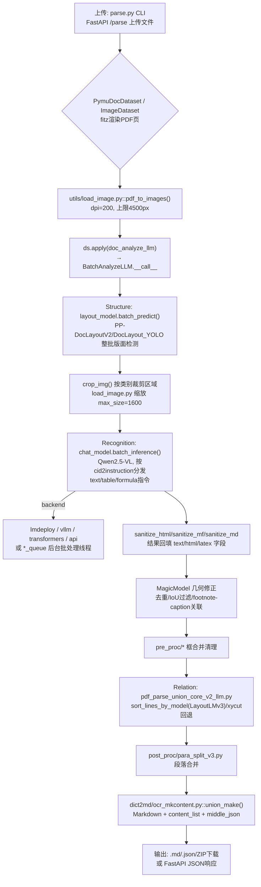

# MonkeyOCR 架构深度解读报告

> 项目路径：`opensource/MonkeyOCR`　|　上游：`Yuliang-Liu/MonkeyOCR`

## 1. 项目概述

MonkeyOCR 采用论文提出的 **Structure-Recognition-Relation（结构-识别-关系）三段式范式**：先用轻量版面检测模型（Structure）定位区域，再用 Qwen2.5-VL 系聊天模型对每个裁剪区域按类别做识别（Recognition：文本/表格/公式），最后用 LayoutLMv3 阅读顺序模型或几何启发式（Relation）确定块间顺序与从属关系。代码库脱胎自 MinerU 血统（`magic_pdf/` 目录结构与类型高度相似），但三个阶段的模型都**在同一进程内本地加载**，服务层是自建的 FastAPI（`api/main.py`），而非依赖外部 vLLM 服务器（虽然识别阶段的 chat 后端可配置为 vLLM/LMDeploy 等）。

## 2. 模块结构

| 路径 | 职责 |
|---|---|
| `api/main.py` | FastAPI 服务：路由、模型生命周期、ZIP打包、挂载 Gradio |
| `magic_pdf/config/` | `constants.py`（类别ID、`MODEL_NAME`）、`enums.py` |
| `magic_pdf/data/dataset.py` | `PymuDocDataset`/`ImageDataset`/`MultiFileDataset`/`Doc` 页面包装 |
| `magic_pdf/model/custom_model.py` | `MonkeyOCR` 类 + 全部 `MonkeyChat_*` 后端封装 |
| `magic_pdf/model/model_manager.py` | 单例 `ModelManager`，供 FastAPI 服务使用 |
| `magic_pdf/model/doc_analyze_by_custom_model_llm.py` | 顶层 `doc_analyze_llm()` 编排 |
| `magic_pdf/model/batch_analyze_llm.py` | `BatchAnalyzeLLM`：跑版面模型→裁剪区域→按类别分发识别 |
| `magic_pdf/model/magic_model.py` | `MagicModel`：模型输出后的几何修正 |
| `magic_pdf/model/sub_modules/layout/` | YOLO/PaddleX 版面模型封装 |
| `magic_pdf/model/sub_modules/reading_oreder/layoutreader/` | LayoutLMv3 阅读顺序模型 + `xycut.py` 启发式回退 |
| `magic_pdf/operators/models_llm.py` | `InferenceResultLLM`：包装原始模型输出 |
| `magic_pdf/operators/pipes_llm.py` | `PipeResultLLM`：包装后处理结果，`get_markdown`/`dump_*` |
| `magic_pdf/pdf_parse_union_core_v2_llm.py` | "Relation" 阶段：`parse_page_core()`，阅读顺序排序 |
| `magic_pdf/pre_proc/` | 检测框合并/去重/裁剪清理 |
| `magic_pdf/post_proc/para_split_v3.py` | 段落切分/合并 |
| `magic_pdf/dict2md/ocr_mkcontent.py` | 块字典树 → Markdown/content-list |
| `demo/demo_gradio.py` | Gradio UI（挂载进 FastAPI） |
| `parse.py` | CLI 入口 |
| `model_configs.yaml` | 唯一模型配置文件 |

## 3. 技术架构流程图



## 4. 应用层：前处理

- 入口：CLI（`parse.py`）或 API（`api/main.py`），均先构造 `Dataset`：
  ```python
  if file_extension == "pdf":
      ds = PymuDocDataset(file_bytes)
  else:
      ds = ImageDataset(file_bytes)
  ```
- `PymuDocDataset`/`Doc.get_image()` 调用 `fitz_doc_to_image` 栅格化每一页（页面切分是隐式的——`dataset.get_page(index)` 逐页迭代）。独立的栅格化工具 `magic_pdf/utils/load_image.py:pdf_to_images(pdf_path, dpi=200)` 用 PyMuPDF 缩放矩阵（`dpi/72`），单边像素上限 4500px。
- `load_image()`（同文件）额外对**每个已裁剪的区域**做 `min_size`/`max_pixels`/`max_size` PIL LANCZOS 缩放——在送入识别 VLM 前统一 `max_size=1600`（`custom_model.py` 多处引用）。
- 核心调用：`ds.apply(doc_analyze_llm, MonkeyOCR_model=monkey_ocr_model, split_pages=split_pages)`（`magic_pdf/model/doc_analyze_by_custom_model_llm.py`）收集全部页面图像后交给 `BatchAnalyzeLLM`。

## 5. 模型服务层

三阶段模型均为**进程内本地 torch 推理**（模型本身没有独立微服务，由 `MonkeyOCR.__init__`——`magic_pdf/model/custom_model.py`——一次性加载）：

- **Structure（版面）**：`PP-DocLayoutV2`（或 `DocLayout_YOLO`），配置见 `model_configs.yaml` 的 `layout_config`，经 `AtomModelSingleton().get_atom_model(...)` 加载。
- **Relation（阅读顺序）**：`layoutreader`——`LayoutLMv3ForTokenClassification`/`LayoutLMv3WithCategoryEmbedding`，用于 `sort_lines_by_model()`（`pdf_parse_union_core_v2_llm.py`），`xycut.recursive_xy_cut` 作为几何启发式回退。
- **Recognition（识别）**：Qwen2.5-VL 系聊天模型，`chat_config.backend` 可配置为 `lmdeploy`/`lmdeploy_queue`/`vllm`/`vllm_queue`/`vllm_async`/`transformers`/`api`（远程 OpenAI 兼容端点）；每种在 `custom_model.py` 中是实现 `batch_inference(images, questions)`（部分支持 `async_batch_inference`）的独立类。

`BatchAnalyzeLLM.__call__`（`batch_analyze_llm.py`）内部：版面模型先对整批页面图像跑 `layout_model.batch_predict`；随后按 `category_id` 对每个检测区域裁剪（`crop_img`，按类别不同的 padding），映射到任务指令（`cid2instruction`：text/table/formula），最后**整批一次性** `chat_model.batch_inference` 完成识别。

服务层与设备管理：`api/main.py` 本身即为唯一对外服务（无独立模型微服务），用进程级单例 `model_manager`（`model_manager.py`）持有 `MonkeyOCR` 对象；GPU 管理包括按 SM 能力自动选 dtype（`_auto_config_dtype`）、按显存自动调 `gpu_memory_utilization`（`_auto_gpu_mem_ratio`）、`torch.cuda.empty_cache()`/`clean_memory()`，以及一把 `asyncio.Lock`（`model_lock`）为同步后端串行化 GPU 访问（`api/main.py`: `async with model_lock:`）。队列型后端（`MonkeyChat_LMDeploy_queue`/`MonkeyChat_vLLM_queue`）用后台线程 `_background_processor` 按 `max_batch_size`/`queue_timeout` 动态合批，支持多用户并发。

## 6. 应用层：后处理

- `batch_analyze_llm.py` 按类别清洗原始识别文本：`sanitize_html`/`sanitize_mf`/`sanitize_md`，回填 `text`/`html`/`latex` 字段到版面框上，并重映射 `category_id`。
- `MagicModel`（`magic_pdf/model/magic_model.py`）做几何修正：`__fix_axis`、`__fix_by_remove_low_confidence`、`__fix_by_remove_high_iou_and_low_confidence`、`__fix_footnote`、`__tie_up_category_by_distance_v2`（关联 caption/footnote 与主体）。
- `pre_proc/*` 在此之前/之后进一步合并清理检测框（`ocr_detect_all_bboxes.py`/`ocr_dict_merge.py`/`ocr_span_list_modify.py`/`remove_bbox_overlap.py`/`cut_image.py`）。
- `pdf_parse_union_core_v2_llm.py:parse_page_core()` 组装页面字典，计算阅读顺序（`sort_lines_by_model`/`sort_lines_by_ppv2`/`cal_block_index`），再调 `post_proc/para_split_v3.py` 做段落合并。
- 最终由 `dict2md/ocr_mkcontent.py`（`union_make`、`ocr_mk_mm_markdown_with_para_and_pagination`）产出 Markdown；`PipeResultLLM.dump_content_list`/`dump_middle_json` 产出结构化 JSON；`draw_layout`/`draw_span`/`draw_line_sort` 生成调试可视化 PDF。

## 7. 入口与部署

- **CLI**（`parse.py`）：单文件/`parse_folder()` 构造 `PymuDocDataset`/`ImageDataset`/`MultiFileDataset`，调用 `doc_analyze_llm`，再 `infer_result.pipe_ocr_mode(...)` 导出 md/json/model-pdf/layout-pdf；支持 `--task`（单任务 text/formula/table，经 `TASK_INSTRUCTIONS`）、`--split_pages`、`--group_size`（批量多文件）、`torch.distributed` 多 GPU 处理整个文件夹。
- **FastAPI**（`api/main.py`）：路由 `POST /ocr/text`、`/ocr/formula`、`/ocr/table`（单任务，返回 JSON `TaskResponse`）、`POST /parse` 与 `/parse/split`（整篇文档，返回 `ParseResponse`，含指向 `/static` 下 ZIP 的 `download_url`）、`GET /health`、`GET /`（重定向到 `/docs`）；`lifespan()` 在启动时调用 `model_manager.initialize_model()`；`/demo` 挂载 Gradio 应用（`demo/demo_gradio.py:create_gradio_app()`）。
- **Demo**：`demo/demo_gradio.py`（经 `gr.mount_gradio_app` 接入同一 FastAPI 应用）、`demo/demo.py`（独立脚本示例）。

## 8. 配置项汇总

唯一配置文件 `model_configs.yaml`（经环境变量 `MONKEYOCR_CONFIG` 指定路径，默认同名文件，`parse.py`/`api/main.py` 共用）：`device`（cuda/cpu/mps）、`weights`（模型名→权重子目录映射）、`models_dir`、`layout_config.model`/`reader.name`、`chat_config.weight_path`/`backend`/`data_parallelism`/`model_parallelism`/`batch_size`、`queue_config.max_batch_size`/`queue_timeout`/`max_queue_size`（队列后端专用）。此外 `docker/env.sh`、`docker/entrypoint.sh`、`docker-compose.yml` 为部署层配置，无其他独立设置文件。

## 9. 使用的模型清单

三阶段（Structure 结构检测 / Recognition 内容识别 VLM / Relation 阅读顺序关系模型）对应的具体模型及加载方式如下。所有权重通过 `tools/download_model.py`（`echo840/{MonkeyOCR|MonkeyOCR-pro-1.2B|MonkeyOCR-pro-3B}` HF repo，或 modelscope 镜像 `l1731396519/*`）整体下载到 `model_weight/` 目录下的 `Structure/`、`Recognition/`、`Relation/` 三个子目录，运行时由 `model_configs.yaml` 的 `weights` 字段映射到具体路径。

| 模型 (名称/HF repo id) | 阶段/用途 | 加载方式(backend) | 代码位置 (file:line) | 默认/可配置 |
|---|---|---|---|---|
| PP-DocLayoutV2（PaddleX，权重子目录 `Structure/PP-DocLayoutV2`，源自 `PaddlePaddle/PP-DocLayout_plus-L` 系列） | Stage1 版面/结构检测（Layout），输出 title/text/table/formula/image 等区域框 | `paddlex.create_model()` 本地推理（PaddleX 后端） | `magic_pdf/model/sub_modules/layout/paddlex_layout/PaddleXLayoutModel.py:9,21`；配置读取 `model_configs.yaml:5-8`；加载调用 `magic_pdf/model/custom_model.py:73-87` | 默认（`layout_config.model: PP-DocLayoutV2`），可切换为 `PP-DocLayout_plus-L` 或 `DocLayout_YOLO` |
| DocLayout_YOLO（`doclayout_yolo_docstructbench_imgsz1280_2501.pt` / `layout_zh.pt`，早期 MonkeyOCR 版本使用） | Stage1 版面检测备选模型 | 本地 torch 推理，`YOLOv10(weight)`（ultralytics/doclayout_yolo 库） | `magic_pdf/model/sub_modules/layout/doclayout_yolo/DocLayoutYOLO.py:1,6`；常量 `magic_pdf/config/constants.py:41`（`MODEL_NAME.DocLayout_YOLO='doclayout_yolo'`）；加载 `magic_pdf/model/custom_model.py:60-72`，路由 `magic_pdf/model/sub_modules/model_init.py:80-84` | 可配置（非当前 yaml 默认，README 中 `MonkeyOCR-3B`/`3B*` 版本使用） |
| layoutreader（`Relation/`，架构为 `LayoutLMv3ForTokenClassification` 或自定义 `LayoutLMv3WithCategoryEmbedding`，源自 `hantian/layoutreader`/ppaanngggg/layoutreader 微调） | Stage3 阅读顺序（Relation）预测，对检测框做序列排序 | 本地 torch/transformers 推理：`transformers.LayoutLMv3ForTokenClassification.from_pretrained()` 或自定义类 `.from_pretrained()`，按 `config.json` 中 `architectures` 字段动态分派，`.to(device).eval()`（支持 bf16） | 加载与分派逻辑 `magic_pdf/model/custom_model.py:91-117`；自定义模型类定义 `magic_pdf/model/sub_modules/reading_oreder/layoutreader/helpers.py:15-27`；权重目录配置 `model_configs.yaml:2-3`（`weights.layoutreader: Relation`） | 默认启用，路径/名称可配（`layout_config.reader.name`） |
| MonkeyOCR-pro-3B / MonkeyOCR-pro-1.2B / MonkeyOCR（Recognition VLM，底座为 Qwen2.5-VL，`echo840/MonkeyOCR-pro-3B` 等，权重子目录 `Recognition/`） | Stage2 内容识别（文本/表格/公式识别），对裁剪区域做 VLM 问答式识别 | 多后端可选：`lmdeploy.pipeline`（PytorchEngineConfig，qwen2d5-vl chat template）／`vllm.LLM`／`transformers.Qwen2_5_VLForConditionalGeneration.from_pretrained` + `AutoProcessor`／OpenAI 兼容 `api`（`openai.OpenAI` client）；另有 `_queue`/`vllm_async` 变体做请求排队批处理 | 分派逻辑 `magic_pdf/model/custom_model.py:119-170`；各 backend 类：`MonkeyChat_LMDeploy` (172)、`MonkeyChat_vLLM` (212)、`MonkeyChat_transformers`（250, `Qwen2_5_VLForConditionalGeneration.from_pretrained` @278）、`MonkeyChat_OpenAIAPI` (445)、`MonkeyChat_LMDeploy_queue` (507)、`MonkeyChat_vLLM_queue` (873)；vllm_async 变体在 `magic_pdf/model/async_vllm.py` | 默认 backend=`lmdeploy`（`model_configs.yaml:10`），`weight_path` 默认 `model_weight/Recognition`，可切换 `vllm/transformers/api/*_queue`；模型版本由下载脚本 `-n` 参数决定，默认 `MonkeyOCR-pro-3B`（`tools/download_model.py:8`） |

补充说明：三阶段模型的"身份"与推理后端相互独立配置——Layout 与 Relation 阶段始终走本地 torch/PaddleX 推理，只有 Recognition VLM 阶段支持多推理引擎切换（这是配置文件中唯一暴露 backend 选项的部分）。`MonkeyChat_transformers` 中固定使用 `attn_implementation="flash_attention_2"`（CUDA 时）。
