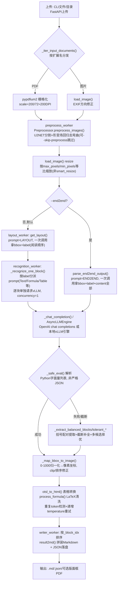

# MonkeyOCRv2 架构深度解读报告（源码级）

> 项目路径：`opensource/MonkeyOCRv2`　|　上游：`Yuliang-Liu/MonkeyOCRv2`　|　论文：[arXiv:2607.11562](https://arxiv.org/abs/2607.11562)
>
> 本报告基于本地 vendored 源码逐行分析，取代此前基于论文/README 公开信息推断的同名报告（该版本已被覆盖）。

## 1. 项目概述

MonkeyOCRv2 相对 v1（`opensource/MonkeyOCR`）在架构范式上发生了方向性转变：v1 是"独立版面检测模型 + VLM识别 + 独立阅读顺序模型"的 Structure-Recognition-Relation 三段式；v2 的核心是**一个文档原生视觉基础模型**（`vision/`，双目标预训练：图文生成+像素级重建）+ **一个基于该编码器的 0.7B 端到端解析模型**（`parsing/`，视觉塔+Qwen3系解码器，走 vLLM 部署）。仓库极简：无 `model_configs.yaml` 之类的多模型配置文件，核心业务逻辑几乎全部集中在 `parsing/core_runner.py`（2220行）一个文件里。

## 2. 模块结构

| 路径 | 职责 |
|---|---|
| `parsing/core_runner.py` | 核心编排：五阶段流水线、prompt构造、vLLM请求、输出解析修复、后处理、Markdown渲染（本报告核心） |
| `parsing/parse.py` | CLI 入口 |
| `parsing/serve.py` | `vllm serve` 包装，注册自定义模型架构后启动 vLLM 服务 |
| `parsing/fastapi/main.py` | FastAPI 服务（`/ocr/text`、`/ocr/formula`、`/ocr/table`、`/parse` 等端点） |
| `parsing/demo/gradio_demo.py` | Gradio demo |
| `parsing/modeling/modeling_monkeyocrv2_vllm.py` | vLLM 侧模型注册（`MonkeyOCRv2ForCausalLM`、视觉塔 `MonkeyOCRv2VisionTransformer`） |
| `parsing/modeling/modeling_preprocessor.py` | 独立的文档去弯曲/去阴影预处理模型（U2NET分割+形变场回归，与 vision/ 编码器无关） |
| `vision/extract_feature.py` / `extract_feature_vitae.py` | 视觉编码器独立特征提取示例（不参与 parsing 主流程） |
| `understanding/infer.py` | MonkeyOCRv2-Und 文档理解模型推理（独立任务，非解析转Markdown） |
| `download_model.py` | 8 个模型变体（`zenosai/` HF repo）的下载脚本 |

## 3. 技术架构流程图



## 4. 应用层：前处理

- 入口 `run_streaming_pipeline`（`core_runner.py:1337`），五阶段各自独立线程池+`queue.Queue`串联（输入解析→预处理→版面/端到端解析→块级识别→写出）。
- **文件加载**：`_iter_input_documents`（`core_runner.py:1298`）区分 PDF/图像；PDF 用 `pypdfium2` 固定 `scale=200/72`（≈200 DPI，`load_pdf_images`，`core_runner.py:1150-1163`，非动态）；图像走 `load_image`/`open_oriented_image`（EXIF方向修正，`core_runner.py:1173-1181`）。
- **文档去弯曲预处理**（可选，`--skip-preprocess`关闭）：`Preprocessor.preprocess_images`（`modeling_preprocessor.py:2119-2169`）——**与 vision/ 视觉编码器完全无关的独立模型**，流程为 resize到512×512 → model1(U2NET风格分割网络，前景掩码+阈值0.8+最大连通域) → model2(形变场预测) → `bilinear_preprocessing`（grid_sample反变形，`core_runner.py:12-25`）恢复原分辨率，产物写入 `preprocessed/page_NNN.png`。
- **resize 策略**：**不是** Qwen-VL 式 `smart_resize`/patch对齐算法，而是普通等比缩放——`load_image` 中若像素超 `max_pixels` 按 `sqrt(max_pixels/area)` 缩小，若过小按 `sqrt(min_pixels/area)`（`core_runner.py:1223-1236`）用 `Image.LANCZOS`。CLI 默认 `max_pixels=1003520`（≈1280×784），LAYOUT/END2END/单任务阶段又统一传 `min_pixels=1003520`（`core_runner.py:441,2172`）确保小图放大。真正的 14px patch 对齐/`spatial_merge_size=2` 由 vLLM 侧 `Qwen2VLProcessor`（`modeling_monkeyocrv2_vllm.py:773-776,207-218`）在服务端完成，parsing 侧只做像素级 resize。

## 5. 模型服务层

- **协议**：标准 **OpenAI chat completions**。`MonkeyOCRv2_ServerParsing._chat_completion`（`core_runner.py:152-218`）构造 `{"model":..., "messages":[{"role":"user","content":[{"type":"image_url","image_url":{"url":data_uri}}, {"type":"text","text":question}]}]}`，POST `{api_base}/chat/completions`（`core_runner.py:176`），图像为 PNG base64 data URI（非http URL）。也支持不经HTTP、`AsyncLLMEngine`本地直连（`MonkeyOCRv2_AsyncParsing`，`core_runner.py:264-434`），此时手工拼接 ChatML 字符串（`build_vllm_prompt`，`core_runner.py:59-65`）：
  ```
  <|im_start|>system\nYou are a helpful assistant.<|im_end|>\n
  <|im_start|>user\n<|vision_start|><|image_pad|><|vision_end|>{question}<|im_end|>\n
  <|im_start|>assistant\n
  ```
- **默认走"版面+逐块识别"两阶段**（非纯单次调用）：先 `get_layout`（`core_runner.py:437-608`）用 `ALL_PROMPT["LAYOUT"]`="Please output the categories and coordinates of the document elements in reading order."拿到 bbox+label（阅读顺序由该 prompt 直接给出，无独立Relation阶段，后续仅按 `_block_idx` 保序）；再对每个 block 按 label 查 `ALL_PROMPT` 派发对应 prompt（Text/Title/Section-header/Caption/List-item/Page-header/Page-footer 用统一文本抽取，Formula 用"LaTeX format"，Table 用"OTSL format"），逐块单独请求（`_recognize_one_block`，`core_runner.py:1066-1098`，`concurrency=1`）。
- **可选 `--end2end` 单次调用**：`ALL_PROMPT["END2END"]`="List the document elements in reading order, including their categories, coordinates, and the content of each element."，一次请求整页图直接输出全部内容（`parse_end2end_output`，`core_runner.py:611-757`）。
- 采样参数：默认 `temperature=0`（`core_runner.py:162,271`，`SamplingParams(max_tokens=10000, temperature=0)`），重试时递增。单任务模式（`-t text/formula/table`）绕过layout阶段直接对整页调用对应prompt（`run_single_task_recognition`，`core_runner.py:2141-2219`）。
- **vision/ 编码器与 parsing 主流程的关系**：`vision/extract_feature.py`（`vision/extract_feature.py:1-66`）是独立特征提取示例，通过 HF `AutoModel.from_pretrained(trust_remote_code=True)` 加载编码器本身，**不参与 parsing 主流程**；parsing 侧的视觉塔是 `modeling_monkeyocrv2_vllm.py` 中重新实现的 vLLM 算子版本 `MonkeyOCRv2VisionTransformer`（`:619-770`），两者是同一架构的两份独立实现（HF版 vs vLLM版）。

## 6. 应用层：后处理

- **原始输出格式**：模型**不输出 MinerU 式 `<|box_start|>` 自定义 token**，而是输出**类 Python 字面量列表**：`[{"bbox":[x1,y1,x2,y2], "label":"...", "content":"..."}, ...]`，用 `eval(text, {"__builtins__":{}}, {})`（`_safe_eval`，`core_runner.py:445-446/612-613`）解析（非严格 `json.loads`，说明模型输出可能含单引号等 Python 字面量语法）。
- **容错解析链**（应对截断/格式损坏）：`_extract_balanced_blocks`/`_extract_tolerant_list_blocks`/`_extract_tolerant_dict_blocks`（`core_runner.py:475-535`）——先整体 `eval`，失败则用括号配对扫描提取所有平衡子串，对末尾未闭合括号自动补全，逐一 `eval` 取解析出元素最多的候选，兜底逐字典项恢复。
- **bbox 反归一化**：模型坐标归一化到 **0–1000**，`_map_bbox_to_image`（`core_runner.py:577-594,730-742`）反算回像素坐标并做 clip/排序修正（x1>x2 时交换）。
- **表格**：模型输出 **OTSL** token（`<fcel>`/`<ecel>`/`<lcel>`/`<ucel>`/`<xcel>`/`<nl>`），`otsl_to_html`（`core_runner.py:761-876`）逐格解析重建带 rowspan/colspan 的 HTML；环境变量 `MOCR2_TABLE_HTML=1` 可跳过转换保留原始 OTSL。
- **公式**：定界符 `$$\n...\n$$`（`_format_block_content`，`core_runner.py:1040`），`process_formula`（`core_runner.py:879-942`）清洗：strip `$`、折叠5次以上重复的 `\quad`/`\qquad`、剥离/保留尾部 `\tag{}`/`\eqno(...)`、重建 `\begin{env}...\end{env}`。
- **标题**：`Title`→每行加 `"# "`，`Section-header`→`"## "`（`core_runner.py:1057-1060`），**无更细分级**（不区分H2/H3以下）。
- **图片**：`Picture`统一输出 ``，ref 为 base64 data URI（`--use-base64`）或落盘相对路径。
- **重复token检测重试**：`detect_repeat_token`（`core_runner.py:945-974`）滑动窗口检测尾部异常重复子串，触发后以递增 `temperature=0.2*(retries+1)`（上限0.8）+`top_p=0.95` 重试（`batch_inference_with_repeat_retry`/`_recognize_one_block`，需 `--retry-repeat` 显式开启，默认最多3次，`MOCR2_REC_MAX_RETRIES`可调）。
- **写出**：`writer_worker`按 `_block_idx` 排序，`result2md`（`core_runner.py:1119-1147`）拼装 Markdown，同时落盘 JSON，可选 `draw_layout_pdf`（`core_runner.py:1101-1117`）画版面框可视化PDF。

## 7. 入口与部署

- **CLI**：`parse.py`（`:12-90`）构造 `BackendConfig`/`PipelineConfig` 调 `core_runner.run_pipeline`；`--server-url`连接外部vLLM服务；`--end2end`切换单次调用模式；`--skip-preprocess`/`--skip-processed`（断点续跑，已生成`.md`的文档跳过）；`-t text/formula/table`单任务模式。
- **vLLM 服务**：`serve.py`（`:28-79`）先 `import modeling_monkeyocrv2_vllm` 完成 `ModelRegistry.register_model("MonkeyOCRv2ForCausalLM", ...)`（`modeling_monkeyocrv2_vllm.py:962-964`）注册自定义架构，再拼 argv 调 `vllm.entrypoints.cli.main.main()`；默认 `--tensor-parallel-size 1 --gpu-memory-utilization 0.5 --max-model-len 16384 --max-num-batched-tokens 16384 --trust-remote-code`，端口默认8888，启动前检测端口占用（`ensure_port_available`）。
- **FastAPI**：`fastapi/main.py`（`/ocr/text`、`/ocr/formula`、`/ocr/table`、`/parse` 等端点，`:204-224`），内部复用 `core_runner.BackendManager`/`run_pipeline`。
- **Gradio demo**：`demo/gradio_demo.py`，同样复用 core_runner。
- **依赖版本**（README）：`vllm==0.11.2`、`torch==2.6.0`、`transformers==4.57.6`、`flash-attn==2.7.4.post1`。

## 8. 健壮性/容错设计汇总

- HTTP层：`_chat_completion` 对 429/500/502/503/504 与连接错误/超时/SSL错误做指数退避重试（默认5次），每次失败重建session。
- 图像异常兜底：`load_image`整体try/except，任何异常（含长宽比>200的畸形图）退化为32×32 dummy图，避免pipeline崩溃。
- worker异常传播：任一线程抛异常经`record_worker_error`→`error_q`→`stop_event`迅速终止全部线程并在主线程重新抛出，避免静默丢数据。
- 断点续跑：已处理文档/已预处理页均可复用缓存跳过。

## 9. Checkpoint 清单（`download_model.py`，HF repo 前缀 `zenosai/`）

| 模型 | 规模 | 用途 |
|---|---|---|
| `MonkeyOCRv2-S` | ViT-S, 28M | 视觉编码器（小） |
| `MonkeyOCRv2-B` | ViT-B, 113M | 视觉编码器（标准，作为对比 dots.mocr 论文报告的主力配置） |
| `MonkeyOCRv2-AS` | ViTAEv2-S, 21M | 视觉编码器变体，用于检测/分割类任务 |
| `MonkeyOCRv2-S-Parsing` | 0.6B | 端到端解析模型（S编码器+Qwen3系解码器），走 vLLM 部署 |
| `MonkeyOCRv2-B-Parsing` | 0.7B | 端到端解析模型（B编码器+Qwen3系解码器），走 vLLM 部署，即论文报告的主力模型 |
| `MonkeyOCRv2-S-Und` | 1.7B | 文档理解模型 |
| `MonkeyOCRv2-B-Und` | 1.8B | 文档理解模型 |

`download_model.py:14-19` 支持 `--type huggingface|modelscope` 两种源。

## 10. 对 uparserstudio 架构设计的启示（更新自公开信息版报告）

- **确认了 v2 并非纯"一次调用"式端到端**：默认模式仍是"版面检测（一次调用）+ 逐块识别（多次调用）"两段式，只是**只用同一个模型**（无需独立的CV版面检测模型或独立阅读顺序模型），阅读顺序由版面检测阶段的 prompt 直接给出。这与此前基于论文推断的"完全单次端到端"有出入，需要更正：v2 相对 v1 的关键区别是**"单模型两段式" vs "三个不同模型三段式"**，而非"单次调用 vs 多段调用"。`--end2end` 选项才是真正的单次调用模式，但README/论文未强调这是默认/推荐配置。
- **协议与 MinerU `backend/vlm/` 高度相似但细节不同**：两者都是"整页版面检测(阅读顺序隐含在内)→逐块按类别识别"的两阶段模式，但 MinerU 用自定义 `<|box_start|>` token格式，v2 用类Python字面量列表+`eval()`解析；两者都用 0-1000 bbox 归一化、OTSL表格、LaTeX公式、重复token检测+温度递增重试的容错设计——这些**可作为 `ARCHITECTURE.md` v0.4 中 `adapters/` 层"共享工具函数"的有力证据**（如 OTSL→HTML 转换器、重复token检测器，两个协议可复用同一实现，只是触发/解析入口不同）。
- **无需独立版面检测服务，解决了 v0.4 §8 的开放问题**：确认 v2 的版面检测与内容识别都由同一个 vLLM 部署的模型完成，不像 v1 需要额外的 PP-DocLayoutV2/YOLO 模型服务——`adapters/monkeyocr.py` 若对齐 v2，只需一个 vLLM endpoint，协议复杂度与 dots.ocr/MinerU-vlm 同级。
- **resize 策略是协议特有的、需要独立实现**：v2 用简单等比缩放+像素数阈值（非 patch 对齐算法），与 dots.ocr/MinerU 阶段①的 patch 对齐策略不同，验证了 `ARCHITECTURE.md` §3 中"每个 adapter 需要独立 preprocess 策略、不能共用同一组 resize 默认参数"的设计判断。
- **文档去弯曲预处理是 v2 独有的可选前处理阶段**，其余四个已分析项目（chandra/dots.ocr/MinerU/MonkeyOCR v1）均无此步骤，若要支持该协议的完整能力，`adapters/monkeyocrv2.py` 需要额外承载一个独立的图像矫正子模型（`Preprocessor`，非 vLLM 部署，需要本地 torch 推理）——这与"模型推理一律外部化"的原则存在张力，是新的开放问题：该去弯曲模型体积多大、是否也应外部化为独立服务，需要在实现前评估。
